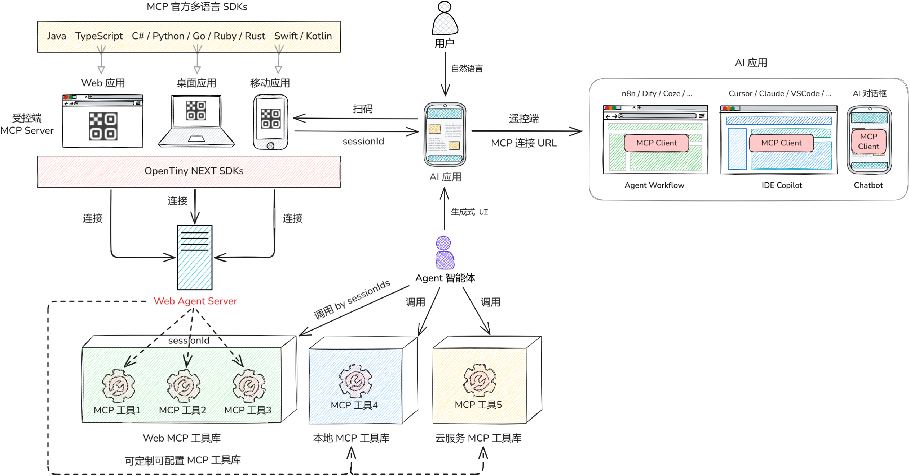
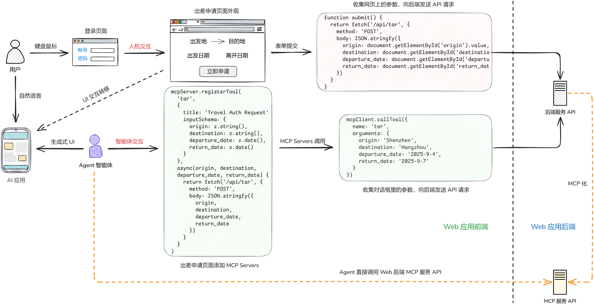
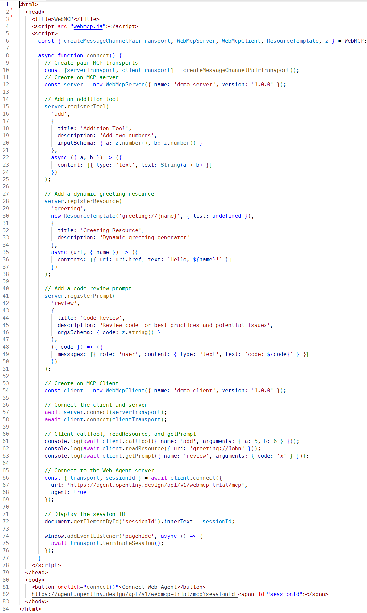

## 一、在 MCP 工具的技术创新

2025 年是 Agent 智能体爆发的一年，AGI 已经演进到 L3 阶段，智能体不仅能回答问题、总结规划方案，还能自主执行任务。Model Context Protocol（MCP）经过一年的发展，已成为智能体公认的手臂，能够调用多种工具完成诸如生成 PDF 文件、查询火车票等任务。然而在日常工作和生活中，仍有大量需要人工交互的传统应用，比如企业内部的办公系统、研发工具，以及个人手机中的社交类、生活类应用，也有让智能体代替人操作的诉求。

面对这类诉求 MCP 似乎无能为力，于是业界普遍采用 GUI 方案来解决。例如，BrowserUse 通过控制浏览器实现 Web 应用的操作，ComputerUse 通过控制电脑和手机实现原生应用的操作。但 GUI 方案存在诸多问题：它们大多通过截取应用界面，交由大模型识别，再模拟人类的点击或输入来实现自动化操作。该方案普遍存在执行过程慢、Token 消耗大、任务成功率低，以及用户隐私泄露等问题。

如何破解这一难题？OpenTiny NEXT 运用逆向思维，创新性地将 MCP Server 运行在前端，使得智能体能够将前端应用当作 MCP 工具来调用，以低成本方式实现传统应用的智能化，并在执行效率和准确率等方面显著优于 GUI 方案。更重要的是，当大量 Web 应用、桌面应用、移动应用都成为新形态的 MCP 工具后，整个 MCP 生态将发生巨大变革。

我们通过一个演示视频来说明：以企业内部的出差场景为例，员工需要在移动应用中填写出差申请、在 Web 应用中填写外出公干、在桌面应用中添加日程安排。原先这些流程必须由员工手动操作，而现在借助 OpenTiny NEXT 员工只需在 AI 应用中以自然语言向智能体提出需求，智能体就可以自主完成上述所有任务。

实操视频：<https://www.bilibili.com/video/BV1v7pMzpEY4/?vd_source=b06daacb8364d3b887df5492fd31d992>

为了实现这一效果，我们做了以下几项工作：首先，在出差申请移动应用、外出公干 Web 应用、日程安排桌面应用的前端中，使用 MCP 官方标准的 SDK 创建 MCP Server，并在该 Server 上注册 MCP 工具。工具的回调函数会调用应用对应的后端服务 API，以实现相应的业务功能。

当这三个应用打开后，会自动连接我们的 WebAgent 服务，连接成功后可在右下角看到蓝色的机器人图标。点击图标会弹出菜单，用户可选择展示二维码，扫码后将自动打开一个 AI 对话框应用。另外，我们也可以将应用中注册的 MCP 工具添加到 AI 对话框的 MCP 工具库。有了这些新工具，智能体就能根据用户意图按需调用，实现代替员工自主完成多个跨端应用的任务。

## 二、OpenTiny NEXT 设计方案详解

以下是 OpenTiny NEXT 的整体设计图，我们将深入每个部分，详细讲解技术创新点。

### 2.1 MCP 官方 SDKs

左上角是 MCP 官方多语言 SDKs，包括 TypeScript、C#、Python 等。我们的方案是让开发人员使用官方 SDKs 在自己的前端应用中创建 MCP Server。例如，在 Web 应用中使用 TypeScript SDK 在页面中创建；在桌面应用中可使用 C#、Python 等 SDKs；在移动应用中可使用 Swift、Kotlin 等。需要说明的是，演示视频中的桌面应用基于 Electron 构建，移动应用基于 uni-app 构建，两者都借助 WebView 将静态 Web 页面封装为具有原生体验的应用。

我们将这些嵌入 MCP Server 的前端应用称为“受控端”。为使 Agent 智能体能够调用受控端中的 MCP Server，开发人员还需调用 OpenTiny NEXT 提供的 SDKs（目前仅提供 TypeScript，后续将提供与 MCP 官方对应的多语言版本），使受控端能够连接我们的 WebAgent 服务。

### 2.2 MCP 连接的技术细节

开发人员创建 MCP Server 后，还需同时创建 MCP Client，并使用我们提供的 connect 方法将 MCP Client 连接到 WebAgent 服务。connect 方法包含一个 url 参数，其值为 WebAgent 的服务地址。连接方式支持 MCP 官方的 Streamable HTTP 和 SSE，同时也支持 WebSocket 等基于 MCP 官方 Transport 扩展的通讯方式。

### 2.3 WebMCP 工具

connect 方法连接成功后，将返回 sessionId 和 transport 对象。同时，WebAgent 服务会创建与该 MCP Client 对应的孪生 Client 对象，并以 sessionId 为键存储到 MCP 工具库中。当在 WebAgent 服务中调用孪生 Client 的 callTool 方法时，请求会通过已建立的 Streamable HTTP 等通道转发到前端应用的 MCP Client，等效于在前端执行 callTool。这样，连接 WebAgent 的智能体就可以调用前端应用中的 MCP 工具，我们将这些工具称为 WebMCP 工具。

### 2.4 按需使用的 WebMCP 工具

WebMCP 工具不同于本地系统搭建的 MCP 工具或部署在互联网上的 MCP 云服务，不能放在传统的 MCP 市场。因为后者通常是固定、静态的，而 WebMCP 工具是临时的、动态的，只有在用户打开应用时才存在，关闭后就会消失。例如，Web 页面中的 MCP Server 脚本仅在页面打开时运行，关闭后即失效。因此，WebMCP 工具类似于小程序，按需使用，用完即弃。

### 2.5 MCP 工具的 sessionId

前面提到 connect 方法返回的 sessionId 用于区分不同前端应用。例如，在同一浏览器中打开多个相同 Web 应用的标签页时，需通过 sessionId 确定调用哪个标签页里的 MCP Server。在演示视频中，AI 应用扫描二维码是为了获取带 sessionId 的 WebAgent 服务地址。智能体调用 WebMCP 工具时会附带 sessionId，WebAgent 根据 sessionId 到 MCP 工具库里查找对应的工具，若找不到则说明应用已关闭或断开。WebAgent 服务会监听连接断开事件，主动从工具库中删除已失效的 WebMCP 工具。

### 2.6 切换路由的 MCP Server

除应用关闭或断开导致 MCP Server 无法访问外，另一种情况是 SPA 类的 Web 应用，这类应用在切换页面路由时，会加载不同的子应用，而每个子应用可以定义不同的 MCP Server。因此，在 SPA 应用的 MCP Client 调用工具前，通常先调用 listTools 查询当前可用工具，以避免因路由切换导致原有的 MCP Server 不可访问。我们可以将“切换页面路由”封装为一个 MCP 工具，智能体可先自动切换到相关子应用，再调用该子应用的 MCP Server。

### 2.7 自动打开 Web 页面

由于 WebMCP 工具需用户打开前端应用才能被调用，若完成一项任务需打开多个应用，能否实现自动化？针对企业 Web 应用，我们提供模拟浏览器的 UI 组件。比如，用户登录企业门户后，智能体可通过 MCP 工具调用该 UI 组件，此时 UI 组件会根据 MCP 工具调用的网址参数，自动打开企业内部多个 Web 应用。

### 2.8 二维码的授权方式

演示视频中，扫码是用户授权智能体的一种方式。除二维码外，我们还提供识别码（六位字母和数字组合）和 URL 共三种方式。用户打开应用后，可自行扫码授权智能体，也可将二维码、识别码或 URL 发送给可以信任的人代为操作（如订机票、酒店等）。这种授权方式与企业的权限管理系统完全解耦，是轻量且高效的解决方案。

### 2.9 完全兼容现有 MCP 生态

我们支持在各类 AI 应用中接入 WebMCP 工具：在智能体开发平台（如 n8n、Dify、Coze）的工作流节点中定义 MCP Server（输入带 sessionId 的 URL）；也支持在 Cursor、Claude、VSCode Copilot 等 IDE 中添加 MCP Server，实现在 IDE 的 AI 对话框中以自然语言的方式调用 WebMCP 工具。现有各类 MCP Host 我们是无法改动的，所以我们的设计方案完全遵循 MCP 标准协议，避免使用私有协议，因而能完全兼容现有的 MCP 生态。

### 2.10 扩展生态，改变架构

我们基于 MCP 官方的 Transport 接口实现桥接，即连接 AI 应用中的 MCP Client 与前端应用中的 MCP Server。Agent 一词兼具智能体与代理两层含义，我们的 WebAgent 服务就是网络智能体代理服务。我们完全支持 MCP 协议中所有特性（包括 Tools、Resources、Prompts、Sampling 等），与那些仅将 MCP Tool 当作 Function Call 的方案不同。整体设计图的右半部分完全可以由开发者自行实现，我们只是在 MCP 工具库中新增动态的 WebMCP 工具，以轻量化的 NEXT-SDK 扩展当前 MCP 生态，改变现有 AI 应用的架构。

## 三、如何实现前端应用智能化

以下示意图详细说明开发者如何借助 OpenTiny NEXT 实现前端应用智能化：

### 3.1 人机交互流程

用户通过鼠标键盘操作，输入账号密码登录系统，在出差申请页面填写出发地、目的地、日期等信息，点击“立即申请”按钮触发 submit 脚本，该脚本获取页面数据并向后端 API 提交 POST 请求。这是传统的人机交互流程。

### 3.2 智能体交互流程

开发者在出差申请页面中添加脚本，通过 mcpServer.registerTool 定义 MCP 工具（参数包括出发地、目的地、出发日期、离开日期），工具的回调函数也调用相同的后端 API，与 submit 方法类似。用户在 AI 应用中以自然语言提出需求，智能体理解意图后通过 mcpClient.callTool 调用该工具，参数由智能体解析自然语言获得。这是智能体的交互流程。

### 3.3 低成本的智能化改造

智能体交互与人机交互都调用同一个后端 API，因此该方案无需修改后端代码，只在前端添加脚本，不会影响现有业务。若将后端 API 全面 MCP 化再由智能体调用，则改造成本显著提高。这是因为企业级 API 通常结构复杂，直接转换容易导致数据量过大、参数深度依赖等问题，让大模型无法直接调用。并且改造后还需维护两套生产环境，成本更高。

### 3.4 前端 MCP 工具的数量

我们认为，前端 MCP Server 应避免操作 UI 组件，而应调用后端 API。MCP Server 定义的数量应小于或等于后端 API 数量，因为部分后端 API（如下拉框选项）已在页面加载时调用。我们不需要关注前端界面组件，原有前端界面的 UI 交互已转移到采用生成式 UI 技术的 AI 应用。若智能体执行过程中需要用户确认一些信息，AI 应用可通过生成式 UI 技术动态渲染交互内容。例如查询机票时若无直达航班，智能体会提示用户选择其他方案，而非直接返回任务失败。

### 3.5 MCP 工具的权限控制

用户登录后，前端界面仅显示用户权限范围内的数据，并且用户也不能操作其权限范围外的数据。由于 MCP 工具是该应用的开发者定义的，智能体相当于以用户的身份读取和操作数据，因而整个过程安全透明。当用户在多个应用同时登录，假设用户在各应用中的权限都不相同，因为 MCP 工具都是在用户登录这些应用之后定义的，即便用户权限不同，也不会导致智能体产生越权问题。倘若智能体直接调用已经 MCP 化的后端 API，则需考虑设定智能体读取和操作数据的权限，确保智能体不会在多个应用中越权操作。

### 3.6 Web 应用智能化案例

以 HTML 页面智能化为例，开发者需编写以下代码：

1. 首先在页面头部引入 webmcp.js，获取 OpenTiny NEXT 提供的 API；

2. 创建基于 Message Channel 实现的 Transport，用于前端 MCP Server 与 MCP Client 通信；

3. 创建 MCP Server，注册工具、资源和提示（代码与 MCP 官网示例一致）；

4. 创建 MCP Client，按规范调用 callTool、readResource、getPrompt 等方法；

5. 调用 connect 方法连接 WebAgent（参数为服务地址），返回 sessionId 和 Transport 对象。

实操演示：<https://live.csdn.net/v/494057>

运行结果如上所示，浏览器控制台展示 MCP Client 调用 MCP Server 的结果。我们将 URL 复制到 MCP Inspector 网站，可以看到 MCP Inspector 能远程调用页面中的 MCP 工具。由于 MCP Inspector 是 MCP 官方的测试验证平台，而我们支持 MCP Inspector 所有的测试验证功能，因此证明我们完全支持 MCP 的标准协议，能与现有 MCP 生态完全兼容。

## 总结

OpenTiny NEXT 支持将海量的企业前端应用转变为 MCP 工具，实现智能化改造，这将极大丰富 MCP 的生态。我们提供低成本、轻量化的企业应用智能化改造方案，通过运用逆向思维将 MCP Server 放在前端运行，解决了 GUI 方案存在的性能等问题。我们不仅支持 Web 应用，还通过 WebView 支持桌面应用、移动应用甚至鸿蒙应用。除 TypeScript 外，我们将陆续推出 MCP 官方支持的其他语言版本，助力企业应用低本高效智能化转型。

## 关于 OpenTiny

欢迎加入 OpenTiny 开源社区。添加微信小助手：opentiny-official 一起参与交流前端技术～\
🌐 官网：<https://opentiny.design>\
📦 GitHub：<https://github.com/opentiny> （欢迎 star）\
OpenTiny NEXT 正式发布，官网、文档、示例、Demo 一站配齐。未来已来，欢迎上车！\
同时欢迎大家进入代码仓库 Star🌟TinyEngine、TinyVue、TinyNG、TinyCLI、TinyEditor\~
如果你也想要共建，可以进入代码仓库，找到 good first issue 标签，一起参与开源贡献\~
