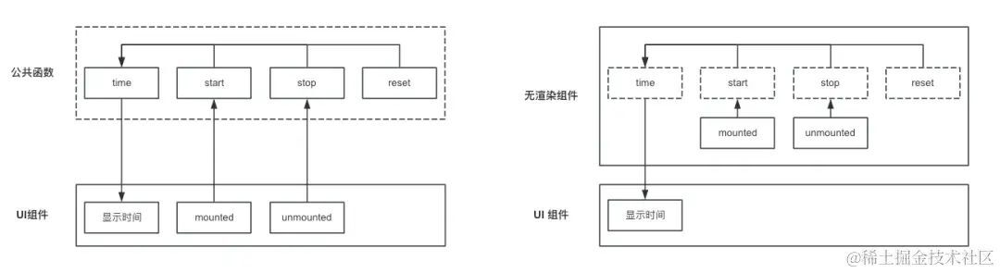
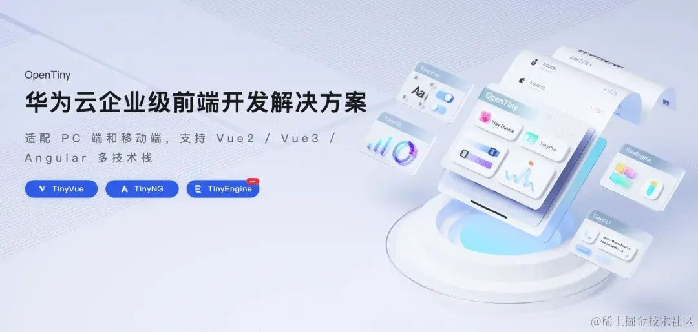
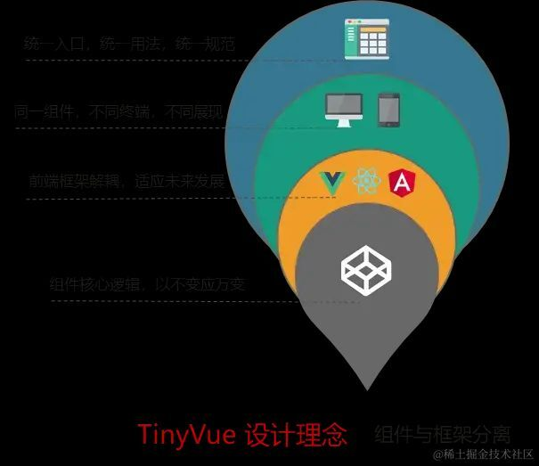
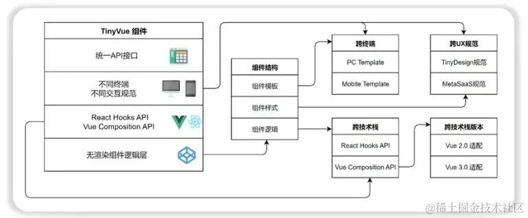

> 本文由前端小伙伴@方长\_beezen 原创。欢迎大家踊跃投稿。  
> 原文链接：<https://juejin.cn/post/7385752495535472655>

## 前言

截止到 2024 年，跨端应用开发所需要考虑的兼容性，已经涵盖了框架、平台和设备类型等多个方面，例如：

- 框架：如 React、Vue、Angular、Svelte、Ember 等。
- 平台：如 鸿蒙、Android、iOS、小程序、快应用、H5 等。
- 设备：如 PC、移动设备、车载设备等。

多元化的需求场景，对前端工程师的要求也是越来越高，他们必须掌握 2 种以上的编程语言或者开发框架，不然就很难胜任跨端应用开发的岗位。前端开发工程师的开发日常，也因此变得愈发复杂。

在如此严峻的前端大环境下，**无渲染组件** (Renderless Components[1])的概念在开发者社区逐渐兴起，频繁出现在各类流行框架中。最早，由 React 社区提出，开发者可以通过将一个 render 函数作为 prop 传递给组件，这个函数可以接收需要的数据，并返回渲染的 UI 内容。后来，在 Vue 框架中提出了 slots 概念，组件内部真实需要渲染的 UI 内容，可以通过插槽的形式控制。现在，无渲染组件被视为一种新模式，其核心理念是将组件的逻辑与表现分离，达到高可复用的效果。换句话说，无渲染组件只关注组件的内部逻辑行为，而将 UI 表现内容交由调用组件来处理。

无渲染组件通过将组件逻辑行为抽象，我们可以更轻松地在各种不同的 UI 表现上下文中重用它，它的出现不仅减轻前端工程师的工作任务，也为跨端应用的开发提供了更多的可能性。

## 什么是无渲染组件？

无渲染组件（Renderless Components）是一种设计模式，其核心理念是将组件的逻辑和表现分离。具体来说，无渲染组件只关注业务逻辑和状态管理，而不关心具体的 UI 渲染实现。常见的无渲染组件实现方式如下：

### Render Props

通过 render prop 属性将一个函数作为子组件传递，使得父组件可以完全控制 UI 渲染。

React 无渲染组件实现，如下：

```js
import React from 'react'

class MouseTracker extends React.Component {
  constructor(props) {
    super(props)
    this.state = { x: 0, y: 0 }
  } // 组件内部逻辑，可复用

  handleMouseMove = (event) => {
    this.setState({
      x: event.clientX,
      y: event.clientY
    })
  }

  render() {
    // this.props.render 渲染子组件
    return (
      <div onMouseMove={this.handleMouseMove}>
                {this.props.render(this.state)}
              
      </div>
    )
  }
}
```

在父组件调用时，`(x,y)`  属性值由无渲染组件提供，UI 渲染则可以自定义控制：

```js
<MouseTracker
  render={({ x, y }) => (
    <h1>
      The mouse position is ({x}, {y})
    </h1>
  )}
/>
```

### Scoped Slots

Scoped Slots 是一种允许父组件完全控制子组件渲染内容的模式，通过 Scoped Slots 向父子组件双向传递数据和方法，而父组件则负责具体的 UI 渲染。

Vue 无渲染组件实现，如下：

```js
<template>
  <slot :mouse="mouse"></slot>
</template>

<script>
  export default {
    data() {
      return {
        mouse: { x: 0, y: 0 },
      };
    },
    mounted() {
      window.addEventListener("mousemove", this.handleMouseMove);
    },
    methods: {
      handleMouseMove(event) {
        this.mouse = { x: event.clientX, y: event.clientY };
      },
    },
  };
</script>
```

在父组件调用时，`(x,y)`  属性值由无渲染组件提供，UI 渲染则可以自定义控制。

```js
<template>
  <MouseTracker v-slot="{ mouse }">
    <h1>The mouse position is ({{ mouse.x }}, {{ mouse.y }})</h1>
  </MouseTracker>
</template>

<script>
  import MouseTracker from "./MouseTracker.vue";
  export default {
    components: {
      MouseTracker,
    },
  };
</script>
```

## 无渲染组件 vs 传统组件

除了上面提到的 render props 和 slots 之外，还有很多其他类似的无渲染组件应用场景。我们不需要关注怎样实现才算是无渲染组件，它只是一种思想，用于将传统组件的逻辑和表现进行分离，从而达到高可复用的一种状态。例如 React 中 HOC（高阶组件）、现在主流的 React Hooks 和 Vue Composition API 等方式，都为实现无渲染组件提供了有利条件。值得一提，Renderless 设计模式特别适合跨端应用的开发，将包含各端应用的特性兼容代码提取到 UI 层特性层实现。

下面是**无渲染组件**对比**传统组件**的特性对照表：

| 特点             | 无渲染组件                                                                                                                  | 传统组件                                                                                             |
| ---------------- | --------------------------------------------------------------------------------------------------------------------------- | ---------------------------------------------------------------------------------------------------- |
| 逻辑与表现的分离 | 1、只包含业务逻辑，不包含具体的 UI 渲染。 2、渲染由父组件或使用它的组件决定。 3、适合复用复杂的逻辑而不关心具体的 UI 表现。 | 1、包含业务逻辑和 UI 渲染。 2、组件本身决定如何渲染 UI。 3、适合封装独立的功能模块，包含逻辑和展示。 |
| 复用性           | 高度复用性，逻辑可以在不同的 UI 实现中复用                                                                                  | 复用性较低，逻辑和 UI 紧耦合。                                                                       |
| 灵活性           | 更加灵活，父组件可以完全控制渲染方式和样式。                                                                                | 灵活性较低，UI 表现固定。                                                                            |
| 测试难度         | 1、测试相对简单，只需测试逻辑部分。 2、不涉及 UI 渲染，测试范围更集中                                                       | 1、测试较复杂，需要测试逻辑和 UI 渲染。 2、需要关注组件的整体行为，包括展示和交互.                   |

无渲染组件的优势在于逻辑与表现分离，实现了高复用性和极大灵活性。它允许父组件可以自定义渲染方式和样式，增强了组件的组合能力，使开发更高效、代码更简洁。同时，无渲染组件还简化了测试过程，保障了应用的稳定性。

## 无渲染组件 vs 公共函数

在日常项目开发中，我们会将项目中的公共逻辑封装为纯函数，以实现代码复用，它们一般不会涉及具体的 UI 渲染和组件的生命周期管理。虽然，无渲染组件也是类似的设计思想。但是，它会利用框架提供的状态管理和数据流特性，将实现更高级的组件功能复用。总而言之，无渲染组件更专注于将组件的逻辑与 UI 分离，不仅仅只考虑公共能力的抽象。

通过无渲染组件的设计思想，我们可以显著地减少开发工作量，同时最大限度地复用组件逻辑，保障模块功能的**完整性**和**稳定性**。

下面的两张图，进一步展示了无渲染组件和传统公共函数在设计思想上的异同之处：



## 无渲染组件库

目前，采用无渲染组件思想设计的优秀组件库有  TinyVue[2]，它目标兼容 Vue、Vue3、React、Angular、Solid 等框架，覆盖 PC 端和 Mobile 端。



图片来源于网路

TinyVue 充分采用了无渲染组件的设计思想，将可复用的逻辑行为抽象到 renderless 模块中，每一个组件的 UI 表现又单独抽象到 PC 模块和 Mobile 模块，实现了跨端、跨版本的高可重用性。

下面是 TinyVue 官方发布的组件架构图：



图片来源于网路



图片来源于网路

TinyVue 组件库可以在不同终端、不同技术栈的场景下使用，得益于其底层强大的兼容封装能力，暴露给用户使用的 API 接口基本相同，极大地降低了跨端应用中的学习和迁移成本。

## 最后

Renderless 设计模式的崛起标志着前端开发进入了更加灵活和高效的时代。通过将组件的逻辑与 UI 表现分离，Renderless 组件不仅提升了代码的复用性和可维护性，还为开发者在多平台、多技术栈下的应用开发提供了更多可能性。随着这一设计模式的逐步普及和应用，我们可以期待未来跨端开发将更加轻松和高效。

## 参考资料

- Vue renderless components[3]
- Understanding Renderless Components in Vue[4]
- 从 0 到 1 实现 OpenTiny 组件库跨框架技术[5]
- OpenTiny[6]

参考资料  
[1]Renderless Components: <https://www.patterns.dev/vue/renderless-components/>

[2]TinyVue: <https://github.com/opentiny/tiny-vue>

[3]Vue renderless components: <https://www.patterns.dev/vue/renderless-components/>

[4]Understanding Renderless Components in Vue: <https://www.telerik.com/blogs/understanding-renderless-components-vue>

[5]从 0 到 1 实现 OpenTiny 组件库跨框架技术: <https://www.cnblogs.com/huaweiyun/p/17776415.html>

[6]OpenTiny: <https://github.com/opentiny/tiny-vue/blob/dev/README.zh-CN.md>

## 关于 OpenTiny

OpenTiny 是一套企业级 Web 前端开发解决方案，提供跨端、跨框架、跨版本的 TinyVue 组件库，包含基于 Angular+TypeScript 的 TinyNG 组件库，拥有灵活扩展的低代码引擎 TinyEngine，具备主题配置系统 TinyTheme / 中后台模板 TinyPro/ TinyCLI 命令行等丰富的效率提升工具，可帮助开发者高效开发 Web 应用。

欢迎加入 OpenTiny 开源社区。添加微信小助手：opentiny-official 一起参与交流前端技术～ OpenTiny 官网：**<https://opentiny.design/>**
OpenTiny 代码仓库：**<https://github.com/opentiny/>**
TinyVue 源码：**<https://github.com/opentiny/tiny-vue>**  
TinyEngine 源码： **<https://github.com/opentiny/tiny-engine>**  
欢迎进入代码仓库 Star🌟TinyEngine、TinyVue、TinyNG、TinyCLI~ 如果你也想要共建，可以进入代码仓库，找到  good first issue 标签，一起参与开源贡献~
