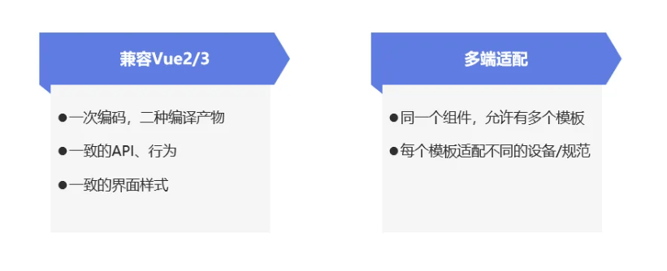
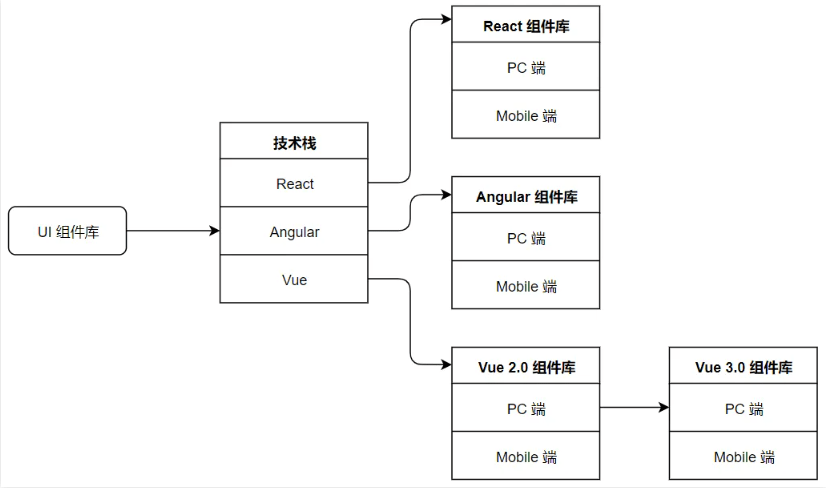
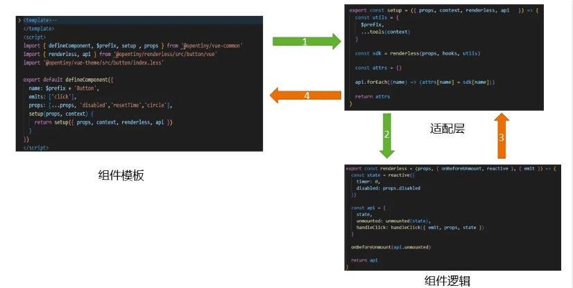
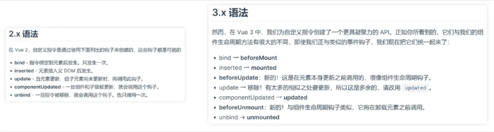
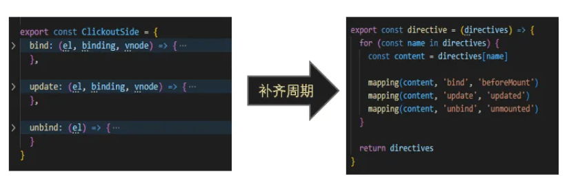
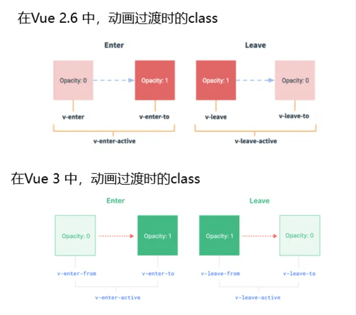

在本期《手把手教你实现 mini 版 TinyVue 组件库》的主题直播中，华为云前端开发 DTSE 技术布道师阿健老师给开发者们展开了组件库跨框架的讨论，同时针对 TinyVue 组件库的关键技术进行了剖析，并通过项目实战演示了一份源码编译出 2 个不同 Vue 框架的组件。最后针对框架间的差异，也给出了相应的技术方案，帮助开发者们实战完成组件库跨框架。

直播链接：<https://bbs.huaweicloud.com/live/DTT_live/202404171630.html>

## **一、手把手带你实现 mini 版 TinyVue**

当前实现组件库的跨框架技术，是提升 Web 页面开发效率与应用灵活性的重要手段。本次直播的实战环节，用 300 行代码模拟了 TinyVue 组件库的跨框架实现，开发者可以在 mini 版组件库中，复现跨框架及多端适配两大功能。同时通过本期的实操环节，也给开发者呈现一个明确且详尽的实现流程，协助大家更好的理解并掌握跨框架技术并运用到实际工作中。

具体源码可参考： <https://github.com/opentiny/mini-tiny-vue>



## **二、为什么要实现组件库跨框架呢？**

目前，Vue 拥有 Vue2 和 Vue3 两大主要分支，它们在开发上并不兼容。Vue2 还可以进一步细分为 2.6 及之前的版本和 Vue2.7 这两个小分支，其中 Vue2.7 作为 2.6 与 Vue3 之间的过渡版本，在开发上起着桥梁作用。

对于现有项目来讲，如果迁移到 Vue3，难免存在 API 及组件功能不同步的情况，因此迁移过程将存在一定的成本及风险。而在当前的 Vue 生态中，诸如 Antdesign 和 Element 等知名组件库都推出了支持 Vue2 和 Vue3 的组件。然而这些官网文档和 API 却并不通用，这意味着实际上是提供了两个独立的组件库来实现跨框架支持的。



作为致力于实现跨框架的 TinyVue 组件库，旨在实现跨不同版本的 Vue 框架兼容性，其独特之处在于采用单份源代码策略，通过智能编译技术，能够同时生成适用于 Vue 2.6、2.7 版本以及 Vue3 版本的组件包。这意味着开发者只需维护同一个官方网站，并提供一套标准化的 API 接口，即可满足多版本 Vue 用户的需求。这种设计有效地减少了 TinyVue 组件库的维护成本和未来技术迁移的风险。

## **三、关键技术剖析**

首先以一个 button 组件为例，组件的左上部分是模板，作为组件的入口，它集成了适配层、renderless 逻辑以及 theme 样式（此处暂不涉及 theme 部分）。值得注意的是，组件内部并未包含任何逻辑代码，所有逻辑均被抽离至 renderless 中，这里可以按照下图所示观察其调用关系。



- 从 vue 文件（即组件的入口文件）开始，引入了适配层中的 setup 函数和无状态的 renderless 函数。setup 函数的调用过程中，将包含状态的 props 和 context，以及无状态的纯函数 renderless 一并传入。

- 然后进入 setup 函数内部，适配层中的 tools 函数会构造一个对象，用于抹平框架之间的差异，并将该对象传递给 renderless 函数。这样，在 renderless 函数中，可以放心地引用该对象，而无需担心组件是在 vue2 还是 vue3 环境下运行。

- 接下来调用纯函数 renderless。它为每个组件构造一个与当前组件相关联的 state 和 api，这些都是有状态的值。随后，这些状态值被返回给适配层。

- 最后适配层将这些状态值传递给模板进行绑定。具体而言，state 被绑定到模板的数据值上，而 api 则被绑定到模板的事件上。

整体来看，调用过程就像一个管道，数据从模板开始流动，经过逻辑处理，再流回到模板上。在这个过程中，它流经的适配层巧妙地抹平了框架之间的差异，正是 TinyVue 跨框架的精妙所在。

## **四、如何解决框架差异统一，实现跨框架？**

1、框架间的差异是什么？

Vue3 是一次全新的框架升级，所以它的语法以及内部实现，都发生了很大的变化，这些是在开发跨框架组件库时必须考虑的问题。而在长期的跨框架组件库的开发中，可能会遇到众多的框架差异，具体可以将这些差异归结为 2 大类：

（1）框架对外差异，直接影响到模板的开发以及某些语法。例如：

- 模板语法差异
- 生命周期名称变化
- 移除了事件修饰符、过滤器、消息订阅
- v-model 语法糖差异
- 指令，动画组件的差异

（2）框架内部差异，主要是 Vue runtime 层面的实现差异。在开发跨框架组件过程中，需要访问组件内部某些变量时可能会遇到，例如：

- 组件实例的差异
- Vnode 结构的差异
- 移除了$children, $scopedSlots 等

2、  框架差异及应对方案

（1）响应式函数引入包差异：

在 Vue 2.6 中引入响应函数

```js
import { reactive, ref, watch, ... } from '@vue/composition-api'
```

在 Vue 3 中引入响应函数

```js
import { reactive, ref, watch, ... } from 'vue'
```

**解决方案**：通过在适配层暴露一个 hooks 变量，统一响应式函数的访问，代码如下

```js
// adapter/vue2/index.js
import * as hooks from '@vue/composition-api'
// adapter/vue3/index.js
import * as hooks from 'vue'
// adapter/index.jsexport { hooks }
```

（2）VNode 和 h 函数的差异：在 Vue 2.6 中，渲染函数的 VNode 参数结构

```js
{
  staticClass: 'button',
  class: { 'is-outlined': isOutlined },
  staticStyle: { color: '#34495E' },
  style: { backgroundColor: buttonColor },
  attrs: { id: 'submit' },
  domProps: { innerHTML: '' },
  on: { click: submitForm },
  key: 'submit-button'
}
```

在 Vue 3 中，渲染函数的 VNode 参数结构是扁平的

```js
{
  class: ['button', { 'is-outlined': isOutlined }],
  style: [{ color: '#34495E' },
  { backgroundColor: buttonColor }],
  id: 'submit',  innerHTML: '',
  onClick: submitForm,
  key: 'submit-button'
}
```

**解决方案**：通过在适配层暴露一个 h 函数，让 Vue3 框架也能支持 Vue2 的参数格式。这样就能统一 h 函数的用法，同时让在 Vue2 时期开发的组件在 Vue3 框架下兼容运行。

```js
// adapter/vue2/index.js
const h = hooks.h

// adapter/vue3/index.js
const h = (component, propsData, childData) => {
  // 代码有省略......
  let props = {}  let children = childData

  if (propsData && typeof propsData === 'object' && !Array.isArray(propsData)) {
  props = parseProps(propsData)
  propsData.scopedSlots && (children = propsData.scopedSlots)
  } else if (typeof propsData === 'string' || Array.isArray(propsData)) {
  childData = propsData
  }

  return hooks.h(component, props, children)
  }

// adapter/index.js
export { h }
```

（3）v-model 的差异：在 Vue 2.6 中，在组件上使用  v-model  相当于绑定  value  属性和  input  事件

```js
  <ChildComponent v-model="pageTitle" />
  <!-- 会编译为：-->
  <ChildComponent :value="pageTitle" @input="pageTitle = $event" />
```

在 Vue 3 中，v-model 相当于绑定了 modelValue 属性和 update:modelValue 事件

```js
  <ChildComponent v-model="pageTitle" />
  <!-- 会编译为：-->
  <ChildComponent :modelValue="pageTitle" @update:modelValue="pageTitle = $event" />
```

**解决方案**：通过 Vue2 中声明 model 的 option 选项，来自定义 Vue2 框架下 v-model 的默认绑定 prop 和 event 。

```js
defineComponent({
  model: {
    prop: 'modelValue', // 默认值为 value
    event: 'update:modelValue' // 默认值为 input
  },
  props: {
    modelValue: String
  } // ...
})
```

（4）slots 的差异：  在 Vue 2.6 中，有普通插槽 slots 和 作用域插槽 scopedSlots

```js
// 普通插槽为对象，可以直接使用
this.$slots.mySlot

// 作用域插槽为函数，要按函数来调用
this.$scopedSlots.header()
```

在 Vue 3 中，统一为 slots 函数的形式

```
// 将所有 scopedSlots 替换为 slots
this.$slots.header()

// 将原有 slots 改为函数调用方式
this.$slots.mySlot()
```

**解决方案**：通过构建一个 vm.$slots 属性， 来统一 2 个框架中，访问 slots 的访问。

```js
// adapter/vue2/index.js
Object.defineProperties(vm, {
  // ......
  $slots: { get: () => instance.proxy.$scopedSlots },
  $scopedSlots: { get: () => instance.proxy.$scopedSlots }
})

// adapter/vue3/index.js
Object.defineProperties(vm, {
  // ......
  $slots: { get: () => instance.slots },
  $scopedSlots: { get: () => instance.slots }
})
```

我们在 vm 下，还暴露了许多框架 runtime 层面上的组件属性，用于抹平跨 Vue 框架的差异。在开发跨框架组件时，要使用 vm 来访问组件，避免直接访问组件的 instance。

```js
// 创建一个Vue2 运行时的兼容 vm 对象
const createVm = (vm, _instance) => {
  const instance = _instance.proxy

  Object.defineProperties(vm, {
    $attrs: { get: () => instance.$attrs },
    $listeners: { get: () => instance.$listeners },
    $el: { get: () => instance.$el },
    $parent: { get: () => instance.$parent },
    $children: { get: () => instance.$children },
    $nextTick: { get: () => hooks.nextTick },
    $on: { get: () => instance.$on.bind(instance) },
    $once: { get: () => instance.$once.bind(instance) },
    $off: { get: () => instance.$off.bind(instance) },
    $refs: { get: () => instance.$refs },
    $slots: { get: () => instance.$scopedSlots },
    $scopedSlots: { get: () => instance.$scopedSlots },
    $set: { get: () => instance.$set }
  })

  return vm
}
// 创建一个Vue3 运行时的兼容 vm 对象
const createVm = (vm, instance) => {
  Object.defineProperties(vm, {
    $attrs: { get: () => $attrs },
    $listeners: { get: () => $listeners },
    $el: { get: () => instance.vnode.el },
    $parent: { get: () => instance.parent },
    $children: { get: () => genChild(instance.subTree) },
    $nextTick: { get: () => hooks.nextTick },
    $on: { get: () => $emitter.on },
    $once: { get: () => $emitter.once },
    $off: { get: () => $emitter.off },
    $refs: { get: () => instance.refs },
    $slots: { get: () => instance.slots },
    $scopedSlots: { get: () => instance.slots },
    $set: { get: () => $set }
  })

  return vm
}
```

（5）指令的差异：Vue3 的指令生命周期的名称变化了,  但指令的参数基本不变

**解决方案**：在开发指令对象时，通过补齐指令周期，让指令对象同时支持 Vue2 和 Vue3

（6）动画类型的差异：

**解决方案**：在全局的动画类名文件中，同时补齐 2 个框架下的类名，让动画类同时支持 Vue2 和 Vue3 的 Transition 组件

```js
// 此处同时写了 -enter \  -enter-from 的类名，所以它同时支持vue2,vue3的 Transition 组件。
.fade-in-linear-enter,
.fade-in-linear-enter-from,
.fade-in-linear-leave-to {
  opacity: 0;
}
```

在构建 TinyVue 跨框架组件库的过程中，团队集中攻克了多个 Vue 框架间的关键差异点，其中六项尤为突出且具有代表性。  
开发 TinyVue 跨框架组件库时，面对 Vue2 与 Vue3 的重要区别，我们确立了两个核心原则：一是“求同去异”，即在编写组件时选用两框架都支持的通用语法，如因 Vue2 不支持多根节点组件而统一采用单根节点设计；二是“兼容并包”，通过构建适配层隐藏框架间的差异，提供统一接口，无需开发者手动判断框架版本，这样他们可以更专注于逻辑开发。在指令对象和动画类名等细节方面，同样贯彻这一简化差异、广泛兼容的理念。

## **关于 OpenTiny**

[OpenTiny](https://opentiny.design/) 是一套企业级 Web 前端开发解决方案，提供跨端、跨框架、跨版本的  [TinyVue 组件库](https://opentiny.design/tiny-vue/zh-CN/overview)，包含基于 Angular+TypeScript 的 [TinyNG 组件库](https://opentiny.design/tiny-ng/overview)，拥有灵活扩展的低代码引擎 [TinyEngine](https://opentiny.design/tiny-engine#/home)，具备主题配置系统[TinyTheme](https://opentiny.design/designtheme/home) / 中后台模板[TinyPro](https://opentiny.design/pro/home)/ [TinyCLI](https://opentiny.design/tiny-cli/home)命令行等丰富的效率提升工具，可帮助开发者高效开发 Web 应用。

---

欢迎加入 [OpenTiny 开源社区](https://github.com/opentiny/)。添加微信小助手：opentiny-official 一起参与交流前端技术～更多视频内容也可关注[B 站](https://space.bilibili.com/15284299?spm_id_from=333.1007.0.0)、抖音、小红书、视频号  
OpenTiny  也在持续招募贡献者，欢迎一起共建

[OpenTiny 官网](https://opentiny.design/)：**https://opentiny.design/**  
[OpenTiny 代码仓库](https://github.com/opentiny/)：**https://github.com/opentiny/**  
[TinyVue 源码](https://github.com/opentiny/tiny-vue)：**https://github.com/opentiny/tiny-vue**
[TinyEngine 源码](https://github.com/opentiny/tiny-engine)： **https://github.com/opentiny/tiny-engine**

欢迎进入代码仓库 Star🌟[TinyEngine](https://github.com/opentiny/tiny-engine)、[TinyVue](https://github.com/opentiny/tiny-vue)、[TinyNG](https://github.com/opentiny/ng)、[TinyCLI](https://github.com/opentiny/tiny-cli)~
如果你也想要共建，可以进入代码仓库，找到  good first issue 标签，一起参与开源贡献~
