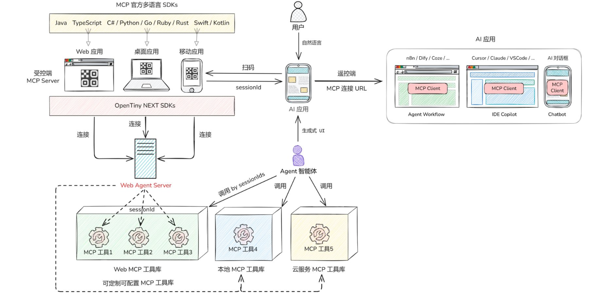
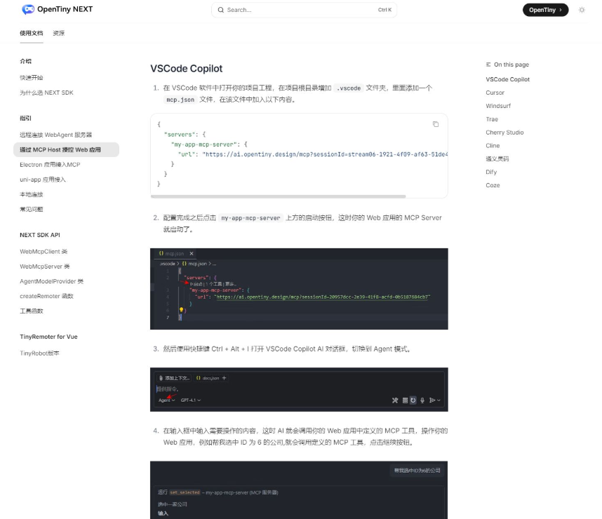
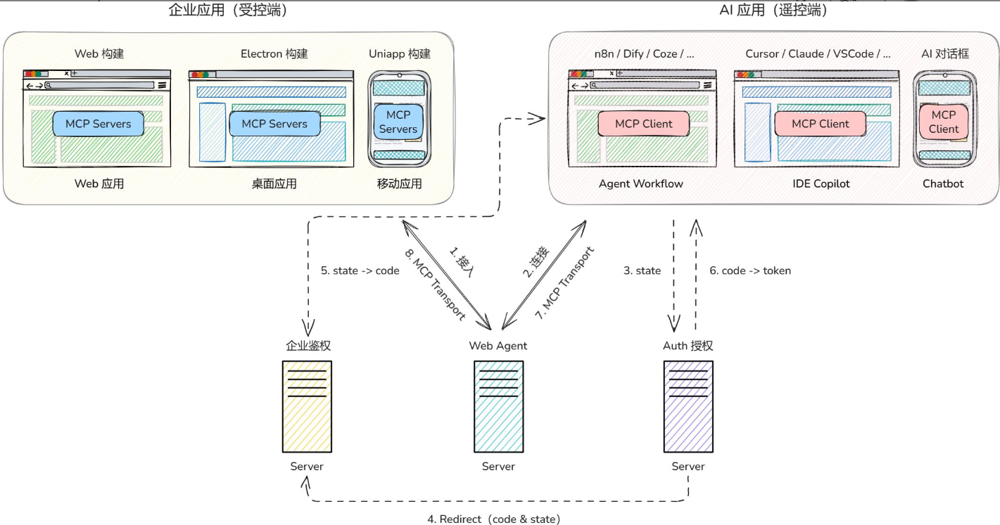
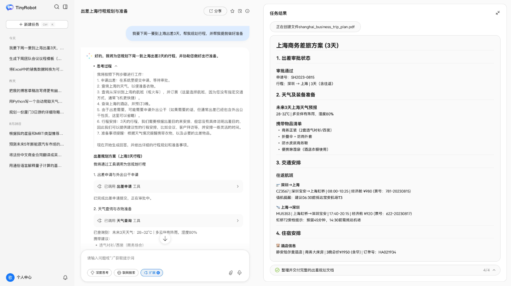
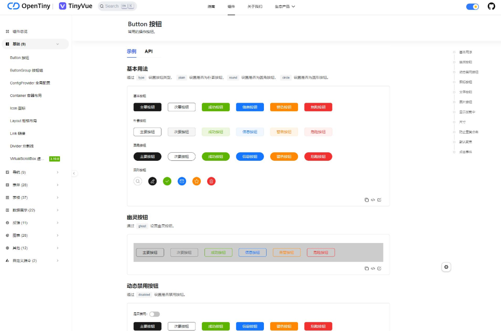
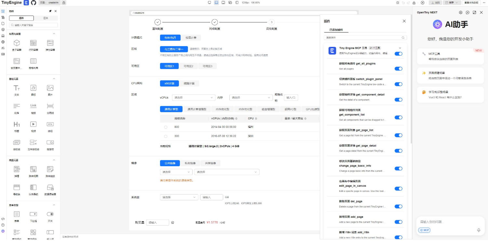

近期，我们推出 **OpenTiny NEXT** —— OpenTiny 的下一代企业级前端智能开发解决方案。这不仅是一次技术升级，更是一场用户交互范式的变革：从传统的人机交互升级成为人机交互范式和智能体交互范式的融合。我们坚信，**每一个企业应用都值得被 AI 理解，每一次用户交互都可以更自然、更智能。**

## 项目背景

当前，大语言模型（LLM）正在深刻地改变人机交互的方式。用户期望通过自然语言完成更复杂、更智能化的操作。然而现有的企业应用（**包括 Web 应用、桌面应用、移动应用等**）大多仍依赖于传统的图形用户界面（GUI）点击操作，无法直接响应 LLM 的指令，使得企业应用与智能体（Agent）之间形成了一道鸿沟。

随着 LLM 和 Agent 技术的发展，企业应用正逐步迈入“智能化”阶段。OpenTiny 作为一套成熟的企业前端开发解决方案，拥有 UI 组件库（TinyVue）和低代码引擎（TinyEngine）等产品，在服务传统前端开发场景的基础上，我们顺应 AI 时代需求，对 OpenTiny 进行一次代际升级，构建一套面向未来的“企业智能前端开发解决方案”。

**OpenTiny NEXT** 新的解决方案整合了 AI 技术与 OpenTiny 原有能力，支持企业应用允许 Agent 理解用户意图并自主完成任务，**打造一个 Agent 主导的企业智能应用生态系统。**

## 愿景与架构

**OpenTiny NEXT** 旨在成为业界领先的企业智能前端开发解决方案，我们致力于为企业应用无缝注入“智驾”能力，打破人、AI 与应用之间的壁垒。

我们的愿景是：**让每一个企业应用都能支持 AI 理解用户意图并自主完成任务，让自然语言成为企业应用的下一代交互范式。**

以下是 OpenTiny NEXT 的整体架构图：

## 项目介绍

OpenTiny NEXT 智能前端开发解决方案以生成式 UI + WebMCP 两大核心技术为依托，构建一个从后端服务、开发工具到前端 UI 完整的智能产品族。

- 基础设施层 (IaaS)：

  - WebAgent: 连接 Agent 智能体与企业应用内置的 MCP 服务的手臂。

- 开发工具层 (PaaS/SDKs)：

  - NEXT-SDKs: 提供跨前端框架、高可扩展的企业应用智能化开发工具库。
  - TinyEngine NEXT: 可生成“智能”应用的智能低代码引擎。

- 应用与组件层 (SaaS/UI)：

  - TinyRobot: 面向最终企业用户的智能体对话入口。
  - TinyVue NEXT: 承载生成式 UI 引擎的企业级智能组件库。

- 门户与生态：
  - OpenTiny NEXT 官网: 产品的统一入口、文档和社区。

### NEXT-SDKs：智能应用开发工具包

NEXT-SDKs 是一套开发工具包，旨在简化 WebAgent 的集成与使用，支持多种编程语言和前端框架，帮助开发者快速实现智能化功能。

它的核心 SDK (包括 TypeScript, Python, Java 等版本)，提供简化的 API 封装与 WebAgent 服务的连接、认证等逻辑，同时提供易用的 API 让开发者将企业应用的前端功能声明为 MCP Server。针对不同前端框架（Vue、React、Angular、Vanilla）特性，它提供 API 以降低用户在特定前端框架中的使用 MCP Server 和连接 WebAgent 的难度。

此外，它还提供一个适配器层，可以将任意前端 AI 对话框组件（包括 TinyRobot 组件）快速接入 WebAgent 服务。并且它支持抹平不同 LLM 差异，支持文字、语音等多模态输入，使得 AI 对话框连接的 LLM 支持受控端的 MCP 工具调用。另外，它还提供动态生成二维码功能，让企业应用里的 MCP 服务成为 AI 对话框里可以让 Agent 调用的工具。

当前市面上的 MCP 服务都是后端服务，但是如果用户的后端服务 Api 想要改造成大模型可以理解的 MCP 服务，成本是非常高的，我们用这种逆向思维把 MCP Server 放在前端，这样用户是不需要对已有的后端 Api 进行改动，已有的业务逻辑如果已经封装成前端的 Api，则可以直接注册成 MCP Tool，前端的工具方法或者业务方法放在 MCP Tool 的回调里就完成了向 AI 提供工具的实现。

### WebAgent：智能体 MCP 服务代理

WebAgent 是连接 Agent 智能体与企业应用内置的 MCP 服务的手臂。提供 MCP 市场和动态添加 MCP 插件能力，支持 Agent 调用多个授权企业应用里的 MCP 服务。基于 OAuth 2.1 协议的授权机制，受控的企业应用拥有者可以精细化授权给指定的遥控端 AI 应用。支持 MCP 插件化架构，可连接企业内部的云服务（如对象存储、数据库）或本地工具（如代码执行器），支持企业私有化部署，支持数据和模型调用均在企业内网，并提供多种维度的计费模型，支持用户注册、登录、角色权限分配及管理等。支持多语言版本，与 MCP 官方 SDKs 相对应，分为 TypeScript、Python、Java 等版本。

在浏览器运行的 Web 应用都可以接入 Web Agent Server：

### TinyRobot：企业智能体个人助手

TinyRobot 是一个企业 AI 应用，支持 Agent 智能体识别用户意图，代替用户自主完成跨多个企业应用的任务。TinyRobot 可调用的 MCP 服务来自 WebAgent 的 MCP 市场和动态添加的 MCP 插件。TinyRobot 会调用 NEXT-SDKs 的能力，实现扫码动态添加 MCP 插件，以及抹平不同 LLM 差异实现 Agent 自主规划和完成任务。

同时它也可以作为对话框组件库使用，也可以当作浏览器扩展安装，助力开发者快速构建各种对话框场景页面。

### TinyVue NEXT：生成式 UI 智能组件库

TinyVue 智能组件库在传统组件库基础上，支持在生成式 UI 场景中使用，AI 智能体可以根据用户意图，按需灵活选择 TinyVue 的组件，呈现给用户可视化的效果，并支持实时互动和交互。

### TinyEngine NEXT：智能应用低代码引擎

TinyEngine 智能低代码引擎集成 MCP 能力，支持自然语言或图片生成页面，并提供可视化手动编辑与 AI 智能优化双模式，帮助开发者快速构建应用。同时生成应用接入 OpenTiny NEXT，支持 LLM 直接操控，可助力企业应用实现智能化升级。

## 场景实践

出差申请是企业高频的办公场景之一，却常因「填表多、流程长」被吐槽。这里我们以“出差申请”场景为例，接入 OpenTiny NEXT 技术后，只需四个步骤，就能实现通过 AI 让企业应用直接被操控，从而实现智能化，让用户直接输入指令，就能完成整个出差流程闭环。

【实操视频】<https://www.bilibili.com/video/BV1v7pMzpEY4/?share_source=copy_web&vd_source=b20224008749f78db5628f8a1503a97f>

## 立即体验，共创智能前端未来

OpenTiny NEXT 即将正式发布，官网、文档、示例、Demo 一站配齐：

🌐 官网：<https://opentiny.design>

📦 GitHub：<https://github.com/opentiny> （欢迎 star）

💬 交流群：添加微信小助手 opentiny-official 回复【OpenTiny NEXT】

后续我们也会对 OpenTiny NEXT 技术做出详细解读，将陆续发布《**一场 MCP 生态的变革 —— 详解 OpenTiny NEXT 逆向思维的技术创新**》 技术文章，请大家敬请期待\~

OpenTiny NEXT，让每一个企业应用都能支持 AI 理解用户意图并自主完成任务，让自然语言成为企业应用的下一代交互范式。

未来已来，欢迎上车！

同时欢迎大家进入代码仓库 Star🌟TinyEngine、TinyVue、TinyNG、TinyCLI、TinyEditor\~
如果你也想要共建，可以进入代码仓库，找到 good first issue 标签，一起参与开源贡献\~
