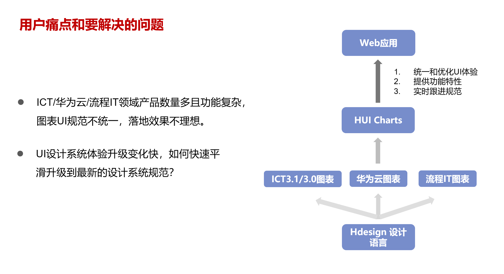
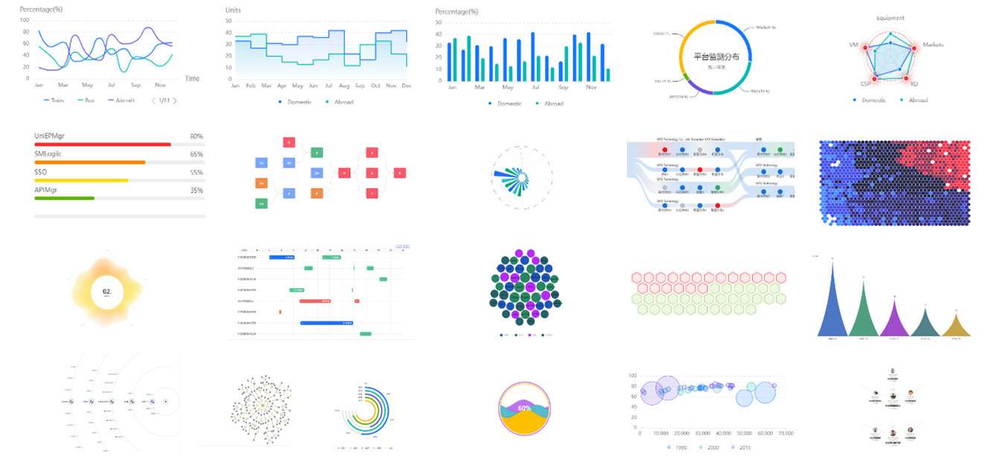
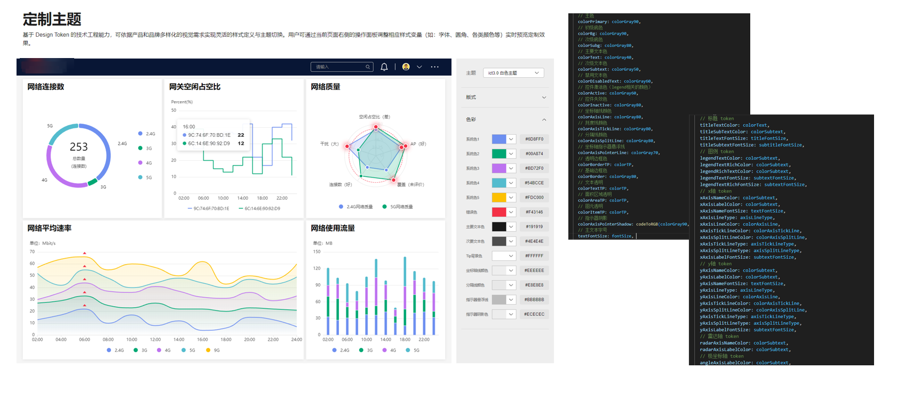
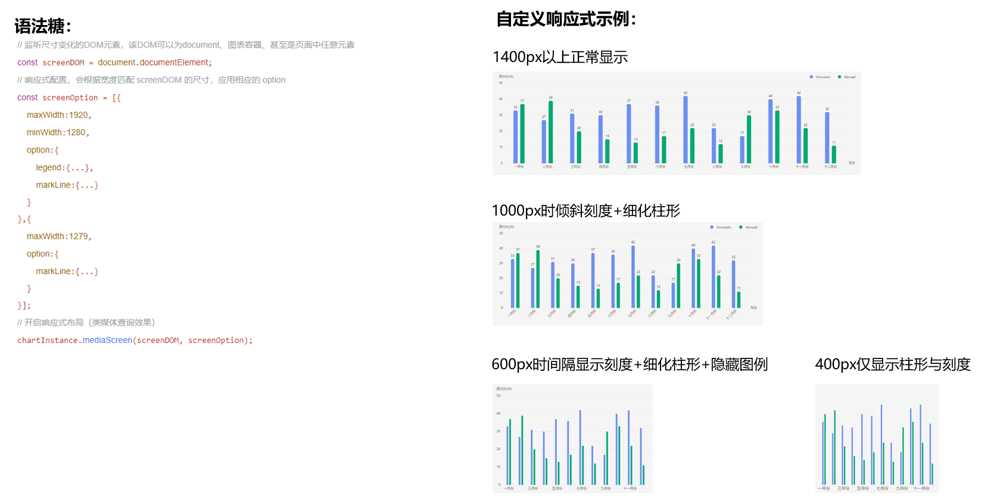
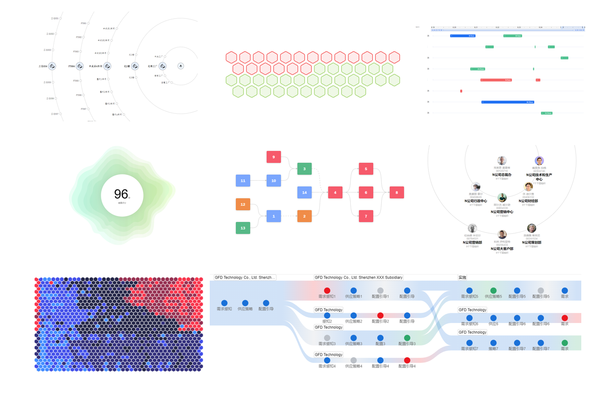

## 引言

大家好！

我们非常高兴地跟大家宣布，今天正式发布我们的新产品——**OpenTiny HUICharts**。这是一款前端 Web 可视化图表库，其基础图表功能构建于 ECharts 之上，而高阶图表则采用了新的底层技术，以满足更广泛的数据可视化需求。

**OpenTiny HUICharts** 集成了自适应、性能提升、数据状态管理、无障碍能力、刻度优化、刻度均分等特性。这些特性帮助我们解决了许多内部业务场景中的问题。我们追求的目标是让图表的使用变得更加简单、直观且易于上手。

## 为什么要做 OpenTiny HUICharts

**OpenTiny HUICharts** 的诞生源于我们的内部业务需求。在处理数据可视化时，我们常常遇到两个主要问题：工具过于复杂和定制性不足。许多现有的图表工具虽然功能强大，但使用起来相对繁琐，需要频繁查询 API 文档。在处理大量复杂数据时，我们发现市场上现有的解决方案无法完全满足我们对数据可视化工具的要求。此外，我们还意识到公司内许多部门使用的图表工具缺乏统一的规范和主题样式，这造成了视觉上的不一致。

综合上面的问题，我们自主研发了 **OpenTiny HUICharts**。目前支持原生使用，也支持 Vue 框架封装组件，参考 [OpenTiny Vue 组件库](https://opentiny.design/tiny-vue/zh-CN/os-theme/components/chart)。 我们支持基础图表如线形图、柱状图、圆盘图、雷达图等，这些图基于 Echarts 图表库，但我们简化了相关 API 的使用，使其更加统一和规范。而针对复杂场景，我们开发了一系列的高阶图表，使用时可按需引用，不依赖其他库。

对我们来说，**OpenTiny HUICharts** 不仅仅是一个产品，更是我们对数据可视化的一种全新探索。目前 **OpenTiny HUICharts** 已经成功落地在公司内部 100 多个产品中，持续提升了用户的可视化体验。



## 组件总览

- 基础图表：线形图、面积图、柱状图、圆盘图、雷达图、地图、桑基图等等。
- 复杂图表：甘特图、流程图、河流图、蜂窝图、波纹图、梯田图、时间轴、组织关系图、雪花图、里程碑图。使用时要按需引用，不依赖其他库。



## 特性

1、一键换肤 & 主题定制

2、可定制化响应式图表

3、生命周期

4、低代码开发

5、内置数据状态提示

6、复杂可视化图表

### 一键换肤 & 主题定制

基于 Design Token 样式变量，可依据产品和品牌多样化的视觉需求实现灵活的**样式定义与主题切换**。用户可通过当前页面右侧的操作面板调整相应样式变量（如：字体、间距、各类颜色等）实时预览定制效果。



### **可定制化响应式图表**

传统的图表库自适应通常是简单的图元缩小，OpenTiny HUICharts 提供了可定制化图表响应式能力，并提供语法糖。

如用户可根据容器宽度，自行抉择隐藏非必要的图元属性，如图例、坐标轴等。



### 生命周期

为了让开发者能够更灵活、更高效地管理图表的创建、更新和销毁过程，OpenTiny HUICharts 图表库提供了生命周期功能，能够在组件的初始化，更新，销毁这几个阶段进行调用回调。

例如，当您要刷新已经渲染完毕的图表时，如果您想刷新配置项和数据，可以使用：

```js
// 新的配置项，为对象格式
let newChartOption = {...};
chartIns.refresh(newChartOption);
```

如果想对图表渲染完毕进行回调，可以这样：

```js
chartIns.onRenderReady(callback)
```

### **内置数据状态提示**

提供数据状态界面和调用接口，也支持用户传入自定义的图标和文本。


### **复杂可视化图表**

OpenTiny HUICharts 提供了传统图表库不包含的复杂可视化图表组件，图表包含自研算法布局和图形绘制。



## 如何使用

1. 环境准备，首先确认安装了 [node](https://nodejs.org/en/)，并确保 node 版本是 10.13 或以上。使用`node -v`命令查看 node 版本
2. 查看组件库当前的版本 `npm show @opentiny/huicharts`
3. 安装，使用 npm 安装组件库最新版本:`npm install @opentiny/huicharts@latest --save`

#### 使用用例

```js
// 引用图表库
import HuiCharts from '@opentiny/huicharts'

// 创建图表容器
;<div id="main" style="width: 600px;height:400px;"></div>

// 创建图表实例
let chartIns = new HuiCharts()

// 初始化图表容器
let chartContainerDom = document.getElementById('main')
chartIns.init(chartContainerDom)

// 填入图表配置项
let chartOption = {
  theme: 'hdesign-light',
  padding: [50, 30, 50, 20],
  legend: {
    show: true,
    icon: 'line'
  },
  data: [
    { 'Month': 'Jan', 'Domestics': 33, 'Abroad': 37 },
    { 'Month': 'Feb', 'Domestics': 27, 'Abroad': 39 },
    { 'Month': 'Mar', 'Domestics': 31, 'Abroad': 20 },
    { 'Month': 'Apr', 'Domestics': 30, 'Abroad': 15 },
    { 'Month': 'May', 'Domestics': 37, 'Abroad': 13 },
    { 'Month': 'Jun', 'Domestics': 36, 'Abroad': 17 },
    { 'Month': 'Jul', 'Domestics': 42, 'Abroad': 22 },
    { 'Month': 'Aug', 'Domestics': 22, 'Abroad': 12 },
    { 'Month': 'Sep', 'Domestics': 17, 'Abroad': 30 },
    { 'Month': 'Oct', 'Domestics': 40, 'Abroad': 33 },
    { 'Month': 'Nov', 'Domestics': 42, 'Abroad': 22 },
    { 'Month': 'Dec', 'Domestics': 32, 'Abroad': 11 }
  ],
  xAxis: {
    data: 'Month'
  },
  yAxis: {
    name: 'Percentage(%)'
  }
}
// 指定使用图表类型：LineChart、AreaChart、BarChart、PieChart、GaugeChart、RadarChart、ProcessChart、BubbleChart等
// 图表类型的英文名称可以在文档左侧菜单栏看到
let chartType = 'LineChart'
chartIns.setSimpleOption(chartType, chartOption)

// 开始渲染
chartIns.render()
```

#### 图表数据刷新

当您要刷新已经渲染完毕的图表时，如果您想刷新配置项和数据，可以使用：

```js
// 新的配置项，对象格式
let newChartOption = {...};
chartIns.refresh(newChartOption);
```

如果您想仅仅刷新数据，可以使用：

```js
// 新的数据，为数组格式
let newData = [...];
chartIns.refreshData(newData);
```

## 特别鸣谢

在这个项目的每一个阶段，我们都深受许多人的帮助和支持。在此，我们特别要感谢所有参与 **[OpenTiny HUICharts](https://github.com/opentiny/tiny-charts)** 开发和测试的团队成员，你们的努力和创意让这个产品成为可能。

感谢我们的合作伙伴，你们的专业知识和无私的建议让我们能够不断优化和改进 **[OpenTiny HUICharts](https://github.com/opentiny/tiny-charts)**。

还要特别感谢所有参与早期测试的用户，你们宝贵的反馈帮助我们发现了许多改进的机会，让 **[OpenTiny HUICharts](https://github.com/opentiny/tiny-charts)** 更加完善。

最后，我们衷心感谢每一位支持我们的朋友。我们期待与大家继续携手前行，将 **[OpenTiny HUICharts](https://github.com/opentiny/tiny-charts)** 带到更多人的日常工作中，助力更多人高效地通过数据表达信息。

## 关于 OpenTiny

欢迎加入 OpenTiny 开源社区。添加微信小助手：opentiny-official 一起参与交流前端技术～  
[OpenTiny 官网](https://opentiny.design/)：[https://opentiny.design/](https://opentiny.design/)
[OpenTiny HUICharts 源码](https://github.com/opentiny/tiny-charts)：[https://github.com/opentiny/tiny-charts](https://github.com/opentiny/tiny-charts)  
欢迎进入代码仓库 Star🌟TinyEngine、TinyVue、TinyNG、TinyCLI~ 如果你也想要共建，可以进入代码仓库，找到  good first issue 标签，一起参与开源贡献~

**（温馨提示：[OpenTiny CCF 开源创新大赛也在持续报名中，欢迎大家一起报名参赛，赢取 10W 奖金](https://www.gitlink.org.cn/competitions/track1_openTiny)）**
