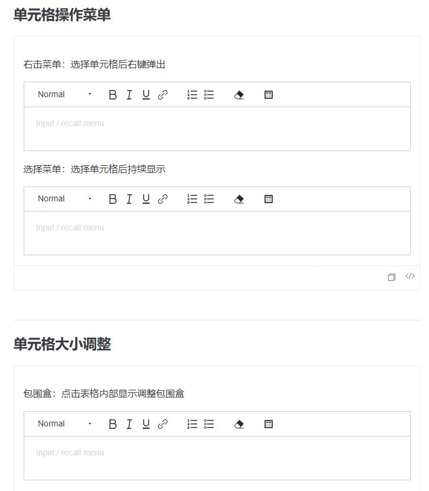
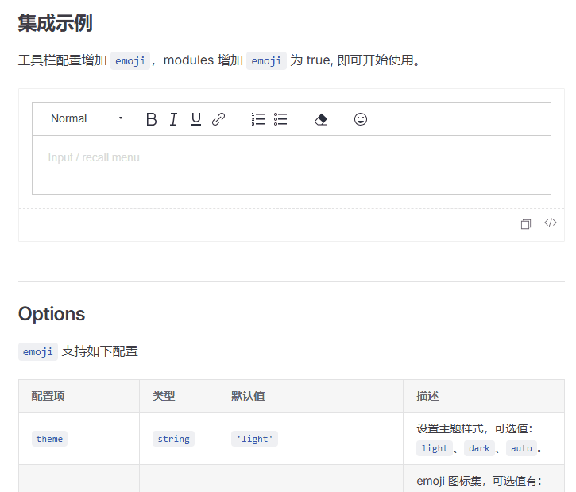
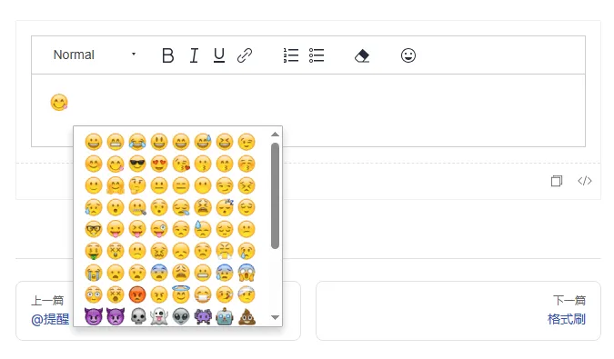
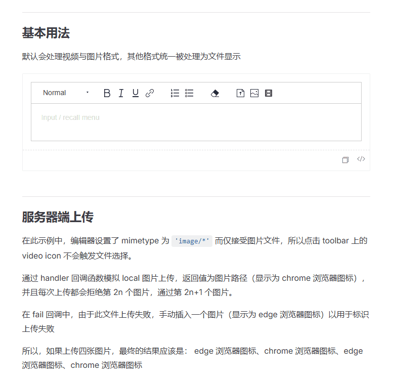

本文由体验技术团队 Kagol 原创，个人公众号：`前端开源星球`。

[TinyEditor](https://opentiny.github.io/tiny-editor/) 是一个基于 Quill 2.0 的富文本编辑器，在 Quill 基础上扩展了丰富的模块和格式，框架无关、功能强大、开箱即用。

- 源码：<https://github.com/opentiny/tiny-editor>
- 官网：<https://opentiny.github.io/tiny-editor>

对于富文本编辑器来说，插入图片、视频、表情，插入和编辑表格，这些都是非常常见的功能，因此我们对这几个模块做了重点优化和重构。

## 更强大的表格

之前的表格模块基于 quill-better-table 实现，现在这个项目已经不维护了，为了让 TinyEditor 的表格功能更好地演进下去，TinyEditor 项目核心贡献者 [zzxming](https://github.com/zzxming) 对表格模块进行了重构，使用了 quill-table-up 作为底层实现，替换了不维护的 quill-better-table。

[quill-table-up](https://github.com/zzxming/quill-table-up) 是 zzxming 设计和实现的，基于 Quill 2.0，拥有更好的模块化设,、更强的功能、更优的体验，而且一直在持续维护中。

quill-table-up 支持 quill-better-table 所有的功能，并且做了大量增强：

- 支持单元格中插入块级元素，比如：标题、引用、代码块等
- 支持自定义单元格背景色、边框颜色
- 拖拽改变行高/列宽，调整表格整体宽高
- 除了右键工具栏菜单，还支持常驻显示工具栏
- 支持斜线快捷菜单插入表格，支持上下左右方向键选择表格行/列大小

quill-table-up 做了很好的模块化设计，每个特性是一个单独的文件，支持按需引入和使用，这一点对于富文本这边的大型组件来说非常友好，可能每个业务只需要其中一部分功能，就可以不需要引入，打包时也不会包含这个特性的代码，能有效地减少包体积。

感谢 [zzxming](https://github.com/zzxming) 在表格模块重构和优化中付出的努力，提升了 TinyEditor 富文本编辑器的表格操作体验。

欢迎朋友们给 quill-table-up 开源项目点个 Star 支持下！

源码：<https://github.com/zzxming/quill-table-up>（欢迎 Star）

使用起来非常简单。

```typescript
import FluentEditor, { generateTableUp } from '@opentiny/fluent-editor'
// 按需导入 quill-table-up 特性模块
import { defaultCustomSelect, TableMenuSelect, TableSelection, TableUp } from 'quill-table-up'
// 引入样式文件
import 'quill-table-up/index.css'
import 'quill-table-up/table-creator.css'

// 注册 table-up 模块
FluentEditor.register({ 'modules/table-up': generateTableUp(TableUp) }, true)

const TOOLBAR_CONFIG = [
  [{ header: [] }],
  ['bold', 'italic', 'underline', 'link'],
  [{ list: 'ordered' }, { list: 'bullet' }],
  ['clean'],
  // 配置工具栏菜单项
  [{ 'table-up': [] }]
]

new FluentEditor(element, {
  theme: 'snow',
  modules: {
    'toolbar': TOOLBAR_CONFIG,
    // 配置 table-up 模块
    'table-up': {
      // 配置工具栏中选择表格行/列数量
      customSelect: defaultCustomSelect,

      // 配置拖选多个单元格，进行后续操作，比如：合并单元格、设置单元格背景色等
      selection: TableSelection,
      selectionOptions: {
        // 配置工具栏菜单的显示方式，支持点击右键显示、选择单元格后常驻显示两种形式
        tableMenu: TableMenuSelect
      }
    }
  }
})
```

效果如下：



更多特性欢迎大家使用和体验。

体验地址：<https://opentiny.github.io/tiny-editor/docs/demo/table-up>

## 更丰富的表情

在富文本中插入表情，虽然不是一个必须的功能，但却能让富文本内容更加有趣，比如我用富文本编辑器写一篇文章，如果能再文章中插入可可爱爱的 Emoji 表情，将是一件多么美妙的事情。

之前的 TinyEditor 支持的表情数量有限，而且没有做分类，不支持搜索，想要找一个想要的表情太难了。[vaebe](https://github.com/vaebe) 基于 emoji-mart 实现了一个新的 Emoji 模块，不仅支持更多表情，而且做了分类，支持表情的搜索、预览、最近实用的表情等实用的功能。

使用之前需要先安装对应的依赖：

```bash
npm i @floating-ui/dom @emoji-mart/data emoji-mart
```

然后分别在工具栏和模块开启 emoji 即可。

```typescript
import FluentEditor from '@opentiny/fluent-editor'

const TOOLBAR_CONFIG = [
  [{ header: [] }],
  ['bold', 'italic', 'underline', 'link'],
  [{ list: 'ordered' }, { list: 'bullet' }],
  ['clean'],
  // 配置 Emoji
  ['emoji']
]

new FluentEditor(element, {
  theme: 'snow',
  modules: {
    'toolbar': TOOLBAR_CONFIG,
    // 配置 emoji 模块
    'emoji': true
  }
})
```

效果如下：



对比下之前的表情面板：



新版的表情功能，UI 和体验都比之前的好太多了，感谢 [vaebe](https://github.com/vaebe) 给我们提供了一个这么好用的表情功能。

更多特性欢迎大家使用和体验。

体验地址：<https://opentiny.github.io/tiny-editor/docs/demo/emoji>

## 体验更好的图片/视频/文件上传功能

“富文本”意味着不仅仅是文字，还包含图片、视频等更丰富的内容，之前的图片、视频、文件上传是独立的三个模块，这就导致很多功能上的重复，比如校验文件格式、大小，多图、多文件上传，调整图片、视频宽高，图片、文件的下载等功能，每个模块都要实现一遍。

[zzxming](https://github.com/zzxming) 敏锐地识别到了这个问题，并将图片、视频、文件模块合并成一个模块，默认会处理视频与图片格式，其他格式统一被处理为文件显示。

- 图片可以拉伸放大缩小，可以左中右对齐，可以复制、下载
- 视频可以播放、暂停、下载、全屏、调整声音
- 文件可以查看大小、下载、删除

使用起来非常简单，只需要在工具栏配置中配置即可。

```typescript
import FluentEditor from '@opentiny/fluent-editor'

const TOOLBAR_CONFIG = [
  [{ header: [] }],
  ['bold', 'italic', 'underline', 'link'],
  [{ list: 'ordered' }, { list: 'bullet' }],
  ['clean'],
  // 配置图片、视频、文件上传功能
  ['file', 'image', 'video']
]

new FluentEditor(element, {
  theme: 'snow',
  modules: {
    'toolbar': TOOLBAR_CONFIG
  }
})
```

效果如下：



更多特性欢迎大家使用和体验。

体验地址：<https://opentiny.github.io/tiny-editor/docs/demo/file-upload>

## 往期推荐文章

- [👍TinyEditor：一个基于 Quill 2.0 的富文本编辑器，功能强大、开箱即用！](https://juejin.cn/post/7403618336952418314)
- [🎈TinyEditor 富文本开源 2 个月的总结：增加格式刷、截屏、TypeScript 类型声明等新特性](https://juejin.cn/post/7430505409176289320)
- [🥳 重磅更新！TinyEditor 开源富文本支持 LaTeX 可编辑公式啦\~](https://juejin.cn/post/7436030236784214068)
- [🎉 喜报！TinyEditor 开源富文本迎来了第一位贡献者](https://juejin.cn/post/7406347285901426728)
- [👏 让我们一起来建设 TinyEditor 开源富文本编辑器吧！](https://juejin.cn/post/7442330442606051338)
- [✨TinyEditor v3.25.0 正式发布！2025 年第一个版本，增加标题列表导航、分隔线等实用特性](https://juejin.cn/post/7455243039655067657)

## 关于 OpenTiny

欢迎加入 OpenTiny 开源社区。添加微信小助手：opentiny-official 一起参与交流前端技术～

[OpenTiny 官网](https://opentiny.design/)：**<https://opentiny.design>**\
[OpenTiny 代码仓库](https://github.com/opentiny)：**<https://github.com/opentiny>**\
[TinyVue 源码](https://github.com/opentiny/tiny-vue)：**<https://github.com/opentiny/tiny-vue>**\
[TinyEngine 源码](https://github.com/opentiny/tiny-engine)： **<https://github.com/opentiny/tiny-engine>**\
欢迎进入代码仓库 Star🌟TinyEngine、TinyVue、TinyNG、TinyCLI、TinyEditor\~

如果你也想要共建，可以进入代码仓库，找到 good first issue 标签，一起参与开源贡献\~
