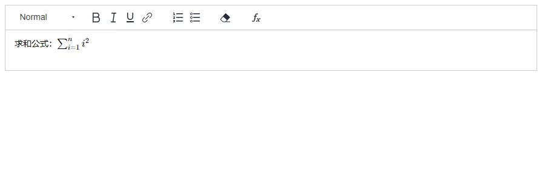
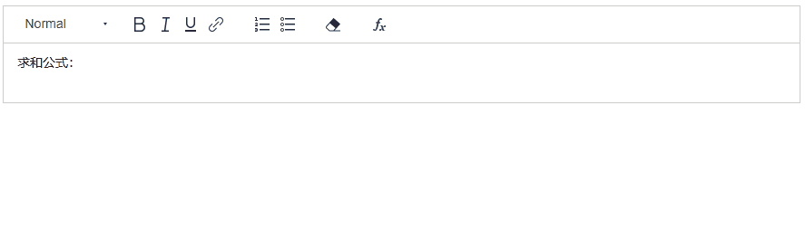
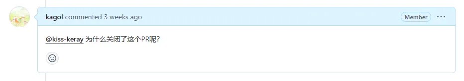
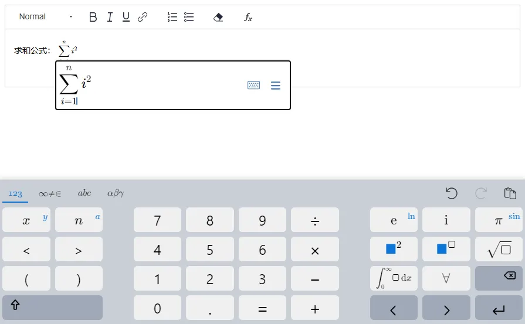
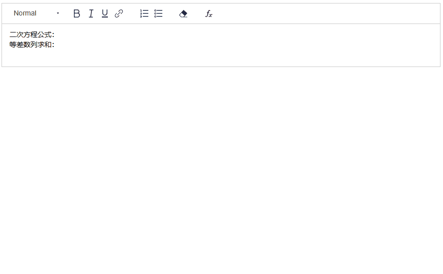
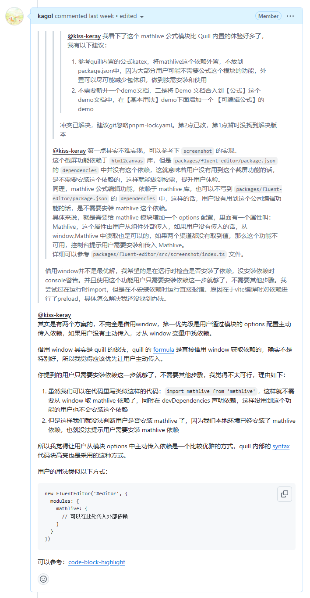
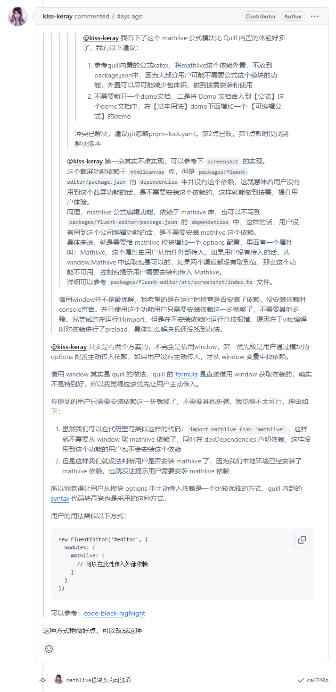

Fluent Editor  是一个基于 Quill 2.0 的富文本编辑器，在 Quill 基础上扩展了丰富的模块和格式，框架无关、功能强大、开箱即用。

- 源码：<https://github.com/opentiny/fluent-editor/（欢迎> Star ⭐）
- 官网：<https://opentiny.github.io/fluent-editor/>

## Quill 内置公式

Quill 内置了公式的功能，基于  `KaTeX`，使用时需要安装 katex 依赖，并导入对应的样式。

安装 katex 依赖：

```bash
npm i katex
```

使用 Quill 内置 formula 公式：

```html
<script setup lang="ts">
  import { onMounted } from 'vue'

  // 导入 katex 和对应的样式
  import katex from 'katex'
  import 'katex/dist/katex.min.css'

  // 挂载 katex 到 window 变量上
  window.katex = katex

  let editor

  const TOOLBAR_CONFIG = [
    [{ header: [] }],
    ['bold', 'italic', 'underline', 'link'],
    [{ list: 'ordered' }, { list: 'bullet' }],
    ['clean'],
    ['formula'] // 配置公式工具栏按钮
  ]

  onMounted(() => {
    editor = new FluentEditor('#editor', {
      theme: 'snow',
      modules: {
        toolbar: TOOLBAR_CONFIG
      }
    })
  })
</script>

<template>
    
  <div id="editor" />
</template>
```

效果图：



内置公式.png

要插入上图中的求和公式，需要知道该公式对应的  KaTeX  语法。

```css
\sum_{i=1}^{n} i^2
```

然后点击工具栏的公式按钮，并将上面的公式粘贴到公式输入框中，按回车键就可以插入公式啦。

以下是效果演示（Gif 动图）：



内置公式 Gif.gif

Quill 内置公式对于用户来说`有一定的使用成本`，并且只支持新增和删除公式，`不支持编辑公式`。

## LaTeX 可编辑公式

2024 年 9 月 27 日，kiss-keray  提交了一个 PR，为 Fluent Editor 增加 mathlive 可编辑公式能力。

过了两天 kiss-keray 关闭了这个 PR，我觉得挺可惜的，就问了一句为什么关闭了呢？



过了两天 kiss-keray 又重新提交了一个 PR #95，经过 20 天左右的检视和交流，今天该 PR 已合入主干分支，并发布正式版本：v3.22.0🎉🎉。

感谢  kiss-keray  为 Fluent Editor 做出的贡献，让 Fluent Editor 富文本拥有这么棒的公式编辑体验！

欢迎朋友们体验和使用 👏

使用可编辑公式之前，需要先安装  `mathlive`  依赖。

```bash
npm i @opentiny/fluent-editor@3.22.0 mathlive
```

```html
<script setup lang="ts">
  import { onMounted } from 'vue'

  // 导入 mathlive，并引入对应的样式
  import 'mathlive'
  import 'mathlive/static.css'
  import 'mathlive/fonts.css'

  let mathliveEditor

  const TOOLBAR_CONFIG = [
    [{ header: [] }],
    ['bold', 'italic', 'underline', 'link'],
    [{ list: 'ordered' }, { list: 'bullet' }],
    ['clean'],
    ['formula'] // 配置工具栏公式按钮
  ]

  onMounted(() => {
    mathliveEditor = new FluentEditor('#mathliveEditor', {
      theme: 'snow',
      modules: {
        toolbar: {
          container: TOOLBAR_CONFIG,
          handlers: {
            formula() {
              // 绑定点击工具栏公式按钮的事件
              const mathlive = this.quill.getModule('mathlive')
              mathlive.createDialog('e=mc^2')
            }
          }
        },
        mathlive: true // 开启可编辑公式功能
      }
    })
  })
</script>

<template>
    
  <div id="mathliveEditor" />
</template>
```

可编辑公式也支持 KaTex/LaTeX 语法，可以直接复制下面的公式，粘贴到公式输入框中。

```css
\sum_{i=1}^{n} i^2
```

效果如下：



可编辑公式.png

同时也支持对公式进行编辑，点击公式输入框右边的小键盘图标即可呼起公式编辑键盘，里面包含非常丰富的公式，使用起来非常方便，也不需要记忆复杂的 KaTeX/LaTeX 公式语法。

以下是效果演示（Gif 动图）：



欢迎通过以下链接体验更多可编辑公式的功能 👏

可编辑公式体验地址：<https://opentiny.github.io/fluent-editor/docs/formula>

## 往期推荐文章

- [🎉Fluent Editor：一个基于 Quill 2.0 的富文本编辑器，功能强大、开箱即用！](http://mp.weixin.qq.com/s?__biz=MzI2MDE3MTM4MA==&mid=2701521363&idx=1&sn=1d9ac1d8fd757848553e6d6a628a4696&chksm=ce9ce2c8f9eb6bded1cb58e52a9d777b63cd349d4353c37d4f27e6af37d727daec5725999819&scene=21#wechat_redirect)
- [👏 喜报！Fluent Editor 开源富文本迎来了第一位贡献者](http://mp.weixin.qq.com/s?__biz=MzI2MDE3MTM4MA==&mid=2701521407&idx=1&sn=db2240d78afddcb4f790e155e4ed684a&chksm=ce9ce2e4f9eb6bf20f27d46159d799d89ba1a1f505a4aa8eab3afa24fb41e203a7829e570776&scene=21#wechat_redirect)
- [🎈Fluent Editor 富文本开源 2 个月的总结：增加格式刷、截屏、TypeScript 类型声明等新特性](http://mp.weixin.qq.com/s?__biz=MzI2MDE3MTM4MA==&mid=2701521458&idx=1&sn=56fa9b07b0667801ce33c569569eb820&chksm=ce9ce129f9eb683f136caacf8d79161257e1a4ada45c24444787360c4520a0ebc8fe7dd0de9d&scene=21#wechat_redirect)

## 关于 OpenTiny

OpenTiny 官网：<https://opentiny.design>\
TinyVue 源码：<https://github.com/opentiny/tiny-vue> （欢迎 Star ⭐）\
TinyEngine 源码：<https://github.com/opentiny/tiny-engine> （欢迎 Star ⭐）\
B 站：<https://space.bilibili.com/15284299>\
欢迎加入 OpenTiny 开源社区。添加微信小助手 opentiny-official 一起参与交流前端技术～

## 附：与 kiss-keray 关于可编辑公式的交流过程

开源社区是一个程序员的聚集地，让我们有机会与全球各地的开发者进行交流和思想碰撞，向他人学习、寻求自我改进，我们要做的就是在与人沟通的过程中保持`谦逊`、`友善`和`耐心`。

一开始 kiss-keray 提交的 PR 没有贴效果图，所以我先是提了一个问题：

> mathlive 公式和 Quill 原生的 formula 公式有什么不同？

kiss-keray 很耐心地给我这个没接触过 mathlive 可视化公式编辑的外行解释了 mathlive 公式的好处：

> mathlive 公式支持可视化编辑，体验更加友好


于是我立马切到 PR #95 对应的分支，进行实际的体验：

    bash
     代码解读
    复制代码
    gh pr checkout 95

确实体验非常棒，让我觉得非常惊喜，于是我花了很多时间进行代码检视，整体实现遵循 Quill 的模块化方式，没有大问题，但我还是发现两个小问题：

- 这个 PR 把 mathlive 依赖内置了，用户不管是否使用 mathlive 公式，都会自动安装 mathlive 依赖，未遵循按需使用的原则，并有可能导致不必要的包体积增加。
- mathlive 目前是单独开了一个 demo 导航，导致与原来公式 demo 的割裂，demo 的层次混乱，影响用户使用文档的体验。


kiss-keray 很快就解决了第二个问题，而第一个问题则没有找到很好的解决方案。


我提供了我的思路，并提供了截屏模块作为参考。


第一次 kiss-keray 并未采纳，并希望寻找一种更优雅的方案，希望实现在运行时检查是否安装依赖。


第二次我详细解释了运行时检查依赖不可行的原因，并提供了 Quill 内部语法高亮模块的例子，用以说明将外部依赖剥离出去是 Quill 推荐的方式，有助于提升用户体验。



最终 kiss-keray 采纳了我的观点，并完成了 mathlive 依赖的剥离。



同时 kiss-keray 还优化了 parchment 的引入方案，不直接从 parchment 引入内容，而是从 quill 中引入。

将依赖从 @opentiny/fluent-editor 主包中剥离，有利于减少产物体积，提升业务的性能。

最终 PR #95 被合入，[kiss-keray](https://link.juejin.cn?target=https%3A%2F%2Fgithub.com%2Fkiss-keray 'https://github.com/kiss-keray') 也成为了 Fluent Editor 开源项目贡献者的一员，感谢 kiss-keray 的付出，欢迎 kiss-keray 的加入！👏


