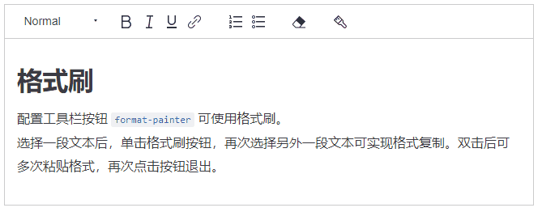
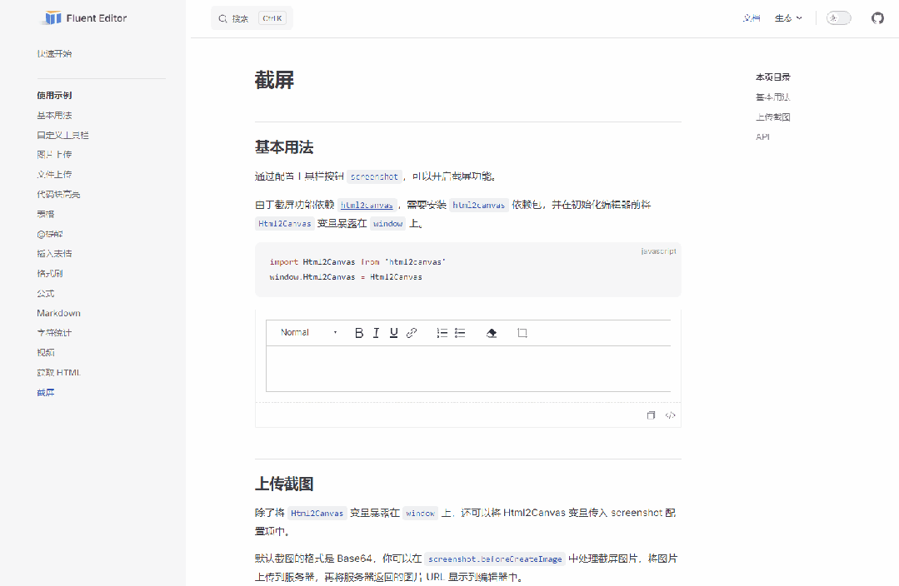
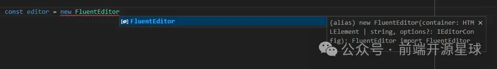
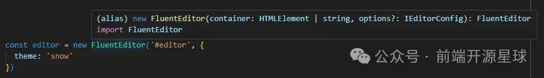
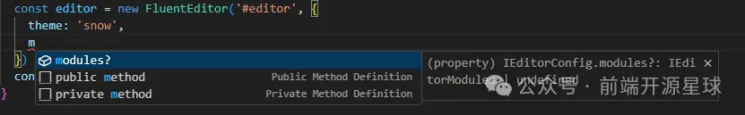
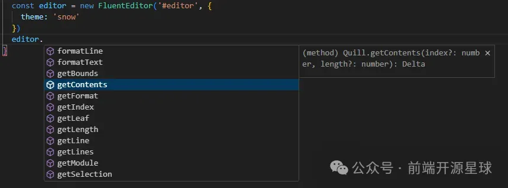

本文由体验技术团队 Kagol 原创。\
Fluent Editor  是一个基于 Quill 2.0 的富文本编辑器，在 Quill 基础上扩展了丰富的模块和格式，框架无关、 功能强大、开箱即用。

2024 年 8 月 12 日，Fluent Editor 正式开源！

- 源码：<https://github.com/opentiny/fluent-editor/>
- 官网：<https://opentiny.github.io/fluent-editor/>

Fluent Editor 的前身是我在 2019 年基于 Quill 做的一款富文本编辑器：EditorX，最早 EditorX 只是在公司内部使用，做 EditorX 的过程让我对 Quill 这款开源富文本有了更加深入的了解，沉淀了《深入浅出 Quill》系列文章。

2021 年 5 月 28 日，我在`华为HWEB大前端技术分享会`上分享了我做 Quill 富文本编辑器的实践：

[Quill 富文本编辑器的实践](http://mp.weixin.qq.com/s?__biz=MzI2MDE3MTM4MA==&mid=2701521141&idx=1&sn=e0774e258736e49b5cc413fc61387d21&chksm=ce9ce3eef9eb6af866b0b1601ddb5c692fc6d5e5b5f4ca5ccc9c723a8180c62cbdc60b7c7bf5&scene=21#wechat_redirect)

Fluent Editor 虽然刚开源 2 个多月，但其实已经在公司内部大量业务中使用，是一个成熟稳定的富文本编辑器。

目前 Fluent Editor 最新版本是：`v3.21.0`

    npm i @opentiny/fluent-editor@3.21.0

欢迎大家体验和使用！

## 近期开发的新特性

虽然 Fluent Editor 在公司内部使用很久了，但开源之后，依然收到了更广泛的社区开发者的 issue，我们持续响应，在这两个多月完成了很多实用的功能。

### 格式刷

第一个功能是格式刷，这个功能很小，但是很实用，而且 Quill 并没有内置。

> 该功能由 Fluent Editor 核心贡献者  zzxming  实现。

使用起来很方便，只需要配置下工具栏，增加  `format-painter`  格式即可。

```js
const TOOLBAR_CONFIG = [
  [{ header: [] }],
  ['bold', 'italic', 'underline', 'link'],
  [{ list: 'ordered' }, { list: 'bullet' }],
  ['clean'],
  ['format-painter'] // 增加格式刷功能
]

const editor = new FluentEditor('#editor', {
  theme: 'snow',
  modules: {
    toolbar: TOOLBAR_CONFIG
  }
})
```

使用体验和 Word 中的格式刷是一样的，选中一段带格式的文本，点击工具栏中的格式刷图标，然后选择另一段文本，这段文本就刷成了对应的格式。



双击格式刷图标，还可以连续刷格式，非常实用。


体验地址：<https://opentiny.github.io/fluent-editor/docs/format-painter>

### 截屏

富文本编辑器还能截屏？！截屏这个功能业界大部分富文本编辑器都没有，也是  `zzxming`  同学实现的。

个人觉得这个功能还是挺实用的，比如我们要做一个用户反馈的功能，放到网站右下角，用户点击之后出现一个富文本框，用户可以在里面输入反馈意见，提供反馈意见总免不了要截个图，更方便地说明要反馈的问题，而此时用户并没有打开微信等软件，并且本身电脑也没有安装截屏工具。

这时富文本的截屏功能就能发挥作用啦！

点击工具栏的截屏图标，就能框选页面区域进行截屏，截屏完，图片会自动插入到富文本的光标位置，巨方便！

该功能基于 canvas2html，`zzxming`  同学非常贴心地解决了：当画面中包含外部链接的图片时，canvas2html 截图出现空白的问题，所以如果你使用 Fluent Editor 的截屏功能，将不会出现该问题。



要给 Fluent Editor 配置截屏功能，需要先安装  `html2canvas`  依赖包，并在初始化编辑器前将  `Html2Canvas`  变量暴露在  `window`  上。

```js
import Html2Canvas from 'html2canvas'
window.Html2Canvas = Html2Canvas
```

然后配置工具栏按钮  `screenshot`，可以开启截屏功能。

```js
const TOOLBAR_CONFIG = [
  [{ header: [] }],
  ['bold', 'italic', 'underline', 'link'],
  [{ list: 'ordered' }, { list: 'bullet' }],
  ['clean'],
  ['screenshot'] // 增加截屏功能
]

const editor = new FluentEditor('#editor', {
  theme: 'snow',
  modules: {
    toolbar: TOOLBAR_CONFIG
  }
})
```

体验链接：<https://opentiny.github.io/fluent-editor/docs/screenshot>

### 完善的 TypeScript 类型支持

Fluent Editor 本身是用 TypeScript 写的，在最新的 v3.21.0 版本中，也支持了 TypeScript 类型声明文件导出，开发者在使用 Fluent Editor 时有非常丝滑的类型提示。

当初始化 Fluent Editor 时，会提示构造函数的参数和相应的类型。



鼠标移到  `FluentEditor`  关键字上也有提示。



配置 modules / toolbar 时也有完善的提示。




编辑器实例的方法也是有提示的。



更多实用功能等你来体验！

- 表格
- 图片上传（支持图片拉伸）
- 附件上传
- 代码块高亮
- @提醒（支持自定义 HTML）
- 插入公式
- 插入视频
- 插入 Emoji 表情
- Markdown 快捷键支持
- 字符统计
- 深色模式
- 超链接支持自动增加  `https://`  前缀
- ...

欢迎社区的开发者朋友们给我们提供宝贵的意见，或者感兴趣也欢迎参与我们的开源共建 🤝

## 关于 OpenTiny

OpenTiny 官网：<https://opentiny.design>\
TinyVue 源码：<https://github.com/opentiny/tiny-vue（欢迎> Star ⭐）\
TinyEngine 源码：<https://github.com/opentiny/tiny-engine（欢迎> Star ⭐）\
B 站：<https://space.bilibili.com/15284299>\
欢迎加入 OpenTiny 开源社区。添加微信小助手 opentiny-official 一起参与交流前端技术～
