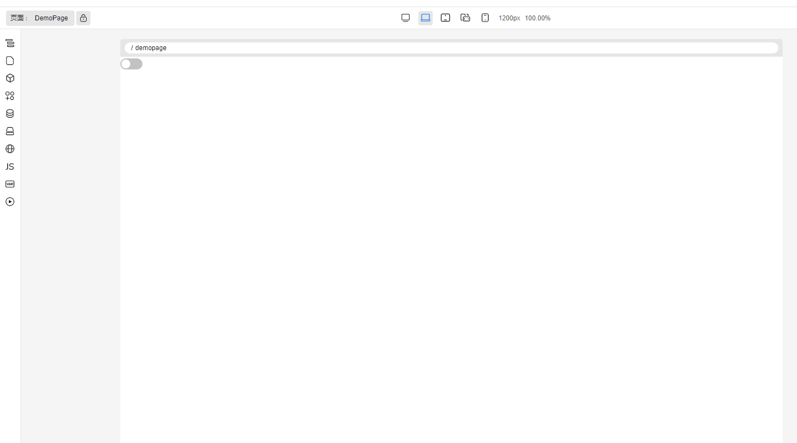
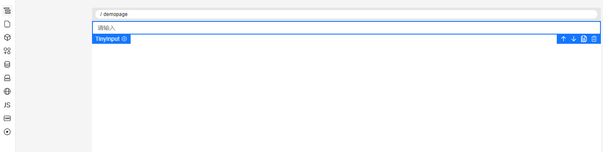
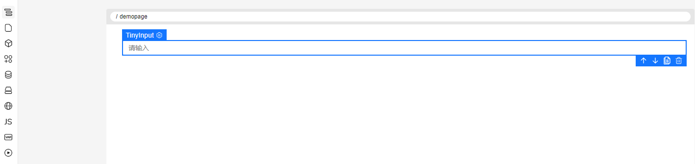
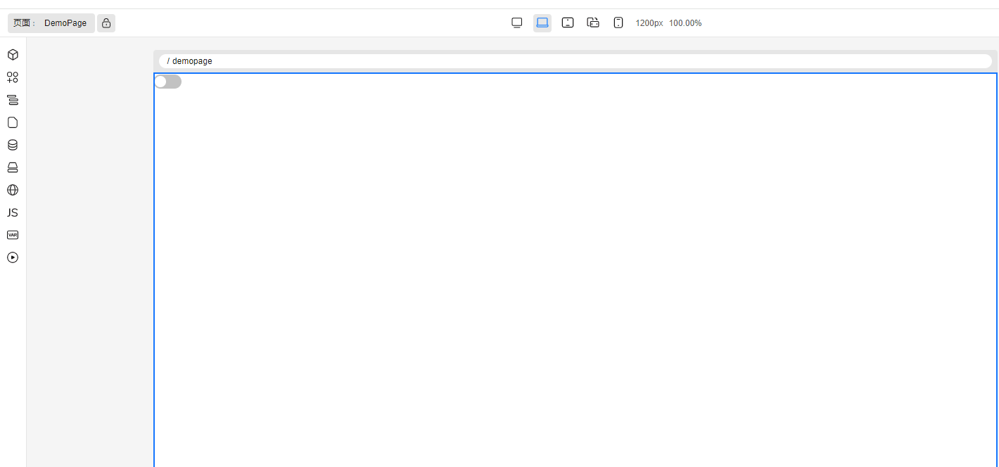
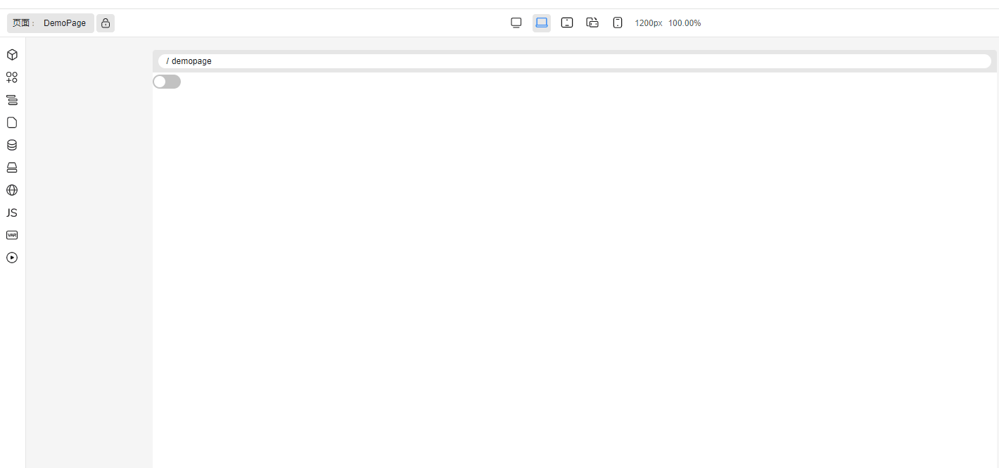

## 前言

TinyEngine 低代码引擎使开发者能够定制低代码平台。它是低代码平台的底座，提供可视化搭建页面等基础能力，既可以通过线上搭配组合，也可以通过 cli 创建个人工程进行二次开发，实时定制出自己的低代码平台。适用于多场景的低代码平台开发，如：资源编排、服务端渲染、模型驱动、移动端、大屏端、页面编排等。

近期，我们正式推出 TinyEngine v2.7 版本，希望能够给大家带来更好的使用体验，能够深度定制化的同时可以更简洁便利地配置。

- 源码：<https://github.com/opentiny/tiny-engine>（欢迎 Star ⭐）
- 官网：<https://opentiny.design/tiny-engine#/home>

这次版本特性开发和问题修复已经有更多的开发者朋友参与进来，我们在此诚挚感谢  [@1degrees @BWrong](https://github.com/opentiny/tiny-engine/releases/tag/v2.7.0 '按住ctrl点击直接打开')  积极参加 TinyEngine 的开源共建，同时也邀请大家一起加入开源社区的建设，让 TinyEngine 成长的更加优秀和茁壮。

## v2.7.0 变更特性概览

- 【增强】【破坏性变更】注册表声明方式变更：默认注册表内置，采用基于唯一 ID 的扁平结构，更加灵活和精确。
- 【优化】【破坏性变更】布局配置优化：支持  `layoutConfig`  和  `relativeLayoutConfig`  两种布局配置方式
- 【增强】注册表热修复功能：通过覆盖官方插件的特定函数或模板，实现紧急 bug 修复
- 【物料】物料可以单独设置是否添加基础样式
- 【增强】i18n 批量下载模板支持配置 URL 或者下载方法
- 【其他】文档更新、功能细节优化与 bug 修复

## TinyEngine v2.7.0 新特性解读

### 一、【增强】【破坏性变更】注册表声明方式变更&默认注册表内置

v2.6 及更老的版本的注册表中，我们收到用户的反馈有这么几个体验不友好的地方：

- 需要手动配置完整注册表，对于用户来说，有些官方的插件、元服务其实不需要改动，这时候其实应该不需要用户声明，减少用户心智负担。
- 升级版本的时候，如果有新的插件、新的原服务，用户原有的二开工程需要手动导入并在注册表中进行声明。

在 V2.7 版本中，我们带来了解决方案：

- 基于唯一 ID 的新注册表方式，使得配置更加灵活（布局则解耦到对应的布局插件中，避免注册表与布局进行耦合）。
- 官方插件合原服务默认内置，后续仅需升级版本，即可体验到新插件、原服务，而不需要重新手动配置。

新版注册表声明方式示例（配置插件、替换插件、新增插件、删除插件）：

```js
import { META_APP } from '@opentiny/tiny-engine'
// 新版注册表配置示例
const register = {
  'engine.root': {
    id: 'engine.root',
    metas: [GenerateCodeService, GlobalService]
  },
  'engine.config': engineConfig,
  // 覆盖官方的配置
  [META_APP.Layout]: {
    options: {...}
  },
  // 配置 false 隐藏工具栏清空按钮，并且在构建的时候，会将工具栏插件的相关代码做 tree-shaking
  [META_APP.Clean]: false,
  // 替换整个页面JS插件，手动配置 tree-shaking 为 true，会将原来的页面JS插件的代码做 tree-shaking
  /* #__TINY_ENGINE_TREE_SHAKING__: true */
  [META_APP.Script]: scriptPlugin,
  // 新增的插件，需要使用与官方插件不相同的唯一 id
  'engine.plugins.customPlugin': {
    ...customPlugin,
    id: 'engine.plugins.customPlugin'
  }
}
```

示例解读：

1. 最外层为一个对象结构，每个键都是一个唯一的注册表 ID。
2. `engine.root`：配置核心的元服务，许多的插件依赖这些核心的元服务。
3. `engine.config`：低代码引擎的配置，主要配置物料、主题等等。
4. `[META_APP.Layout]`：配置低代码引擎的布局，可以通过扩展官方布局来自定义。
5. `[META_APP.Clean]: false`：通过设置为  `false`  来隐藏特定工具栏按钮，同时在构建时会进行 tree-shaking 优化。
6. `[META_APP.Script]`：替换整个页面 JS 插件，并通过注释  `#__TINY_ENGINE_TREE_SHAKING__: true`  指示构建工具对原插件代码进行 tree-shaking。
7. `engine.plugins.customPlugin`：添加新的自定义插件，需要使用与官方插件不同的唯一 ID。

**重要提示 ⚠️**：v2.7 开始，如果对原插件没有改动（配置、替换、删除），则不需要在注册表中进行声明，因为官方内置了全量的注册表。

#### 升级步骤

1. 将注册表配置从旧的分类式结构（`toolbars`, `plugins`, `settings`等）调整为基于唯一 ID 的扁平结构
2. 对于已存在的官方组件，使用其唯一 ID 作为对象的键
3. 移除不需要的插件时，将其值设置为  `false`
4. 添加新插件时，确保使用与官方插件不同的唯一 ID

详细内容请参考：[新注册表文档](https://opentiny.design/tiny-engine#/help-center/course/dev/new-registry '按住ctrl点击直接打开')

#### Vite 配置要求

##### registryPath 配置

**重要说明 ⚠️**：v2.7 版本开始，为了使注册表的 tree-shaking 功能正常工作，您需要在  `vite.config.js`  中配置  `registryPath`  参数。

```js
// vite.config.js
import { defineConfig, mergeConfig } from 'vite'
import { useTinyEngineBaseConfig } from '@opentiny/tiny-engine-vite-config'

export default defineConfig((configEnv) => {
  const baseConfig = useTinyEngineBaseConfig({
    viteConfigEnv: configEnv,
    root: __dirname,
    // 其他配置...
    registryPath: './registry.js' // 必须配置，指向注册表文件路径
  })

  // 其他配置...
  return mergeConfig(baseConfig, customConfig)
})
```

这个配置主要用于：

- 支持插件的 tree-shaking 优化
- 识别被设置为  `false`  的插件并在构建时移除相关代码
- 解析注册表中的特殊注释指令

### 二、【优化】【破坏性变更】布局配置优化

v2.6 及以前的版本中，我们是将布局与注册表进行了强行的耦合。plugin 代表左侧的插件，toolbars 代表顶部的工具栏。

v2.7 的版本中，我们将注册表与布局进行了解耦，布局配置在布局插件中进行配置，并提供两种配置方式，使得布局配置方式更加灵活。

新版布局配置提供了两种配置方式：

- `layoutConfig`：完整布局配置，自定义整个布局结构
- `relativeLayoutConfig`：局部调整插件顺序，适用于仅调整部分插件位置

#### layoutConfig 完整布局配置

options.layoutConfig 可以全局调整插件位置。 适用场景：调整全局的插件、工具栏的位置，包括新增的插件。 ⚠️ 注意：

1. 使用 options.layoutConfig 配置项时，options.relativeLayoutConfig 配置项将失效
2. 使用该配置项时，需要列举完整的插件列表。没有列举的插件，将不会显示。

使用示例：

```js
export default {
  [META_APP.Layout]: {
    options: {
      layoutConfig: {
        plugins: {
          left: {
            top: [
              META_APP.Materials,
              META_APP.OutlineTree,
              META_APP.AppManage,
              META_APP.BlockManage,
              META_APP.Collections,
              META_APP.Bridge,
              META_APP.I18n,
              META_APP.PageController,
              META_APP.State
            ],
            bottom: [META_APP.Schema, META_APP.EditorHelp, META_APP.Robot]
          },
          right: {
            top: [META_APP.Props, META_APP.Styles, META_APP.Event]
          }
        },
        toolbars: {
          left: [META_APP.Breadcrumb, META_APP.Lock, META_APP.Logo],
          center: [META_APP.Media],
          right: [
            [META_APP.ThemeSwitch, META_APP.RedoUndo, META_APP.Clean],
            [META_APP.Preview],
            [META_APP.GenerateCode, META_APP.Save]
          ],
          collapse: [
            [META_APP.Collaboration],
            [META_APP.Refresh, META_APP.Fullscreen],
            [META_APP.Lang],
            [META_APP.ViewSetting]
          ]
        }
      }
    }
  }
}
```

#### relativeLayoutConfig 局部布局配置方式

relativeLayoutConfig 可以局部调整插件位置。 适用场景：仅调整局部的插件位置，或者是增加新插件时，指定顺序。

支持的相对位置有：

- insertBefore 显示在指定的插件前面
- insertAfter 显示在指定的插件后面

使用示例：

```js
export default {
  [META_APP.Layout]: {
    options: {
      // 局部调整插件顺序
      relativeLayoutConfig: {
        // 将页面 JS 插件显示在页面管理插件前面
        [META_APP.Script]: {
          insertBefore: META_APP.AppManage
        },
        // 将物料面板显示在状态管理插件后面
        [META_APP.Materials]: {
          insertAfter: META_APP.State
        },
        // 将页面 schema 插件显示在物料插件前面
        [META_APP.Schema]: {
          insertBefore: META_APP.Materials
        },
        // 将保存按钮显示在主题切换按钮前面
        [META_APP.Save]: {
          insertBefore: META_APP.ThemeSwitch
        },
        // 将自定义插件显示在大纲树后面
        'engine.plugins.customPlugin': {
          insertAfter: META_APP.OutlineTree
        }
      }
    }
  }
}
```

⚠️ 温馨提示：当使用  `layoutConfig`  配置项时，`relativeLayoutConfig`  配置项将失效。

更详细的布局配置以及更详细的布局插件配置，请参考  [文档](https://opentiny.design/tiny-engine#/help-center/course/dev/global-layout-api '按住ctrl点击直接打开')

### 三、【增强】注册表热修复功能：通过覆盖官方插件的特定函数或模板，实现紧急 bug 修复

**背景：** 开源的开发过程中，难免会遇到一些紧急的 bug 需要修复，如果等待开源版本的下个版本发布，可能需要经过这样一个流程：

1. 用户向 TinyEngine 团队反馈 bug。（30min - 1h）
2. TinyEngine 团队分析 bug 原因，并给出修复方案。（1h - 2h）
3. 验证修复方案，发布新版本。（1h）
4. 用户同步新版本，验证新版本。（1h-2h）
5. 用户确认无误，提交审批流程给领导，发布新版本。（1h-2h）
6. 新版本上线，用户可以正常使用。（1h-2h）

经过上述的一个流程可以看到，整个标准的修复流程相对比较长，如果是一些对用户影响比较大的问题，在商业上可能无法满足要求。

因此，我们推出了注册表的 hotfix 功能，可以通过传入 hotfix 的注册表，对某些插件实现函数级别的覆盖能力，从而实现快速修复紧急 bug。

**使用示例：**

1. 在后端增加一个接口，返回临时的 hotfix 注册表。比如  `/hotfix-registry.js`。没有紧急 bug 的时候，返回空对象。
2. 在 TinyEngine 初始化的时候，调用这个接口，获取临时的 hotfix 注册表。

```js
// 这里获取线上的注册表
const fetchHotfixRegistry = async (url) => {
  const response = await import(/* @vite-ignore */ url)
  return response.default
}

async function startApp() {
  // 调用 initHotfixRegistry 方法，传入接口地址以及请求方法，获取临时的 hotfix 注册表并提前注册。
  const hotfixRegistry =
    (await initHotfixRegistry({
      url: 'http://localhost:8090/hotfixRegistry.js',
      request: fetchHotfixRegistry
    })) || {}

  const registry = await import('../registry')
  const { init } = await import('@opentiny/tiny-engine')

  init({
    // 合并多个注册表
    registry: [registry.default, hotfixRegistry],
    configurators,
    createAppSignal: ['global_service_init_finish']
  })
}

startApp()
```

示例 hotfix 注册表：

```js
// hotfixRegistry.js
export default {
  'engine.plugins.i18n': {
    overwrite: {
      methods: {
        'Main': {
          // 覆盖 i18n 插件的 openEditor 方法
          openEditor: (ctx) => (_event, row) => {
            const { isEditMode, editingRow, i18nTable, langList, getActiveRow, utils } = ctx()
            isEditMode.value = Boolean(row.key)
            editingRow.value = row
            if (!isEditMode.value) {
              row.key = `custom.${utils.guid()}`
              langList.value.unshift(row)
            }
            i18nTable.value.setActiveRow(row).then(() => {
              getActiveRow()
            })
          }
        }
      },
      lifeCycles: {
        'Main': {
          onMounted: [
            // i18n 插件 Main.vue 文件的第一个 onMounted 方法，不覆盖
            '',
            // 覆盖 i18n 插件 Main.vue 文件的第二个 onMounted 方法
            (ctx) => () => {
              const { i18nSearchTypes, currentSearchType } = ctx()
              console.log('overWrite i18n onMounted', i18nSearchTypes, currentSearchType.value)
              currentSearchType.value = i18nSearchTypes[0].value
            }
          ]
        }
      }
    }
  }
}
```

详细内容请参考：[注册表高级配置文档](https://opentiny.design/tiny-engine#/help-center/course/dev/new-registry-advanced '按住ctrl点击直接打开')

#### 查看注册表最终呈现的效果

我们综合 1-3 所有对注册表的操作，演示最终的效果（修改插件位置、覆盖插件方法、替换插件、新增插件等等）



### 四、【优化】API 变更

v2.7 版本对  `@opentiny/tiny-engine-meta-register`  包的 API 进行了重大重构，以下是主要变化：

#### 移除的 API

##### 1. `getMergeRegistry`  函数

变更说明：`getMergeRegistry`  函数已被完全移除，不再提供此 API。

旧版用法：

```js
import { getMergeRegistry } from '@opentiny/tiny-engine'

// 根据类型和 ID 获取合并后的注册表项
const plugin = getMergeRegistry('plugins', 'engine.plugins.materials')
const allPlugins = getMergeRegistry('plugins')
```

新版替代方案：

```js
import { getMergeMeta, getMergeMetaByType, getAllMergeMeta } from '@opentiny/tiny-engine'

// 根据 ID 获取特定的注册表项
const plugin = getMergeMeta('engine.plugins.materials')

// 根据类型获取所有注册表项
const allPlugins = getMergeMetaByType('plugins')

// 获取所有注册表项
const allMetas = getAllMergeMeta()
```

##### 2. `getLayoutComponent`  函数

变更说明：`getLayoutComponent`  函数已被移除，不再单独提供布局组件获取功能。

旧版用法：

```js
import { getLayoutComponent } from '@opentiny/tiny-engine-meta-register'

const layoutComponent = getLayoutComponent({ id: 'engine.layout.header' })
```

新版替代方案： 布局组件现在通过新的注册表机制进行管理，应使用  `getMergeMeta`  获取：

```js
import { getMergeMeta } from '@opentiny/tiny-engine'

const layoutMeta = getMergeMeta('engine.layout')
```

#### 新增的 API

##### 1. `getMergeMetaByType`  函数

功能说明：根据类型获取所有匹配的注册表项。

```js
import { getMergeMetaByType } from '@opentiny/tiny-engine'

// 获取所有插件类型的注册表项
const plugins = getMergeMetaByType('plugins')
```

##### 2. `getAllMergeMeta`  函数

功能说明：获取所有的注册表项。

```js
import { getAllMergeMeta } from '@opentiny/tiny-engine'

// 获取完整的注册表
const allMetas = getAllMergeMeta()
```

##### 3. `initHotfixRegistry`  函数

```js
import { initHotfixRegistry } from '@opentiny/tiny-engine-meta-register'

// 从远程 URL 加载热修复注册表
await initHotfixRegistry({
  url: 'https://example.com/hotfix-registry.js'
})
```

##### 4. 插件  `align`  配置的废弃

在 v2.7 版本中，插件的  `align`  配置属性已被废弃，不再作为定位插件位置的方式。新版本中应使用  `layoutConfig`  或  `relativeLayoutConfig`  来定位插件。

旧版写法：

```js
// 不再支持的写法
const plugin = {
  id: 'engine.plugins.customPlugin',
  align: 'leftTop' // 已废弃
  // 其他配置...
}
```

新版写法：

```js
// 新写法 - 使用 layoutConfig 定位插件
const register = {
  'engine.layout': {
    options: {
      layoutConfig: {
        plugins: {
          left: {
            top: ['engine.plugins.customPlugin' /* 其他插件... */]
          }
        }
      }
    }
  }
}

// 或使用 relativeLayoutConfig
const register = {
  'engine.layout': {
    options: {
      relativeLayoutConfig: {
        'engine.plugins.customPlugin': {
          insertBefore: 'engine.plugins.materials'
        }
      }
    }
  }
}
```

##### 5. 插件  `type: setting`  配置的废弃

在 v2.7 版本中，右侧设置面板插件不再使用  `type: 'setting'`  来标识，而是统一使用插件 ID 来区分。

旧版写法：

```js
// 不再支持的写法
export default {
  id: 'engine.setting.props',
  title: '属性',
  type: 'settings', // 已废弃
  name: 'props',
  icon: 'form'
}
```

新版写法：

```js
// 新写法
export default {
  id: 'engine.setting.props',
  title: '属性',
  type: 'plugins', // 统一使用 plugins 类型
  name: 'props',
  icon: 'form'
}
```

右侧设置面板的插件现在也通过布局配置的  `layoutConfig`  或  `relativeLayoutConfig`  进行定位：

```js
const register = {
  'engine.layout': {
    options: {
      layoutConfig: {
        plugins: {
          right: {
            top: ['engine.setting.props', 'engine.setting.styles', 'engine.setting.event']
          }
        }
      }
    }
  }
}
```

#### 升级指导

1. 替换  `getMergeRegistry`  调用：

   - 将  `getMergeRegistry(type, id)`  替换为  `getMergeMeta(id)`
   - 将  `getMergeRegistry(type)`  替换为  `getMergeMetaByType(type)`

2. 移除  `getLayoutComponent`  调用：

   - 使用  `getMergeMeta()`  获取布局相关的注册表项
   - 通过新的布局配置机制管理布局组件

3. 利用新增 API：

   - 使用  `getAllMergeMeta()`  获取完整注册表信息，便于调试和开发
   - 使用  `initHotfixRegistry()`  实现热修复功能

详细的 API 说明，请参考：[注册表 API](https://opentiny.design/tiny-engine#/help-center/course/dev/new-registry '按住ctrl点击直接打开') ，[升级指南文档](https://opentiny.design/tiny-engine#/help-center/course/dev/v2.7-upgrade-guide '按住ctrl点击直接打开')

### 五、 【物料】物料可以单独设置是否添加基础样式

在之前的版本中，我们在代码层面给物料添加了统一的默认样式类：component-base-style，主要是增了一些边距，但在这个版本中，我们可以在组件的层面选择是否添加这个样式类，避免了所有组件同时开关默认样式类而导致不够灵活；

/public/mock/bundle.json:

```json
{
  "name": {
    "zh_CN": "输入框"
  },
  "component": "TinyInput",
  "configure": {
    // ...
    "useBaseStyle": true
  }
}
```

以 TinyInput 为例，当我们不添加默认样式类时



添加默认样式类后



### 六、【增强】i18n 批量下载模板支持配置 URL 或者下载方法

#### 1. 通过 url 的方式配置

可以通过给 i18n 插件添加 batchImportTempDownloadUrl 属性来配置下载链接

示例如下：

```js
// registry.js
import { I18n } from '@opentiny/tiny-engine'
export default {
  // ...
  [META_APP.I18n]: {
    ...I18n,
    options: {
      batchImportTempDownloadUrl: '/123.rar',
      batchImportTempDownMethod: ''
    },
    id: META_APP.I18n
  }
}
```

在设计器里点击下载模板查看下载内容，当然这里的格式是自定义的，实际使用请按照正确的模板格式来创建文件



#### 2. 通过下载方法的方式配置

通过给 i18n 插件添加 batchImportTempDownMethod 属性来激活调用自定义方法来下载模板

示例如下：

```js
// registry.js
import { I18n } from '@opentiny/tiny-engine'
export default {
  // ...
  [META_APP.I18n]: {
    ...I18n,
    options: {
      batchImportTempDownloadUrl: '',
      batchImportTempDownMethod: () => {
        alert('downloading')
        window.open('/123.rar', '_blank')
      }
    },
    id: META_APP.I18n
  }
}
```

示例效果：



**Tips: 当同时配置了下载 URL 和下载方法时，配置下载方法的优先级总是最高的**

### 七、【其他】功能细节优化\&bug 修复

- 默认导出的模式，没有读取  `.default`  属性，导致无法渲染  [@chilingling](https://github.com/chilingling '按住ctrl点击直接打开')  [#1491](https://github.com/opentiny/tiny-engine/pull/1491 '按住ctrl点击直接打开')

- 二开工程同时使用依赖  `@opentiny/tiny-engine`  和  `@opentiny/tiny-engine-common`启动项目时，会报错  `getMetaApi`  相关的实例或者是状态无法找到。[@chilingling](https://github.com/chilingling '按住ctrl点击直接打开')  [#1494](https://github.com/opentiny/tiny-engine/pull/1494 '按住ctrl点击直接打开')

- 数据源静态数据无数据时新增字段无法点击  [@xuanlid](https://github.com/xuanlid '按住ctrl点击直接打开')  [#1502](https://github.com/opentiny/tiny-engine/pull/1502 '按住ctrl点击直接打开')

- 数据源的数据有长度限制，但是实际依然可以点击保存，预期保存显示校验   [@xuanlid](https://github.com/xuanlid '按住ctrl点击直接打开')  [#1502](https://github.com/opentiny/tiny-engine/pull/1502 '按住ctrl点击直接打开')

- 使用远程数据源的时候，在使用过后，新建一个数据源，会发现之前用过的链接会出现在新建的数据源   [@xuanlid](https://github.com/xuanlid '按住ctrl点击直接打开')  [#1502](https://github.com/opentiny/tiny-engine/pull/1502 '按住ctrl点击直接打开')

- 物料区块 tab 中添加区块，点击全选按钮然后搜索，数据会消失  [@xuanlid](https://github.com/xuanlid '按住ctrl点击直接打开')  [#1504](https://github.com/opentiny/tiny-engine/pull/1504 '按住ctrl点击直接打开')

- 物料区块 tab 中区块从分组删除后，添加区块区域数据没有及时刷新  [@xuanlid](https://github.com/xuanlid '按住ctrl点击直接打开')  [#1506](https://github.com/opentiny/tiny-engine/pull/1506 '按住ctrl点击直接打开')

- 数据源下静态数据，当出现校验显示的时候，新增静态数据按钮显示错位  [@xuanlid](https://github.com/xuanlid '按住ctrl点击直接打开')  [#1507](https://github.com/opentiny/tiny-engine/pull/1507 '按住ctrl点击直接打开')

- 数据源下在分辨率较大的情况下（测试的电脑默认分辨率下），会不显示静态数据的复制和删除  [@xuanlid](https://github.com/xuanlid '按住ctrl点击直接打开')  [#1507](https://github.com/opentiny/tiny-engine/pull/1507 '按住ctrl点击直接打开')

- 数据源的校验没有立即生效  [@xuanlid](https://github.com/xuanlid '按住ctrl点击直接打开')  [#1507](https://github.com/opentiny/tiny-engine/pull/1507 '按住ctrl点击直接打开')

- 数据源静态数据下，计数器的校验逻辑有问题  [@xuanlid](https://github.com/xuanlid '按住ctrl点击直接打开')  [#1507](https://github.com/opentiny/tiny-engine/pull/1507 '按住ctrl点击直接打开')

- 单个页面多次修改偶现预览失败  [@xuanlid](https://github.com/xuanlid '按住ctrl点击直接打开')  [#1508](https://github.com/opentiny/tiny-engine/pull/1508 '按住ctrl点击直接打开')

- 修复往表格列插槽拖动时，有可能拖动节点到插槽的顶层，导致节点被插入到 TinyGrid children，导致表格显示的 bug [@chilingling](https://github.com/chilingling '按住ctrl点击直接打开')  [#1512](https://github.com/opentiny/tiny-engine/pull/1512 '按住ctrl点击直接打开')

- 创建区块时生成截图失败   [@betterdancing](https://github.com/betterdancing '按住ctrl点击直接打开')  [#1514](https://github.com/opentiny/tiny-engine/pull/1514 '按住ctrl点击直接打开')

- 创建区块和发布区块时接口报错   [@betterdancing](https://github.com/betterdancing '按住ctrl点击直接打开')  [#1515](https://github.com/opentiny/tiny-engine/pull/1515 '按住ctrl点击直接打开')

- 手动收起页面树的时候，如果清除搜索后，已收起的页面且没被搜索到的也会自动展开  [@betterdancing](https://github.com/betterdancing '按住ctrl点击直接打开')  [#1525](https://github.com/opentiny/tiny-engine/pull/1525 '按住ctrl点击直接打开')

- 物料区块 tab 添加区块，区块全选后，搜索区块然后取消全选，会连带取消全部区块的选中状态，当前修改为，只取消搜索出来的选项的，搜索清空后，未搜索到的数据选择正常，不会被取消  [@xuanlid](https://github.com/xuanlid '按住ctrl点击直接打开')  [#1526](https://github.com/opentiny/tiny-engine/pull/1526 '按住ctrl点击直接打开')

- 文档更新

  - [2.7 版本更新日志](https://opentiny.design/tiny-engine#/help-center/course/dev/changelog '按住ctrl点击直接打开')
  - [2.7 版本升级文档](https://opentiny.design/tiny-engine#/help-center/course/dev/v2.7-upgrade-guide '按住ctrl点击直接打开')
  - [注册表新文档](https://opentiny.design/tiny-engine#/help-center/course/dev/new-registry '按住ctrl点击直接打开')
  - [注册表布局配置](https://opentiny.design/tiny-engine#/help-center/course/dev/global-layout-api '按住ctrl点击直接打开')
  - [注册表热修复功能](https://opentiny.design/tiny-engine#/help-center/course/dev/new-registry-advanced '按住ctrl点击直接打开')

以上是此次更新问题修复的主要内容

如需了解更多可以查看：[v2.7.0 所有 changelog](https://github.com/opentiny/tiny-engine/releases/tag/v2.7.0 '按住ctrl点击直接打开')

## 结语

TinyEngine 2.7 版本更新不仅限于注册表新架构、物料默认样式、国际化配置下载 URL 或方法，还对画布不支持默认导出的物料、小图标出码等功能进行了修复。每一步前行都值得铭记，感谢有您陪伴我们一起迭代成长，同时也欢迎大家加入社区讨论，参与社区共建！

## 关于 OpenTiny

欢迎加入 OpenTiny 开源社区。添加微信小助手：opentiny-official 一起参与交流前端技术～

[OpenTiny 官网](https://opentiny.design/)：**<https://opentiny.design>**\
[OpenTiny 代码仓库](https://github.com/opentiny)：**<https://github.com/opentiny>**\
[TinyVue 源码](https://github.com/opentiny/tiny-vue)：**<https://github.com/opentiny/tiny-vue>**\
[TinyEngine 源码](https://github.com/opentiny/tiny-engine)： **<https://github.com/opentiny/tiny-engine>**\
欢迎进入代码仓库 Star🌟TinyEngine、TinyVue、TinyNG、TinyCLI、TinyEditor\~

如果你也想要共建，可以进入代码仓库，找到 good first issue 标签，一起参与开源贡献\~
