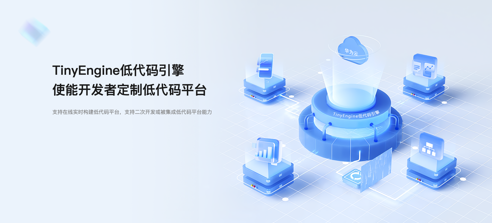
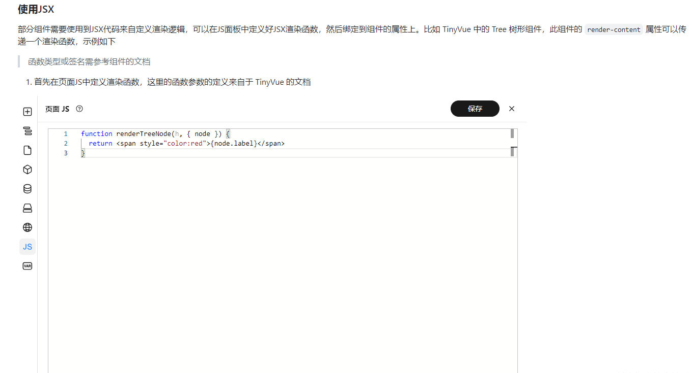
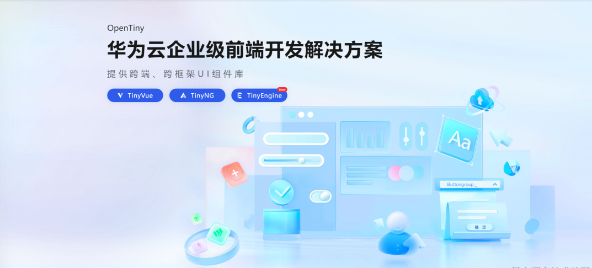

# 项目介绍

[TinyEngine](https://opentiny.design/tiny-engine#/home) 低代码引擎使能开发者定制低代码平台。  
它是低代码平台的底座，提供可视化搭建页面等基础能力，既可以通过线上搭配组合，也可以通过下载源码进行二次开发，实时定制出自己的低代码平台。适用于多场景的低代码平台开发，如：资源编排、服务端渲染、模型驱动、移动端、大屏端、页面编排等。

# 官网更新

## 使用手册文档更新

1. 更新了《页面 JS》中关于 JSX 使用文档

2. 更新了《样式设置》文档，对当前我们样式设置的方案进行了补充

3. 对当前门户网站存在的一些样式、交互问题进行修复，如：

   - 历史记录样式调整

   - 构建物料包中，区块页面版本号界面展示与 UI 不一致

   - 构建物料包中，区块页面 关键字搜索功能问题

   - ....

# 设计器更新

## 新优化

- 样式面板支持书写 jsx
- 样式面板新交互
- 在生产配置使用 vue.prod.js
- 右侧配置面板，给物料设置内外边距时，只有点中中间的数字才能弹出 margin 框进行设置，建议改成选中该区域就能够弹出来
- 添加自定义事件冒泡弹窗改为弹窗
- 删除选中下拉框的勾符号
- 优化 http 接口报错 ui, 接口详情不展示在 title
- 修复 preview 生产打包的时候 repl 引入的 monaco-editor 里的 worker 跨域报错、预览页面增加调试模式
- 数据源远程字段表单验证样式修改

## Bug 修复

- 修复第三方组件本地无法渲染的 bug
- 使用 peerdependencies 同步 vue 版本，避免因为 vue 实例不同造成区块无法渲染的 bug
- 只允许有一个 id，样式选择器只能添加一个 id
- 修复代码编辑器全屏时的样式问题
- 修复新建区块的表单确定时未校验的问题
- 修改远程字段发送请求无效
- TinyTabItem、TinyBreadcrumbItem 组件配置有误
- 修复资源管理工具类型切换
- 无法调用 JS 面板定义的 this.xxx 方法，方法出码的时候再 state 后面定义
- 修复画布选中框的显示层级不正确的问题
- ....

# 了解更多

- TinyEngine 官网: <https://opentiny.design/tiny-engine>
- GitHub 仓库: <https://github.com/opentiny/tiny-engine>

如果你今天刚刚加入我们，可以先在官网上的进行 demo 的体验，也可以查看使用手册了解 TinyEngine 的能力。

## **关于 OpenTiny**

OpenTiny 是一套企业级 Web 前端开发解决方案，提供跨端、跨框架、跨版本的 TinyVue 组件库，包含基于 Angular+TypeScript 的 TinyNG 组件库，拥有灵活扩展的低代码引擎 TinyEngine，具备主题配置系统 TinyTheme / 中后台模板 TinyPro/ TinyCLI 命令行等丰富的效率提升工具，可帮助开发者高效开发 Web 应用。

---

欢迎加入 OpenTiny 开源社区。添加微信小助手：opentiny-official 一起参与交流前端技术～

OpenTiny 官网：**<https://opentiny.design/>**  
OpenTiny 代码仓库：**<https://github.com/opentiny/>**  
TinyVue 源码：**<https://github.com/opentiny/tiny-vue>**  
TinyEngine 源码： **<https://github.com/opentiny/tiny-engine>**

欢迎进入代码仓库 Star🌟TinyEngine、TinyVue、TinyNG、TinyCLI~

如果你也想要共建，可以进入代码仓库，找到  good first issue 标签，一起参与开源贡献~
