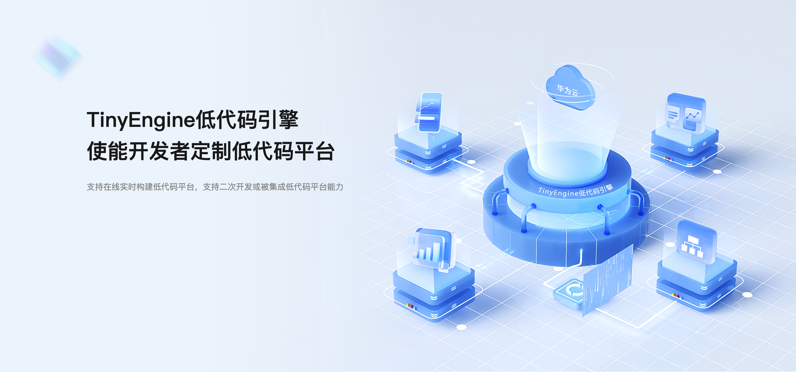
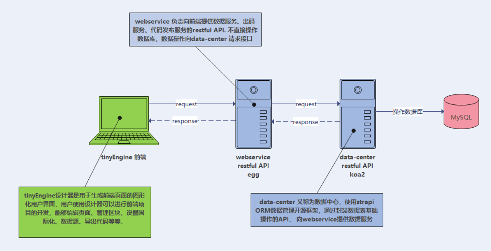
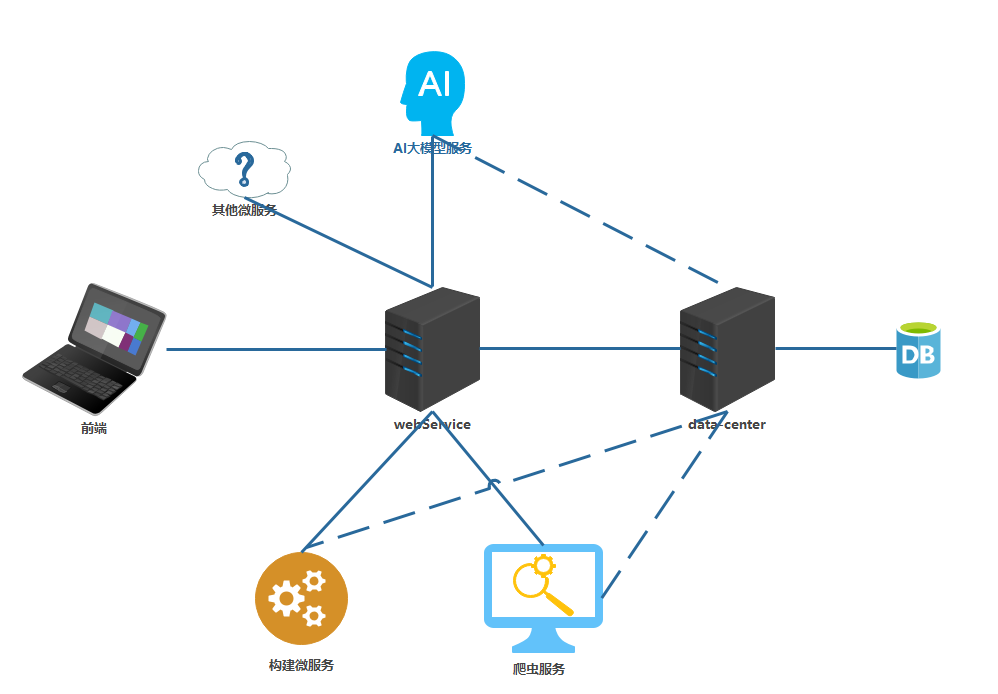
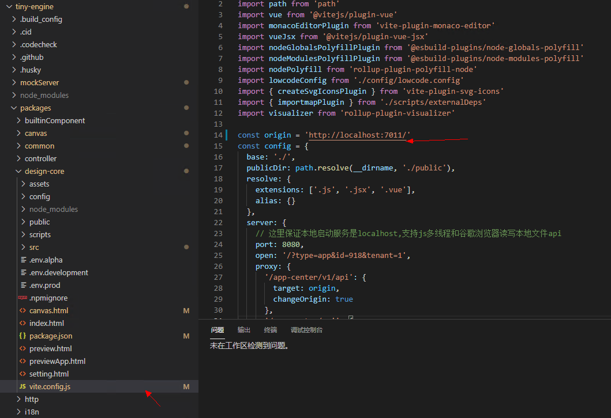

# 背景介绍

## TinyEngine 低代码引擎介绍

随着企业对于低代码开发平台的需求日益增长，急需一个通用的解决方案来满足各种低代码平台的开发需求。正是在这种情况下，低代码引擎应运而生。它是一种通用的开发框架，通过对低代码平台系统常用的功能进行解构，将其划分为多个功能模块，并为每个模块定义了相应的协议和开发范式，使得开发者可以根据自身的业务需求，轻松定制开发出自己的低代码开发平台。 </br>

TinyEngine 提供了低代码底层能力，并集成了人工智能，从而使用户能够高效开发。[TinyEngine](https://opentiny.design/tiny-engine#/home) 具有强大的拖拽功能，无论是图元还是复杂组件，都能在画布上带来流畅的体验。它适用于多场景的低代码平台开发，包括资源编排、流程编排、服务端渲染、模型驱动、移动端、大屏端以及页面编排等低代码平台。 </br>
TinyEngine 官网：<https://opentiny.design/tiny-engine>  
TinyEngine 源码：<https://github.com/opentiny/tiny-engine> （欢迎 star）



## 服务端开源介绍

2023 年 9 月 21 日，[TinyEngine](https://opentiny.design/tiny-engine#/home) 在[华为全联接大会正式宣布开源](https://juejin.cn/post/7280926568854667299)，引发了广泛的关注，3 个月时间收获了 960 个 Star，组建了 4 个用户交流社群，成员数 772 名。 </br>

很多企业和个人开发者尝试基于 TinyEngine 搭建自己的低代码平台，为搭建企业 Web 应用提效，在使用过程中，大家也遇到了很多问题，比较常见的包括：如何对接服务端、如何导入第三方组件库、如何使用插槽、如何生成代码、如何开发自定义插件等，为此我们在 10 月 27 日策划了一次[线上直播答疑活动](https://juejin.cn/post/7298642242116452402)，邀请了团队技术专家为大家答疑解惑。 </br>

其中如何对接服务端是众多开发者非常关注的问题，为了帮助开发者打通低代码平台搭建的前后端整体流程，本次 [TinyEngine](https://opentiny.design/tiny-engine#/home) 低代码引擎服务端配套代码的开源，让开发者能够深入了解 TinyEngine 低代码引擎的前后端运行机制，更能够让更多的小伙伴以更深的层次参与到产品共建，共同探讨并改进系统，推动其不断优化，带来更高的创新潜力，使得更多的人能够从中受益。 <br/>

同时服务端的开源为自由定制和扩展提供了可能，开发者可以参考 TinyEngine 的代码，根据自身需求对服务端进行改造创新，从而使得产品更具灵活性，能够满足各种复杂的业务需求，构建一个强大而健壮的 TinyEngine 生态系统。

# 核心特性

当今互联网应用的复杂性和用户需求的多样性要求我们搭建一套灵活的、便于扩展的系统架构，以满足不断变化的业务需求。 因此我们引入了微服务的概念，将系统拆分为小而独立的服务单元，使得每个服务单元都可以独立开发、测试和部署。这种架构不仅提高了团队的协作效率，还使得系统更容易扩展和维护。 <br>

- TinyEngine 设计器微服务选择了**基于 Node.js 的技术栈**，为前端开发者提供了一致的开发体验，无需学习额外的语言即可全栈开发，降低了开发难度和学习曲线，避免了学习新语言的困扰。更能够从服务端的角度去理解 TinyEngine 设计器的运行原理与设计思想。 <br>
- 在我们的架构设计中，我们**采用了 [Egg.js](https://www.eggjs.org/zh-CN) 作为业务接口微服务的框架**。Egg.js 优秀的设计和丰富的插件生态系统，使得我们能够迅速构建可维护、可扩展的微服务，从而确保系统的稳定性和可维护性。 <br>
- 为了降低服务耦合，我们还单独封装了**提供数据库操作接口的数据中心微服务**，在框架选型上我们选择了 [Strapi](https://docs.strapi.io/)，Strapi 是一个开源数据管理框架。不仅提供了强大的数据管理和查询功能，还支持自定义内容类型和灵活的 API 构建，为我们的微服务提供了丰富的数据支持。Strapi 的易用性和可扩展性使得我们能够高效地管理和发布数据，确保前端业务接口始终能够获得及时、准确的数据支持。 <br>

综上所述，我们的技术架构旨在提供高效、可维护、可扩展的系统，充分利用 Node.js 和现代化的开源工具，使我们能够更好地满足不断变化的业务需求。这种架构不仅提高了开发效率，还为未来的扩展和创新提供了坚实的基础。

# 服务端架构

根据上面的介绍，开发者可以根据微服务这一特性，轻松扩展并实现自己的 TinyEngine 服务端架构。

- 业务接口微服务（webService）：构建业务的引擎， 汇总连接其他微服务为前端提供接口。
- 数据中心(dataCenter)： 作为数据基座，统一进行数据管理，为其他微服务提供一致性的数据支持。



根据上述架构特点，我们可以在此基础上，通过核心的 webService (业务接口微服务) 搭配任务队列服务(RabbitMq、 Kafka、 RocketMq 等等)连接其他功能微服务， 从而拓展整体系统的功能，例如：

- 构建服务：由 webService 收集用户请求触发任务队列执行耗费机器资源的构建设计器、区块、物料的相关服务。
- 爬虫服务：单独封装 安装了 puppeteer 服务器的微服务，由 webService 触发去执行一些爬取数据、代理登录等等操作。
- AI 大模型相关服务：连接自己内部 AI 大模型， 进行设计器智能化相关的 AI 代码生成、指令操作等等功能的。
- 发布服务：封装自己的 CI/CD 流水线微服务，结合设计器代码产出，使代码生产-构建-部署一条龙式运作。



# 硬件配置

## 本地开发

推荐使用 `windows` 操作系统， 推荐配置如下：

- 64 位操作系统
- 12 核 CPU
- 32G 内存

## 服务容器化部署

以下信息为支撑 50 qps 并发量的配置参考， 开发者可根据实际情况进行具体问题具体分析，配置信息仅供参考.

配置单位：

- U: cpu 核数
- G: 内存单位

在配置负载均衡的情况下推荐：

| 服务       | 配置  | 工作负载数量 |
| ---------- | ----- | ------------ |
| webService | 1U+3G | 4            |
| dataCenter | 1U+2G | 4            |

# FAQ

**1、服务端开源之后，如果不想启动 webService 和 dataCenter 两个后端服务器，是否还能沿用原来 mockServer？**  
答：可以正常使用 mockServer，启动方式和原先一致，直接在项目里执行 `pnpm dev` 即可

**2、如果本地启动了 webService 和 dataCenter，那么前端本地工程是否还需要更改配置？如果需要，如何更改配置？**  
答：需要更改配置，更改流程如下：
启动 `tinyengine`

修改 `packages/design-core/vite.config.js` 中 origin 的值为自己本地 webService 项目的地址端口（webService 端口默认为 7011）

运行如下脚本并启动

```sh
pnpm install  # 第一次启动项目需要
pnpm serve:frontend
```

启动成功后浏览器会自动打开设计器页面



具体搭建流程可参考官网本地化部署文档：[TinyEngine 服务端开源部署](https://opentiny.design/tiny-engine#/help-center/course/backend/51)

# 未来规划

1，人工智能：计划将低代码平台与 AIGC（人工智能生成内容）技术相结合，为用户提供更加智能、高效的应用开发体验。后续我们考虑将低代码平台的开发流程与 AIGC 技术相结合，通过自然语言处理、机器学习和深度学习等技术，实现应用界面的自动生成、功能模块的智能推荐和代码的自动化生成等功能。

2，模型驱动：我们将致力于将低代码平台与模型驱动能力相结合，为用户提供更加高效、智能的开发体验。深入研究各种业务模型，包括数据模型、业务流程模型等，以了解其特性和需求。后续，我们将低代码平台的开发流程与模型驱动能力相结合，通过可视化建模工具和自动化技术，实现业务模型的快速构建和部署。通过这一创新性的接入方式，用户将能够更加高效地构建和调整业务模型，降低开发难度和成本。

## **关于 OpenTiny**

[OpenTiny](https://opentiny.design/) 是一套企业级 Web 前端开发解决方案，提供跨端、跨框架、跨版本的  [TinyVue 组件库](https://opentiny.design/tiny-vue/zh-CN/overview)，包含基于 Angular+TypeScript 的 [TinyNG 组件库](https://opentiny.design/tiny-ng/overview)，拥有灵活扩展的低代码引擎 [TinyEngine](https://opentiny.design/tiny-engine#/home)，具备主题配置系统[TinyTheme](https://opentiny.design/designtheme/home) / 中后台模板[TinyPro](https://opentiny.design/pro/home)/ [TinyCLI](https://opentiny.design/tiny-cli/home)命令行等丰富的效率提升工具，可帮助开发者高效开发 Web 应用。

---

欢迎加入 [OpenTiny 开源社区](https://github.com/opentiny/)。添加微信小助手：opentiny-official 一起参与交流前端技术～更多视频内容也可关注[B 站](https://space.bilibili.com/15284299?spm_id_from=333.1007.0.0)、抖音、小红书、视频号

OpenTiny  也在持续招募贡献者，欢迎一起共建

[OpenTiny 官网](https://opentiny.design/)：**https://opentiny.design/**

[OpenTiny 代码仓库](https://github.com/opentiny/)：**https://github.com/opentiny/**

[TinyVue 源码](https://github.com/opentiny/tiny-vue)：**https://github.com/opentiny/tiny-vue**

[TinyEngine 源码](https://github.com/opentiny/tiny-engine)： **https://github.com/opentiny/tiny-engine**

欢迎进入代码仓库 Star🌟[TinyEngine](https://github.com/opentiny/tiny-engine)、[TinyVue](https://github.com/opentiny/tiny-vue)、[TinyNG](https://github.com/opentiny/ng)、[TinyCLI](https://github.com/opentiny/tiny-cli)~

如果你也想要共建，可以进入代码仓库，找到  good first issue 标签，一起参与开源贡献~
