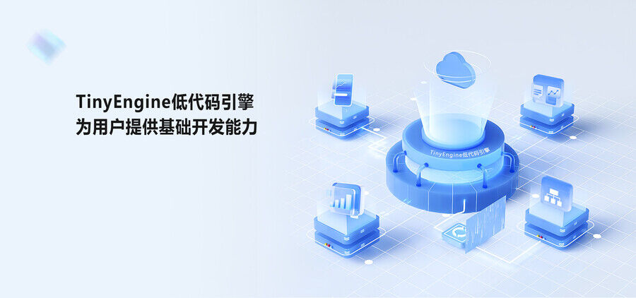
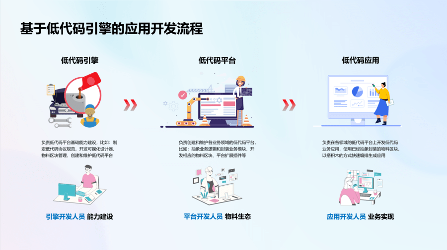
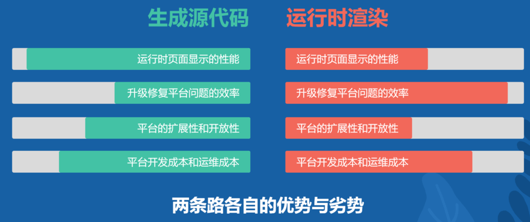
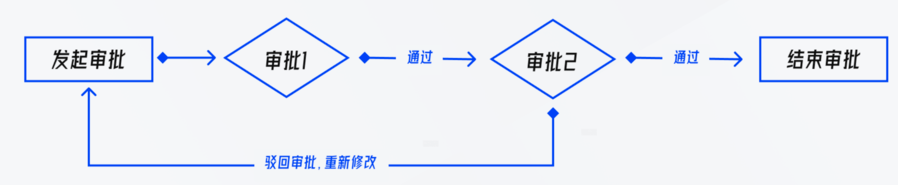
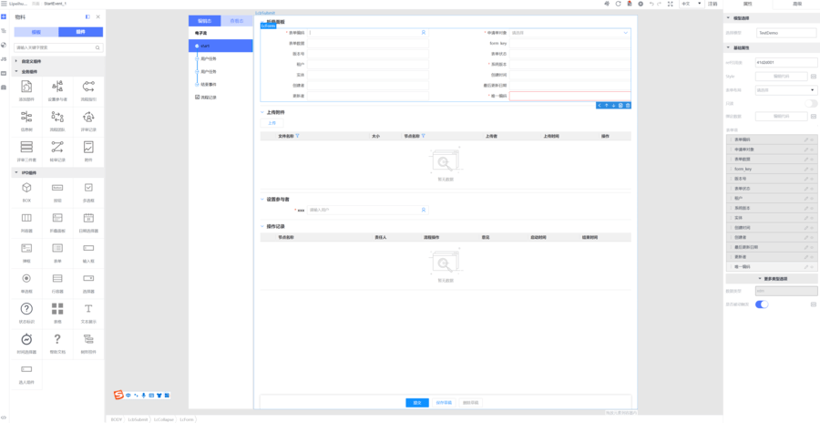
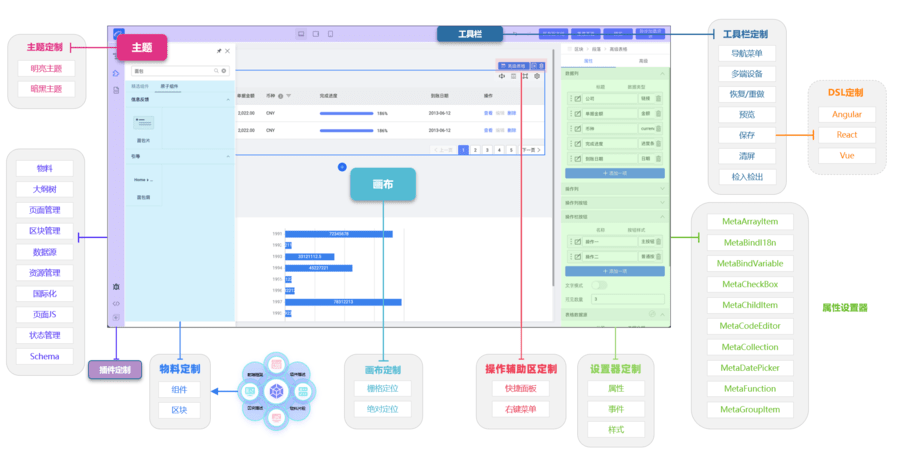

在当今数字化飞速发展的时代，企业对高效、敏捷的应用程序需求日益旺盛。为了满足这一需求，越来越多的低代码开发平台开始涌现。这些平台通过提供简单易用的开发工具和优化后的开发流程，帮助开发者快速构建高质量、可重复使用的应用程序，同时降低了开发的难度和成本，提高了开发效率和灵活性。这些低代码开发平台的出现，无疑为企业的数字化转型提供了更快速、更高效的方法，也将推动整个软件开发行业的进步。

## TinyEngine 项目介绍

随着企业对于低代码开发平台的需求日益增长，急需一个通用的解决方案来满足各种低代码平台的开发需求。正是在这种情况下，低代码引擎应运而生。它是一种通用的开发框架，通过对低代码平台系统常用的功能进行解构，将其划分为多个功能模块，并为每个模块定义了相应的协议和开发范式，使得开发者可以根据自身的业务需求，轻松定制开发出自己的低代码开发平台。



[TinyEngine](https://opentiny.design/) 提供了低代码底层能力，并集成了人工智能，从而使用户能够高效开发。[TinyEngine](https://opentiny.design/) 具有强大的拖拽功能，无论是图元还是复杂组件，都能在画布上带来流畅的体验。它适用于多场景的低代码平台开发，包括资源编排、流程编排、服务端渲染、模型驱动、移动端、大屏端以及页面编排等低代码平台。

### 核心亮点

- **可以定制开发低码平台**。



[TinyEngine](https://opentiny.design/) 采用灵活的系统架构，其出色的整体架构提供了高度的自定义自由度，使用户能够像搭建积木一样选择不同的模块来构建自己的专属设计器。此外，插件化的架构使得用户可以方便地扩展与业务相关的功能。 在 [TinyEngine](https://opentiny.design/) 中，插件根据位置大致分为三类：toolbars/plugins/settings，分别对应顶部区域、左侧区域和右侧区域。toolbars 插件主要偏向于无需 UI 或者 UI 较为简单的工具插件，plugins 是业务功能插件，显示在左侧(或下方)抽屉页面，可以通过点击进行展开收起或切换。这些功能都像是独立的积木块，用户可以选择性地保留或删除。同时，用户也可以开发自己的插件或工具，并将其安装到对应的位置。**TinyEngine 的灵活性极强，用户可以自由地决定他们想要开发什么样的低代码平台。**

[TinyEngine](https://opentiny.design/) 提供了一套完善的插件体系，涵盖了插件开发所需的基础 UI 库、工具库、插件面板的显示控制、生命周期管理、公共 API 注册与共享等。这一体系使得开发者只需遵循简单的规范，即可快速开发出业务所需的插件，从而极大地提高了开发效率和灵活性。通过使用 [TinyEngine](https://opentiny.design/) 提供的插件体系，开发者可以更加轻松地管理和维护复杂的插件生态系统，同时降低维护成本。总之，[TinyEngine](https://opentiny.design/) 的插件体系为开发者提供了一个全面、高效、灵活的开发平台，使得快速开发出高质量的插件成为可能。

插件开发需要遵循一定的开发规范，主要是文件规范与导出规范：

1、文件规范，必须包含下面几个文件

```js
pluginProject
- src 插件源码
- index.js 注册插件入口，需要导出约定的数据结构
- package.json
```

2、导出规范， index.js 文件需要导出一个对象来声明基础信息

```js
import component, { api } from './src/Main.vue'

export default {
  id: 'pluginId', // 插件id
  title: 'pluginName', // 插件名
  icon: 'js', // 插件 icon
  align: 'top', // 插件位置，左侧插件可选值：'top' | 'bottom'  工具栏可选值：'right' | 'center' | 'left'
  component, // 插件面板打开时渲染的组件
  api // 插件暴露的 api，可以提供给其他插件调用
}
```

在此基础上就可以按照业务需要自由开发相关逻辑代码。

3、最后在 addons.js 插件配置文件中引入，就完成一个完整的插件开发了。

```js
import Materials from '@xxxx/lowcode-plugin-materials'

export default {
  plugins: [
    Materials
    // ...
  ],
  toolbars: [
    // ...
  ],
  settings: [
    // ...
  ]
}
```

（ps:我们呼吁用户把开发的插件包开源，共建 [TinyEngine](https://opentiny.design/) 的生态。）

- **TinyEngine 有开放的物料协议和扩展接口。**

[TinyEngine](https://opentiny.design/) 低代码引擎默认的物料来源于华为云开源组件库 [TinyVue](https://opentiny.design/tiny-vue/zh-CN/os-theme/docs/changelog)，该组件库拥有丰富的组件和强大的功能。并且实现了跨端垮技术栈，同时支持 vue2 和 vue3。即使业务系统使用其他组件库，也无需切换，得益于 TinyEngine 强大的开放物料设计，可直接导入第三方组件库，例如 elementUI 和 AntDesign 等。引擎底层技术架构采用 webcomponent 技术，因此支持 Vue、React 和 Angular 等不同技术栈的组件或区块。**用户可以自由选择所需的组件库并导入使用**。

导入第三方组件库，找到 runner.js 物料文件。然后参照默认物料 @opentiny/vue 即可，主要修改以下地方：

```js
// 全量导入UI组件库
import UI from '@xxxx/UI'

Object.entries(UI).forEach(([key, component]) => {
  const { name } = component
  if (name) {
    window.TinyLowcodeComponent[name] = component
  }
})

// 导入某个组件库里面的单个组件
import { button } from '@xxxx/UI'

window.TinyLowcodeComponent[name] = button
```

通过导入第三方组件库，用户可以在低代码平台中使用这些组件库来开发应用程序。除了导入组件外，用户还需要通过 bundle.json 文件来描述导入的组件所暴露出来的事件和属性。这样，用户可以在应用程序中使用这些组件，并通过 bundle.json 文件来了解和使用组件的事件和属性。这是一个非常方便和灵活的功能，使得用户可以自由地使用和定制他们所需的组件，从而快速开发出高质量的应用程序。

```json
// 以下JSON为节选按钮暴露的属性
{
  "schema": {
    "type": "object",
    "properties": {
      "size": {
        "title": "定义按钮尺寸",
        "type": "string",
        "enum": ["large", "medium", "small", "mini"],
        "enumNames": ["较大尺寸", "中等尺寸", "较小尺寸", "迷你尺寸"],
        "default": ""
      },
      "text": {
        "title": "设置按钮显示的文本",
        "type": "string",
        "default": ""
      }
    },
    "events": {
      "onClick": {
        "label": {
          "zh_CN": "鼠标单击时触发",
          "en_US": "Triggered on mouse click"
        },
        "description": {
          "zh_CN": "鼠标单击时触发的回调函数"
        },
        "type": "event",
        "defaultValue": ""
      }
    }
  }
}
```

- **TinyEngine 支持自定义 DSL 生成定制的源代码。**

相对于在运行时由平台提供渲染引擎的方式，这种方式能够为用户提供更多的自主权和安全性。用户可以自由地定义自己的 DSL，并根据需要生成定制化的源代码，从而更加灵活地控制应用程序的行为和性能。


[TinyEngine](https://opentiny.design/) 默认生成 Vue 的源代码。当页面编排完成后，会生成一个包含页面信息的 schema。DSL 通过遍历递归等方法，从中生成源代码。如果技术栈是 Angular 或 React，用户可以完全开发一个 Angular 或 React 的 DSL，从而生成一个新的源代码工程。用户可以根据自己的需求定制生成源代码的方式，这是一个非常灵活和强大的功能，使得 TinyEngine 可以适应不同的技术栈和需求，从而更加广泛地应用于各种应用程序的开发。

如果你想开发其他技术栈的 DSL，那么一定要对**页面协议**比较熟悉。

```js
interface IPageSchema { // 页面 或 区块 schema
  fileName?: string; // 页面名称，schema 是页面时使用
  componentName?: string; // 组件名，schema 是页面时值为 "Page"
  blockName?: string; // 区块名，schema 是区块时使用
  id: string;
  css?: string; // 页面全局样式
  props?: { // 组件绑定的属性
      [prop:string]?: any;
      style?: string; // 行内样式
      className?: string; // 绑定的样式类名
      };
      lifeCycles?: { // 生命周期
      [prop:string]?: {
          type: 'js'; // 固定值
          source: string; // 函数字符串
      }
      };
  children?: Array< IComponentSchema > | string; // 子组件列表 或 文本字符串
  dataSource?: { // 数据源
      list: Array< IDateSource > // 数据源列表
  };
  actions?: { // 页面 JS
      module: {
          source: string; // 页面定义的 JS 源码字符串
      };
      type: "FUNCTION"; // 固定值
      list: Array<{
          id: string; // 页面所定义的函数名
          title: string; // 配置时显示名称 与 id 一致
      }>
  };
  bridge?: { // 桥接
  imports?: Array<{
          name: string; // 配置时显示名称
          type: "package" | "local"; // package: npm 包; local: 本地文件
          path: string; // 导入的路径(包名或者本地路径)
          item: string; // 导入的项目
          useDefault?: boolean; // 是否默认导出
          instance?: string; // 实例名，需要注入service时需要添加该字段，typescript 模式下使用
      }>
  };
  inputs: Array<{ // 页面接口：输入类型
      name: string; // 输入属性名称
      type: string; // 数据类型声明
      defaultValue?: any; // 默认值
      }>;
  outputs: Array<{ // 页面接口：事件输出
      name: string; // typescript类型声明
      type: string; // 数据类型声明
  }>;
      schema?: IComponentMetaSchema // 区块时使用，区块需要暴露的组件属性元数据
  }
```

对于需要被搜索引擎爬虫 SEO 的用户，也可以用服务端 SSR 的解决方式。这种方案也可以用来快速查看自己编辑的页面。

```js
// 伪代码
function render(_schema) {
  let _arr = []
  _schema.forEach((item) => {
    let componentName = item.componentName
    if (item.children && item.children.length) {
      _arr.push(h(componentName, item.props, [item?.props?.text, render(item.children)]))
    } else {
      const text = item?.props?.text || ''
      _arr.push(h(componentName, item.props, text))
    }
  })

  return _arr
}
```

- **TinyEngine 支持高低代码混合开发。**

高低代码混合开发可以更好地满足业务需求。在企业的应用开发中，往往需要面对快速变化的业务需求，此时，如果全部采用低代码方式进行开发，则可能会因为代码的复杂性而无法快速适应变化。而如果采用高低代码混合的方式，则可以通过低代码进行常规业务的快速开发，对于特殊的业务逻辑，则由专业开发人员通过高代码进行实现，这样就可以更好地满足业务需求的变化。

[TinyEngine](https://opentiny.design/) 在构建应用程序的过程中，提供了下载源代码的功能，使得用户可以在线下进行复杂业务逻辑的调试。这一特点极大地便利了开发者的操作，减少了在线调试和测试的时间和资源消耗，同时也提高了代码的质量和可靠性。通过下载源代码进行调试，用户可以更加灵活地控制应用程序的行为和性能，从而更好地满足业务需求。总之，TinyEngine 的这一特点为用户提供了更多的自主权和灵活性，使得他们可以更加高效地控制应用程序的行为和性能。

- **TinyEngine 支持 AI 辅助开发。**

低代码平台与 AI 的结合具有巨大的发展潜力。这种结合可以在很大程度上提高非专业开发者的开发效率和应用智能化水平。随着 AI 技术的不断发展和低代码平台的不断成熟，二者的结合将会在更多领域内实现更高效、更智能的业务流程和管理模式，带来更大的商业价值。

低代码平台通过提供易于使用的开发工具和预先构建的模块，简化了应用程序的开发过程。AI 技术则可以帮助应用程序具备更智能、更自适应的特性。通过低代码平台和 AI 的结合，开发者可以更快速、更高效地构建应用程序，并实现更智能化的应用特性。

## 企业关于低代码的需求

- ### PDM 元数据电子审批流

审批流业务场景是现代企业运营中不可或缺的一环。业务流程从某个特定点开始，然后经过一系列的审批节点，完成流程的审批。这些节点通常由不同级别的人员担任，例如主管、经理、财务、法务和总经理等，每个人都扮演着特定的角色和职责。

假设场景如下：流程发起人 A 启动了一个电子审批流程。这个流程首先会被传递到主管进行审批。在审批过程中，主管会仔细检查初始业务流程信息和其他相关数据，然后决定是否进一步推进流程，或退回给 A 进行修订。如果主管批准了这个流程，那么它将被移交给下一级审批人，也就是经理。在经理的审批环节，他/她也会详查相关数据和信息，并基于这些以及自己的独立判断来做出决策。值得注意的是，尽管经理可以查看到主管填写的一些技术信息，但这些信息并不对财务和法务公开。也就是说，只有经理和总经理可以看到这些技术信息，财务和法务无法获知。经理会根据这些保密信息以及自己的专业判断来决定是否继续推进流程。

如果经理也批准了该流程，那么它将被送至财务节点进行审批。在审批过程中，财务主要关注经济相关的问题，例如价格、付款方式等等。一旦财务审批通过，流程会被移交给法务进行审批。

与财务审批类似，法务审批主要关注法律风险和合规性问题。在审批时，法务会仔细检查相关的合同、协议等法律文件，并评估是否存在任何法律风险或合规性问题。一旦法务批准了流程，流程将被移交给总经理进行最后的审批，以完成整个审批流程。



需要注意的是，这种审批流业务场景并不是只有一个，而是有很多个。例如，除了上述的采购流程，还有其他业务流程需要进行审批，比如：数据入库流程、报价流程等等。每个流程都有自己的特点和审批节点数量不一。有些流程可能只需要两三个节点就可以完成审批，有些则可能需要十几个节点才能完成。但是，所有类型的审批流大致相似。如：页面上常见的元素包括表单、表格以及常用的审批组件等。

**技术分析：** 若采用传统的开发方式，每当新增一种流程时，前端开发人员都需要开发所有审批节点的审批页面，并重新进行发布流程。同样地，服务端开发人员也需要重新建立一个审批流，通过特定页面录入各节点审批人，并编写相应的审批流规则。显然，这对于前端和服务端开发人员来说都是十分繁琐的工作。

**解决方案：**   基于 [TinyEngine](https://opentiny.design/) 低代码引擎，开发出一个专为电子审批流设计的低代码平台。然后，将所有与流程相关的组件，如模板、评审记录和流程指引等导入到平台的物料区域。最后，将这个专注于开发审批流的低代码平台集成到 PDM 元数据电子流业务模块中。在低代码平台上，想要开发任意一个流程的审批页面，只需要将流程模板拖入，并在模板中嵌入本流程的表单或表格，即可轻松完成该节点的审批页面，极大地提高了开发效率和便利性！ 服务端也将采用另一种特定于 flow 类型的低代码平台（将在后续内容中详细介绍），以实现对审批流程人员编排。这样，前后端之间的连接就实现了完美的贯通。



- ### Flow 图元编排类型设计器

图元编排在众多场景中扮演着重要角色，例如流程图、审批流、部署流水线和架构图等。资源编排只是编排的主体变成了云服务资源。

资源编排遵循基础设施即代码（Infrastructure as Code, IaC）的设计理念，资源编排与以往单独管理每种云服务资源的方式有所不同。通过资源编排设计器，用户无需手动创建多个资源，只需在平台上使用设计器进行拖拽和配置，即可生成模板，并一键部署多个资源。这样，用户可以更加高效地管理和编排云服务资源，提高资源的利用率和部署速度。

因此，针对资源编排服务场景，我们需要定制一个专用的低代码平台来满足用户的需求。该平台将具备图形化界面，允许用户通过简单的拖拽和配置来创建、修改和删除资源编排模板，而无需编写大量的代码。此外，该平台还将支持一键部署功能，以快速部署多个资源，提高资源编排的效率和速度。

考虑到需要支持大量的云服务资源，且每个云服务资源需要配置的属性各不相同，因此采用传统开发方式为每种云服务资源开发专门的属性设置页面是不可行的。因此，我们需要一个能够自定义渲染的属性配置方案。通过自定义渲染，用户可以根据不同的云服务资源类型和属性，自由地定义和控制属性页面的交互效果，从而提高属性配置的灵活性和可扩展性。

同时模板是极为重要的一环，它直接关系到最终资源的部署。因此，模板需要符合特定的标准格式，这就要求画布和属性面板的输入必须能够准确反映到最终的模板中。

整理出主要的述求：

- 整个页面应至少包含以下几部分：资源列表、画布和属性设置面板
- 画布应具备核心的拖拽和连线绘图功能，以支持用户直观地进行资源编排
- 属性设置面板需要支持自定义配置渲染，以满足不同云服务资源类型和属性的配置需求
- 该平台应具备可拓展性，以支持开发出其他能力，满足未来可能出现的新的编排需求

在分析了上述需求后，我们可以清楚地看到，使用传统开发方式将面临巨大的工作量和现实的实现困难。同时，经过对比发现，资源编排设计器和低代码设计器之间有许多相似之处，例如它们都涉及基础资源、拖拽操作和配置功能，只是在画布区域存在差异。

**解决方案：** TinyEngine 作为一个出色的低代码引擎，通过优秀的整体架构提供了高度自由的定制能力。它允许我们像搭积木一样选择不同的积木来搭建一个专属的设计器。同时，属性面板全部通过 JSON 配置文件进行渲染，无需编写任何代码，灵活而强大。这种开发方式可以大大降低开发成本，提高效率。 该设计器的布局类似于 VS Code，核心模板与功能区域划分清晰明了，易于上手。插件化的架构也使得自由拓展业务相关功能变得轻而易举。 综上所述，我们最终决定使用 TinyEngine 来开发图元编排设计器，以满足资源编排的需求。



- ### 其他业务类型的低码平台诉求

1，跨境电商的低代码平台，旨在方便商家快速装修店铺。商家只需要从平台提供的模板中选择一套适合自己的商品模板，并进行文字和图片的修改，即可快速建立自己的电商网站。此外，该平台还需要具备方便搜索引擎优化（SEO）的功能，让商家的电商网站更容易被潜在客户发现。

2，随着移动互联网的迅速普及，各种应用程序推送消息的需求日益增长。在这个背景下，APP 厂商只需要使用推送消息平台提供的模板，并简单配置一下推送内容和样式，即可轻松实现消息推送。

3，运维管理平台是针对企业运营过程中涉及的各种数据和页面进行管理的工具。随着企业运营数据的不断增加，页面变得越来越复杂。其实不同的岗位对于关心的信息也不尽相同。低代码平台的应用可以让不同岗位的员工通过简单的拖拽操作，轻松获取自己需要的数据和信息。这种方式不仅可以提高工作效率，而且还可以降低操作难度，使得更多人可以轻松上手使用。

## 未来展望

[TinyEngine](https://opentiny.design/) 专注于为用户提供低代码的基础能力，目前正致力于跟生成式 AI 相结合，与用户共同打造面向未来的应用。

## **关于 OpenTiny**

[OpenTiny](https://opentiny.design/) 是一套企业级 Web 前端开发解决方案，提供跨端、跨框架、跨版本的  [TinyVue 组件库](https://opentiny.design/tiny-vue/zh-CN/overview)，包含基于 Angular+TypeScript 的 [TinyNG 组件库](https://opentiny.design/tiny-ng/overview)，拥有灵活扩展的低代码引擎 [TinyEngine](https://opentiny.design/tiny-engine#/home)，具备主题配置系统[TinyTheme](https://opentiny.design/designtheme/home) / 中后台模板[TinyPro](https://opentiny.design/pro/home)/ [TinyCLI](https://opentiny.design/tiny-cli/home)命令行等丰富的效率提升工具，可帮助开发者高效开发 Web 应用。

**核心亮点：**

- 跨端跨框架：  使用 Renderless 无渲染组件设计架构，实现了一套代码同时支持 Vue2 / Vue3，PC / Mobile 端，并支持函数级别的逻辑定制和全模板替换，灵活性好、二次开发能力强
- 组件丰富：PC 端有 100+组件，移动端有 30+组件，包含高频组件 Table、Tree、Select 等，内置虚拟滚动，保证大数据场景下的流畅体验，除了业界常见组件之外，我们还提供了一些独有的特色组件，如：Split 面板分割器、IpAddress IP 地址输入框、Calendar 日历、Crop 图片裁切等
- 集成人工智能：低代码引擎提供低代码底层的能力，集成人工智能，让 AI 助力用户高效开发，适用于多场景的低代码平台开发。如：资源编排、服务端渲染、模型驱动、移动端、大屏端、页面编排等低代码平台
- 配置式组件：  组件支持模板式和配置式两种使用方式，适合低代码平台，目前团队已经将 OpenTiny 集成到内部的低代码平台，针对低码平台做了大量优化
- 周边生态齐全：  提供了基于 Angular + TypeScript 的 TinyNG 组件库，提供包含 10+ 实用功能、20+ 典型页面的 TinyPro 中后台模板，提供覆盖前端开发全流程的 TinyCLI 工程化工具，提供强大的在线主题配置平台 TinyTheme

---

欢迎加入 [OpenTiny 开源社区](https://github.com/opentiny/)。添加微信小助手：opentiny-official 一起参与交流前端技术～更多视频内容也可关注[B 站](https://space.bilibili.com/15284299?spm_id_from=333.1007.0.0)、抖音、小红书、视频号

OpenTiny  也在持续招募贡献者，欢迎一起共建

[OpenTiny 官网](https://opentiny.design/)：**https://opentiny.design/**

[OpenTiny 代码仓库](https://github.com/opentiny/)：**https://github.com/opentiny/**

[TinyVue 源码](https://github.com/opentiny/tiny-vue)：**https://github.com/opentiny/tiny-vue**

[TinyEngine 源码](https://github.com/opentiny/tiny-engine)： **https://github.com/opentiny/tiny-engine**

欢迎进入代码仓库 Star🌟[TinyEngine](https://github.com/opentiny/tiny-engine)、[TinyVue](https://github.com/opentiny/tiny-vue)、[TinyNG](https://github.com/opentiny/ng)、[TinyCLI](https://github.com/opentiny/tiny-cli)~

如果你也想要共建，可以进入代码仓库，找到  good first issue 标签，一起参与开源贡献~
**往期文章推荐**

- [必不可少的 UI 组件一——组件的基础知识](https://link.juejin.cn?target=http%3A%2F%2Fmp.weixin.qq.com%2Fs%3F__biz%3DMzU5ODA3OTY5Ng%3D%3D%26mid%3D2247491605%26idx%3D1%26sn%3Db85064d6b81a2a673bc9e1eeea82a1dd%26chksm%3Dfe4b01aac93c88bc1de779f6e558da7cdd181cec49a1fbdac804b54bab19729cbc45ddf3f104%26scene%3D21%23wechat_redirect 'http://mp.weixin.qq.com/s?__biz=MzU5ODA3OTY5Ng==&mid=2247491605&idx=1&sn=b85064d6b81a2a673bc9e1eeea82a1dd&chksm=fe4b01aac93c88bc1de779f6e558da7cdd181cec49a1fbdac804b54bab19729cbc45ddf3f104&scene=21#wechat_redirect')
- [OpenTiny Vue 3.10.0 版本发布：组件 Demo 支持 Composition 写法，新增 4 个新组件](https://link.juejin.cn?target=http%3A%2F%2Fmp.weixin.qq.com%2Fs%3F__biz%3DMzU5ODA3OTY5Ng%3D%3D%26mid%3D2247491250%26idx%3D1%26sn%3D66b6840f3f93d415a33b9ade09dcd9b8%26chksm%3Dfe48ff0dc93f761ba3965380b759b184616d9dc39a903f1bda689037ba0b177c98fb0bae7c38%26scene%3D21%23wechat_redirect 'http://mp.weixin.qq.com/s?__biz=MzU5ODA3OTY5Ng==&mid=2247491250&idx=1&sn=66b6840f3f93d415a33b9ade09dcd9b8&chksm=fe48ff0dc93f761ba3965380b759b184616d9dc39a903f1bda689037ba0b177c98fb0bae7c38&scene=21#wechat_redirect')
- [前端 Vuer，请收好这份《Vue 组件单元测试》宝典](https://link.juejin.cn?target=http%3A%2F%2Fmp.weixin.qq.com%2Fs%3F__biz%3DMzU5ODA3OTY5Ng%3D%3D%26mid%3D2247490886%26idx%3D1%26sn%3D3c0fcbe86c01b01e0ed876904743ca76%26chksm%3Dfe48fcf9c93f75ef621391689021922451ae5621c75f0c5c3024352d9df8d0f18139095865f9%26scene%3D21%23wechat_redirect 'http://mp.weixin.qq.com/s?__biz=MzU5ODA3OTY5Ng==&mid=2247490886&idx=1&sn=3c0fcbe86c01b01e0ed876904743ca76&chksm=fe48fcf9c93f75ef621391689021922451ae5621c75f0c5c3024352d9df8d0f18139095865f9&scene=21#wechat_redirect')
- [OpenTiny 前端组件库正式开源啦！面向未来，为开发者而生](https://link.juejin.cn?target=http%3A%2F%2Fmp.weixin.qq.com%2Fs%3F__biz%3DMzU5ODA3OTY5Ng%3D%3D%26mid%3D2247490622%26idx%3D1%26sn%3Df928726a3608ebf0999529187dc2a22c%26chksm%3Dfe48fd81c93f7497608ed97ea0d60d12b61d03c062ebda49c84a9c4e3cdb0550e25930df9aa1%26scene%3D21%23wechat_redirect 'http://mp.weixin.qq.com/s?__biz=MzU5ODA3OTY5Ng==&mid=2247490622&idx=1&sn=f928726a3608ebf0999529187dc2a22c&chksm=fe48fd81c93f7497608ed97ea0d60d12b61d03c062ebda49c84a9c4e3cdb0550e25930df9aa1&scene=21#wechat_redirect')
- [从自研走向开源的 TinyVue 组件库](https://link.juejin.cn?target=http%3A%2F%2Fmp.weixin.qq.com%2Fs%3F__biz%3DMzU5ODA3OTY5Ng%3D%3D%26mid%3D2247490528%26idx%3D1%26sn%3D911d84e6bb275e6125464f07643c1150%26chksm%3Dfe48fa5fc93f734911c4f44a5f4e2d6c4e29e00ad68cae35c4edc3771de1cbf65cd5f2a8a224%26scene%3D21%23wechat_redirect 'http://mp.weixin.qq.com/s?__biz=MzU5ODA3OTY5Ng==&mid=2247490528&idx=1&sn=911d84e6bb275e6125464f07643c1150&chksm=fe48fa5fc93f734911c4f44a5f4e2d6c4e29e00ad68cae35c4edc3771de1cbf65cd5f2a8a224&scene=21#wechat_redirect')
- [我要做开源，提交我的第一个 PR](https://link.juejin.cn?target=http%3A%2F%2Fmp.weixin.qq.com%2Fs%3F__biz%3DMzI2MDE3MTM4MA%3D%3D%26mid%3D2701520396%26idx%3D1%26sn%3Dbd42224d212cb4b78ffcbca98f463db8%26chksm%3Dce9cfd17f9eb7401d41b21639f80b09846a1c44b237c6733b809aeb2259c3d2521c88c490e7a%26scene%3D21%23wechat_redirect 'http://mp.weixin.qq.com/s?__biz=MzI2MDE3MTM4MA==&mid=2701520396&idx=1&sn=bd42224d212cb4b78ffcbca98f463db8&chksm=ce9cfd17f9eb7401d41b21639f80b09846a1c44b237c6733b809aeb2259c3d2521c88c490e7a&scene=21#wechat_redirect')
