## 前言

TinyEngine 低代码引擎使开发者能够定制低代码平台。它是低代码平台的底座，提供可视化搭建页面等基础能力，既可以通过线上搭配组合，也可以通过 cli 创建个人工程进行二次开发，实时定制出自己的低代码平台。适用于多场景的低代码平台开发，如：资源编排、服务端渲染、模型驱动、移动端、大屏端、页面编排等。

近期，我们正式推出 TinyEngine v2.6 版本，希望能够给大家带来更好的使用体验，满足大家日益增长的各种需求。

- 源码：<https://github.com/opentiny/tiny-engine> （欢迎 Star ⭐）
- 官网：<https://opentiny.design/tiny-engine#/home>

这次版本特性开发和问题修复已经有更多的开发者朋友参与进来，我们在此诚挚感谢  [@zzerX](https://github.com/0x7A7A6572 '按住ctrl点击直接打开') 、 [@1degrees](https://github.com/1degrees '按住ctrl点击直接打开') 、[@JasonWellGao](https://github.com/JasonWellGao '按住ctrl点击直接打开')  积极参加 TinyEngine 的开源共建，同时也邀请大家一起加入开源社区的建设，让 TinyEngine 成长的更加优秀和茁壮。

##### v2.6.0 变更特性概览

- 【增强】页面树增强支持折叠
- 【UI】UI 刷新：数据源功能 UI 调整、替换图标等
- 【优化】预览支持热更新，移除 URL 依赖
- 【优化】属性出码支持 JSFunction
- 【优化】支持配置页面 title
- 【优化】页面操作菜单支持配置
- 【优化】Tabs 组件支持配置名称，支持绑定
- 【优化】文档更新
- 【其他】大量功能细节优化与 bug 修复

## TinyEngine v2.6.0 新特性解读

### 1. 【增强】页面树增强支持折叠

#### 1.1 页面树支持折叠子节点

点击节点的图标，则可以收起或者展开它的子孙节点


#### 1.2 搜索时自动展开被收起的节点

如果节点一开始被收起，此时通过搜索框搜索，如果匹配到被收起的节点，则会自动展开，显示在搜索结果中

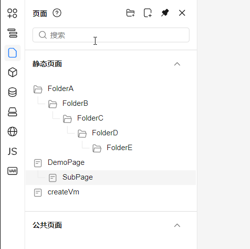

#### 1.3 页面树支持横向滚动

页面树深度很深度或者节点名称非常长时，页面树宽度不够宽，此时页面树容器底部出现横向滚动条。往右滚动可查看超宽的内容

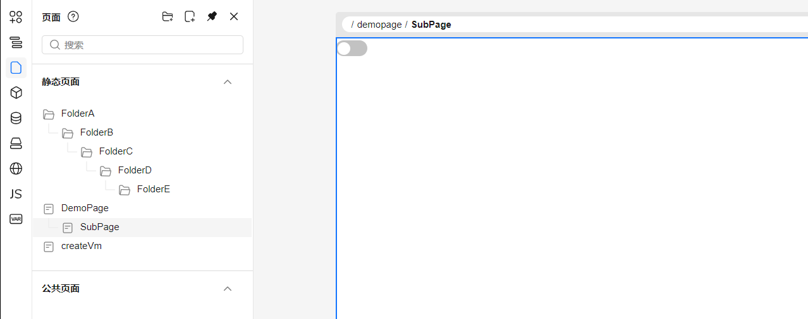

### 2. 【UI】UI 刷新：数据源功能 UI 调整、替换图标等

#### 2.1 数据源功能 UI 调整

v2.6 之前版本中，创建数据源时，获取远程字段信息在三级面板，使用起来不方便，且远程获取字段信息应该优先于数据源字段，用户应该先获取远程字段之后，再对字段进行修改。

##### 2.1.1 原版本数据源

数据源字段及远程字段信息页面

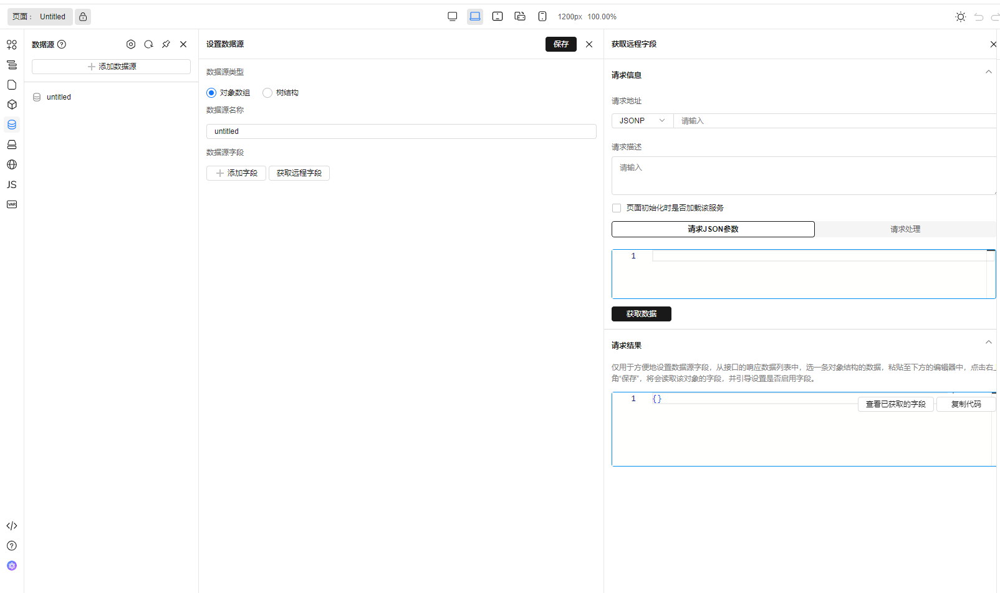

添加数据源成功后，在数据源列表点击编辑静态数据图标，打开静态数据管理页面添加或者修改静态数据
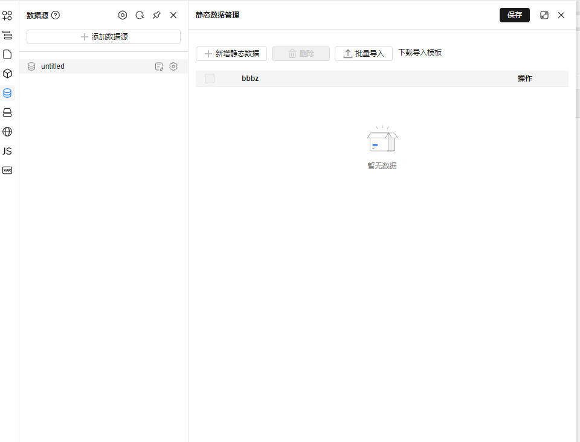

##### 2.1.2 现版本数据源

- 添加数据源\
   在添加数据源的时候，会有三个页签展示（远程配置，数据源字段，静态数据），将原本的设置数据源和静态数据管理放在了同一个面板，便于添加字段和数据，入口更明显。

  a.远程配置页签（对应的原点击获取远程配置后的页面），配置请求地址，请求描述，请求设置后，点击查看远程字段，三级面板打开，展示请求结果，如请求结果中的数据进行改变，点击查看已获取的字段，查看字段下的数据会进行改变。

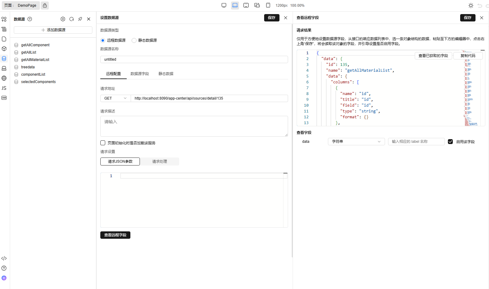

b.点击查看远程字段的保存按钮，二级面板的页签会自动切换选中数据源字段，会将展示的字段信息回填在数据源字段页签中

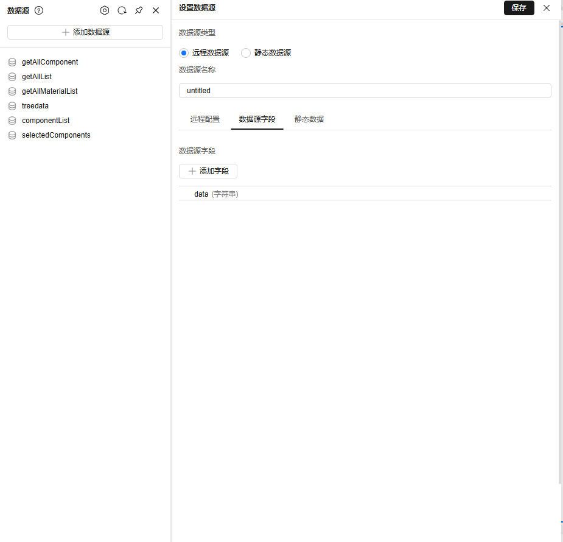

c.点击静态数据页签，可以看到数据源字段出现在静态数据的列名中，在当前页面可以添加静态数据

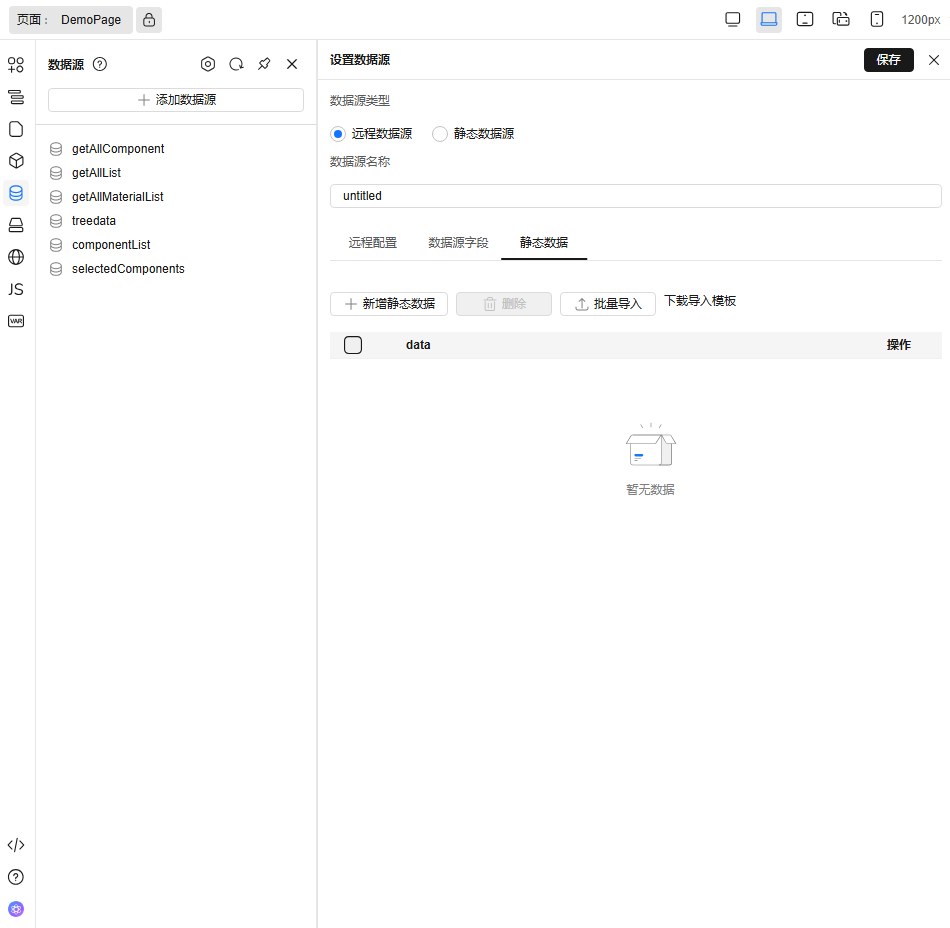

数据源字段改变，静态数据会增加列，保存时同时保存

- 在数据源列表设置当前某个数据源\
   操作同添加数据源，原有数据默认为远程数据源，按照对象数组处理

#### 2.2 新手引导

之前版本的新手引导，都是大模块式加上大篇幅的文字介绍，重点不突出，用户看着也很费劲，本次优化删繁就简，将重点功能进行引导，突出重点。

以下为新手引导内容调整，共分为 4 步。

- 重点告知用户锁定功能

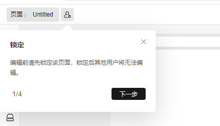

- 引导新用户拖拉拽组件到画布上

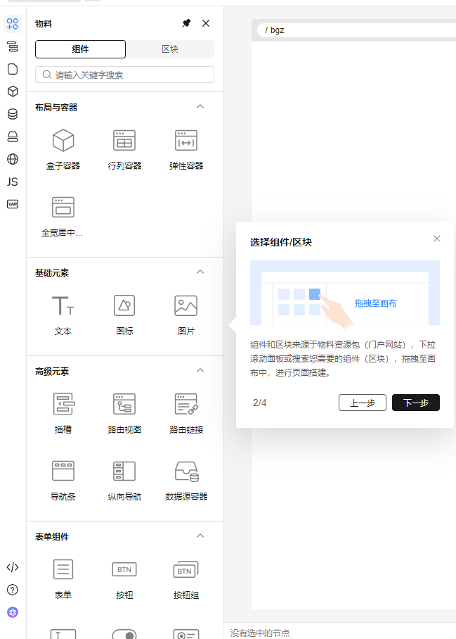

- 引导用户对画布中的组件进行属性设置

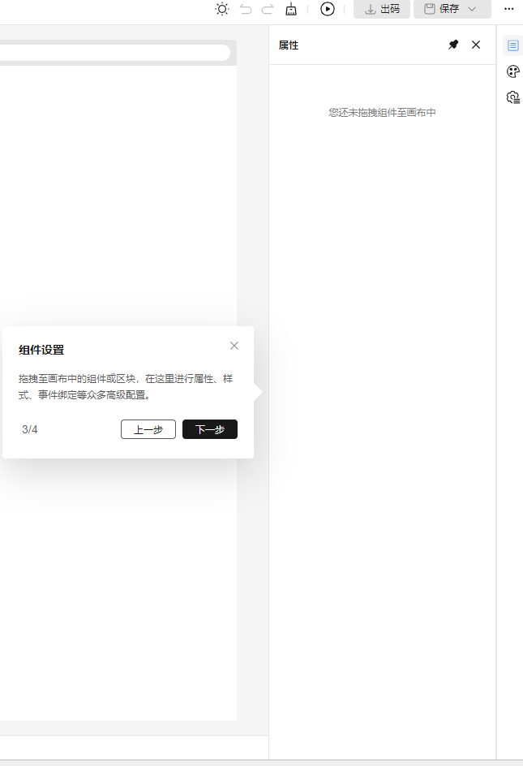

- 重点突出预览/出码功能

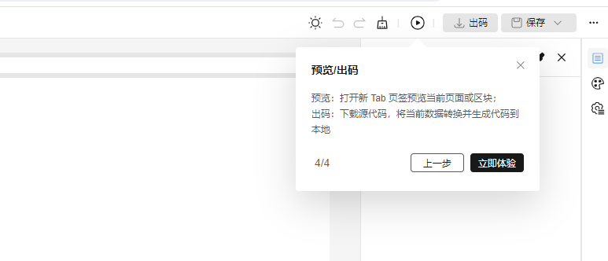

#### 2.3 物料面板图标调整

设计稿换新风格后，原物料图标跟页面风格不匹配，更换所有的物料图标

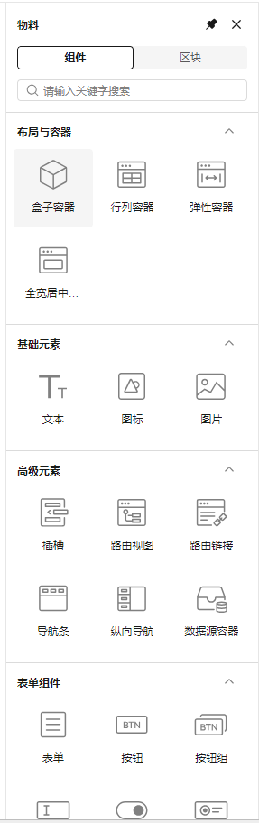

#### 2.4 帮助问号内容提示和跳转形式调整

设计器中面板旁帮助提示文案调整，跳转由之前的直接点击帮助问号图标改为点击提示文案后查看详情跳转
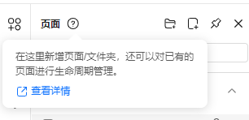

### 3. 【优化】预览支持热更新，移除 URL 依赖

**⚠️ Breaking Change (v2.6)**

在 v2.6 版本中，我们对页面预览配置进行了破坏性调整，现在需要在物料入口 `preview.js` 中直接配置物料信息，不再通过 URL 参数传递物料相关的 script 和 css 资源。

#### 基本配置

在 `preview.js` 文件中，需要在注册表的 `engine.config` 配置中添加 `material` 属性：

```js
import { initPreview, META_SERVICE, HttpService } from '@opentiny/tiny-engine'

const registry = {
  [META_SERVICE.Http]: HttpService,
  'engine.config': {
    id: 'engine.config',
    theme: 'light', // 新增：物料配置
    material: ['/mock/bundle.json']
  }
}

initPreview({
  registry
})
```

#### 迁移指南

如果您从 v2.5 或更早版本升级到 v2.6，请按以下步骤进行迁移：

1. 在  `preview.js`  的  `engine.config`  中添加  `material`  配置
2. 确保物料包 JSON 文件路径正确且可访问

### 4. 【优化】属性出码支持 JSFunction

v2.5 或更早版本之前，组件属性值直接绑定 JSFunction 的时候，出码会错误。比如：

```json
{
  "props": {
    "render-content": {
      "type": "JSFunction",
      "value": "function render(h, { node, data }) {\n  return <span style=\"color: red;font-size: 20px;\">{node.label}</span>\n}\n"
    }
  }
}
```

会出码成为：

```html
<template>
    <tiny-tree  :render-content="function render(h, { node, data }) {
  return <span style=\"color: red;font-size: 20px;\">{node.label}</span>
}
">
    </tiny-tree>
</template>
```

v2.6 版本对该场景做了优化： 检测到属性为 JSFunction 的时候，将函数值生成到 setup 函数里面。然后属性绑定为该函数。

比如上述的属性会生成为（将 function 绑定到 script 中）：

```html
<template>
  <tiny-tree :render-content="render"></tiny-tree>
</template>

<script setup>
  const render = wrap(function render(h, { node, data }) {
    return <span style="color: red; font-size: 20px">{node.label}</span>
  })
</script>
```

### 5. 【优化】支持配置页面 title

打开设计器之后，默认会修改页面的标题为 `${app.name}-TinyEngine设计器`。

在 v2.6 版本中，我们在 GlobalService 元服务中增加了  `enableTitleUpdate`配置项，以满足二开用户自定义页面标题的需求。

配置项名称：`enableTitleUpdate`

配置项作用：配置 TinyEngine 是否自动修改页面标题。默认为 true，即自动修改页面标题

配置示例：

```js
import { GlobalService } from '@opentiny/tiny-engine'

export default {
  root: {
    id: 'engine.root',
    metas: [
      HttpService,
      GenerateCodeService,
      { ...GlobalService, options: { ...GlobalService.options, enableTitleUpdate: false } },
      ThemeSwitchService
    ]
  }
  //...
}
```

### 6. 【优化】页面操作菜单支持配置

之前版本页面只有默认操作菜单项，2.6 版本提供了页面操作菜单支持配置

默认操作菜单

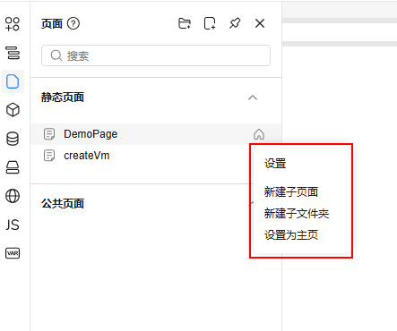

通过配置项来定制

- 'customPageOperations'：自定义操作配置项
- 'type'：菜单项类型
- 'label'：菜单项名称
- 'action'：菜单项操作

```js
// registry.js
import { handleClickDelete } from './tests/utils'
export default {
  // ...
  plugins: [
    // ...
    [
      Page,
      {
        options: {
          ...Page.options,
          customPageOperations: [{ type: 'delete', label: '删除', action: handleClickDelete }]
        }
      }
    ]
    // ...
  ]
  // ...
}
```

```js
// 方法中传有两个参数
export const handleClickDelete = async (node, emit) => {
  // node 为所选择的页面的信息， 可以直接调接口处理数据
  // emit 可以调用页面父组件的方法，例如 在选择的页面下新建子页面  emit('createPage', 'staticPages', node.id)
}
```

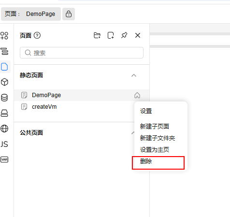

### 7. 【优化】Tabs 组件支持配置名称，支持绑定

标签页组件可以配置 tab title 和 tab name\
tab title —>页签标题\
tab name —>页签值

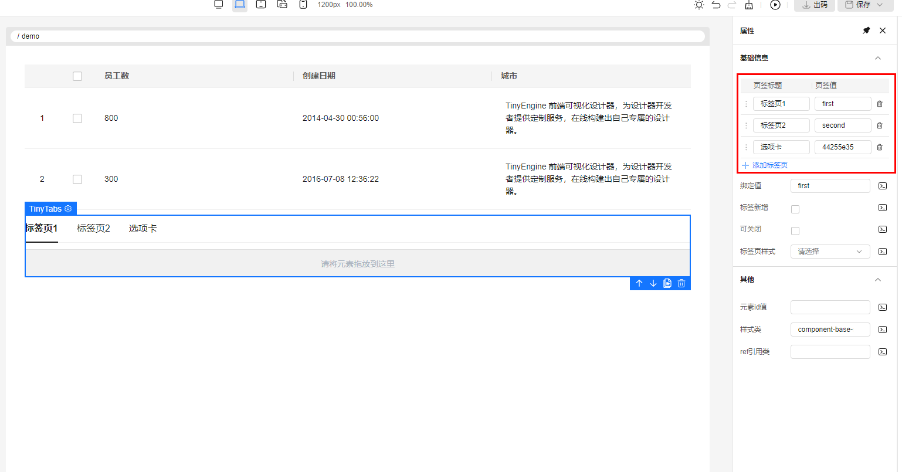

### 8. 文档更新

- 文档图片已刷新为最新设计器 UI 图片
- 新增路由能力相关文档
- 大纲树相关文档更新
- 新增画布快捷操作文档
- 增加 engine.config 配置项详解
- 物料 API 文档更新

### 9. 【其他】功能细节优化\&bug 修复

- TinyTabs 组件在不存在物料配置的情况下，走 renderSlots 逻辑导致 TinyTabs 无法渲染的 bug。TinyTooltip 组件插槽无法通过  `inject`  获取到 pageContext 时，报错的 bug。 [@chilingling](https://github.com/chilingling)  [#1421](https://github.com/opentiny/tiny-engine/pull/1421 '按住ctrl点击直接打开')
- 水平布局设置无效冗余   [@chilingling](https://github.com/chilingling)  [#1329](https://github.com/opentiny/tiny-engine/pull/1329 '按住ctrl点击直接打开')
- 更新输入输入框 controls-position 配置   [@xuanlid](https://github.com/xuanlid)  [#1401](https://github.com/opentiny/tiny-engine/pull/1401 '按住ctrl点击直接打开')
- 更新 popeditor 组件 grid-op 配置  [@xuanlid](https://github.com/xuanlid)  [#1402](https://github.com/opentiny/tiny-engine/pull/1402 '按住ctrl点击直接打开')
- 移除警告信息  [@SonyLeo](https://github.com/SonyLeo)  [#1391](https://github.com/opentiny/tiny-engine/pull/1391 '按住ctrl点击直接打开')
- 修复二级路由页面引用区块路径错误的问题  [@zzerX](https://github.com/0x7A7A6572 '按住ctrl点击直接打开')  [#1415](https://github.com/opentiny/tiny-engine/pull/1415 '按住ctrl点击直接打开')
- 父级节点是插槽的场景，无法使用画布中的向左箭头向上选中父节点问题  [@chilingling](https://github.com/chilingling)  [#1419](https://github.com/opentiny/tiny-engine/pull/1419 '按住ctrl点击直接打开')
- 删除当前正在编辑的页面，会得到请求报错弹窗。 [@chilingling](https://github.com/chilingling)  [#1432](https://github.com/opentiny/tiny-engine/pull/1432 '按住ctrl点击直接打开')
- 属性面板下拉框多选模式无法展示文本  [@xuanlid](https://github.com/xuanlid)  [#1439](https://github.com/opentiny/tiny-engine/pull/1439 '按住ctrl点击直接打开')
- 进入设计器时，如果 url 上没有页面 id，编辑画布后保存，无法保存，保存接口会报错问题  [@chilingling](https://github.com/chilingling)  [#1440](https://github.com/opentiny/tiny-engine/pull/1440 '按住ctrl点击直接打开')
- 修复从物料列表拖拽取消后，点击选中画布的节点，会导致选中的节点被移动到画布最后的 bug。修复往表格列插槽拖动时，有可能拖动节点到插槽的顶层，导致节点被插入到 TinyGrid children，导致表格显示的 bug。 [@chilingling](https://github.com/chilingling)  [#1449](https://github.com/opentiny/tiny-engine/pull/1449 '按住ctrl点击直接打开')
- 修复小图标出码 BUG  [@1degrees](https://github.com/1degrees)  [#1447](https://github.com/opentiny/tiny-engine/pull/1447 '按住ctrl点击直接打开')
- 删除废弃包  [@chilingling](https://github.com/chilingling)  [#1410](https://github.com/opentiny/tiny-engine/pull/1410 '按住ctrl点击直接打开') [#1412](https://github.com/opentiny/tiny-engine/pull/1412 '按住ctrl点击直接打开') [#1434](https://github.com/opentiny/tiny-engine/pull/1434 '按住ctrl点击直接打开') [#1438](https://github.com/opentiny/tiny-engine/pull/1438 '按住ctrl点击直接打开')
- 升级 Vite 插件版本   [@chilingling](https://github.com/chilingling)  [#1418](https://github.com/opentiny/tiny-engine/pull/1418 '按住ctrl点击直接打开')
- 【优化】添加插件 sourcemap  [@chilingling](https://github.com/chilingling)  [#1380](https://github.com/opentiny/tiny-engine/pull/1380 '按住ctrl点击直接打开')
- 物料文件更新  [@chilingling](https://github.com/chilingling)  [#1413](https://github.com/opentiny/tiny-engine/pull/1413 '按住ctrl点击直接打开')    [@xuanlid](https://github.com/xuanlid)  [#1397](https://github.com/opentiny/tiny-engine/pull/1397 '按住ctrl点击直接打开')
- 【代码优化】物料物块详情导入的 panel API 不存在，替换为可用的 API 名  [@JasonWellGao](https://github.com/JasonWellGao '按住ctrl点击直接打开')  [#1319](https://github.com/opentiny/tiny-engine/pull/1319 '按住ctrl点击直接打开')
- 【代码优化】增加容错性  [@SonyLeo](https://github.com/SonyLeo)  [#1436](https://github.com/opentiny/tiny-engine/pull/1436 '按住ctrl点击直接打开')

以上是此次更新问题修复的主要内容，更多细节请查看  [v2.6.0 changelog](https://github.com/opentiny/tiny-engine/releases/tag/v2.6.0 '按住ctrl点击直接打开')

## 结语

TinyEngine 2.6 版本更新不仅限于页面树增强支持折叠，设计器 UI 刷新，还对预览支持热更新、出码、支持配置页面 title 等功能进行了完善。每一步前行都值得铭记，感谢有您陪伴我们一起迭代成长，同时也欢迎大家加入社区讨论，参与社区共建！
