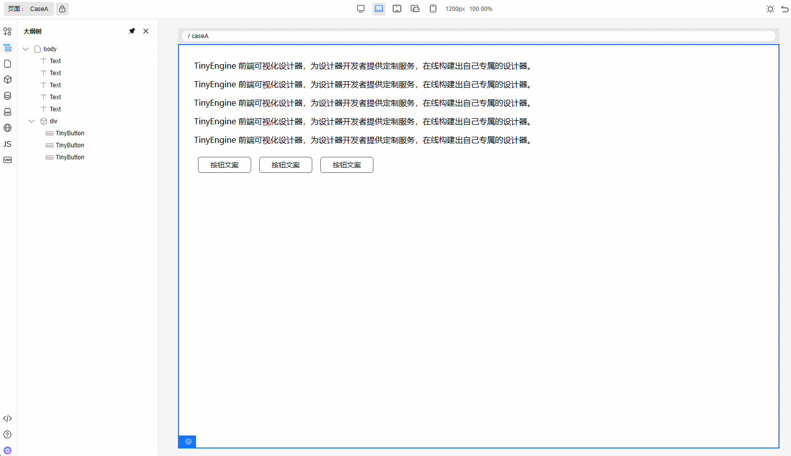
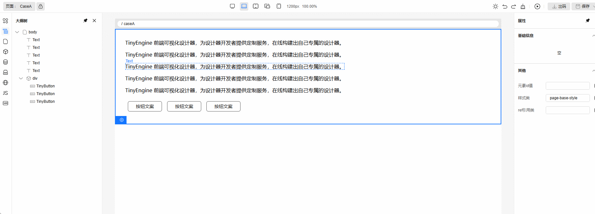
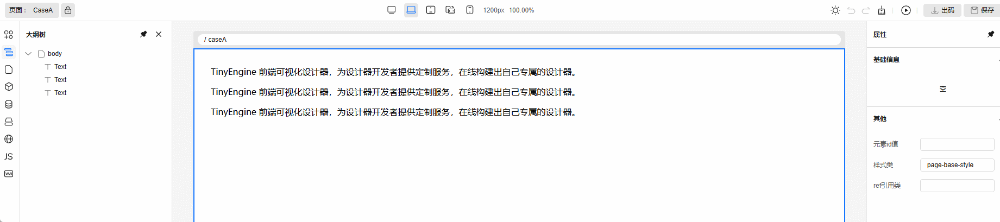
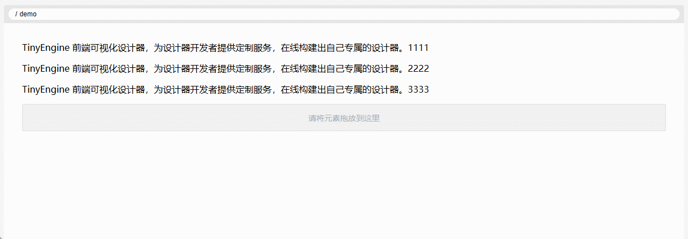
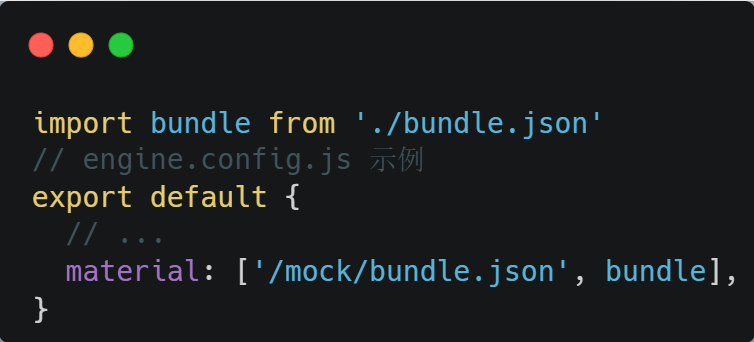
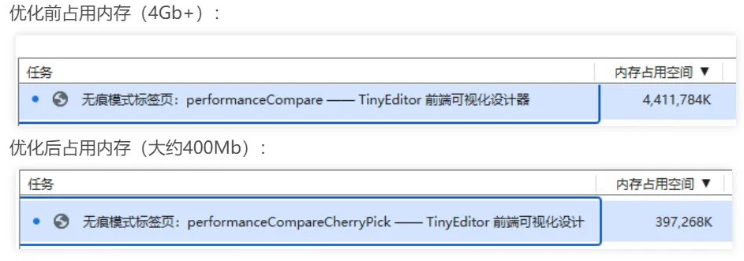
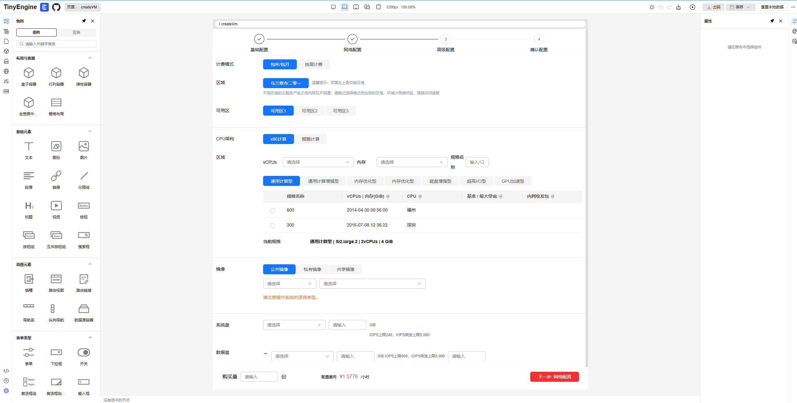

## 前言

TinyEngine 低代码引擎使开发者能够定制低代码平台。它是低代码平台的底座，提供可视化搭建页面等基础能力，既可以通过线上搭配组合，也可以通过 cli 创建个人工程进行二次开发，实时定制出自己的低代码平台。适用于多场景的低代码平台开发，如：资源编排、服务端渲染、模型驱动、移动端、大屏端、页面编排等。

近期，TinyEngine v2.5 版本带着新的功能和优化一起来咯\~ 希望这次更新能为大家的使用带来更多的便利与惊喜。

- 源码：<https://github.com/opentiny/tiny-engine（欢迎> Star ⭐）
- 官网：<https://opentiny.design/tiny-engine#/home>

这次版本特性开发和问题修复已经有更多的开发者朋友参与进来，我们在此诚挚感谢  [@BWrong](https://github.com/BWrong) 、[@1degrees](https://github.com/1degrees '按住ctrl点击直接打开')  积极参加 TinyEngine 的开源共建，同时也邀请大家一起加入开源社区的建设，让 TinyEngine 成长的更加优秀和茁壮。

## v2.5.0 变更特性概览

- 【画布】画布多选支持右键菜单。
- 【画布】画布多选支持拖拽。
- 【CDN】修复 CDN 本地化的支持。
- 【性能优化】画布 iframe 移除 base64 避免大内存占用问题。
- 【页面预览】页面预览支持热更新。
- 【物料配置】物料支持直接在配置中传入对象。
- 【物料 API】物料支持使用 refreshMaterial 进行刷新物料。
- 【物料】新增 TinyTransfer 组件。
- 【其他】大量功能细节优化与 bug 修复。

## TinyEngine v2.5.0 新特性解读

### 1. 【画布】画布多选支持右键菜单

#### 1.1 基本介绍

多选右键菜单是一个便捷的功能，当用户选中多个组件节点后，右键点击可以呼出专用的多选菜单，提供批量操作能力。

#### 1.2 功能详情

多选状态下的右键菜单包含以下几个主要功能选项：

- **删除**：一键删除所有选中的节点，无需逐个操作

- **复制**：批量复制所有选中的节点，便于快速重用

- **添加父级**：为选中的节点添加共同父容器，包含以下子选项：

  - **容器(批量)** ：为每个选中节点单独添加父级容器
  - **容器 (公共父级)** ：仅当选中节点为连续的兄弟节点时可用，创建一个公共父容器
  - **弹出框(公共父级)** ：仅当选中节点为连续的兄弟节点时可用，创建 TinyPopover 组件作为公共父级

- **新建区块**：基于选中的组件创建可复用的区块组件

注意事项：

- 多选菜单触发条件：当选中节点的数量大于 1 时，系统自动切换到多选菜单模式

- 批量添加父级：对于  **添加父级**  中“容器（批量）”选项，选中多个节点时可用

- 添加公共父级：对于  **添加父级** 中“容器(公共父级)”和“弹出框(公共父级)”选项，只有当所选节点是连续的兄弟节点时才可用

#### 1.3 功能使用展示

a. 右键菜单：批量复制 + 批量删除


b. 右键菜单：添加父级

c. 右键菜单：支持选中多个节点添加区块\


### 2. 【画布】画布多选支持拖拽

#### 2.1 基本介绍

多选拖拽是一个批量移动节点的功能，用户可以同时选中多个组件节点并作为整体进行拖拽操作，提高组件布局调整的效率。

#### 2.2 使用方法

a. **多选操作**

按键多选：按住 Ctrl 键，点击选中多个组件

b. **拖拽操作**

- 开始拖拽：选中多个组件后，在选中组件上按下鼠标左键
- 移动过程：拖动鼠标，组件的拖拽元素会同时移动，保持原有的相对位置关系
- 完成放置：释放鼠标按键，组件将放置在新位置

#### 2.3 界面展示



#### 2.4 注意事项

- 点击已选中的组件但不拖动时，自动切换为单选状态
- 大量组件同时拖拽可能造成性能下降，建议适量选择

### 3.【CDN】修复 CDN 本地化支持

在 1.x 版本中，我们新增了 CDN 本地化的特性。但是在 2.x 版本中，该功能失效了。在 2.5 版本中，我们将该特性迁移上来。

使用示例：在 .env.alpha 或者 .env.prod 环境变量文件中，新增如下配置：

```shell
# CDN 本地化配置示例

# 将画布、页面预览需要的 vue、vue-i18n 等等依赖复制到构建产物中
VITE_LOCAL_IMPORT_MAPS=true

# 将本地物料 bundle.json 的 script 和 css 复制到构建产物中
VITE_LOCAL_BUNDLE_DEPS=true

# 将 VITE_LOCAL_BUNDLE_DEPS 复制到构建产物中的目录名称，默认为 local-cdn-static
VITE_LOCAL_IMPORT_PATH=local-cdn-static
```

然后执行  `pnpm build:alpha`  或者时  `pnmp build:prod`  就可以得到带有 CDN 本地化文件的产物啦\~

相关联 PR：<https://github.com/opentiny/tiny-engine/pull/1242>

详细文档：[https://opentiny.design/tiny-engine#/help-center/course/dev/import-map-local](https://opentiny.design/tiny-engine#/help-center/course/dev/import-map-local.md)

### 4.【页面预览】页面预览支持热更新

在前端开发中，有一种特性叫做热更新，我们直接修改代码，保存文件之后，浏览器就会自动刷新网页，我们就可以看到效果了。在 v2.5 版本中，TinyEngine 也带来了一种页面预览热更新的特性。我们打开预览页面，在画布中进行拖拉拽，不需要再次点击页面预览或者刷新页面，预览页面就会自动刷新。

关联 PR：<https://github.com/opentiny/tiny-engine/pull/1261>

相关联特性支持：

- 支持配置预览页面跳转的 url。
- 页面预览热更新功能支持开关。

详情请参照文档：[https://opentiny.design/tiny-engine#/help-center/course/dev/preview-api](https://opentiny.design/tiny-engine#/help-center/course/dev/preview-api.md)

### 5.【物料配置\&API】物料支持直接在配置中传入对象 &  支持使用 refreshMaterial 进行刷新物料

**物料支持在配置中传入对象**

v2.0 - v2.4 的版本中，我们的物料配置仅支持传递 url 进行获取物料。v2.5 的版本中，我们支持了直接传递对象，使得配置物料的方式更灵活。

配置示例：



```Shell
import bundle from './bundle.json'
// engine.config.js 示例
export default {
  // ...
  material: ['/mock/bundle.json', bundle],
}
```

**物料新增 refreshMaterial API**

使用场景：二开工程中，允许用户上传物料，或者是动态更新物料后，需要刷新物料，此时可以调用该方法。

更多详情请查看文档：[https://opentiny.design/tiny-engine#/help-center/course/dev/material-api](https://opentiny.design/tiny-engine#/help-center/course/dev/material-api.md)

### 6. 【性能优化】画布 iframe 移除 base64 避免大内存占用问题

在 2.0+ 的画布优化中，我们使用了 base64 来将 script 传递到画布中，但是 base64 在 src 中却会占用很大的内存，这加剧了页面的卡顿，使用体验变得不好。所以，在 v2.5 的版本中，我们将 base64 去除，避免大内存占用的问题。（Tips：画布后续将进行更多的优化，支持更多的拓展点和更强大的二次开发功能。欢迎大家来使用反馈提 PR）



关联 PR：<https://github.com/opentiny/tiny-engine/pull/1321>

### 7.【物料】新增 TinyTransfer 组件

**功能概览**\
  新增高性能穿梭框组件，支持数据在左右面板间快速转移，适用于权限分配、数据分类等多选场景。\
**关键特性**\
  基础穿梭功能：支持单/多选、全选、快捷移动操作，可通过按钮或拖拽交互实现数据转移。\
  搜索过滤：内置关键词搜索功能，可快速定位目标数据项。

### 8.【官网】官网 Demo 刷新为 v2.5 版本

官网的 Demo 从 1.x 刷新为 v2.5 版本。链接：<https://opentiny.design/tiny-engine#/tiny-engine-editor>

欢迎大家到官网上体验 Demo。


### 9.【其他】功能细节优化\&bug 修复

- 默认出码模板的 vite.config.js 增加  `base: './'`  配置。 [@xuanlid](https://github.com/xuanlid)  [#1247](https://github.com/opentiny/tiny-engine/pull/1247)
- 解决编辑区块不生效的 bug。 [@SonyLeo](https://github.com/SonyLeo)  [#1257](https://github.com/opentiny/tiny-engine/pull/1257)
- 解决获取 globalState 不正确的 bug。 [@chilingling](https://github.com/chilingling)  [#1292](https://github.com/opentiny/tiny-engine/pull/1292)
- 解决删除绑定事件没有触发保存状态更新的 bug。 [@chilingling](https://github.com/chilingling)  [#1253](https://github.com/opentiny/tiny-engine/pull/1253)
- 修复 getRenderer 在 canvas init 完成前可能为 null，在控制台报错的问题。 [@chilingling](https://github.com/chilingling)  [#1254](https://github.com/opentiny/tiny-engine/pull/1254)
- 修复 HtmlAttributesConfigurator 配置组件样式问题。 [@BWrong](https://github.com/BWrong)  [#1302](https://github.com/opentiny/tiny-engine/pull/1302)
- 优化 TinyCheckboxGroup 和 video 组件配置。 [@chilingling](https://github.com/chilingling)  [#1294](https://github.com/opentiny/tiny-engine/pull/1294)
- 修复出码单元测试；修复状态变量 key 可能不合法需要增加引号的 bug。[@chilingling](https://github.com/chilingling)  [#1291](https://github.com/opentiny/tiny-engine/pull/1291)
- 修复手动编辑 schema 之后，导致页面无法保存的 bug。[@chilingling](https://github.com/chilingling)  [#1299](https://github.com/opentiny/tiny-engine/pull/1299)
- 修复父级页面有区块时，页面预览有错误的 bug。[@1degrees](https://github.com/1degrees)  [#1289](https://github.com/opentiny/tiny-engine/pull/1289)
- AI 对话框不强制要求填 token。[@xuanlid](https://github.com/xuanlid)  [#1310](https://github.com/opentiny/tiny-engine/pull/1310)
- 修复新建区块后 url 未更新导致画布渲染错误的 bug。 [@gene9831](https://github.com/gene9831)  [#1323](https://github.com/opentiny/tiny-engine/pull/1323)
- 修复清空画布后，页面保存操作失败的 bug。 [@1degrees](https://github.com/1degrees)  [#1341](https://github.com/opentiny/tiny-engine/pull/1341)
- 修复 i18n 面板打开之后，i18n 词条列表不显示的 bug。[@SonyLeo](https://github.com/SonyLeo)  [#1358](https://github.com/opentiny/tiny-engine/pull/1358)
- 修复重复点击一个还原页面之后，接口报错的 bug。[@xuanlid](https://github.com/xuanlid)  [#1368](https://github.com/opentiny/tiny-engine/pull/1368)
- 修复复制页面保存之后，无法切换到新页面的 bug。 [@chilingling](https://github.com/chilingling)  [#1361](https://github.com/opentiny/tiny-engine/pull/1361)
- 修复画布存在 jsx 函数的时候，报错无法渲染的 bug。 [@chilingling](https://github.com/chilingling)  [#1376](https://github.com/opentiny/tiny-engine/pull/1376)
- 修复新增插件后，可能无法显示新插件的 bug。[@SonyLeo](https://github.com/SonyLeo)  [#1373](https://github.com/opentiny/tiny-engine/pull/1373)
- 修复：点击复制页面，弹出"您即将复制的页面有更改未保存，是否确定跳过更改直接复制？"，但复制页面并没有更改未保存的 bug。[@SonyLeo](https://github.com/SonyLeo) [#1365](https://github.com/opentiny/tiny-engine/pull/1365)
- 修复 chrome 浏览器 136 版本，清空样式面板的样式类之后，伪类下拉框宽度不正常的 bug。[@xuanlid](https://github.com/xuanlid)[#1398](https://github.com/opentiny/tiny-engine/pull/1398)
- 修复异步函数在绑定事件函数之后，丢失 async descriptor 描述符的 bug。[@chilingling](https://github.com/chilingling) [#1396](https://github.com/opentiny/tiny-engine/pull/1396)
- 修复即使固定面板，新增页面之后，页面仍然被关闭的 bug。[@SonyLeo](https://github.com/SonyLeo)  [#1393](https://github.com/opentiny/tiny-engine/pull/1393)

以上是此次更新问题修复的主要内容，更多细节请查看  [v2.5.0 changelog](https://github.com/opentiny/tiny-engine/releases/tag/v2.5.0 '按住ctrl点击直接打开')

## 结语

TinyEngine 2.5 版本更新不仅修复了许多问题，还对多选功能进行了完善，更有页面预览热更新、CDN 本地化等重要特性支持。每一步前行都值得铭记，感谢有您陪伴我们一起迭代成长，同时也欢迎大家加入社区讨论，参与社区共建！

## 关于 OpenTiny

欢迎加入 OpenTiny 开源社区。添加微信小助手：opentiny-official 一起参与交流前端技术～\
OpenTiny 官网：**<https://opentiny.design>**\
OpenTiny 代码仓库：**<https://github.com/opentiny>**\
TinyVue 源码：**<https://github.com/opentiny/tiny-vue>**\
TinyEngine 源码：**<https://github.com/opentiny/tiny-engine>**\
欢迎进入代码仓库 Star🌟TinyEngine、TinyVue、TinyNG、TinyCLI、TinyEditor\~ 如果你也想要共建，可以进入代码仓库，找到 good first issue 标签，一起参与开源贡献\~
