## 前言

TinyEngine 低代码引擎使开发者能够定制低代码平台。它是低代码平台的底座，提供可视化搭建页面等基础能力，既可以通过线上搭配组合，也可以通过 cli 创建个人工程进行二次开发，实时定制出自己的低代码平台。适用于多场景的低代码平台开发，如：资源编排、服务端渲染、模型驱动、移动端、大屏端、页面编排等。
近期，TinyEngine v2.4 版本带着新的功能和优化正式上线\~ 希望这次更新能为大家的使用带来更多的便利与惊喜。

近期，我们正式推出 TinyEngine v2.6 版本，希望能够给大家带来更好的使用体验，满足大家日益增长的各种需求。

- 源码：<https://github.com/opentiny/tiny-engine> （欢迎 Star ⭐）
- 官网：<https://opentiny.design/tiny-engine#/home>

  这次版本特性开发和问题修复已经有更多的开发者朋友参与进来，我们在此诚挚感谢 [@STATICHIT](https://github.com/STATICHIT '按住ctrl点击直接打开')、[@stwflyfox](https://github.com/stwflyfox '按住ctrl点击直接打开')、[@webzmj530](https://github.com/webzmj530 '按住ctrl点击直接打开')、[@Ljhhhhhh](https://github.com/Ljhhhhhh '按住ctrl点击直接打开')、[@1degrees](https://github.com/1degrees '按住ctrl点击直接打开') 积极参加 TinyEngine 的开源共建，同时也邀请大家一起加入开源社区的建设，让 TinyEngine 成长的更加优秀和茁壮。
  在本次更新中，我们重点开发及优化了以下几个方面

##### v2.4.0 变更特性概览

- 主题开发能力：cli 支持用户自定义主题
- 插件灵活布局：所有插件面板统一浮动和固定逻辑，部分面板可拖拽调整宽度 -默认页与主页功能优化调整
- 大纲树支持复制、删除、多选能力
- 文档开源：文档从内部托管迁移至了 Github
- 项目 TS 改造
- AI 插件支持输入用户大模型 API Token 使用 AI 功能
- 同时支持 unpkg 与 npmmirror CDN
- 修复了多个问题，优化了一些交互与功能细节。

## TinyEngine v2.4.0 新特性解读

### 1.主题开发能力

#### 1.1 默认提供了深色和浅色主题，通过顶部主题切换插件点击图标即可进行切换

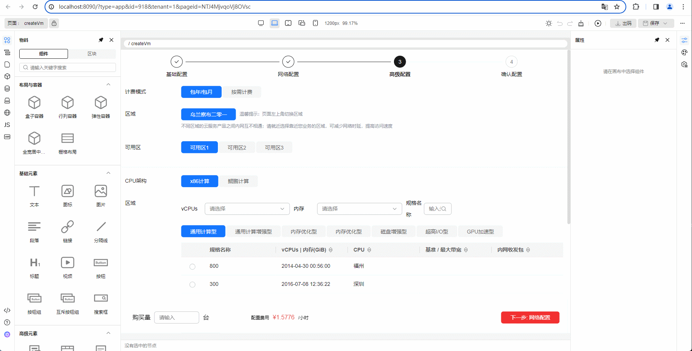

#### 1.2 用户在注册表配置自定义主题，主题切换展示为列表切换

创建设计器可参考官网文档：<https://opentiny.design/tiny-engine#/help-center/course/dev/91>
在已经创建的设计器根目录执行 engine-cli create，选择 theme 以创建一个新的主题

npx @opentiny/tiny-engine-cli create

# 上面命令默认会拉取最新的版本，也可以指定版本号

npx @opentiny/tiny-engine-cli@2.4.0 create

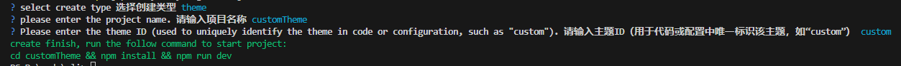

执行下面命令安装依赖 # 安装依赖
npm install

- 将主题接入设计器

使用 vs Code 打开 customPlatform 项目，修改 registry.js

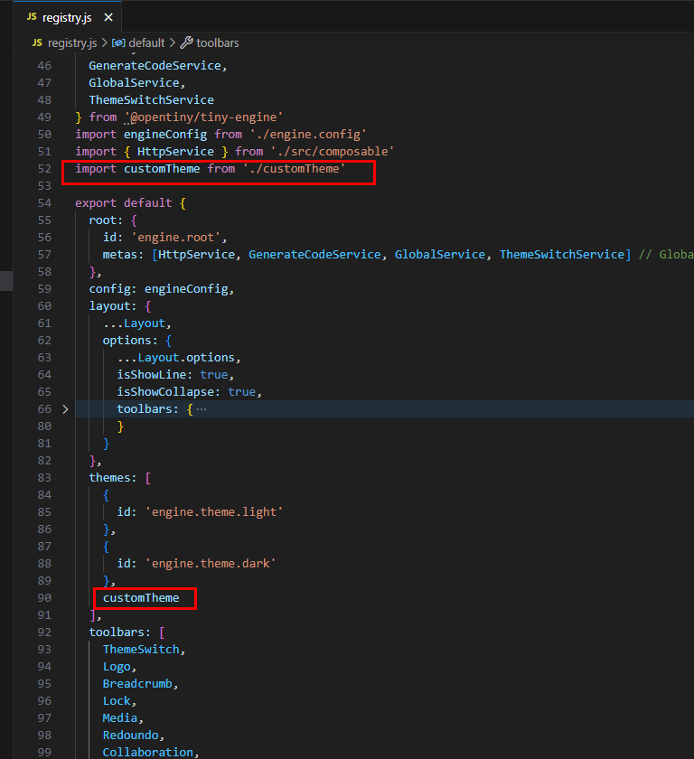

- 开发调试主题

重新打开项目页面，可以看到主题展示为列表切换，可以切换自定义主题

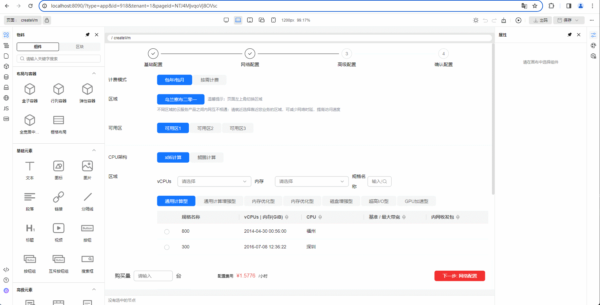

### 2. 插件灵活布局

#### 2.1 统一固定和浮动逻辑

所有插件面板统一浮动和固定逻辑

之前版本的  **固定**  和  **浮动**  插件面板操作 仅支持  **物料**  和  **大纲树** ；\\

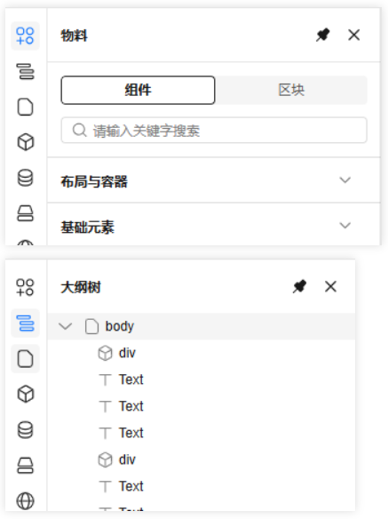

现在左右侧的插件全部支持  **固定**  和  **浮动** 面板操作。\
\*\
以 区块管理 和 数据源 面板为例进行展示\*\\

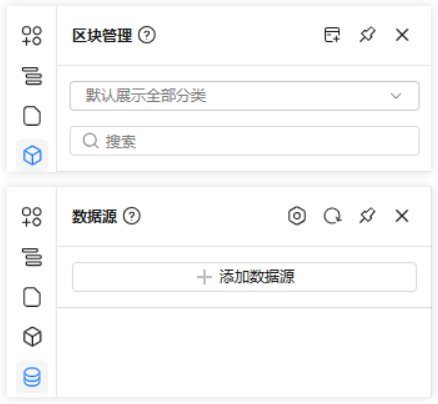

#### 2.2 部分面板可拖拽调整宽度

操作方法：鼠标悬浮在相应面板右侧的边框线上，边框线变色即可开始拖动。

目前支持拖拽改变面板宽度的插件是：**大纲树**、**页面 JS**  和  **页面 Schema**

- 大纲树

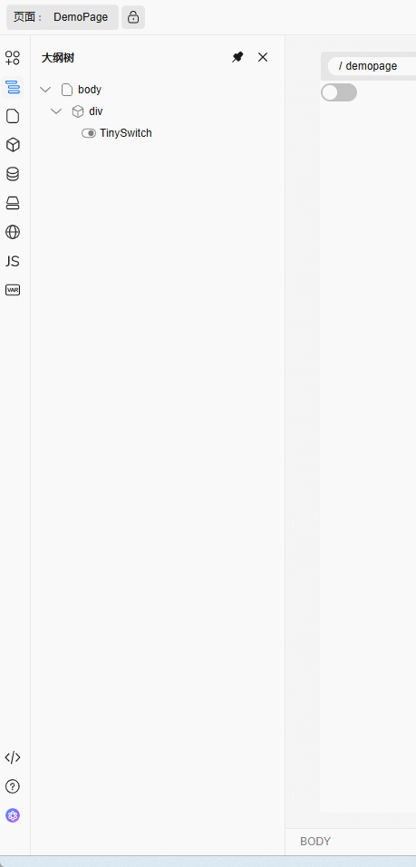

- 页面 JS

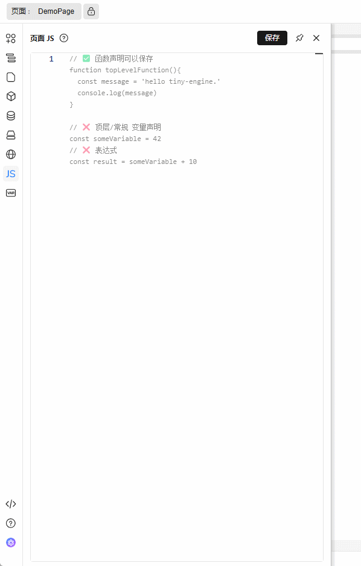

- 页面 Schema

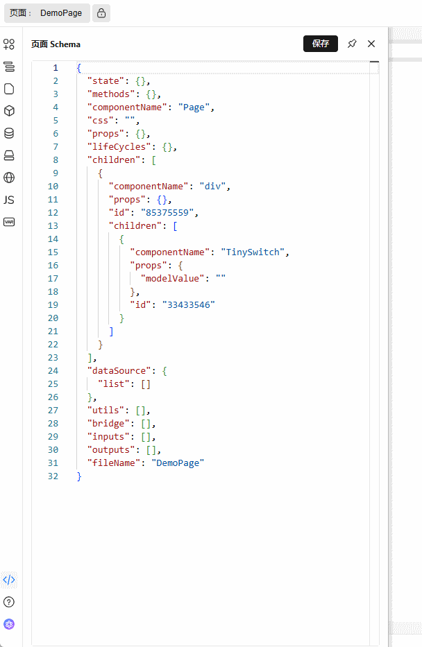

### 3. 默认页与主页功能优化调整

- 主页调整为在”...“菜单设置

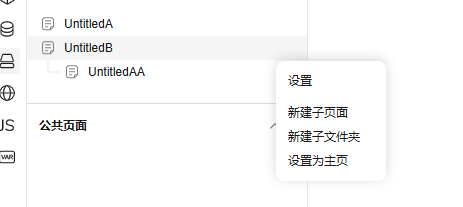

- 默认页调整

之前的默认页是在子页面的页面设置中将其设置为父级的默认页（如图所示）

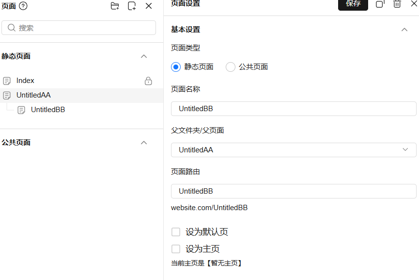

这个版本调整为在父页面直接选择默认页（如图所示）

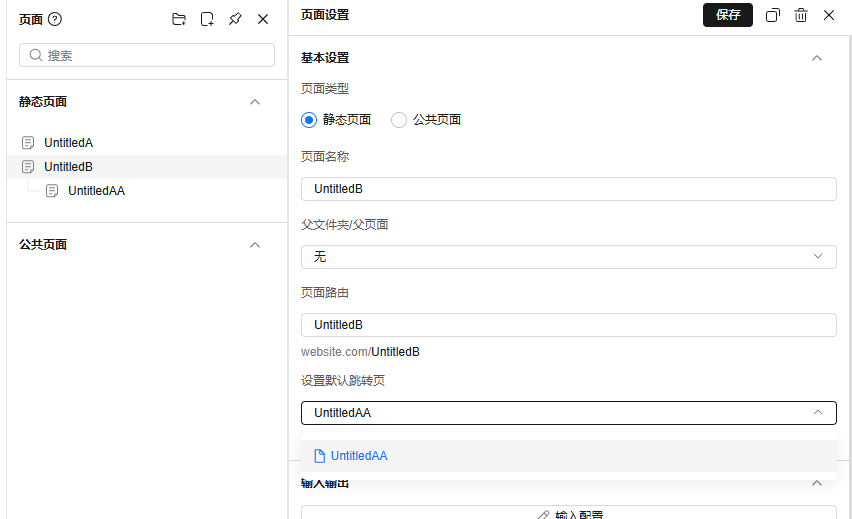

### 4. 大纲树支持复制、删除、多选能力

在上一个 2.3 版本中，画布提供了多选节点的功能，并且多选节点支持快捷键进行操作，多选时支持  `ctrl+c`  复制、`ctrl+v`  粘贴、`delete`  删除等。2.4 版本我们把支持多选的功能同步给了大纲树，并且多选操作逻辑和画布保持一致，多选选中的节点在大纲树和画布会同步显示。如下图所示

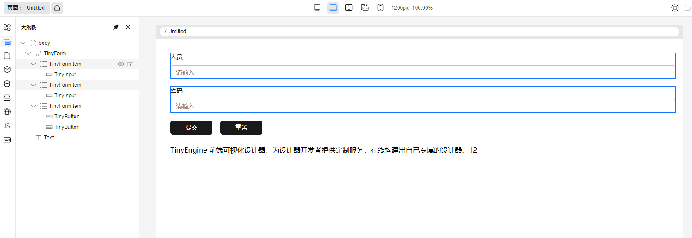

另外还给大纲树补充了几个其他常用的快捷键，具体看如下表格

| 大纲树支持的快捷键 | 功能说明                                       | 支持多选 |
| ------------------ | ---------------------------------------------- | -------- |
| `ctrl+鼠标点击`    | 选择多个节点。如点击已选中节点后，则为取消选中 | 否       |
| `ctrl+c`           | 复制节点                                       | 是       |
| `ctrl+v`           | 粘贴节点                                       | 是       |
| `ctrl+x`           | 剪切节点                                       | 是       |
| `delete`           | 删除节点                                       | 是       |
| `ctrl+z`           | 撤销历史记录                                   | 否       |
| `ctrl+y`           | 回退历史记录                                   | 否       |
| `ctrl+s`           | 保存页面 schema                                | 否       |

### 5. 文档开源

文档现已开源！我们将文档从内部托管迁移至了 Github。这份文档现在属于整个社区！欢迎开发者：

- ✍ 修正你发现的问题
- 💡 添加你熟悉的技巧
- 📚 编写新的教程章节

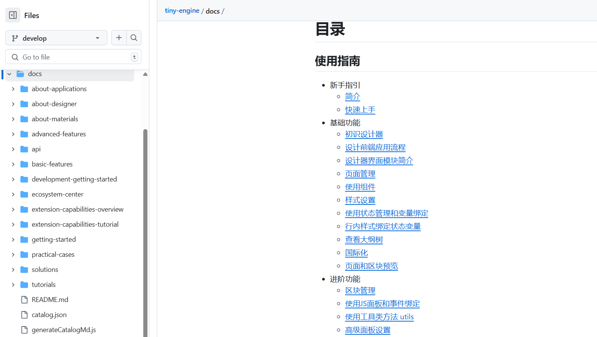
期待与你共同打造更好的技术文档

### 6. 项目 TS 改造

随着项目规模的扩大，基于 Javascript 的代码在可维护性和团队协作方面逐渐暴露出一些问题。为了解决潜在的类型错误、提高开发效率并增强代码稳定性，我们决定将项目改造成 Typescript。这个改造过程是逐步的，目前 2.4 版本进行了如下更改

- 项目改造成了 ts 项目，ts 类型完善工作正在进行中
- 添加了 ts 的 ESLint 规则校验以增强代码质量

### 7. AI 插件支持输入用户大模型 API Token 使用 AI 功能

Ai 对话框交互样式调整，点击 标题 或 设置图标 展示弹窗，弹窗内可配置大模型类型以及对应的 token

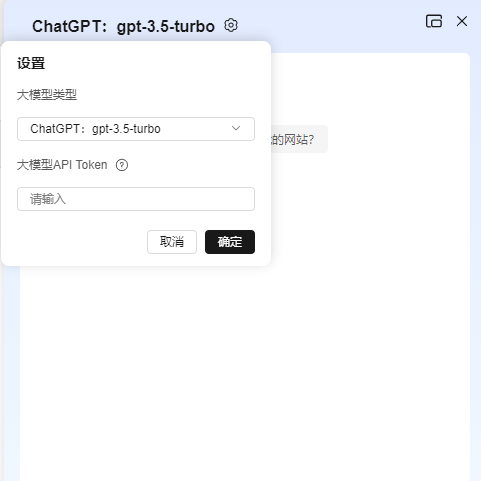

### 8. 同时支持 unpkg 与 npmmirror CDN

鉴于 unpkg cdn 在国内网络有可能波动，访问不稳定的原因。我们增加了 npmmirror CDN 的支持。PR：[#1220](https://github.com/opentiny/tiny-engine/pull/1220 '按住ctrl点击直接打开')

使用方法：

1. 使用 npmmirror CDN

```shell
// .env.alpha、.env.development、.env.production

VITE\_CDN\_DOMAIN=<https://registry.npmmirror.com>

\# 需配合 VITE\_CDN\_TYPE 使用，值必须是 npmmirror

VITE\_CDN\_TYPE=npmmirror
```

2. 使用 unpkg CDN

```Shell

VITE\_CDN\_DOMAIN=<https://unpkg.com>
```

3. 物料使用 npmmirror CDN

npmmirror CDN 格式为： `https://registry.npmmirror.com/${packageName}/${version}/files/filePath`

如果我们物料也需要使用 npmmirror 的 CDN，我们按照格式进行配置即可。比如：

- <https://registry.npmmirror.com/@opentiny/vue-runtime/~3.20/files/dist3/tiny-vue-pc.mjs>
- <https://registry.npmmirror.com/element-plus/2.4.2/files/dist/index.full.mjs>

### 9. 【其他】功能细节优化\&bug 修复

- 修复：insert 方法因为 referTargetNode 找不到引起的报错，导致 slot 插槽增加失败。[@chilingling](https://github.com/chilingling) [#1140](https://github.com/opentiny/tiny-engine/pull/1140 '按住ctrl点击直接打开')
- 修复：margin 不支持配置负数  [@xuanlid](https://github.com/xuanlid '按住ctrl点击直接打开') [#1164](https://github.com/opentiny/tiny-engine/pull/1164 '按住ctrl点击直接打开')
- 修复：数据源绑定时，将数据源初始化的 State 和原有 State 错误更新，导致功能无效，Schame 沉余无用数据  [@1degrees](https://github.com/1degrees '按住ctrl点击直接打开')  [#1208](https://github.com/opentiny/tiny-engine/pull/1208 '按住ctrl点击直接打开')
- 修复：拆包之后 packages 字段丢失  [@webzmj530](https://github.com/webzmj530 '按住ctrl点击直接打开') [#1200](https://github.com/opentiny/tiny-engine/pull/1200 '按住ctrl点击直接打开')
- 修复：拆包的时候一个组件在多个分组里面也可以一个分组里面存在两个组件(componentName 相同, snippetName 不同) [@webzmj530](https://github.com/webzmj530 '按住ctrl点击直接打开') [#1212](https://github.com/opentiny/tiny-engine/pull/1212 '按住ctrl点击直接打开')
- 修复：页面初始化时，页面加载 dataSourceMap 提示 undefined 的 bug [@chilingling](https://github.com/chilingling) [#1142](https://github.com/opentiny/tiny-engine/pull/1142 '按住ctrl点击直接打开')
- 修复：设计器画布上下移动和复制按钮异常  [@chilingling](https://github.com/chilingling) [#1180](https://github.com/opentiny/tiny-engine/pull/1180 '按住ctrl点击直接打开')
- 修复了 schema 中 `css` 字段缺失时，代码生成为 `<style scoped>undefined</style>` 的问题 [@chilingling](https://github.com/chilingling) [#1179](https://github.com/opentiny/tiny-engine/pull/1179 '按住ctrl点击直接打开')
- 修复：文案为空时 i18n 下的文案为 null 导致出码异常，新增判断条件，默认为空对象  [@Ljhhhhhh](https://github.com/Ljhhhhhh '按住ctrl点击直接打开') [#1211](https://github.com/opentiny/tiny-engine/pull/1211 '按住ctrl点击直接打开')
- 修复：1. 多选节点进行点击回退剩余一个元素时，框选效果异常  2. 快捷键剪切失效  [@SonyLeo](https://github.com/SonyLeo '按住ctrl点击直接打开') [#1201](https://github.com/opentiny/tiny-engine/pull/1201 '按住ctrl点击直接打开')
- 修复：自定义渲染函数中的组件，如果页面没有引入，预览页面和出码页面会存在问题  [@webzmj530](https://github.com/webzmj530 '按住ctrl点击直接打开') [#1146](https://github.com/opentiny/tiny-engine/pull/1146 '按住ctrl点击直接打开')
- 修复：引入的第三方组件无法在出码、预览中正常使用  [@Ljhhhhhh](https://github.com/Ljhhhhhh '按住ctrl点击直接打开') [#1215](https://github.com/opentiny/tiny-engine/pull/1215 '按住ctrl点击直接打开')
- 修复：表格组件插槽变量无法使用\$rowIndex 变量  [@xuanlid](https://github.com/xuanlid '按住ctrl点击直接打开') [#1224](https://github.com/opentiny/tiny-engine/pull/1224 '按住ctrl点击直接打开')
- 修复：页面 JS 插件中函数存在注释时保存会导致内容丢失或无法保存  [@chilingling](https://github.com/chilingling) [#1184](https://github.com/opentiny/tiny-engine/pull/1184 '按住ctrl点击直接打开')
- 修复：连续设置需要过滤内容的 script 到 js 面板，js 面板没有正确显示更新  [@chilingling](https://github.com/chilingling) [#1196](https://github.com/opentiny/tiny-engine/pull/1196 '按住ctrl点击直接打开')
- 修复：画布行列容器组件，鼠标悬停剪刀图标时，分割虚线不显示  [@gene9831](https://github.com/gene9831 '按住ctrl点击直接打开') [#1233](https://github.com/opentiny/tiny-engine/pull/1233 '按住ctrl点击直接打开')
- 修复：滚动画布时，hover 框不会随着元素位置变动更新  [@gene9831](https://github.com/gene9831 '按住ctrl点击直接打开') [#1235](https://github.com/opentiny/tiny-engine/pull/1235 '按住ctrl点击直接打开')

以上是此次更新问题修复的主要内容，更多细节请查看  [v2.4.0 changelog Bug Fixes](https://github.com/opentiny/tiny-engine/releases/tag/v2.4.0 '按住ctrl点击直接打开')

## 如何使用新版本

- 如果是从 2.0.0 版本升级上来，只需要在 cli 创建出来的工程，将 @opentiny/tiny-engine 相关的依赖，升级到 2.4.0 即可
- 如果是从 1.x 版本升级上来，需要参考迁移指南，升级到 2.4 版本
- 如果是全新创建项目，仅需要使用 tinyengine-cli 创建项目即可。`npx @opentiny/tiny-engine-cli create-platform my-designer`

## 结语

TinyEngine 2.4 版本更新不仅是对大纲树功能进行了完善，实现了插件灵活布局等，最重要的是我们将文档从内部托管迁移至了 Github！每一步前行都值得铭记，感谢有您陪伴我们一起迭代成长，同时也欢迎大家加入社区讨论，参与社区共建！

## 关于 OpenTiny

欢迎加入 OpenTiny 开源社区。添加微信小助手：opentiny-official 一起参与交流前端技术～

[OpenTiny 官网](https://opentiny.design/)：**[https://opentiny.design](https://opentiny.design/)**

[OpenTiny 代码仓库](https://github.com/opentiny)：**<https://github.com/opentiny>**

[TinyVue 源码](https://github.com/opentiny/tiny-vue)：**<https://github.com/opentiny/tiny-vue>**

[TinyEngine 源码](https://github.com/opentiny/tiny-engine)： **<https://github.com/opentiny/tiny-engine>**

欢迎进入代码仓库 Star🌟TinyEngine、TinyVue、TinyNG、TinyCLI、TinyEditor\~

如果你也想要共建，可以进入代码仓库，找到 good first issue 标签，一起参与开源贡献\~
