## 前言

TinyEngine 低代码引擎使开发者能够定制低代码平台。它是低代码平台的底座，提供可视化搭建页面等基础能力，既可以通过线上搭配组合，也可以通过 cli 创建个人工程进行二次开发，实时定制出自己的低代码平台。适用于多场景的低代码平台开发，如：资源编排、服务端渲染、模型驱动、移动端、大屏端、页面编排等。

近期，TinyEngine 正式推出 2.3 版本！继 2.2 版本通过嵌套路由革新应用架构后，本次升级聚焦路由能力增强与界面主题切换，使得开发体验再上新的台阶。

- 源码：<https://github.com/opentiny/tiny-engine> （欢迎 Star ⭐）
- 官网：<https://opentiny.design/tiny-engine#/home>

这个版本的问题修复有社区的开发者朋友  @hashiqi12138  参与进来，我们在此诚挚感谢   @hashiqi12138  积极参加 TinyEngine 的开源共建，同时也邀请大家一起加入开源社区的建设，让 TinyEngine 成长的更加优秀和茁壮。

下面列举了新版本的更新内容，方便大家更加直观的了解版本的变化。

## v2.3.0 变更特性概览

1. 路由能力增强：RouterView 组件支持预览子界面和一键清除预览路径。

2. 界面样式优化：对主题变量进行重构，支持主题切换和暗色主题。

3. 大纲树优化：大纲树节点新增组件图标并且支持拖拽。

4. 画布快捷操作：支持画布选中元素右键添加父容器，支持节点多选和快捷键操作。

5. Monaco 编辑器增强：增加编辑器内部快捷键保存事件。

所有变更详情请查看：<https://github.com/opentiny/tiny-engine/releases/tag/v2.3.0 >

## TinyEngine v2.3.0 新特性解读

### **1. 路由能力增强**

特性概览：

- RouterView 组件支持预览子页面，并支持嵌套预览子页面
- 路由 bar 会显示预览页面的路径，当前编辑页面会高亮，支持一键清除预览页面的路径

**为什么需要预览子页面功能？** 在 2.2 版本中，我们通过在父页面拖入 RouterView 来提供给子页面渲染的插槽，然而在编辑父页面时，我们无法结合子页面内容来实时预览更改后的整体效果，想查看整体效果只能通过单页预览或者出码运行。为了提升这个场景的交互体验，我们推出了 RouterView 组件支持预览子页面功能

下面我们逐步创建演示示例来展示路由的新功能。

首先我们创建多个页面，页面结构如下

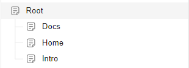

接着在 Root 页面中拖入横向导航条和路由视图，横向导航条中的路由链接绑定好跳转页面，然后在每个子页面中拖入文本。效果如下所示

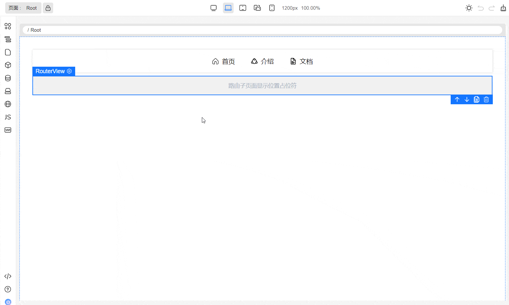

#### 1.1 RouterView 组件支持预览子页面

我们回到 Root 页面，Root 页面中有一个横向导航条和一个 RouteView 路由视图。悬停 RouteView 组件，RouteView 右上角显示“眼睛”图标，点击此图标用会弹出列表。列表的可选项分为两类：

- 路由子页面占位符。是列表首个元素，选择后重置 RouterView 为占位符
- RouteView 组件所在的页面的子页面，选择任意一个子页面后，RouterView 内容会显示子页面

具体效果如下图所示。RouterView 中显示了子页面，预览的子页面是只读的（鼠标悬停子页面的组件显示灰色边框，说明是只读的），当前编辑页仍然是 Root 页面

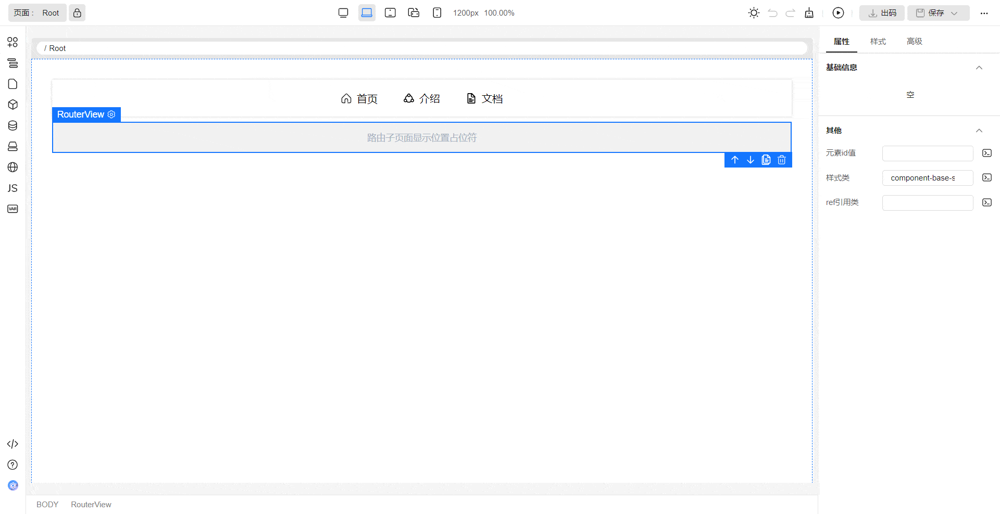

#### 1.2 RouterView 组件预览子页面支持嵌套预览

我们将 Docs 页面稍作修改，首先给 Docs 页面增加两个子页面分别为 QuickStart 和 BestPractices，这两个子页面也拖入一个基本的文本便于识别，最后在 Docs 页面中拖入一个路由视图。页面结构和 Docs 页面预览如下

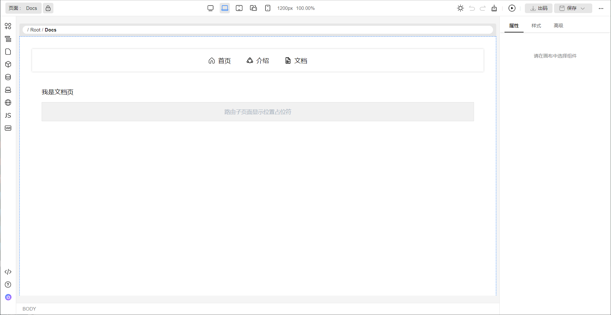

我们回到 Root 页面，将 Root 页面中的 RouterView 显示为 Docs 页面，即使 RouterView 内部的内容是只读的，嵌套的 RouterView 仍然可以继续选择要显示的子页面。效果如下图所示

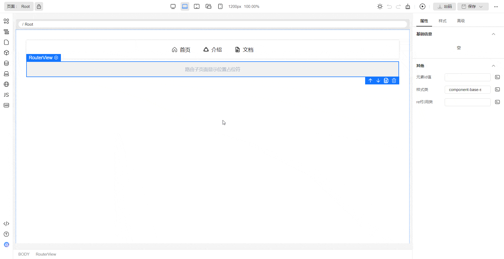

#### 1.3 路由 bar 会显示预览页面的路径，当前编辑页面会高亮

在之前的图例中，你可能已经注意到了，当我们在 RouterView 中显示了子页面后，路由 bar 中的路径会同步更新，并且当前编辑页面会加粗高亮。在上一个图例中，当前编辑页一直是 Root 页面，Root 路由会高亮显示，当前编辑页后的预览的路径文本色显示为浅色

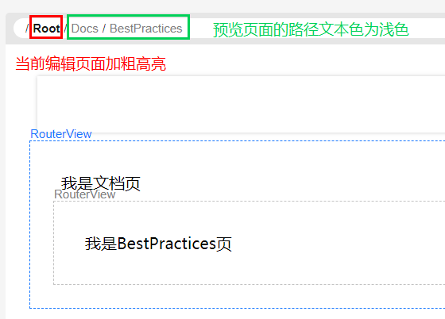

#### 1.4 路由 bar 支持一键清除预览页面的路径

如果存在预览路径，当鼠标选听到路由 bar 上时，会出现“重置路由视图为占位符”的按钮，点击后会将当前编辑页的路由视图重置为占位符。如下图所示，当前编辑页面为 Root 页面，Root 页面的 RouterView 显示了 Docs 页面，Docs 页面内部的 RouterView 显示了 BestPractices 页面，点击“重置路由视图为占位符”的按钮后，Root 页面的 RouterView 重置为了占位符，子页面 Docs 和嵌套的子页面 BestPractices 都不再显示

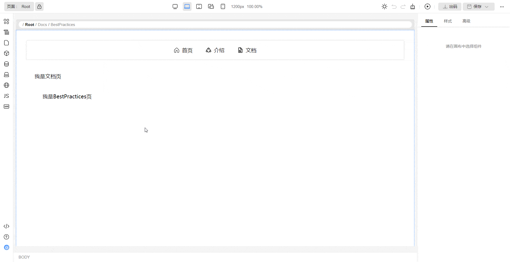

### 2. 主题切换/主题变量重构/暗色主题

#### 2.1 主题切换

- 新增主题切换元应用和元服务，支持在线切换深色主题和浅色主题
- 支持在工具栏中以 icon 按钮和以单选框两种形式配置
- 预览界面主题根据设计器当前的主题变化

#### 2.2 主题变量重构

重构目的：之前项目中存在 dark 和 light 两个主题包，每个包里都有我们各个插件里的主题样式变量。相当于我们 TinyEngine 里的主题代码耦合了各个插件里的样式变量，这样用户在新增自己的插件时，还需要到我们代码里做侵入式修改，去添加自己插件的样式，做不到插件独立化。

重构前代码：

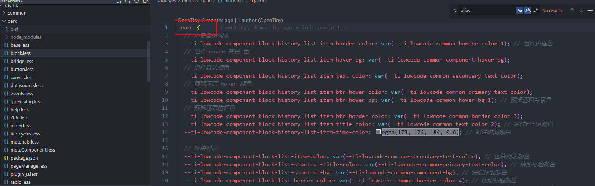

重构内容：对 theme/dark 和 theme/light 主题包进行重构，收拢为一个主题包 theme/base，只提供基础的色板、主题变量以及全局通用组件的样式覆盖。

theme/base 主题包文件大致分为：

- **base.less**  定义基础色值、间距、字号、字重、圆角等（即 base 变量）
- **common.less**  调用 base 变量，定义不同主题变量（即 common 变量）
- **component-common.less**  用来对组件库组件样式进行重写

将各个插件自己的变量从我们的 theme 包还给各个插件，由插件自己配置。每个插件有独立的 vars.less（less 中的变量称为模块变量），模块变量调用 common 变量。

这也是插件独立化的一部分，插件自己本身即可完成亮色暗色主题的配置，方便第三方插件自身配置主题颜色。

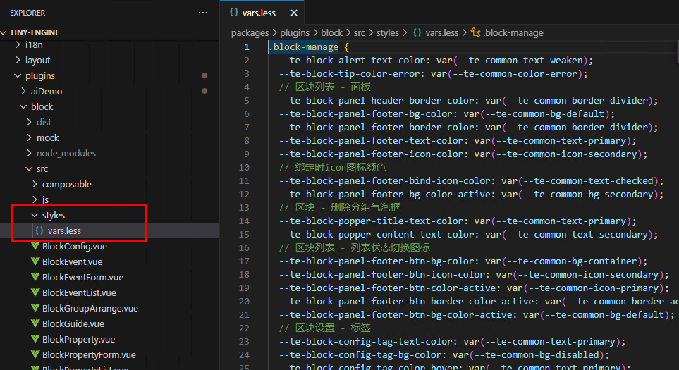

#### 2.3 暗色主题

- 对暗色主题的样式、交互进行调整，调整内容包括但不限于各个模块内部的字号、边框、背景、按钮等细节
- 添加大量暗色主题色值，根据主题变量重构的结构将色值赋值给变量

### 3. 大纲树优化

#### 3.1 UI 更新

大纲树 UI 更新，增加了组件图标

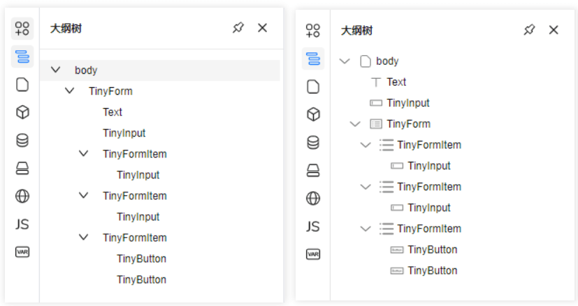

#### 3.2 节点支持拖拽

大纲树节点支持拖拽，下面是一个最基础的拖拽文本到 div 容器的例子

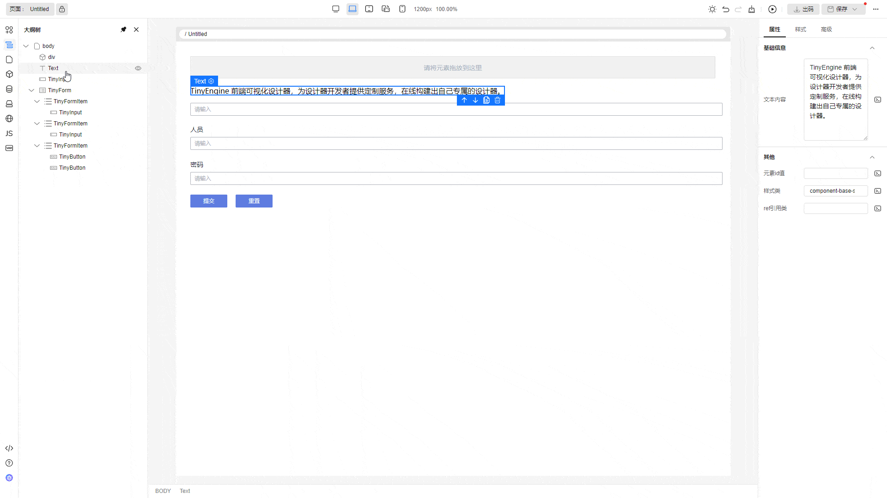

拖拽时鼠标悬停节点即拖拽目标节点。拖拽交互分为三类：拖拽为目标节点的子节点、拖拽为目标节点的前一个兄弟节点、拖拽为目标节点的后一个兄弟节点。UI 分别为如下表示：

将 Text 节点拖拽为 div 节点的子节点。拖拽为目标节点的子节点时，目标节点显示全部边框

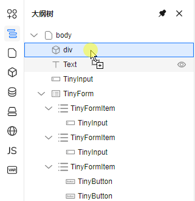

将 Text 节点拖拽为 div 节点的前一个兄弟节点。拖拽为目标节点的子节点时，目标节点显示上边框

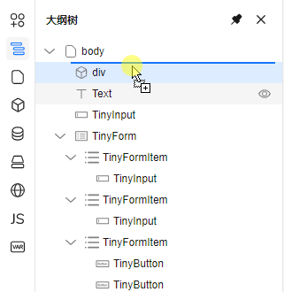

将 Text 节点拖拽为 div 节点的后一个兄弟节点。拖拽为目标节点的后一个兄弟节点时，目标节点显示下边框

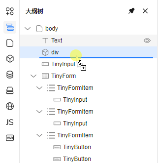

另外如果禁止拖拽，则目标节点的背景色会高亮警告。如下图所示，将 div 节点拖拽为 Text 节点的子节点是行不通的

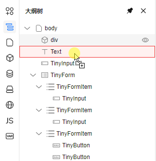

禁止拖拽的逻辑和画布是保持一致的，由物料组件的  `isContainer`  和  `nestingRule`  属性决定。目标节点对应的组件的属性  `isContainer`  为  `True`  是允许其他节点拖拽为目标节点的子节点的前提条件，`nestingRule`  请参考物料资产包协议中的**组件属性信息结构规范**章节

#### 3.3 大纲树嵌套深度很深时，显示横向滚动条

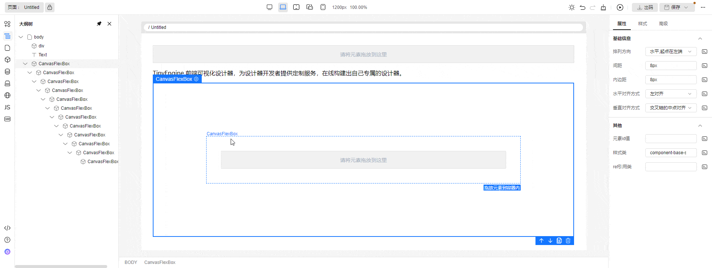

### 4. 画布快捷操作

#### 4.1 支持画布选中元素右键添加父容器

- 在画布中右键页面元素 -> 添加父级 -> 容器：

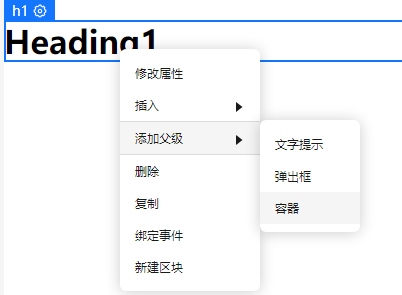

- 选中指定 容器 点击 鼠标左键：

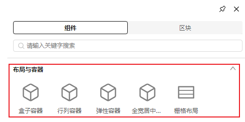

- 点击 画布元素 或 点击 大纲树 ， 即可查看新增的父容器

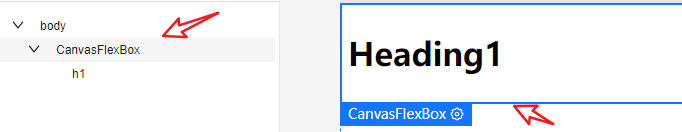

#### 4.2 支持节点多选

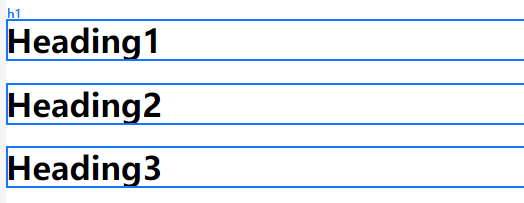

长按 ctrl + 鼠标单击，可支持元素多选，多选节点后可以结合快捷键可以实现批量复制、粘贴、删除操作。（多选节点后右键菜单能力后续版本持续完善）

#### 4.3 快捷键梳理

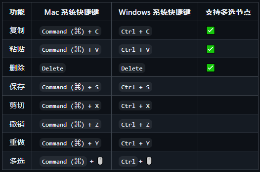

\*\*\*\*目前系统支持上述快捷键对画布元素进行操作，其中  **复制**、**粘贴**  和  **删除**  支持多选节点后进行批量操作。

### 5. Monaco 编辑器增强

增加编辑器内快捷键（ctrl + s）保存事件，在插件"页面 JS"、"页面 schema"中已绑定对应保存事件。

### 6. 其他：交互、功能细节优化 & bug 修复

- 升级：UI 组件库 TinyVue 从 3.14 升级到 3.20。 @chilingling #1008
- 修复：CanvasRowCol 组件剪刀工具无效的 bug。 @chilingling #1075
- 修复：组件打开插槽后，不显示 placeholder，无法往插槽里面拖入内容。@chilingling #1099
- 修复：设置主页面存在将子页面设置为主页后，子页面变成了第一级页面的逻辑。 @lichunn #1115
- 修复：svg 图标颜色配置出码后不生效。 @hashiqi12138 #1111
- 修复：创建页面会出现创建历史备份的弹窗，操作繁琐。@xuanlid #1107
- 修复：国际化资源首次删除单个词条时，删除按钮置灰无法删除  @SonyLeo #1102
- 修复：物料分组增加区块时，关键字检索不匹配  @SonyLeo #1102
- 修复：没有设置主页时路由出码格式不对。 @lichunn #1116
- 修复：页面预览显示内容为上一次保存的内容。@lichunn #1095
- 修复：TinyGrid 组件列插槽拖入内容保存后，再次选中无法进行操作。@chilingling #1100

以上是此次更新问题修复的主要内容，更多细节请查看  v2.3.0 changelog Bug Fixes

## 如何使用新版本

- 如果是从 2.0.0 版本升级上来，只需要在 cli 创建出来的工程，将 @opentiny/tiny-engine 相关的依赖，升级到 2.3.0 即可
- 如果是从 1.x 版本升级上来，需要参考迁移指南，升级到 2.3 版本
- 如果是全新创建项目，仅需要使用 tinyengine-cli 创建项目即可。`npx @opentiny/tiny-engine-cli create-platform my-designer`

## 结语

TinyEngine 低代码引擎本次更新不仅增强了路由和画布能力，而且对主题及样式进行重构和优化。后续 TinyEngine 也将持续优化文档，更新教程，欢迎开发者朋友们使用\~也希望朋友们一起参与共建

同时欢迎大家给 OpenTiny 提建议：[【OpenTiny 调研征集】共创技术未来，分享您的声音！](https://mp.weixin.qq.com/s?__biz=MzU5ODA3OTY5Ng==&mid=2247498532&idx=1&sn=56678cf1078debef902d24c418dda725&scene=21#wechat_redirect)

## 关于 OpenTiny

欢迎加入 OpenTiny 开源社区。添加微信小助手：opentiny-official 一起参与交流前端技术～\
OpenTiny 官网：**<https://opentiny.design>**\
OpenTiny 代码仓库：**<https://github.com/opentiny>**\
TinyVue 源码：**<https://github.com/opentiny/tiny-vue>**\
TinyEngine 源码： **<https://github.com/opentiny/tiny-engine>**\
欢迎进入代码仓库 Star🌟TinyEngine、TinyVue、TinyNG、TinyCLI\~ 如果你也想要共建，可以进入代码仓库，找到 good first issue 标签，一起参与开源贡献\~
