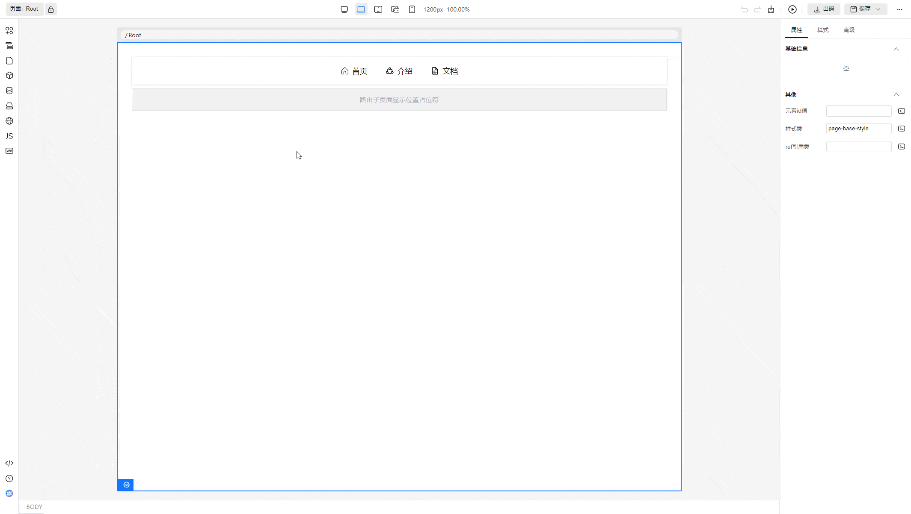
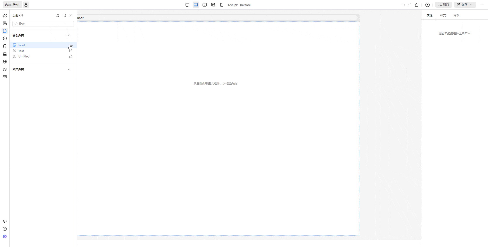
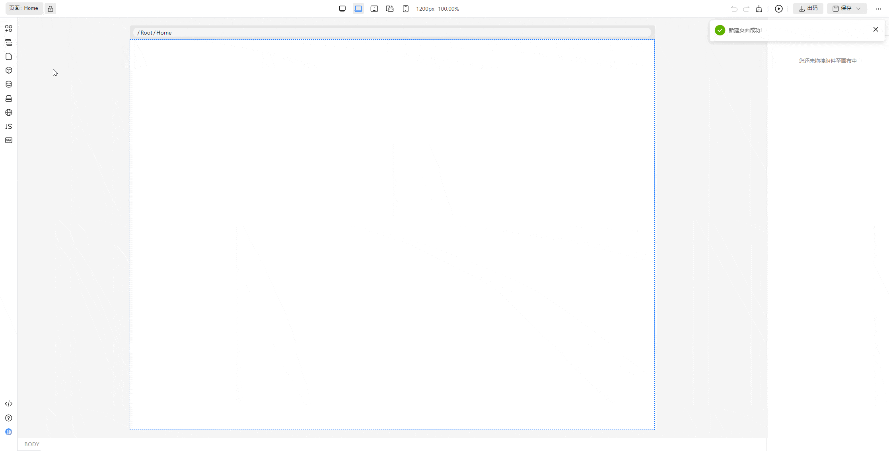
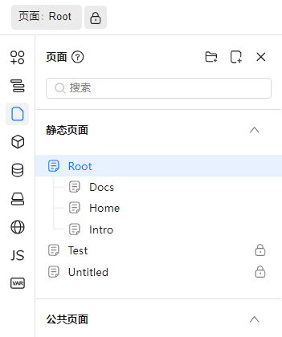
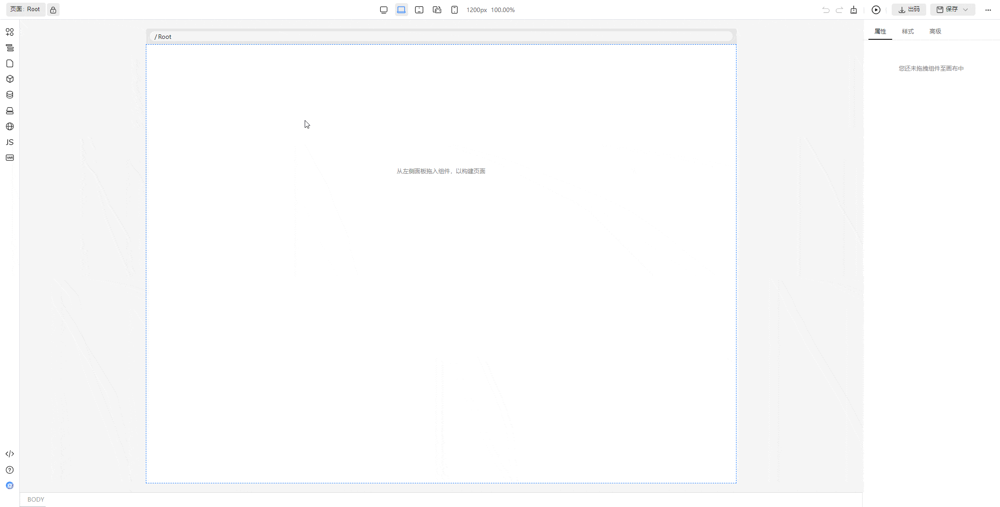
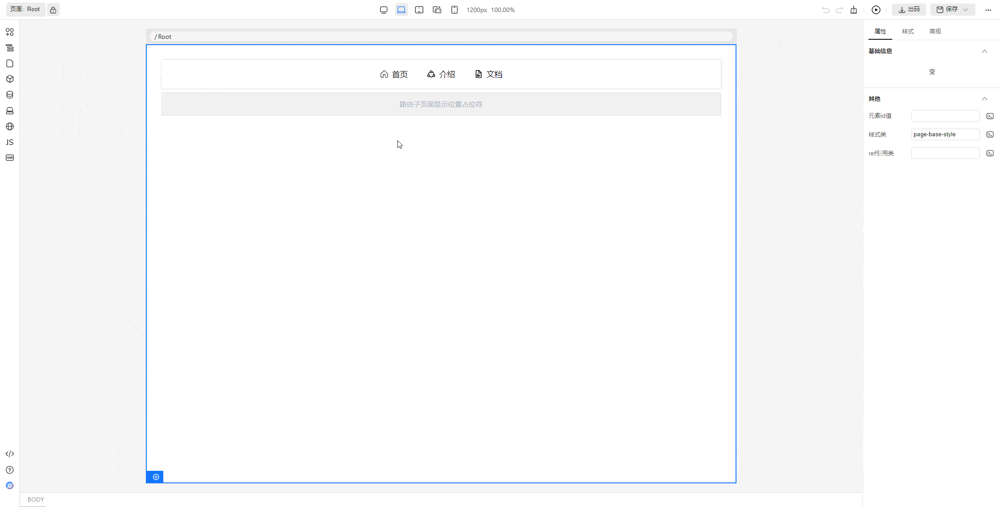
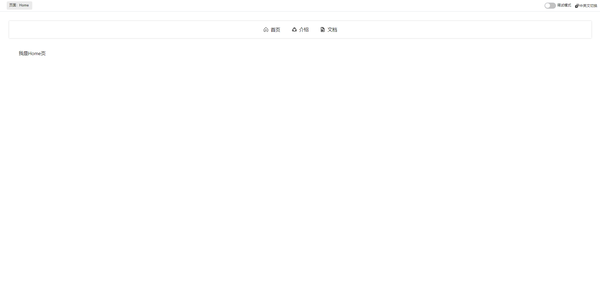
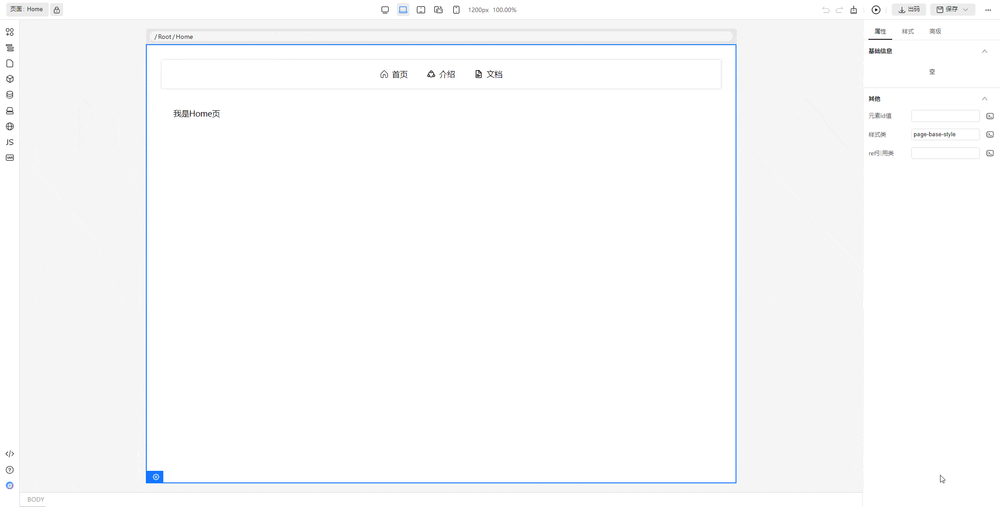
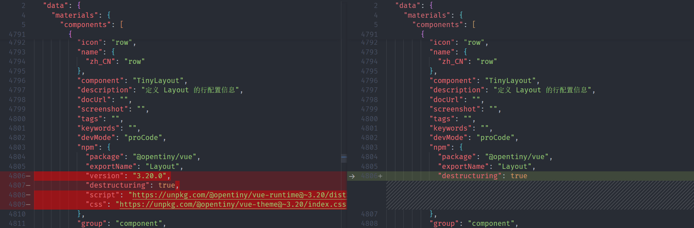
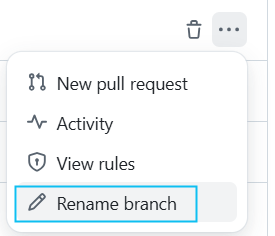

2025 年春节假期已过，大家都带着慢慢的活力回到了工作岗位。为了让大家在新的一年继续感受到 Tiny Engine 的成长与变化，我们很高兴地宣布：TinyEngine v2.2 版本正式发布！本次更新带来了重要的功能增强——页面支持嵌套路由，让开发者在构建复杂应用时更加得心应手。接下来，我们将详细介绍该版本的几大亮点与改进

## v2.2.0 变更特性概览

1. 页面支持嵌套路由，出码支持多层级路由嵌套结构
2. 物料协议 npm 字段整改，物料协议新增字段：materials.packages
3. 状态管理默认值支持表达式
4. 默认开启区块插件中的区块分类与物料插件中区块分组合并的选项
5. 修复了多个问题，包括 Element Plus 出码样式引入、I18n 格式化、国际化配置弹窗异常等
6. 默认分支变更，`refactor/develop`  分支更改为  `develop`

详情可见：<https://github.com/opentiny/tiny-engine/releases/tag/v2.2.0>

## TinyEngine v2.2.0 新特性解读

### 1. 页面支持嵌套路由

Vue 的路由管理器 vue-router 在前端项目中得到了广泛应用，尤其是其强大的嵌套路由功能，能够让开发者以层级化的方式组织和渲染页面组件。TinyEngine 在 2.2.0 版本之前，虽然出码也引入了 vue-router，但是页面路由仅有顶层路由，不支持嵌套。为了更好地管理复杂的页面结构和提升开发效率，我们在此次更新中引入了嵌套路由的支持，特别是将 vue-router 中常用的 router-link 和 router-view 引入 TinyEngine 低代码平台。这一功能使得开发者能够像在 Vue 项目中一样，灵活地管理多层级路由，轻松实现页面的嵌套和跳转，从而提升了平台的可用性和开发效率，帮助开发人员更快速地构建出符合需求的应用程序。

**页面支持嵌套路由大特性，带来 10 余项路由相关全新能力：**

- 画布渲染器：支持多层级的父子页面嵌套渲染，并在页面切换时实现局部切换刷新，提供更加灵活的渲染体验
- 页面管理插件：支持在静态页面下任意层级创建子页面，并允许通过拖拽进行页面编排，使页面管理更加直观便捷
- 画布容器：画布顶部新增了路由指示器，帮助开发者更清晰地查看页面路由结构
- 内置物料：新增了 RouterLink、RouterView，以及横向和竖向导航的快捷 snippet，为快速构建页面提供了更多选择
- 属性配置：新增页面选择器，支持选择跳转页面
- 预览模块：在单页预览时，支持嵌套视图的预览，提供更完整的视图展示
- 出码模块：支持多层级路由嵌套结构的输出，优化了复杂项目的开发流程
- 画布容器右键功能增强：增加了 RouterLink 的右键菜单功能，可以快速进行路由跳转
- 画布容器工具增强：增加非激活页面悬停，支持 RouterLink 组件悬停菜单，并支持通过悬停菜单直接点击进行跳转，提升了操作的便捷性
- 工具栏：新增了切换嵌套视图和单页视图的功能，使得页面查看和编辑更加灵活

接下来我们将逐步操作来展示上述新增的特性

**演示的最终效果**会达到如下图所示。

Root 页面为父页面，拥有 3 个子页面，分别可以使用导航栏中的路由链接进行跳转。跳转到子页面后同时显示父页面，父子页面嵌套渲染



**支持静态页面下新建子页面**。首先进入页面管理插件，新增一个 Root 页面，新建完成后，悬停 Root 项，点击右侧出现的菜单项，接着点击新建子页面。弹出的表单中，表单项“父文件夹/父页面”会自动填充，填写表单项“页面名称”和“页面路由”然后保存，即可新建一个子页面。这里我们新建一个子页面，名为 Home



**页面树支持拖拽编排。** 为了演示拖拽编排功能，我们先在根目录新建一个页面名为 Intro，新建完成后可以看到 Intro 页面是在顶层。然后拖拽 Intro 页面到 Root 页面下，松开鼠标后页面右上角提示“保存成功”说明拖拽已完成



接着再添加一个子页面名为 Docs，你可以参考刚刚添加 Intro 页面的步骤添加 Docs 页面，也可以直接在 Root 页面下新建子页面。最终 Root 页面的树结构为这样



**新增了内置物料，属性配置中新增页面选择器**。打开 Root 页面，我们从物料拖入导航条和路由视图。导航条是预设的多个路由链接组成的 snippet，路由链接设置好跳转页面后可以用来跳转到其他路由，路由视图则是子路由插槽。这里的逻辑和 vue-router 是保持一致的，并且最终出码也是使用的 vue-router。在这里我们给每个路由链接设置到对应的路由



**RouterLink 增加右键菜单路由跳转，或者通过悬停菜单点击后跳转。画布顶部的路由指示器，也可以点击跳转。** 如下图操作所示，我们给每个子页面添加一条简单的文本，方面查看当前子页面是哪一个。可以通过点击路由链接的右键菜单来实现路由跳转，需要注意的是，右键菜单只能在当前编辑（激活）页面的组件上生效。所以我们额外增加了一种交互方式，当你悬停在路由链接上时，无论此时路由链接是否能够编辑，可以点击右上角出现的跳转按钮来实现路由跳转



**画布渲染器：支持父子多层级页面嵌套渲染，支持切换页面的时候局部切换刷新。** 如上图所示，在跳转到子页面后嵌套渲染了父子页面，在子路由之间切换只进行了局部刷新

**预览时，支持单页预览的时候嵌套视图预览。** 如下图所示，单页预览子页面时，会同时显示父页面内容。横向导航条属于父页面内容，导航条下面的“我是 Home 页”文本则属于子页面内容



**工具栏增加切换嵌套视图/单页视图。** 点击页面右上角的菜单按钮，可以查看到新增了“切换到单页/嵌套视图”的选项。使用此选项来进行嵌套视图/单页视图的切换



**出码支持多层级路由嵌套结构的输出。** 上述应用最终出码的路由文件如下

```ts
import { createRouter, createWebHashHistory } from 'vue-router'
const routes = [
  {
    name: '8984',
    path: 'Root',
    component: () => import('@/views/Root.vue'),
    children: [
      {
        name: '8987',
        path: 'Docs',
        component: () => import('@/views/Root/Docs.vue'),
        children: []
      },
      {
        name: '8985',
        path: 'Home',
        component: () => import('@/views/Root/Home.vue'),
        children: []
      },
      {
        name: '8986',
        path: 'Intro',
        component: () => import('@/views/Root/Intro.vue'),
        children: []
      }
    ]
  },
  {
    name: '8903',
    path: 'test',
    component: () => import('@/views/Test.vue'),
    children: []
  },
  {
    name: '8907',
    path: 'Untitled',
    component: () => import('@/views/Untitled.vue'),
    children: []
  }
]

export default createRouter({
  history: createWebHashHistory(),
  routes: [{ path: '/', children: routes }]
})
```

## 2. 物料协议更新

（1）将组件依赖的组件库信息从组件 npm 字段中提取到 materials.packages 字段统一管理



（2）兼容了原来的字段配置

### 3. 状态管理默认值支持表达式

背景：如果页面状态变量配置了 getter、setter。但是默认值为表达式的场景，出码会有 bug。

比如：

```json
{
  // 状态变量
  "state": {
    "IconPlusSquare": {
      // 默认值为表达式
      "defaultValue": {
        "type": "JSResource",
        "value": "this.utils.IconPlusSquare()"
      },
      // 带有 getter 或者是 getter
      "accessor": {
        "getter": {
          "type": "JSFunction",
          "value": "function() { this.state.IconPlusSquare = `${this.state.firstName} ${this.state.lastName}` }"
        }
      }
    }
  }
}
```

旧版本无法支持该场景下的出码，新版本支持正常出码为：

```js
// 状态默认值出码
const state = vue.reactive({
  IconPlusSquare: utils.IconPlusSquare()
})

// getter 出码
vue.watchEffect(
  wrap(function () {
    this.state.IconPlusSquare = `${this.state.firstName} ${this.state.lastName}`
  })
)
```

TODO: 当前仅在出码侧进行了支持，变量插件侧需要后续支持配置复杂的状态变量初始值。

### 4. 默认开启区块插件中的区块分类与物料插件中区块分组合并的选项

在之前 v2.1.0 版本的更新中，提供了将区块插件中的区块分类与物料插件中区块分组合并的选项，此功能是提供给 Java 版本的后端使用，**v2.2.0** 版本默认打开了此功能

如果你使用了 Java 版本的后端，无需再修改注册表配置，`mergeCategoriesAndGroups`  默认值为  `true`

如果你使用了 NodeJS 版本的后端，将注册表中的区块插件中的  `mergeCategoriesAndGroups`  修改成  `false`

```ts
export default {
  // ...
  plugins: [
    Materials,
    Tree,
    Page,
    // NodeJS版本后端，Block 插件设置 mergeCategoriesAndGroups 选项 为 false
    [Block, { options: { ...Block.options, mergeCategoriesAndGroups: false } }],
    Datasource,
    Bridge,
    I18n,
    Script,
    State,
    Schema,
    Help,
    Robot
  ]
  // ...
}
```

### 5. 其他：交互、功能细节优化 & bug 修复

- 修复：state getter、setter 无法保存修改与 globalState getter 在画布计算不正确问题@chilingling #930
- 修复：区块有插槽和传参时出码异常问题@chilingling #919
- 修复：自定义区块和组件预览时，无法完整正确渲染出内容（组件或区块缺失）@chilingling #920
- 修复：使用 Java 后端在区块管理创建分组时因参数类型错误导致报错问题@gene9831 #985
- 修复：解决物料中使用相对路径脚本时动态组件 URL 错误的问题。@BWrong #958
- 修复：切换页面或区块时未清除选中区域问题@chilingling #992
- 修复：编辑器中国际化词条配置弹窗切换全屏时位置问题@yy-wow #969
- 优化：页面 JS 插件编辑器增加代码示例提示。通过@SonyLeo #1012
- 修复：解决刷新页面后保存插件勾选自动保存状态无效的问题@SonyLeo #1004
- 修复：页面设置中的父表单字段不显示@gene9831 #1069
- 修复：数据源类型选择显示异常@SonyLeo #1082
- 修复：出码包含 element-plus 时，没有引入样式的 bug @chilingling #817
- 修复：国际化词条下拉选择选项格式问题  @yy-wow #950
- 修复：点击国际化配置区域会导致当前属性配置弹窗整体关闭的问题  @yy-wow #970

以上是此次更新问题修复的主要内容，更多细节请查看  v2.2.0 changelog Bug Fixes

### 6. 默认分支变更

背景：在过去我们 TinyEngine v2.0 版本重构开发过程中，v2.0 开发分支 refactor/develop 与 v1.0 开发分支 develop 同步迭代演进，如今 v2.0 版本已完成架构调整趋于稳定，同时两个版本也存在较大差异不便于直接合入，后续双分支演进重新调整为：v2.0 版本分支设为默认分支持续迭代演进，v1.0 版本不增加新特性只修复问题。在 24 年 12 月份已经完成 TinyEngine develop 分支重命名为 v1.x 分支，refactor/develop 分支设置为默认分支的调整。

本次将默认分支`refactor/develop` 重命名为`develop`，调整后更符合语义与分支命名规范。后续所有新分支将基于`develop` 分支开发，需要确保本地仓库同步更新，可以参考下面步骤：

a）先修改远程仓库设置：如果是基于 TinyEngine fork 的项目，在 fork 仓库的分支管理页面: <https://github.com/{YourUserName}/tiny-engine/branches> ，将 refactor/develop 分支重命名为 develop(如果是基于 TinyEngine clone 的项目可以忽略该步骤)



b）然后修改本地仓库：

```shell
# 获取最新分支信息
git fetch origin
# 重命名本地分支
git branch -m refactor/develop develop
# 更新本地分支的远程跟踪分支
git branch --set-upstream-to=origin/develop develop
# 删除旧的远程分支引用（可选）
git fetch --prune
```

## 如何使用新版本

- 如果是从 2.0.0 版本升级上来，只需要在 cli 创建出来的工程，将 @opentiny/tiny-engine 相关的依赖，升级到 2.2.0 即可
- 如果是从 1.x 版本升级上来，需要参考迁移指南，升级到 2.2 版本
- 如果是全新创建项目，仅需要使用 tinyengine-cli 创建项目即可。`npx @opentiny/tiny-engine-cli create-platform my-designer`

## 结语

随着  TinyEngine v2.2.0  版本的发布，路由嵌套视图、页面管理与渲染能力得到了极大的提升，让开发者在构建复杂应用时更加高效、灵活。此外，物料资产包协议和界面交互的优化进一步提升了开发体验。我们将继续致力于提供更强大的功能和更加完善的细节优化，感谢大家的支持与反馈，期待在未来版本中为您带来更多惊喜！

同时欢迎大家给 OpenTiny 提建议：[【OpenTiny 调研征集】共创技术未来，分享您的声音！](https://www.wjx.cn/vm/rsK8GO1.aspx)

## 关于 OpenTiny

欢迎加入 OpenTiny 开源社区。添加微信小助手：opentiny-official 一起参与交流前端技术～\
OpenTiny 官网：**<https://opentiny.design/>**\
OpenTiny 代码仓库：**<https://github.com/opentiny/>**\
TinyVue 源码：**<https://github.com/opentiny/tiny-vue>**\
TinyEngine 源码： **<https://github.com/opentiny/tiny-engine>**\
欢迎进入代码仓库 Star🌟TinyEngine、TinyVue、TinyNG、TinyCLI\~ 如果你也想要共建，可以进入代码仓库，找到 good first issue 标签，一起参与开源贡献\~
