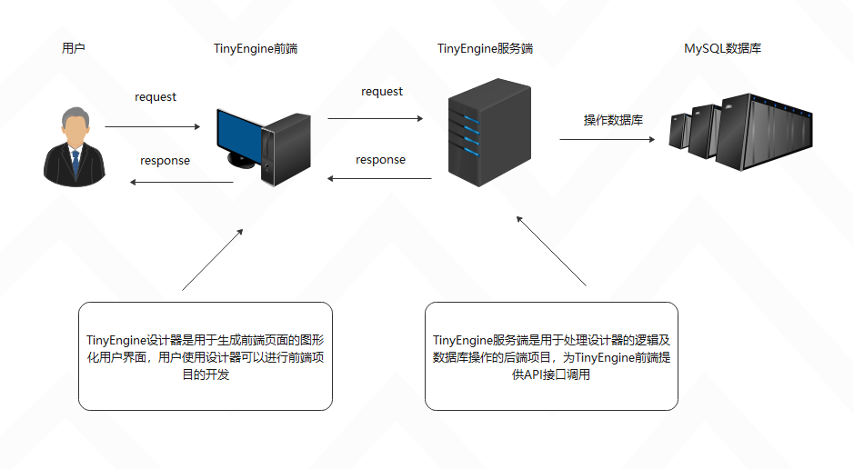
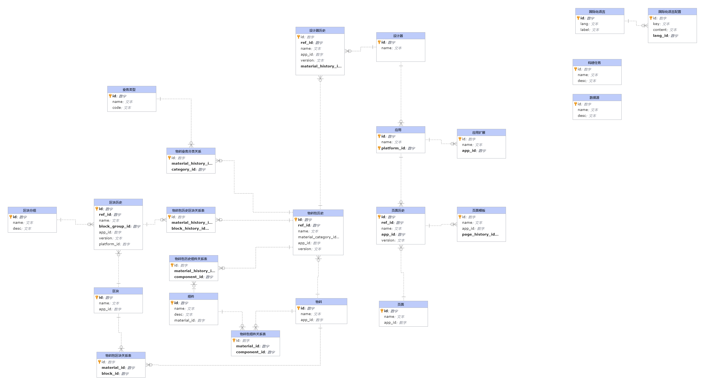
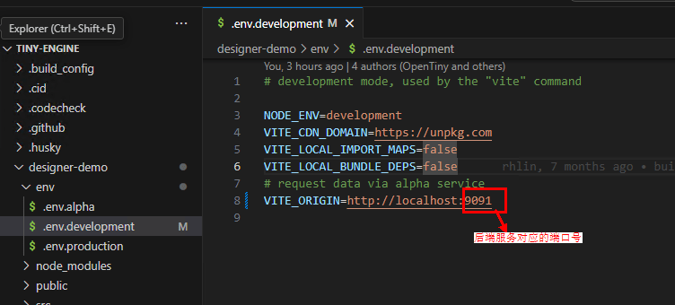
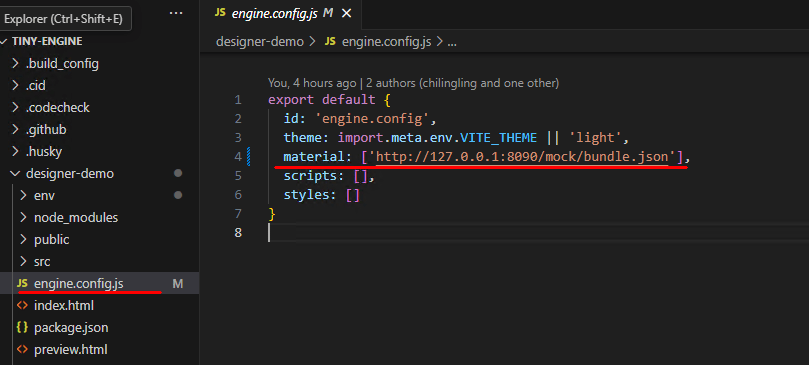

本文由体验技术团队路延刚原创。

## TinyEngine 低代码引擎简介

低代码引擎是一种通用的开发框架，通过对低代码平台系统常用的功能进行解构，将其划分为多个功能模块，并为每个模块定义了相应的协议和开发范式，使得开发者可以根据自身的业务需求，轻松定制开发出自己的低代码开发平台。

TinyEngine 低代码引擎作为低代码平台的底座，提供可视化搭建页面等基础能力，既可以通过线上搭配组合使用，也可以通过 cli 创建个人工程进行二次开发，实时定制出自己的低代码平台。适用于多场景的低代码平台开发，如：资源编排、服务端渲染、模型驱动、移动端、大屏端、页面编排等。

TinyEngine 官网：<https://opentiny.design/tiny-engine>\
TinyEngine 源码：<https://github.com/opentiny/tiny-engine> （欢迎 star）

## Java 版本开源介绍

自 TinyEngine 开源以来，我们发现越来越多企业和个人开发者开始基于 TinyEngine 搭建自己的低代码平台，也有大量用户对服务端 Java 版本有着强烈的期待。针对这一需求，TinyEngine 团队果断将服务端 Java 版本开发列入重要计划。经过团队成员的不懈努力，服务端 Java 版本终于问世，希望能为开源生态贡献新的力量。

本次 TinyEngine 低代码引擎服务端 Java 版本代码的开源，让开发者能够深入了解 TinyEngine 低代码引擎的前后端运行机制，更能够让更多的小伙伴以更深的层次参与到产品共建，共同探讨并改进系统，推动其不断优化，带来更高的创新潜力，使得更多的人能够从中受益。

同时服务端的开源为自由定制和扩展提供了可能，开发者可以参考 TinyEngine 的代码，根据自身需求对服务端进行改造创新，从而使得产品更具灵活性，能够满足各种复杂的业务需求，构建一个强大而健壮的低代码生态系统。

TinyEngine 服务端 Java 源码：<https://github.com/opentiny/tiny-engine-backend-java（欢迎star）>

### 1、项目概述

tiny-engine-backend-java 是一个基于 springboot、mybatisPlus、mysql 的服务端系统，主要用于管理 TinyEngine 的业务逻辑、数据存储、操作。该项目简化开发，提高效率，具有高扩展和高可维护性。

### 2、技术栈

- **Spring Boot :**   为项目提供快速开发和自动配置功能，简化了传统 JavaEE 项目开发流程，它提供了内嵌式的 Web 服务器（Tomcat）以及自动化配置功能，减少了大量的配置工作。
- **MyBatis Plus:**   在 MyBatis 基础上封装的增强工具，简化了数据库的操作，如自动生成 CRUD 操作代码、动态 sql、分页查询等，减少了手写 sql 负担，增加了开发效率。
- **MySQL:**   项目的关系型数据库管理系统，负责持久化数据，支持复杂的查询和事务管理。

### 3、Java 版本特性介绍

- **自动化配置：**  Spring Boot 自动化配置减少了繁琐的 xml 配置，使得开发者可以专注于业务逻辑的开发。
- **高可拓展性：** 项目采用了松耦合的设计，便于后续功能扩展，例如可以添加更多功能模块、支持多数据源等。
- **低耦合：** 为了降低服务耦合度，在 Node.js 版本的基础上对数据库表进行了重构，并对相关逻辑进行优化，降低了开发难度和学习曲线，更能够从服务端的角度去理解 TinyEngine 设计器的运行原理与设计思想 。
- **服务减负：** 去除了区块构建，改用区块新方案，不再对 verdaccio 和 unpack 服务依赖，部署更轻松简便，使用更得心应手。

### 4、服务端架构

### 5、数据模型设计

Java 版本重新设计了数据模型，对原有 js 版本的表字段做调整，去除由于 Strapi 的使用建立的冗余关联表，让表与表之间的关系更清晰。

- **数据模型 ER 表**

## Java 版本与 Node.js 差异

| Java 版本                                                                                                     | Java 版本                                                                        | Node.js 版本                                                                                                         | Node.js 版本                                                                                                         |
| ------------------------------------------------------------------------------------------------------------- | -------------------------------------------------------------------------------- | -------------------------------------------------------------------------------------------------------------------- | -------------------------------------------------------------------------------------------------------------------- |
| 优点                                                                                                          | 缺点                                                                             | 优点                                                                                                                 | 缺点                                                                                                                 |
| **性能**：Java 编译后的字节码在 JVM（Java 虚拟机）上运行，性能通常优于 Node.js。                              | **启动时间**：由于 Java 需要 JVM 启动，启动时间通常比 Node.js 慢。               | **快速开发**：Node.js 基于 JavaScript，开发者可以利用浏览器的丰富生态系统和工具（如 npm ），实现快速开发和原型制作。 | **性能**：Node.js 运行在 V8 引擎上，性能通常不如 Java。在处理计算密集型任务时，可能会表现不佳。                      |
| **安全性**：Java 有内置的安全机制，如字节码验证，能够更好地保护应用程序免受恶意攻击。                         | **复杂的生态系统**：虽然 Java 生态系统丰富，但也意味着选择和集成可能会比较复杂。 | **事件驱动**：Node.js 基于事件驱动架构，非常适合 I/O 密集型应用，如实时聊天、数据流处理等。                          | **安全性**：由于 Node.js 的生态系统相对较新，某些库和工具可能存在安全漏洞。                                          |
| **可扩展性**：Java 支持面向对象编程（OOP），具有良好的模块化和可扩展性，适合大型企业级应用。                  | **资源消耗**：Java 应用程序通常对系统资源（如内存和 CPU）要求较高。              | **非阻塞 I/O**：Node.js 使用非阻塞 I/O 模型，使其在处理大量并发连接时表现出色                                        | **可扩展性**：虽然 Node.js 适合 I/O 密集型应用，但在处理复杂业务逻辑和大型企业应用时，可能需要额外的架构设计和优化。 |
| **丰富的生态系统**：Java 有一个庞大的生态系统，包括丰富的框架（如 Spring、Hibernate）和库，能够简化开发过程。 | 不支持原有的区块方案                                                             | **社区支持**：Node.js 拥有一个活跃的开发者社区和丰富的包管理器 npm，能够快速找到所需的库和工具。                     | 暂不支持区块新方案，fork 用户需要自己修改代码支持 TinyEngine 的区块新方案。                                          |
| **跨平台**：Java 的“写一次，运行到处”的理念使其能够在不同的平台上运行。                                       |                                                                                  | **成本低**：由于 Node.js 是基于 JavaScript 的，开发者无需额外学习成本，且可以利用现有的前端开发技能。                | 后期（官方）主要工作重心将转移至 Java 版本                                                                           |

## 附：Node.js 版本介绍

2024 年年初 OpenTiny 开源了 TinyEngine 的 Node.js 版本服务端，其中包含 tiny-engine-webservice 和 tiny-engine-data-center 两个微服务，每个服务单元都可以独立开发、测试和部署。这种架构不仅提高了团队的协作效率，还使得系统更容易扩展和维护。

Node.js 版本开源介绍详情可见：[https://mp.weixin.qq.com/s/7G1eviib45mMOC1_h762sA?token=645893077\&lang=zh_CN](https://mp.weixin.qq.com/s?__biz=MzU5ODA3OTY5Ng==&mid=2247492502&idx=1&sn=d7e4affc9d155ba8f1d253c2e36cbc71&token=645893077&lang=zh_CN&scene=21#wechat_redirect)

## FAQ

**1、Java 服务端开源之后，如果不想启动服务端服务器，是否还能沿用原来 mockServer？**\
答：可以正常使用 mockServer，启动方式和原先一致，直接在项目里执行  `pnpm dev`  即可

**2、如果本地启动了 Java 后端，那么前端本地工程是否还需要更改配置？如果需要，如何更改配置？**\
答：需要更改配置，更改流程如下： 启动  `tinyengine`

修改 env 目录下的 env.development 文件中的 VITE_ORIGIN 变量为本地 tiny-engine-backend-java 项目的地址端口

修改 engine.config.js 文件中的 material 值如图

运行如下脚本启动

    pnpm install  # 第一次启动项目需要
    pnpm serve:frontend

启动成功后浏览器会自动打开设计器页面

部署流程指导可参考官网使用手册：平台开发指南>解决方案>Java 服务端部署到服务器 章节（官网使用手册：<https://opentiny.design/tiny-engine#/help-center/course/dev>）

## 未来规划

1、人工智能：计划将低代码平台与 AIGC（人工智能生成内容）技术相结合，为用户提供更加智能、高效的应用开发体验。后续我们考虑将低代码平台的开发流程与 AIGC 技术相结合，通过自然语言处理、机器学习和深度学习等技术，实现应用界面的自动生成、功能模块的智能推荐和代码的自动化生成等功能。

2、模型驱动：我们将致力于将低代码平台与模型驱动能力相结合，为用户提供更加高效、智能的开发体验。深入研究各种业务模型，包括数据模型、业务流程模型等，以了解其特性和需求。后续，我们将低代码平台的开发流程与模型驱动能力相结合，通过可视化建模工具和自动化技术，实现业务模型的快速构建和部署。通过这一创新性的接入方式，用户将能够更加高效地构建和调整业务模型，降低开发难度和成本。

## 关于 OpenTiny

欢迎加入 OpenTiny 开源社区。添加微信小助手：opentiny-official 一起参与交流前端技术～\
OpenTiny 官网：**<https://opentiny.design>**\
OpenTiny 代码仓库：**<https://github.com/opentiny>**\
TinyVue 源码：**<https://github.com/opentiny/tiny-vue>**\
TinyEngine 源码： **<https://github.com/opentiny/tiny-engine>**\
欢迎进入代码仓库 Star🌟TinyEngine、TinyVue、TinyNG、TinyCLI\~\~ 如果你也想要共建，可以进入代码仓库，找到 good first issue 标签，一起参与开源贡献\~\~
