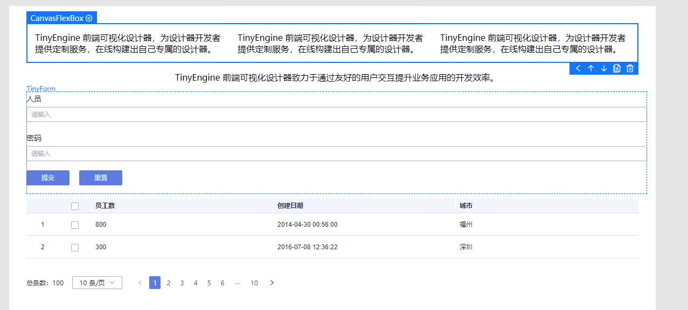
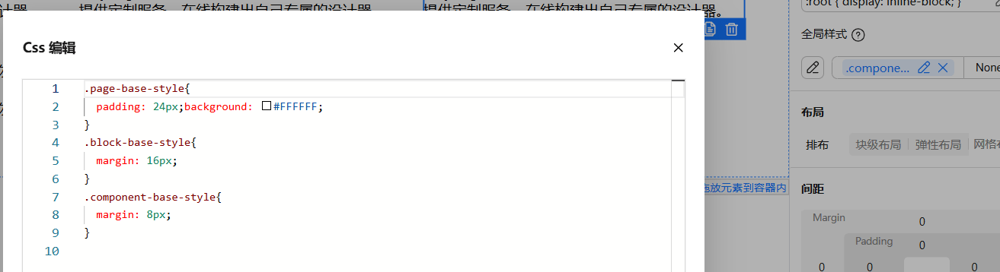
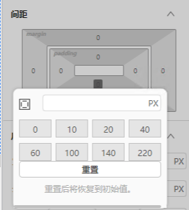
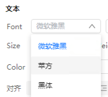
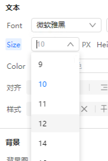
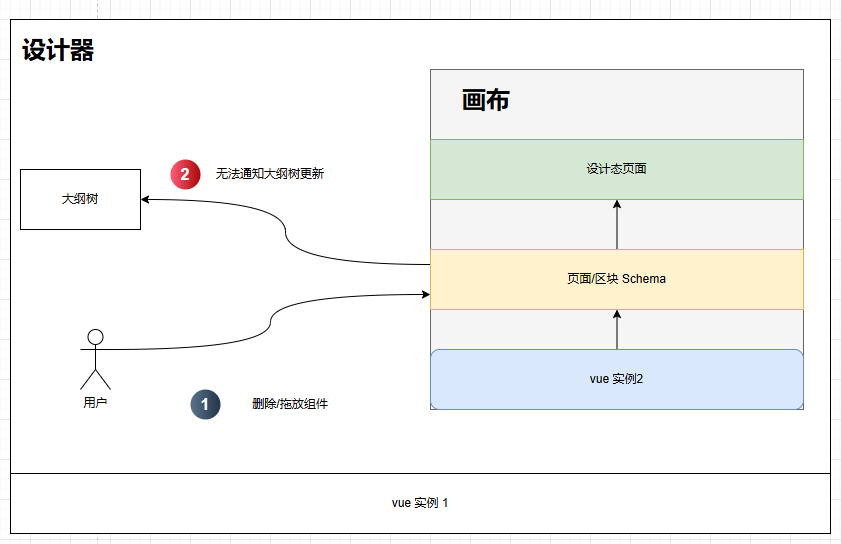
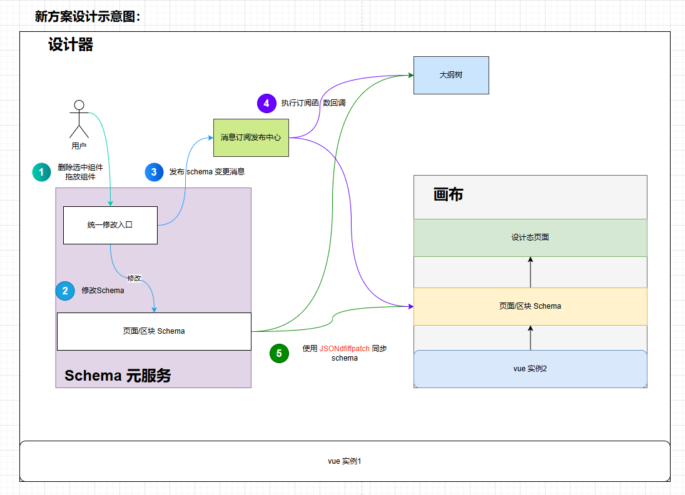
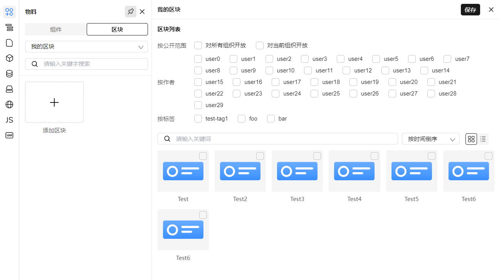
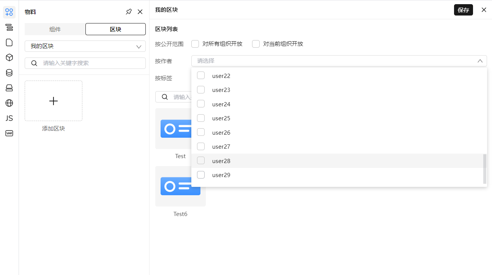

## 前言

2025 年蛇年已经到来，TinyEngine v2.1.0 版本也已经蛇气腾腾的发布了出来，新年新气象，为了让大家更详细了解到 v2.1.0 的内容更新，我们特此列举了该版本中的一些重要特性更新。

## v2.1.0 变更特性概览

1、使用了新的纯前端区块构建方案，区块构建速度从分钟级别提升到秒级别。

2、新增了页面的 UI 默认规范，随手拖拉拽就拥有美观大方的页面。

3、画布通信使用全新方案，解决插件及时监听 schema 变动痛点，为引擎可扩展性增加无限可能。

4、优化了那么大的一堆 UI、交互与功能细节。

详情可见：<https://github.com/opentiny/tiny-engine/releases/tag/v2.1.0>

## TinyEngine v2.1.0 新特性解读

### 一、全新区块构建方案

原来的区块构建发布方案中，区块发布构建需要经过：

1. 后端得到区块 schema，调用 DSL 进行出码。
2. 将出码写入到区块模板工程中。
3. 执行 npm install 安装依赖。
4. 执行 npm run build:block 构建区块，得到 dist 中的目标产物。
5. 将得到的产物上传到自部署的 unpkg cdn 托管平台。


<p align=center>原区块构建方案示意图</p>

原区块构建发布方案有以下痛点：

- 需要搭建自部署的 unpkg cdn 托管平台，对很多前端同学来说，有一定的门槛。
- 每次的构建发布过程中，都需要经过出码 -> 依赖安装 -> 构建 -> 上传产物的复杂流程（即使是仅改动了一个字符！），耗费了一定的时间，不利于敏捷开发。

@ajaxzheng  同学从 @vue/compiler-sfc 中得到启发，发现我们其实可以在前端直接编译区块，省去在后端大量的安装依赖和构建的时间。

新方案简要流程为：

1. 得到区块 schema，调用 DSL 进行出码。
2. 根据出码，调用 @opentiny/tiny-engine-block-compiler 构建区块，得到区块的模块代码（blob url 形式）。
3. 画布使用异步组件加载得到的模块代码。


<p align=center>新区块构建方案示意图</p>

更多细节请查看 PR: <https://github.com/opentiny/tiny-engine/pull/906>

于是，经过新方案的改造之后，我们区块的**构建速度从分钟级提升到了秒级，大幅提高开发效率**。欢迎大家来体验！

**PS:   后端升级改动点：**

如果是 fork Node.js 后端的用户需要使用 TinyEgine v2.1.0 新特性 ，更多细节请查看 PR:<https://github.com/opentiny/tiny-engine-webservice/pull/25>

### 二、新增页面 UI 默认规范

原本界面编辑视图，选择组件/区块到画布之后无默认间距，需要用户自行调整。

现在对界面的元素布局进行了优化，用户通过拖拉拽生成界面时可以无需过多关注界面规范。

只通过拖拉拽生成的界面效果图：


改动点如下：

**a.对页面、组件、区块新增了可配置的默认基础样式**

- 设计器界面的显示如下



- 代码配置如下

  在 registry.js 的 plugins 中可按需配置

  Materials 的配置项：

  设置  `useBaseStyle`  为  `true`，给页面、区块、组件添加上基础样式（默认为`true`）

  `blockBaseStyle`  是区块的基础样式配置，className 区块的基础类名，style 是基础样式

  同上，`componentBaseStyle`  是组件的基础样式配置

  Page 的配置项：

  `pageBaseStyle`  是页面的基础样式配置

  以下代码为默认配置：

  ```js
  plugins: [
    {
      ...Materials,
      options: {
        ...Materials.options,
        useBaseStyle: true,
        blockBaseStyle: {
          className: 'block-base-style',
          style: 'margin: 16px;'
        },
        componentBaseStyle: {
          className: 'component-base-style',
          style: 'margin: 8px;'
        }
      }
    },
    {
      ...Page,
      options: {
        ...Page.options,
        pageBaseStyle: {
          className: 'page-base-style',
          style: 'padding: 24px;background: #FFFFFF;'
        }
      }
    }
  ]
  ```

**b.调整样式面板的间距、字体、字号选择**

样式面板的**间距选择**调整为规范基础间距，如 4、8、12、16、20、24、32、36、40 等。



文本字体列表添加中文优先系统字体：微软雅黑（Microsoft YaHei）、苹方（PingFang）


字号改为下拉选择，添加规范推荐字号，如 9、10、11、12、14、16、18、20、24 等



**c.新增了弹性容器和全宽居中组件**

- 弹性容器：自带 Flex 布局的容器，属性面板可设置排列方向、间距、内边距、对齐方式
- 全宽居中组件：默认宽度 100% 并居中的容器

**d.功能支持：清空画布和元素调整样式时，保留且不影响基础样式**

### 三、全新画布通信新方案

原来的画布通信方案中，我们直接拿到在画布中的 schema 引用，并直接修改，比如修改组件的属性或者插入删除组件等。

原方案的好处是：修改 schema 可以直接快速触发画布渲染，快速且高性能。

但是原方案有一个明显的硬伤是：插件无法监听 schema 的变动，比如，我们固定了大纲树面板的时候，在画布中拖拽改变组件的顺序，大纲树由于无法监听 schema 的变动，导致无法响应式地自动更新大纲树。



于是，为了满足原来画布快速高性能渲染要求，同时可以让插件监听 schema 的变动，执行插件自身的逻辑，满足后续更多可扩展插件的需求，我们推出了一种新的画布通信方案：


更多细节，请查看 PR:  <https://github.com/opentiny/tiny-engine/pull/885>

新方案核心要点：

- 使用事件发布订阅来通知 schema 变更。
- 使用 JSONdiffpatch 同步 iframe 中画布 schema 与 iframe 外 schema 的差异。

相关文档：

**<https://github.com/opentiny/tiny-engine/blob/refactor/develop/packages/canvas/DesignCanvas/README.md>**

（注意：当前 API 仍未稳定，未来几个版本可能会有变动，如果需要使用，未来几个版本升级时需要注意相关 API 变更）

### 四、物料插件中，区块相关 UI 升级

1. 在分组中点击添加区块，弹出的区块列表页面中，原来的作者、标签筛选器，由**多选框**更改成了**多选下拉选择器**。原来的多选框在选项非常多时，会占据大量页面空间，使用多选下拉选择器优化 UI 布局

- 更改前（多选框）



<!---->

- 更改后（多选下拉选择器）



2. 在分组中点击添加区块，弹出的区块列表页面中，目前支持全选区块，一键保存添加

### 五. 提供将区块插件中的区块分类与物料插件中区块分组合并的选项

区块插件增加了  `options.mergeCategoriesAndGroups`  配置项，来决定是否合并分类和分组接口。

- 设置  `mergeCategoriesAndGroups`  为  `false`（默认值），保持原来的逻辑不变，即分类和分组接口都会调用
- 设置  `mergeCategoriesAndGroups`  为  `true`，将分类接口替换成分组接口。并且将区块管理页面的  `分类`  文本全部替换成了  `分组`  文本

分类接口：/material-center/api/block-categories

分组接口：/material-center/api/block-groups

具体接口参数请查看 packages/plugins/block/src/js/http.js

使用实例如下，在注册表中添加区块插件选项

```js
export default {
  // ...
  plugins: [
    Materials,
    Tree,
    Page, // Block 插件添加 mergeCategoriesAndGroups 选项
    [Block, { options: { ...Block.options, mergeCategoriesAndGroups: true } }],
    Datasource,
    Bridge,
    I18n,
    Script,
    State,
    Schema,
    Help,
    Robot
  ]
  // ...
}
```

**注意：此功能是提供给 Java 版本的后端使用**

### 六. 其他：交互、功能细节优化 & bug 修复\*\*

- 修复 面包屑 Breadcrumb 组件、Popeditor 组件物料配置不对的 bug @lichunn  #929

- 修复作用域插槽参数出码不对的 bug @chilingling  #930

- 优化了 i18n 绑定的样式  @gene9831 in #925

- 修复了 i18n 插件在排序后，无法添加词条的 bug @chilingling  #976

- 修复物料插件区块分组添加区块后，页面卡死的 bug @chilingling  #975

- 修复变量 getter 与全局变量 getter 的相关 bug @chilingling#930

- 修复保存按钮红色点样式错位的 bug @SonyLeo  #982

- 优化了若干样式与交互细节  @xuanlid  #916

## 如何使用新版本

1、如果是从 2.0.0 版本升级上来，只需要在 cli 创建出来的工程，将 @opentiny/tiny-engine 相关的依赖，升级到 2.1.0 即可

2、如果是全新创建项目，仅需要使用 tinyengine-cli 创建项目即可。npx @opentiny/tiny-engine-cli create-platform my-designer

## 结语

**TinyEngine v2.1.0**  不仅优化了区块构建流程、构建速度、UI 规范和画布通信，还对功能细节进行了全面改进，使得开发体验更加高效和流畅。我们诚挚地邀请大家体验这一版本的强大功能，欢迎大家在 GitHub 提交反馈和建议！

同时，TinyEngine 开源的过程中，离不开社区开源贡献者的代码贡献、bug 反馈等等大量的帮助，我们会一如既往的努力研发与改进，早日将 TinyEngine 打造成一流的低代码引擎，让开源社区多一份更好的选择！

**彩蛋**：TinyEngine v2.1.0 也兼容即将开源的 TinyEngine 后端 Java 版本，用户可以根据需要调整后端区块发布流程以支持新特性。

## 关于 OpenTiny

欢迎加入 OpenTiny 开源社区。添加微信小助手：opentiny-official 一起参与交流前端技术～\
OpenTiny 官网：**<https://opentiny.design/>**\
OpenTiny 代码仓库：**<https://github.com/opentiny/>**\
TinyVue 源码：**<https://github.com/opentiny/tiny-vue>**\
TinyEngine 源码： **<https://github.com/opentiny/tiny-engine>**\
欢迎进入代码仓库 Star🌟TinyEngine、TinyVue、TinyNG、TinyCLI\~ 如果你也想要共建，可以进入代码仓库，找到 good first issue 标签，一起参与开源贡献\~
