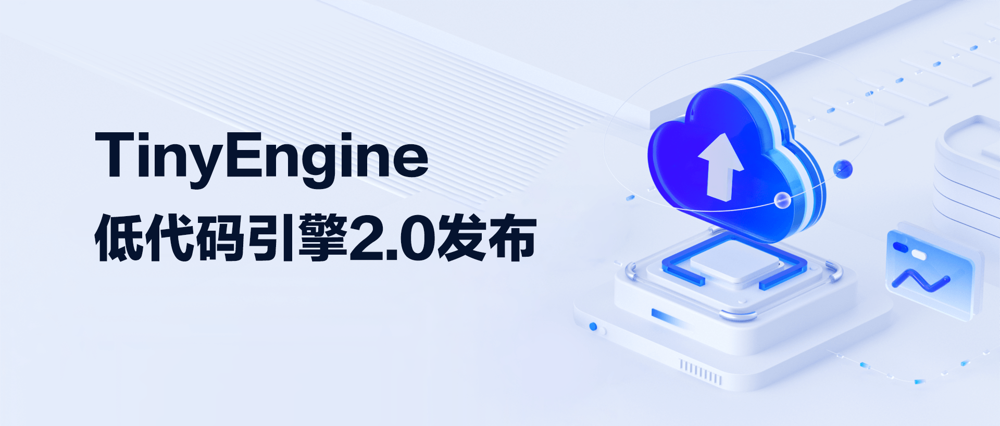
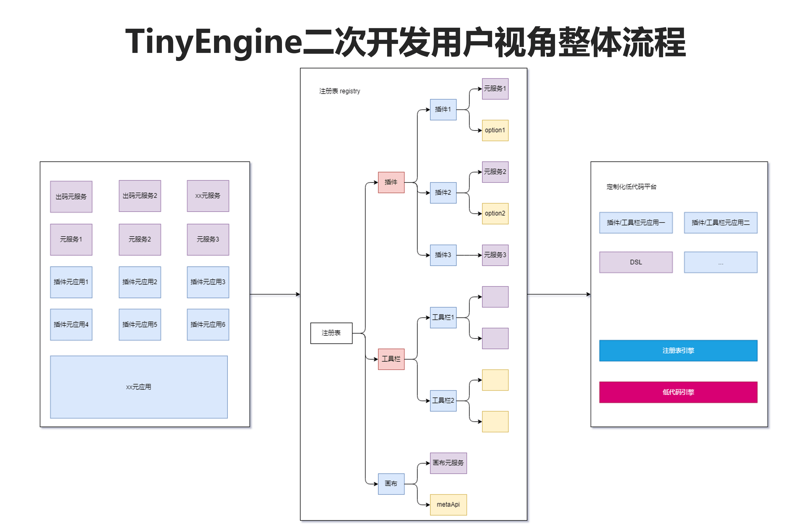
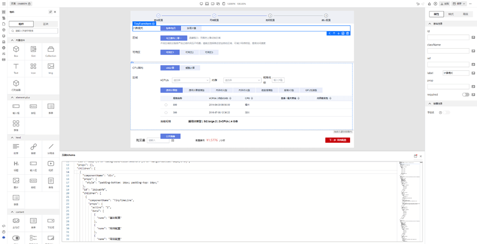
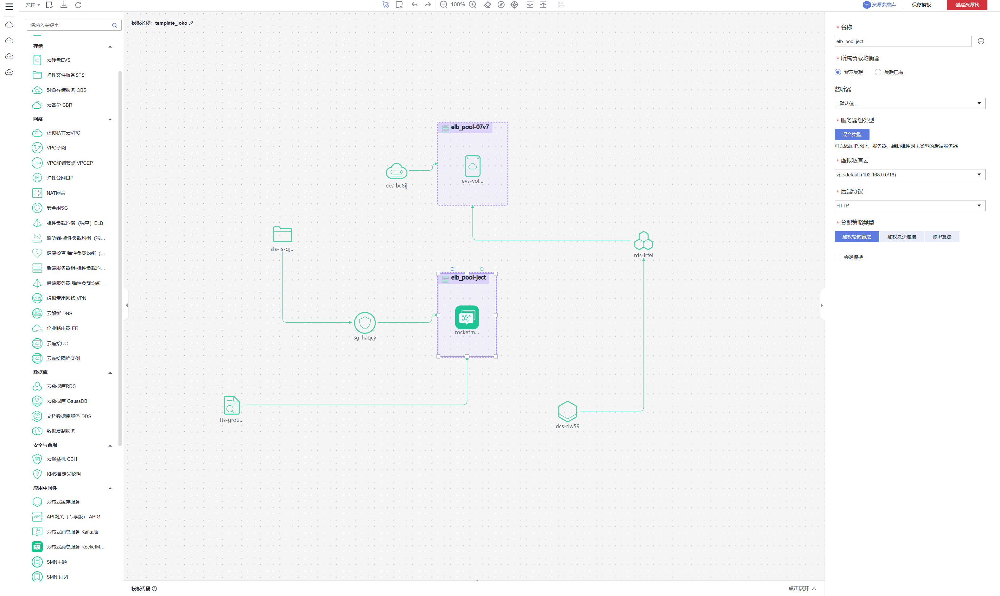
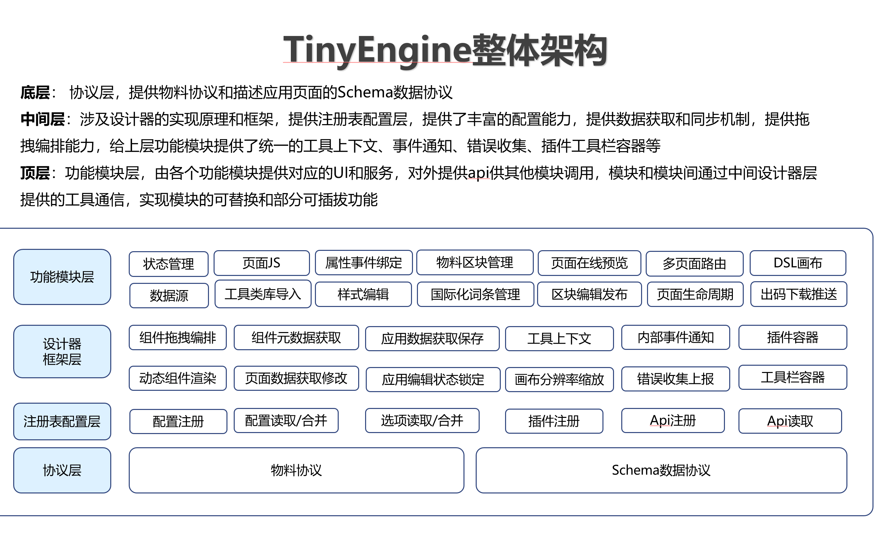

自从 TinyEngine 开源以来，众多开发者已经将 TinyEngine 应用于生产环境，见证了其在实际项目中的表现。然而，随着项目的持续迭代和用户群体的不断扩大，我们发现用户在深度定制方面会遇到一些阻碍，其中最核心的问题集中在：源码二次开发管理问题以及定制化能力不够强大，想要深度定制必须修改源码，而当开发者们在 TinyEngine 的源码中融入了大量的定制业务逻辑，这又使得直接合并 TinyEngine 自身的新功能变得异常困难，常常引发代码冲突和错误。

为了解决用户的这些痛点问题，TinyEngine 团队投入了大量的时间，对 TinyEngine 的架构进行了优化和调整。这次的调整不仅提升了其核心性能，还精心打磨了一系列创新功能，旨在为开发者提供更流畅、更高效的开发体验。

## TinyEngine2.0 新特性介绍

### 优化的开发体验：包引入与 CLI 工具

TinyEngine 2.0 版本的一大亮点是将源码开发变成了**包引入**的模式，并且与之相结合的提供了**CLI 工具**，彻底改变了用户二次开发的方式。**告别传统克隆源码模式，一键生成低代码平台项目。** 这里提供了  `@opentiny/tiny-engine-cli`  这个强大的 CLI 工具，只需执行一条简单的命令即可快速生成一个以 TinyEngine 为基础的低代码平台项目：

    npx @opentiny/tiny-engine-cli create

生成的项目中 tiny-engine 作为一个核心 npm 包，package.json 文件依赖包含：

- 核心依赖：`@opentiny/tiny-engine`、主题等。
- 开发依赖：`@opentiny/tiny-engine-vite-config`、`@opentiny/tiny-engine-mock`  等，为开发提供便利。

这样的开发模式，主要有以下几个特点：

- 非侵入式开发  ，可以将二次开发内容与 TinyEngine 核心代码进行分离，避免对核心代码造成污染；
- 增强版本兼容性，摆脱源码修改管理迭代更新难问题，可以轻松同步 TinyEngine 的官方代码；
- 提高开发效率，CLI 工具可以提供丰富的命令和脚手架，帮助开发者快速搭建低代码平台；
- 聚焦业务编码，提供了一种标准化的开发流程，使得开发者能够迅速进入编码状态。

### 开创性的“洛书架构”

在深入探讨该架构之前，大家可以先理解一个熟悉的计算机概念——Windows 注册表。Windows 注册表是一个中心化的数据库，它存储着系统、软件程序以及硬件设备的配置和设置信息，为操作系统提供了一个统一的机制来存储和检索关键数据，确保了系统的稳定性和程序的正确运行。这样的设计给 TinyEngine 也提供了灵感，TinyEngine 也可以借助这样的概念，给开发者提供出一个这样的架构：

丰富的配置能力：架构应覆盖全面，能够对整个系统的组件、配置项、API 等内容进行细致的定制化配置，以满足不同场景的需求。

灵活的替换机制：通过注册表机制，可以轻松地对组件、API 等内容进行替换，实现灵活的插拔和定制。

函数级别的覆盖能力：当配置和替换能力无法满足特定需求时，提供函数级别的覆盖能力，作为最后的解决方案，确保用户可以实现个性化的功能。基于这样的原则，我们推出了我们 TinyEngine 的洛书架构。它拥有全局的内容存储，记录了所有可配置化的信息。这个架构允许进行插件的可插拔操作，实现插件的配置化管理，以及对插件 API 的集中管理。这样的设计不仅提高了系统的灵活性，也为开发者提供了极大的便利。

“洛书架构”为二次开发项目还提供了一种无缝对接最新特性的方式。在软件开发的实际操作中，将基座系统的新特性同步到定制系统中往往是一项复杂的任务。当一个系统已经积累了大量的定制业务代码时，尝试直接集成新功能不仅会面临巨大的技术挑战，还可能对现有业务逻辑的稳定性以及系统的可维护性造成不利影响。在 TinyEngine 2.0 版本中，这一问题得到了有效的解决。

TinyEngine 2.0 引入了一系列创新的架构设计和功能增强，使得新特性的集成变得更加顺畅和高效。

    interface MetaApp {
     id: string
     // 入口组件
     entry?: VueComponent
     // 可供定制的局部模块组件，例如定制 header、footer
     components?: Record<string, VueComponent>
     // 对外提供的api接口
     apis?: Record<string, Function>
     // component的配置项
     options?: Record<string, any>
     // 布局
     layout?: MetaApp
     // 生命周期 
      lifeCycle?: Record<string, Function>
     // 覆盖逻辑
     overwrite?: Overwrite
       …… // 其余可配置的项
    }

这种架构允许项目动态地注册和使用 TinyEngine 的新功能，无需复杂的升级过程。这意味着开发者可以立即使用 TinyEngine 的最新成果，这种**同步机制**不仅提高了开发效率，还确保了项目能够快速响应 TinyEngine 的更新，保持技术的先进性。

### 布局灵活：自由定义

“洛书架构”是 TinyEngine 的一大创新，它提供了一种灵活的架构系统，允许开发者根据业务需求自由定义整个设计器的布局。在调研使用 TinyEngine 的开发者的过程中，发现 TinyEngine 被用于各种项目中，这也导致了布局非常多样化。例如：有在底部加上 schema 面板、有在画布旁边加上流程相关面板、创建页面时弹窗展示页面模板等丰富的布局。

为了兼容多种布局，“洛书架构”的推出可以满足开发者可以轻松地创建复杂的页面布局，而无需担心底层实现的复杂性。

这种灵活性使得 TinyEngine 成为一个强大的工具，能够满足从简单到复杂的各种开发需求。

### 画布可以修改：技术栈画布的灵活切换

除了设计器布局类型比较丰富以外，画布的类型也是非常多的。例如，在需要快速布局的页面编排场景中，可以选择文档流式画布；而在需要精确控制的流程平台中，则可以使用图元编排的画布。

TinyEngine 的“洛书架构”支持根据应用场景灵活切换技术栈画布，这意味着开发者可以根据项目的具体需求选择最合适的技术方案。

这种灵活性使得 TinyEngine 能够适应不同的开发需求，提供高效的定制化开发支持。

### 快速使用第三方组件库

TinyEngine 默认导入的组件库是华为云开源的 TinyVue 组件库。在开源之后，收到了部分小伙伴的反馈：“公司目前是使用 elementUI 组件库的。能不能支持我们导入第三方组件库。”这个答案是肯定的。得益于 TinyEngine 的渲染机制，TinyEngine 支持导入其他的组件库，如 elementUI 和 Ant Design Vue（antdUI），极大地简化了集成流程。除此以为，TinyEngine 还提供组件复用方案，提供了区块的能力。开发者能够将业务系统中可复用的组件提取出来，打包并上传到平台的资产管理库中，集中管理版本，使其更灵活、更易用。相关的区块局域网部署方案也已经放到官网文档里面了，大家可以查阅。

(官网文档：<https://opentiny.design/tiny-engine> ）

### 出码可以定制成任意语言

TinyEngine 的核心优势在于其对多种技术栈的深度支持。无论是前端开发中的主流框架 Vue 和 React，还是为鸿蒙系统量身打造的 ArkTS 语言，TinyEngine 都能够灵活定制并输出相应技术栈的代码。这种多技术栈的支持，使得 TinyEngine 能够适应各种开发需求。我们的开发者现在可以根据项目的具体需求，选择最合适的技术栈，增强了项目的适应性和扩展性。

TinyEngine 低代码引擎的灵活代码输出能力，为开发者提供了一个强大的开发环境，可以根据系统自身的需要定制出需要的出码语言。

### 嵌入任意的系统中使用

TinyEngine 能够高效集成至各垂直领域业务系统，实现与第三方系统的无缝对接和参数流转。这种集成能力，使得 TinyEngine 在多种业务场景中都能使用，无论是 AI、流程管理还是教育领域，都能提供量身定制的解决方案。这种集成使得 TinyEngine 成为一个强大的工具，能够满足各种业务需求。

## 未来展望

TinyEngine 2.0 的发布，也让 TinyEngine 自我迭代更新之路迈出了重要一步，希望全新的灵活定制扩展能力能够助力开发者更好的构建自己的低代码平台。未来，TinyEngine 也计划引入更多功能，增强低代码编排能力，让开发过程体验更友好。

### 模型驱动，高效开发页面

目前 TinyEngine 在规划中不仅支持模型驱动开发，还允许开发者轻松实现模型事件的绑定，快速构建多样化的业务页面。通过模型驱动架构，TinyEngine 提升了代码的一致性和可读性，使得开发过程更加高效，同时也降低了后期维护的难度。这种架构的优势在于，它将业务逻辑从代码中抽象出来，使得开发者可以更加专注于业务本身，而不是深陷代码的细节。开发者可以利用 TinyEngine 的模型驱动开发功能，快速构建业务页面，大大减少了代码编写的工作量，加速了整个开发流程。

### AI 辅助开发

TinyEngine 深度融合 AI 辅助开发，通过 AI 的深度集成，用户可以迅速响应业务需求，从设计到代码实现一键转换，优化开发流程，缩短项目周期。目前，AI 辅助开发依赖于大模型的生成能力。大模型的生成能力其实时好时坏。有时候生成的代码渲染在画布上面是非常高效的， 几句话就能生成一个交互页面，但是有时候生成的代码又是不可用的，导致画面渲染不出来。这功能我们内部也在持续孵化完善中。

对于 TinyEngine 低代码引擎有更多想要了解的，欢迎观看**TinyEngine 低代码引擎系列直播课(第 1 讲——第 6 讲）** ：<https://space.bilibili.com/15284299>

## 关于 OpenTiny

OpenTiny 官网：<https://opentiny.design>\
TinyVue 源码：<https://github.com/opentiny/tiny-vue（欢迎> Star ⭐）\
TinyEngine 源码：<https://github.com/opentiny/tiny-engine（欢迎> Star ⭐）\
B 站：<https://space.bilibili.com/15284299>\
欢迎加入 OpenTiny 开源社区。添加微信小助手 opentiny-official 一起参与交流前端技术～
