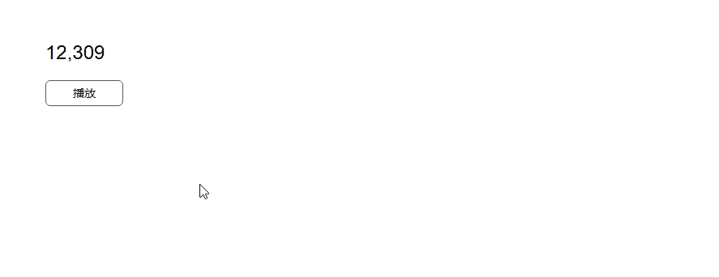
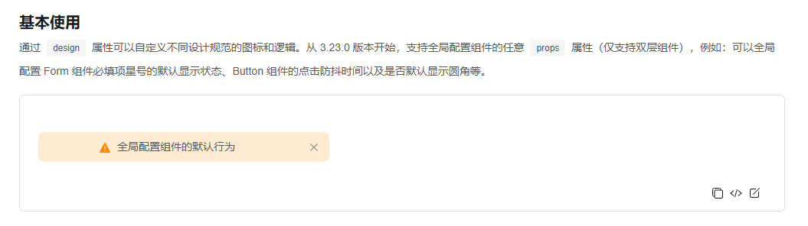
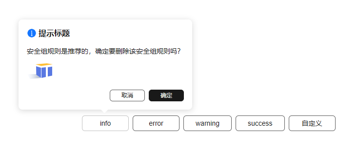

我们非常高兴地宣布，2025 年 5 月 15 日，TinyVue  发布了  v3.23.0 🎉。

本次 3.23.0 版本主要有以下重大变更：

- 增加 NumberAnimation 数字动画组件
- DesignConfig 支持全局配置组件的 props
- ConfigProvider 支持配置主题变量
- PopConfirm 增加 message 插槽

详细的 Release Notes 请参考：<https://github.com/opentiny/tiny-vue/releases/tag/v3.23.0>

本次版本共有 13 位贡献者参与开发，其中  sakurajiajia / 552847957  是新朋友，欢迎新朋友的加入 👏

1. sakurajiajia - 新增贡献者 ✨
2. 552847957 - 新增贡献者 ✨
3. shenjunjian
4. kagol
5. zzcr
6. gimmyhehe
7. lcy0620
8. discreted66
9. chenxi-20
10. betavs
11. wuyiping0628
12. James-9696
13. Darkingtail

感谢新老朋友们对 TinyVue 的辛苦付出 👏

你可以更新  `@opentiny/vue@3.23.0`  进行体验！

```bash
npm i @opentiny/vue@3.23.0
```

我们一起来看看都有哪些更新吧！

## NumberAnimation 数字动画组件

数字动画组件可以将数字的变化过程以动态效果展示出来。

可以让用户更加直观地感受到数据的提升，动态展示比静态数字更能吸引注意力，也更能体现数据的变化趋势。

效果如下：



使用起来也很简单，只需要配置 from 和 to 两个参数，从一个数字(from)动态增长为另一个数字(to)。

```html
<template>   <tiny-number-animation :from="fromVal" :to="toVal" /> </template>

<script setup>
  import { ref } from 'vue'
  import { TinyNumberAnimation } from '@opentinyvue/vue'

  const fromVal = ref(0)
  const toVal = ref(12309)
</script>
```

## DesignConfig 支持全局配置组件的 props

DesignConfig 主要用来配置设计规范，如果说主题定制功能可以让用户定制组件的样式效果，那么 DesignConfig 则可以更进一步，能让用户定制组件的交互行为，除此之外，也能定制部分 DOM 元素，比如图标。

本次 v3.23.0 又更进一步，支持全局配置 90% 以上组件的 props，之前我们只支持小部分组件的 props 配置，后来用户提出更多组件 props 配置的需求。

社区开发者  hashiqi12138  借鉴 React 高阶组件（HOC）的概念，提出了一种从 DesignConfig 透传组件 props 到组件内部的思路，并通过 PR #3084  进行了实现。

这是一种非常好的思路，既不会破坏现在组件，又能实现全部配置所有组件的 props。

hashiqi12138  的第一个版本没有使用插件，需要每个组件包一层容器组件，这样对组件的改造过大，zzcr  提出可能会对现有业务造成影响。

第二个版本做了优化，通过 unplugin-hoc-plugin 插件解决了以上问题，但是实现方案过于繁琐，而且没有考虑用户局部配置组件 props 的优先级问题。

zzcr  利用 TinyVue 大部分组件支持双层组件的特性，提出了一种更简洁的方案，并通过 PR #3419  进行了实现。

目前该特性已经在 v3.23.0 版本提供，非常感谢  hashiqi12138  和  zzcr  在此特性中的辛苦付出！

该特性使用起来很方便，比如我想配置所有 Alert 组件内容居中。

```html
<template>
    
  <div>
        <tiny-config-provider :design="design">
            <tiny-alert type="warning" description="全局配置组件的默认行为"></tiny-alert>     </tiny-config-provider
    >
      
  </div>
</template>

<script setup>
  import { TinyConfigProvider, TinyAlert } from '@opentinyvue/vue'

  const design = {
    name: 'my-design', // 设计规范名称
    version: '1.0.0', // 设计规范版本号
    components: {
      Alert: {
        props: {
          center: true
        }
      }
    }
  }
</script>
```

效果如下：



## ConfigProvider 支持配置主题变量

ConfigProvider 主要用来配置全局性的东西，比如主题样式、设计规范、组件逻辑、改变文字方向等。

比如我想把品牌色由黑色改成绿色，可以通过 ConfigProvider 的 theme，将  `tv-base-color-brand`  这个 CSS 变量设置成  `'green'`  即可。

```html
<template>
    <tiny-button @click="changeTheme">改变主题颜色</tiny-button>   <tiny-config-provider :theme="theme">
        <tiny-button type="primary">主题色按钮</tiny-button>   </tiny-config-provider
  >
</template>

<script setup lang="ts">
  import { ref } from'vue'
  import { TinyConfigProvider, TinyButton } from'@opentiny/vue'

  const theme = ref({})

  functionchangeTheme() {
    theme.value = {
      data: {
        'tv-base-color-brand': 'green'// 默认是 #191919
      }
    }
  }
</script>
```

## PopConfirm 增加 message 插槽

PopConfirm 组件主要删除等操作的确认，之前 message 内容只能传字符串，没法传自定义的内容，存在一定的局限性。

[betavs](https://github.com/betavs)  为 PopConfirm 增加了 message 插槽，让用户可以自由传入自己的内容，比如传入一张图片。

效果如下



详细的更新信息请查看  Release Notes：<https://github.com/opentiny/tiny-vue/releases/tag/v3.23.0>

## 关于 OpenTiny

欢迎加入 OpenTiny 开源社区。添加微信小助手：opentiny-official 一起参与交流前端技术～\
OpenTiny 官网：**<https://opentiny.design>**\
OpenTiny 代码仓库：**<https://github.com/opentiny>**\
TinyVue 源码：**<https://github.com/opentiny/tiny-vue>**\
TinyEngine 源码：**<https://github.com/opentiny/tiny-engine>**\
欢迎进入代码仓库 Star🌟TinyEngine、TinyVue、TinyNG、TinyCLI、TinyEditor\~ 如果你也想要共建，可以进入代码仓库，找到 good first issue 标签，一起参与开源贡献\~
