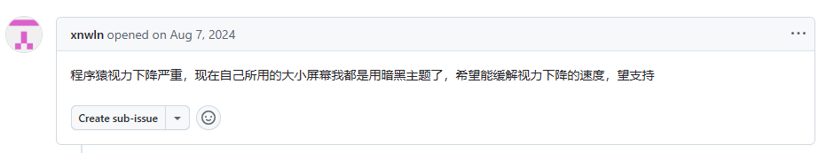
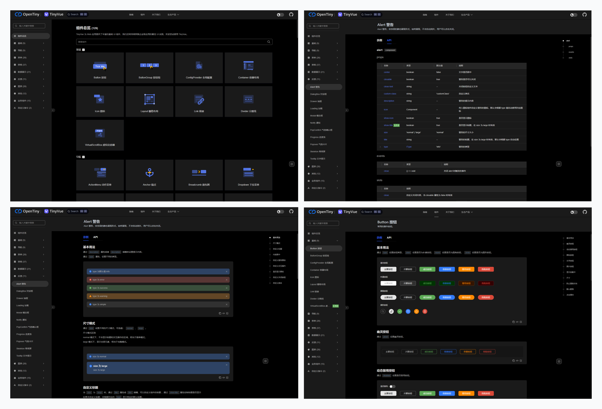
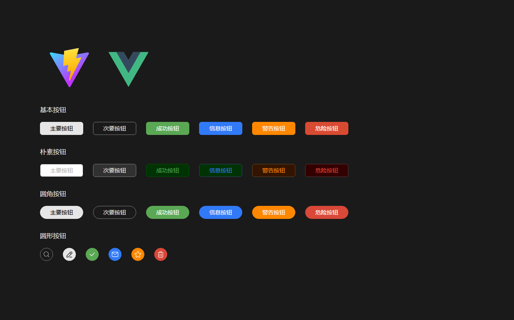
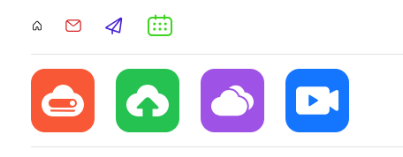
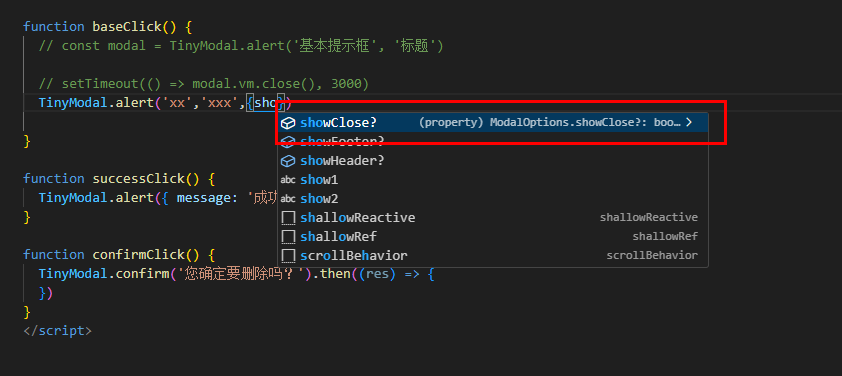

我们非常高兴地宣布，2025 年 4 月 7 日，TinyVue 发布了 v3.22.0🎉。

本次 3.22.0 版本主要有以下重大变更：

- 支持深色模式
- 增加基于 UnoCSS 的图标库
- 更丰富的 TypeScript 类型声明
- 支持 XSS 配置

详细的 Release Notes 请参考：<https://github.com/opentiny/tiny-vue/releases/tag/v3.22.0>

本次版本共有 18 位贡献者参与开发，其中 hashiqi12138/hu-qi/tsinghua-lauDarkingtail/lcy0620/discreted66 是新朋友，欢迎新朋友的加入 👏

1. hashiqi12138- 新增贡献者 ✨
2. hu-qi- 新增贡献者 ✨
3. tsinghua-lau- 新增贡献者 ✨
4. Darkingtail- 新增贡献者 ✨
5. lcy0620- 新增贡献者 ✨
6. discreted66- 新增贡献者 ✨
7. shenjunjian
8. kagol
9. zzcr
10. gimmyhehe
11. Davont
12. betavs
13. wuyiping0628
14. Youyou-smiles
15. James-9696
16. chenxi-20
17. MomoPoppy
18. gweesin

感谢新老朋友们对 TinyVue 的辛苦付出 👏

你可以更新`@opentiny/vue@3.22.0`进行体验！

    npm i @opentiny/vue@3.22.0

我们一起来看看都有哪些更新吧！

## 1 支持深色模式

TinyVue 开源以来，陆续有小伙伴提出要支持深色模式。



本次 v3.22.0 版本全面支持了深色模式。

效果如下：



使用方式也非常简单，只需要引入深色模式样式文件，在 html 标签配置`class="dark"`即可。

假设我们已经有了一个 Vite + Vue3 的工程。

先安装 TinyVue 3.22.0 版本。

    npm i @opentiny/vue@3.22.0

然后在 src/style.css 文件中写入以下代码，引入深色模式样式文件。

    @import '@opentiny/vue-theme/dark-theme-index.css';

接着在 index.html 的 HTML 根元素添加 dark 类名。

    <html class="dark">
    ...
    </html>

我们尝试在 App.vue 中引入 TinyVue 的 Button 组件。

    <template>
      <tiny-button type="primary">主要按钮</tiny-button>
      <tiny-button>次要按钮</tiny-button>
    </template>

    <script setup>
    import { TinyButton } from '@opentiny/vue'
    </script>

具体代码可以拷贝 Button 组件的 demo 代码：<https://opentiny.design/tiny-vue/zh-CN/os-theme/components/button>

效果如下：



## 2 增加基于 UnoCSS 的图标库

之前 TinyVue 的图标库图标整体不够统一，存在一些重复图标，并且是通过封装 Vue 组件方式提供的，性能欠佳。

本次我们的设计师小姐姐和开发小哥哥携手推出了一款更加现代、更美观、性能更优异的图标库，而且是框架无关的。

- 源码：<https://github.com/opentiny/icons（欢迎> Star ⭐）
- 官网：<https://opentiny.github.io/icons/>
- 图标预览：<https://opentiny.github.io/icons/browser-icons-base>

OpenTiny Icons 是 OpenTiny 团队推出的一款纯 CSS 图标库，单色图标以线型图标为主的设计风格，图标统一为`16*16`的大小，拥有安全边距，保证了一致的视觉大小。

该图标库主要有以下亮点特色：

- CSS 图标库：纯 CSS 图标，支持 Vue / React 等所有的前端框架
- 按需引用：支持`@iconify-json`导出方式，配合`@unocss/preset-icons`插件， 实现按需引用
- 图标美观/丰富：300+ 基础单色图标，精致美观，风格统一，大小&颜色随心变，可满足大部分日常开发需要
- 支持多色图标：支持 330+ 的多色图标，覆盖常见的空数据、请求状态、应用权限等场景
- 适用场景多：支持组件库的开发，日常应用开发

欢迎有需要的朋友使用！

使用方式也非常简单，我们以一个普通的 vite 工程 为例，执行以下命令安装`@opentiny/icons`图标库。

    npm install @opentiny/icons

在 style.css 中加入以下内容，就可以放心使用图标库了

    @import "@opentiny/icons/style/all.css";

图标库可以通过 CSS 去完全控制样式，其中单色图标支持通过字体大小和颜色去自定义样式，而彩色图标仅支持自定义大小。

```css
<i class="ci-home" style="font-size:14px; color:#000;"></i>
<i class="ci-email" style="font-size:16px; color:#d32222;"></i>
<i class="ci-news" style="font-size:18x; color:#4822d3;"></i>
<i class="ci-date" style="font-size:20px; color:#40d322;"></i>
<hr />
<i class="ci-svc-ecs" style="font-size:72px;"></i>
<i class="ci-svc-obs" style="font-size:72px;"></i>
<i class="ci-svc-cbr" style="font-size:72px;"></i>
<i class="ci-svc-live" style="font-size:72px;"></i>
<hr />
```

效果如下：



更多使用方式，请参考文档：<https://opentiny.github.io/icons/>

## 3 更丰富的 TypeScript 类型声明

TinyVue 组件库很早就支持 TypeScript 类型提示，不过有些函数式组件（比如 Modal、Loading 等）的 TypeScript 支持不是特别友好，本次版本完善了这部分组件的 TypeScript 类型声明，给 Modal、Notify、Loading、Message 等函数式组件增加了 TypeScript 类型声明。

使用效果如下：



## 4 支持 XSS 配置

为了尽可能防止 XSS 攻击，TinyVue 内置的 XSS 过滤规则比较严格，会对所有包含 XSS 风险的代码片段进行过滤处理。若开发者需要放开部分规则（比如富文本场景下放开 img 标签的 src 属性）的需求场景，可以手动配置 xss 白名单。

使用  `@opentiny/utils`  中的  `setXssOption`  方法传入自定义的 xss 白名单，示例：

    import { xss } from'@opentiny/utils'

    const options = {
    enableAttrs: true,
    enableHtml: true,
    enableUrl: true,

    html: {
        whiteList: {
          a: ['class', 'style', 'contenteditable', 'data-id', 'data-title', 'data-size', 'href', 'data-last-modified'],
          img: ['class', 'style', 'src']
        }
      }
    }

    xss.setXssOption(options)

同时欢迎大家一起参与 OpenTiny 开源共建：[朋友你好，一起加入 OpenTiny 社区吧\~](https://mp.weixin.qq.com/s?__biz=MzU5ODA3OTY5Ng==&mid=2247498700&idx=1&sn=4d8ab269d1c9c7be47e5f5baf726b229&scene=21&token=109915013&lang=zh_CN#wechat_redirect)

## 关于 OpenTiny

欢迎加入 OpenTiny 开源社区。添加微信小助手：opentiny-official 一起参与交流前端技术～\
OpenTiny 官网：**<https://opentiny.design>**\
OpenTiny 代码仓库：**<https://github.com/opentiny>**\
TinyVue 源码：**<https://github.com/opentiny/tiny-vue>**\
TinyEngine 源码：**<https://github.com/opentiny/tiny-engine>**\
欢迎进入代码仓库 Star🌟TinyEngine、TinyVue、TinyNG、TinyCLI、TinyEditor\~ 如果你也想要共建，可以进入代码仓库，找到 good first issue 标签，一起参与开源贡献\~
