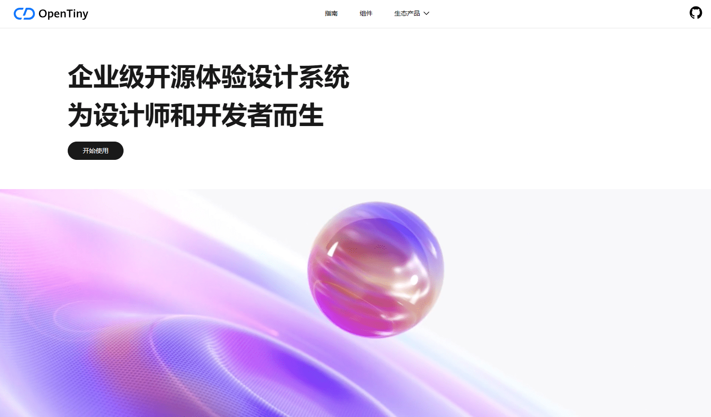
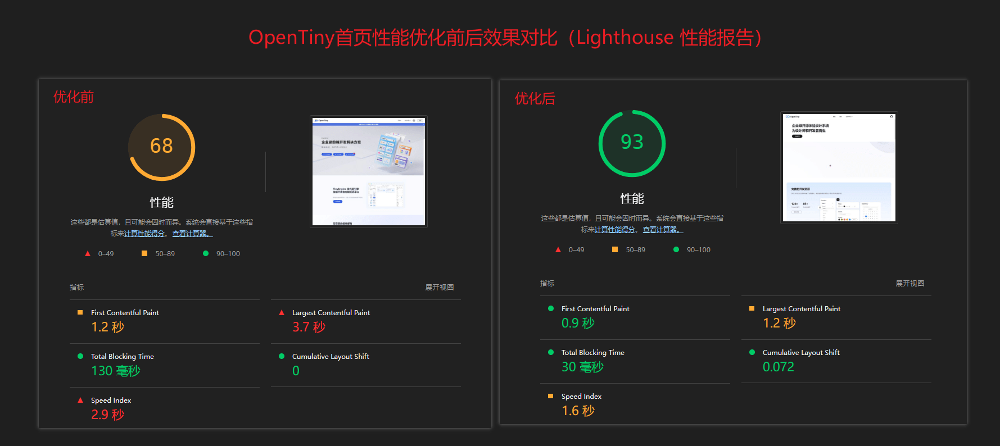
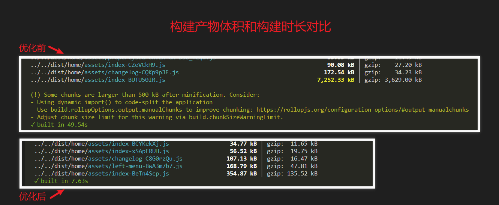
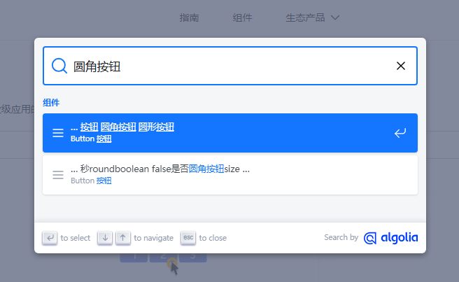
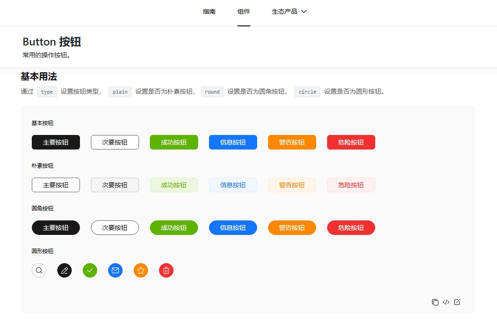
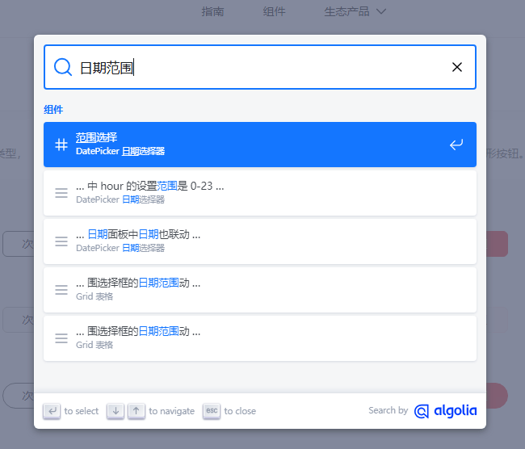
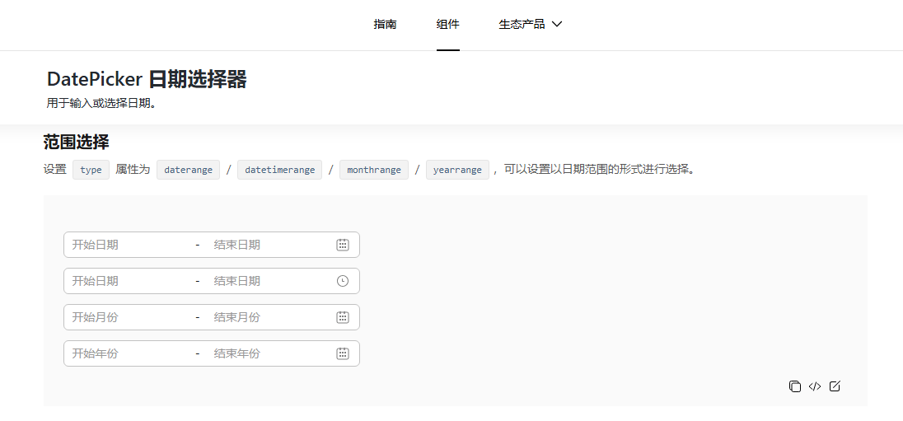
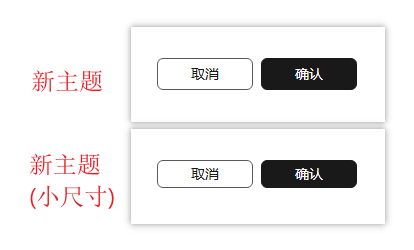
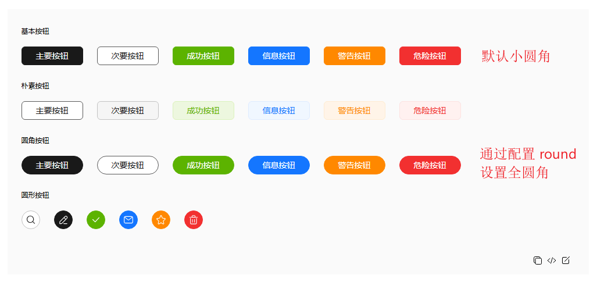

本文由体验技术团队 Kagol 原创。\
我们非常高兴地宣布，2024 年 12 月 4 日，TinyVue  发布了  v3.20.0 🎉。

本次 3.20.0 版本主要有以下重大变更：

- OpenTiny 官网首页 UI 和性能优化，更具现代性和设计美感，加载速度更快、体验更好。
- TinyVue 官网增加 Algolia 全文搜索，原来只能搜索组件名称，现在可以搜索组件 Demo 和 API 文档，让你更容易搜索到自己想要的内容。
- 主题配置工具增加覆盖 CSS 功能，定制性更强，并且增加了老主题、Aurora 主题的适配。

详细的 Release Notes 请参考：<https://github.com/opentiny/tiny-vue/releases/tag/v3.20.0>

本次版本共有 13 位贡献者参与开发，感谢朋友们的辛苦付出 👏

- shenjunjian
- kagol
- zzcr
- gimmyhehe
- Davont
- GaoNeng-wWw
- betavs
- wuyiping0628
- Youyou-smiles
- James-9696
- chenxi-20
- mengqiuleo
- MomoPoppy

你可以更新  `@opentiny/vue@3.20.0`  进行体验！

    npm i @opentiny/vue@3.20.0

我们一起来看看都有哪些更新吧！

## 1 OpenTiny 官网首页 UI 和性能优化

### 1.1 官网 UI 美化

2024 年 7 月，我们对 TinyVue 网站的 UI 进行了优化，让组件文档阅读体验更友好。

- [设计师小姐姐加入之后，TinyVue 组件库官网焕然一新！](https://juejin.cn/post/7397015953445961763)

2024 年 11 月，我们在 TinyVue 3.19.0 版本对组件库整个 UI 进行了升级，让 UI 更美观、更符合现代风格。

- [焕然一新！TinyVue 组件库 UI 大升级，更符合现代的审美！](https://juejin.cn/post/7434471288556961833)
- 🎉[TinyVue v3.19.0 正式发布！Tree 组件终于支持虚拟滚动啦！UI 也升级啦，更更符合现代审美](https://juejin.cn/post/7435822767805218855)\~

2024 年 12 月，我们对 OpenTiny 官网首页进行了 UI 优化，更具现代性和设计美感，并对官网首页的加载性能进行优化，实现秒开。



我们对体验和性能的优化，永不止步！

欢迎大家访问 OpenTiny 官网进行体验：<https://opentiny.design/>

### 1.2 官网性能优化

之前 OpenTiny 首页打开比较慢，一个 js 文件就将近 8MB，存在性能问题。

于是我们全面分析了网站的构建产物，寻找性能瓶颈，并进行优化，以下是取得的主要成果：

1. Lighthouse 性能分从 68 分提升到了 93 分，各项数据都有明显提升，提升 37%左右；
2. 构建产物体积从 8MB 降到 856KB（其中与首页相关的 js 代码仅有 450KB），提升近 10 倍；
3. 构建时长从 50s 缩短到 7.63s，提升 6.5 倍左右。

Lighthouse 性能得分对比：



构建产物对比：



## 2 TinyVue 官网增加 Algolia 全文搜索

之前  TinyVue  组件库的官网只支持搜索组件，这样用户想找组件怎么用还是比较难的。

- 首先需要知道组件准确的名字
- 然后在左侧菜单打开组件的文档
- 还要在组件 demo 和 api 文档中一个一个看，自己要的功能在哪里，怎么配置
- 特别是有些组件功能非常复杂，比如表格，光是组件 api 就 100 多个

新手觉得很头大。


为了让不熟悉 TinyVue 组件库的新手也能快速找到组件文档，快速使用上 TinyVue，我们给 TinyVue 文档增加了 Algolia 全文搜索功能。

只需要打开 TinyVue 网站：<https://opentiny.design/tiny-vue/>

按  `Ctrl + K`  快捷键，或者点击左上角的搜索框，会弹出搜索面板，输入你想了解的内容，比如：“圆角按钮”，按 Enter 就可以跳转到圆角按钮对应的页面。



跳转到圆角按钮页面：



再比如：“日期范围”



跳转到日期范围页面：



我不需要知道文档在哪里，要的时候我按  `Ctrl + K`  进行搜索就行了！

寻找文档的效率大大提升！

欢迎大家体验！

## 3 主题配置工具增加覆盖 CSS 功能

TinyVue 组件库提供了  `TinyThemeTool`  类进行主题切换和自定义主题配置，如果你的业务需要定制主题风格，或者覆盖某些组件的样式，可以考虑使用我们提供的 TinyThemeTool 工具。

### 3.1 自定义主题

v3.20.0 版本我们给 TinyThemeTool 增加了覆盖组件 CSS 样式的功能，使用方式如下：

`ThemeData`  是自定义主题数据格式，用户可以通过`data`属性，传入覆盖的全局  `CSS 变量`， 通过`css`属性，传入有效的 CSS 规则块。

```css
interface ThemeData {
/** 主题的ID */
 id?: string
/** 主题的名称 */
 name?: string
/** 主题的中文名称 */
 cnName?: string
/**
  * 需要追加的全局css变量的对象
  * 比如：{ 'tv-base-color-brand' : '#1476ff' } 会追加到 :root { --tv-base....... }
  * */
 data?: Record<string, string>
/**
  * 需要追加的样式规则, 以覆盖或扩充组件的样式
  * 比如：.tiny-button { border:none;  }
  * */
 css?: string
}
```

自定义主题的方式如下：

```ts
import TinyThemeToolfrom'@opentiny/vue-theme/theme-tool'

const themeTool = newTinyThemeTool()

themeTool.changeTheme({
name: 'my-app-custom-styles',
data: {
   'tv-base-color-brand': '#1476ff',
   'tv-font-size-md': '12px',
   'tv-font-size-lg': '16px',
   'tv-font-size-xxl': '20px'
 },
css: `
   .tiny-button {
     --tv-Button-border-radius: 6px;

     min-width: 80px;
     border:none;
     padding : 2px 20px;
   }
   .tiny-button.tiny-button--primary{
     background-color: #508de3;
   }
 `
})
```

### 3.2 使用老主题或 Aurora 主题

我们不建议用户继续使用旧主题，对于历史项目，我们提供一组旧主题的`CSS变量`,需要用户在工程中适配。

如果你实在不喜欢我们提供的新主题，想使用老主题或者 Aurora 主题，你可以通过 ThemeTool 工具进行配置。

```ts
import TinyThemeTool, { tinyOldTheme, tinyAuroraTheme } from '@opentiny/vue-theme/theme-tool'

const themeTool = new TinyThemeTool(tinyOldTheme) // 传入 tinyAuroraTheme 可以配置 Aurora 主题

// themeTool.changeTheme(tinyOldTheme)  // 动态切换主题
```

### 3.3 对新主题进行定制

如果你喜欢我们的新主题，但觉得新主题有一部分样式我不喜欢，那么你也可以自由定制。

比如你觉得新主题太大了，想改成小尺寸，你可以在 App.vue 中加上以下样式，覆盖默认的主题变量。

```css
:root {
   --tv-size-height-xs: 24px; // mini 尺寸
   --tv-size-height-sm: 24px; // small 尺寸
   --tv-size-height-md: 28px; // medium 尺寸 - 默认
   --tv-size-height-lg: 32px; // large 尺寸
   --tv-size-height-xl: 36px; //  xLarge 尺寸
}
```

效果对比：



除了以上优化之外，我们还对社区朋友们提到的以下问题进行了优化：

- 将按钮组件默认的全圆角改成了小圆角，用户可以通过配置 round 属性为 true 来设置大圆角



欢迎大家体验我们的  TinyVue  组件库，并在评论区进行反馈和交流\~

## 关于 OpenTiny

OpenTiny 官网：<https://opentiny.design>\
TinyVue 源码：<https://github.com/opentiny/tiny-vue> （欢迎 Star ⭐）\
TinyEngine 源码：<https://github.com/opentiny/tiny-engine> （欢迎 Star ⭐）\
B 站：<https://space.bilibili.com/15284299>\
欢迎加入 OpenTiny 开源社区。添加微信小助手 opentiny-official 一起参与交流前端技术～
