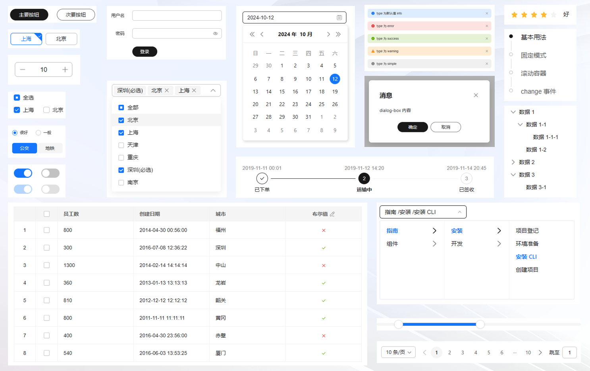
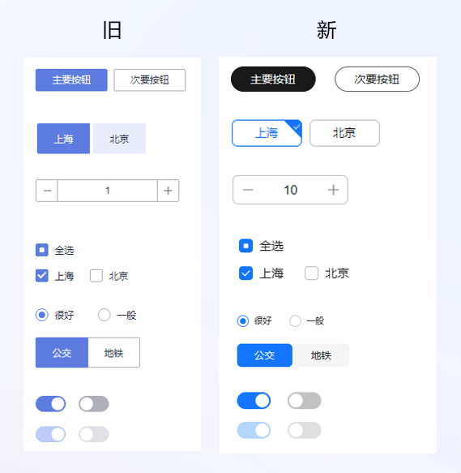
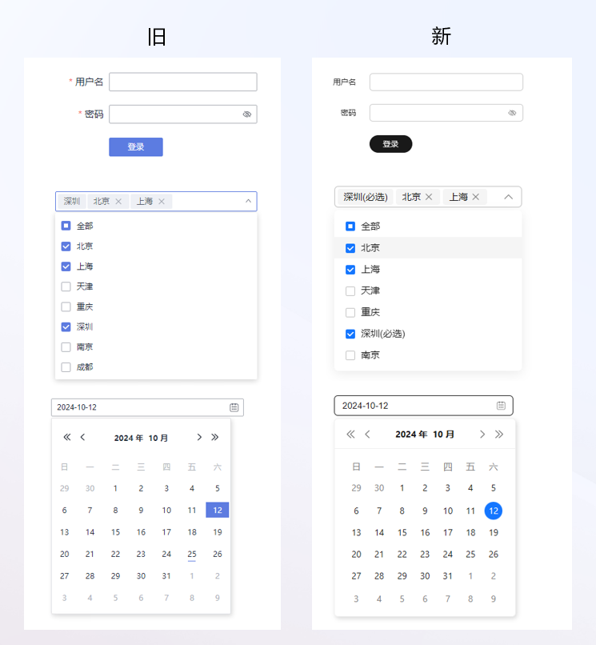
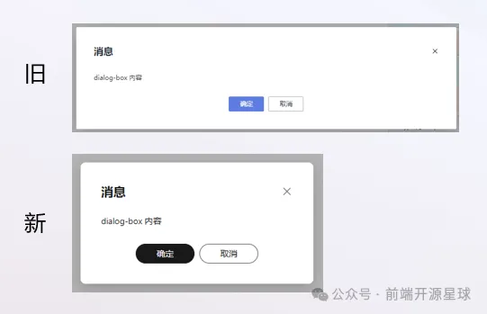
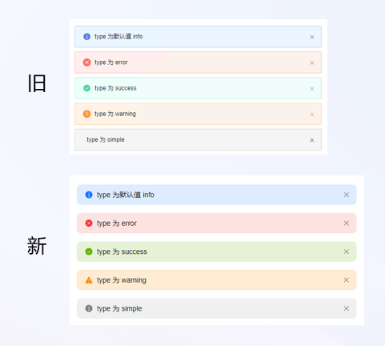
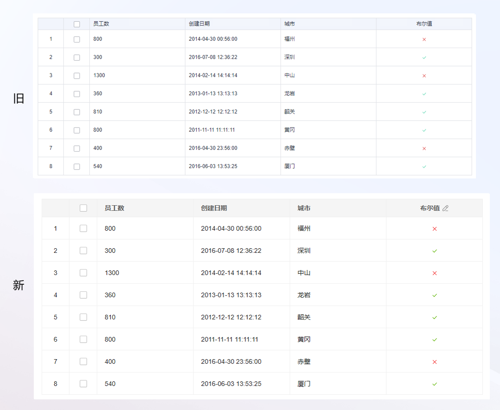
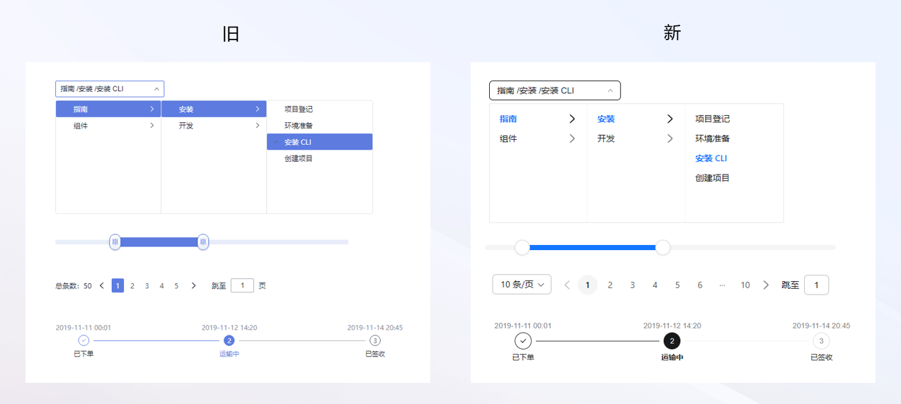

本文由体验技术团队 Kagol 原创。\
自从 TinyVue 组件库去年开源以来，一直有小伙伴反馈我们的 UI 不够美观，风格陈旧，不太满足现阶段审美。

> “TinyVue 给我的感觉就是一个没啥审美能力、但是很努力的老程序员开发的”

看到这个评价，我是哭笑不得，一方面对小伙伴们真诚、友好的反馈充满感激，另一方面也为我们没有做好 UI 感到惭愧。

于是我们和设计师同事携手一起，对 TinyVue 组件做了全面的 UI 升级，适配了一套更符合现代审美的设计规范：OpenTiny Design，这套全新的设计规范，是我们的设计师同事结合华为云的业务特点和最新的设计趋势打磨出来的，目前 TinyVue 所有组件均已支持 OpenTiny Design 设计规范。

当然这套设计规范也不是静止不变的，后续还是会不断迭代和优化，也欢迎广大的开发和设计师朋友给我们提出宝贵的意见。

访问 TinyVue 组件库官网即可进行体验：

<https://opentiny.design/tiny-vue>

## **整体组件效果**

整体视觉风格以黑蓝为主，稳重又现代，并且更加圆润，看着非常舒服。

## **新旧效果对比**

我们再来看下新旧效果对比。

### **按钮、表单类组件**

除了颜色上的变化，按钮的变化比较明显，变成了全圆角，其他组件也更加圆润。

复选框按钮组件变化比较大，在右上角增加了对勾效果，勾选效果更明显，不容易和按钮混淆。

数字输入框组件的优化效果也很明显，原先细长细长的，感觉不太协调，优化之后更符合现代风格。

### **输入、下拉类组件**

所有的输入框类的组件边框颜色都比之前淡一些，不会太突兀，并且也更圆润。

日期选择框是一个很复杂的组件，我们花了很多精力进行优化，很多都是细节上的打磨，虽然每个细节的优化都不起眼，但是所有细节优化合起来，整体给人的感觉就有很大的不同，大家可以体验下日期选择框这个组件。

<https://opentiny.design/tiny-vue/zh-CN/os-theme/components/date-picker>

### **弹窗组件**

弹窗组件主要是整体宽度、圆角、阴影的调整，看起来调整的东西不多，但每一处调整都起了画龙点睛的效果。

### **警告组件**

警告组件比较明显的变化是颜色和图标，颜色的层次更加分明，图标的表意也更加准确，比如警告图标，之前是圆形的，现在改成三角形，就更加符合大家的共识。

### **表格组件**

表格组件看起来变化不大，但细看也有很多优化，比如整体线条颜色更浅，更能突出单元格中的核心内容，表头颜色和高度也有一定的调整。

### **其他组件**

滑块组件的优化也非常明显，之前的滑块手柄给人一种很古老的感觉，难怪大家都说风格陈旧，现在改成圆形效果好多了，看起来就像是现代的风格。

大家觉得这次 TinyVue 的视觉升级效果怎么样呢？欢迎在评论区留言。

## **关于 OpenTiny**

欢迎加入 OpenTiny 开源社区。添加微信小助手：opentiny-official 一起参与交流前端技术～\
OpenTiny 官网：**<https://opentiny.design/>**\
OpenTiny 代码仓库：**<https://github.com/opentiny/>**\
TinyVue 源码：**<https://github.com/opentiny/tiny-vue>**\
TinyEngine 源码： **<https://github.com/opentiny/tiny-engine>**\
欢迎进入代码仓库 Star🌟TinyEngine、TinyVue、TinyNG、TinyCLI\~ 如果你也想要共建，可以进入代码仓库，找到  good first issue 标签，一起参与开源贡献\~
