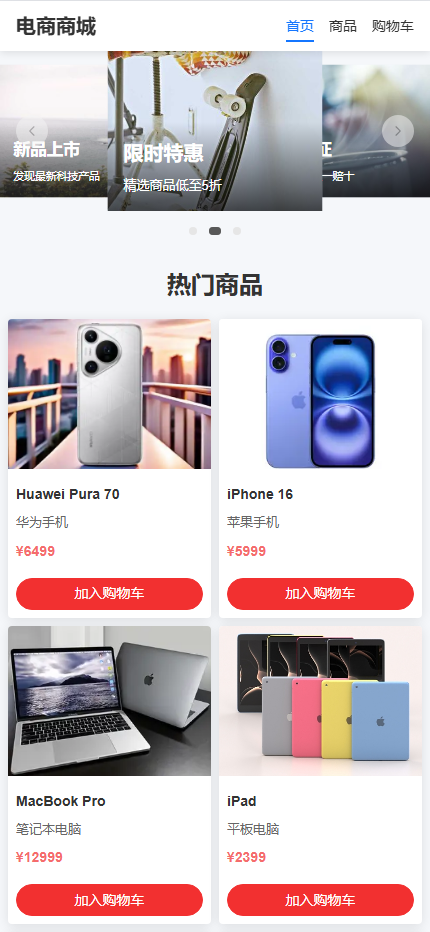
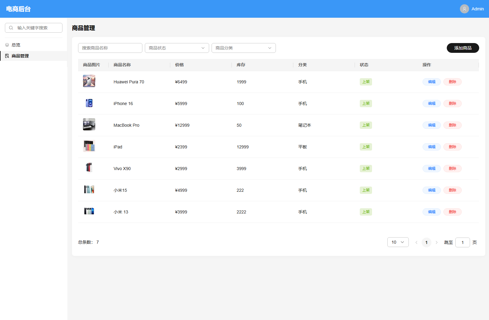
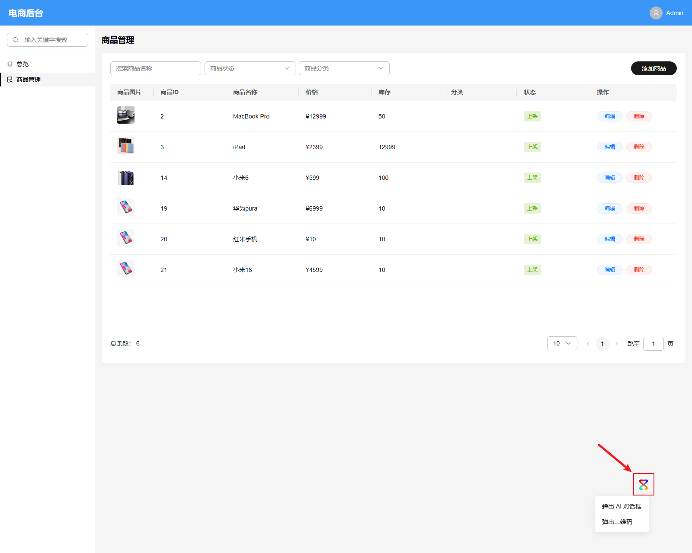
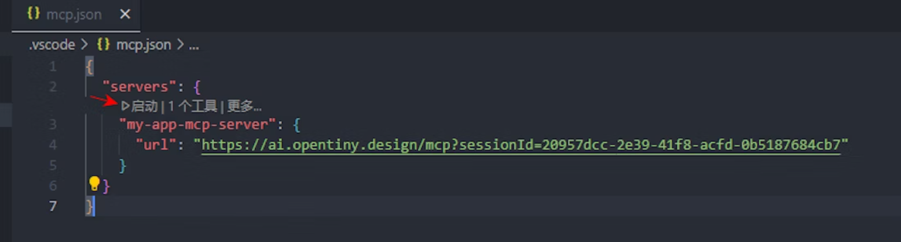
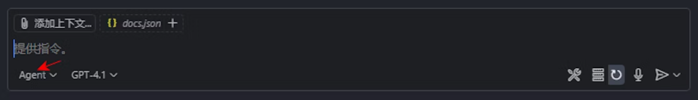

## 1. 背景描述

传统的 Web 应用都是由人来操作的，用户需要学习帮助文档，操作成本相对较高。

OpenTiny 团队基于 MCP 协议实现了 AI 代替人操作 Web 应用这项技术，并应用到我们的 TinyVue 组件库中，实现了 TinyVue 组件库的智能化改造，使用 TinyVue 智能组件库开发的应用，天然地支持被 AI 识别和操控。
我们还提供了一套各框架的 SDK，支持现有业务快速接入 AI、实现智能化，目前支持 Vue、React、Angular 等前端框架。
由于我们是基于标准的 MCP 协议实现的，具备通用性和广泛的适用性，可以通过各种不同类型的 MCP Host 来控制 Web 应用，比如可以通过网页上的 AI 对话框来控制 Web 应用，也可以通过 VSCode Copilot、Cursor 等 IDE 工具，或者通过 Dify、Coze 等智能体平台来操控，甚至可以通过手机 App、微信小程序等方式远程遥控你的 Web 应用，我们可以像微信聊天一样与 AI 对话，让 AI 帮我们操作各类 Web 应用，实现我们的需求。

OpenTiny NEXT 提供一套企业级 Web 前端智能应用解决方案，只需要简单的四步，就能帮助企业将传统 Web 应用转变成智能应用。我们只需要用自然语言给 AI 提需求，AI 智能体会帮助我们操作 Web 应用，高效完成业务操作。

OpenTiny NEXT 提供了 TinyVue 前端智能组件库、TinyEngine 智能低代码平台、TinyRobot 企业智能助手、WebAgent 智能代理等一揽子解决方案，支持 Cursor、Dify、AI 对话框等各种 Agent 平台远程操控 Web 应用，助力企业将传统 Web 应用转变成 Agentic Web 应用。

## 2. 实验简介

本实验就带大家亲自动手实操，借助 OpenTiny NEXT 提供的工具，将一个传统 Web 应用转变成智能应用，体验让 AI 智能体代替人操作 Web 应用。

我们提供了一个传统的电商网站示例项目，该项目主要包含电商商城前端应用、电商后台管理系统、电商后端三个部分，前端项目基于 Vite + Vue3 + TinyVue 技术栈，后端项目基于 Express。

- shop 电商商城前端应用，给终端用户使用，用于购买商品，比如：浏览商品、加入购物车、下单购买商品等
- shop-admin 电商后台管理系统，给电商公司内部同事管理商品，比如：增加商品、删除商品、修改商品库存等
- shop-server 电商后端，用于商品数据存储，并给前端项目提供 API 接口

本实验会带着大家把这个电商项目改造成智能应用，主要分成四步，先安装 @opentiny/next-sdk 软件包，然后在项目中引入 NEXT SDK 提供的 WebMcpServer 类，初始化 MCP Server 实例，为项目注册 MCP 工具，接着引入 WebMcpClient，初始化 MCP Client 实例，并与 WebAgent 智能代理进行连接，最后在页面中引入 TinyRobot 企业智能助手。完成以上步骤，该电商网站右下角会出现一个图标，代表该网站已完成智能化改造，可以打开企业智能助手，与 AI 进行对话，让 AI 智能体帮我们操作应用，比如：帮我上架 10 台华为 Pura 70 手机。

通过本次实验，你将收获：

- 学习如何使用 git 克隆一个 GitHub 前端项目，通过 pnpm 安装依赖，实现本地启动
- 掌握如何在一个传统的 Web 应用中接入 NEXT SDK，并与 WegAgent 智能代理连接，完成智能化改造
- 学会在项目中引入 TinyRobot 企业智能助理，并通过与智能助理对话，让 AI 智能体代替人操作 Web 应用
- 了解如何在 Web 应用中定义 MCP Server 和 MCP Client，注册 MCP 工具
- 了解如何给 VSCode Copilot / Dify 等 Agent 平台配置 MCP Server，让 AI 智能体调用工具完成操作

## 3. 基本要求

- 熟练使用 VSCode 或其他代码编辑器
- 具有 Chrome、Edge 等浏览器的调试能力
- 具备 Vue、TypeScript 等基本的前端开发能力

## 4. 代码实战

### 4.1 克隆电商网站项目代码，实现本地启动

打开 VSCode 代码编辑器，`` Ctrl + ` `` 打开终端命令行工具，使用 `git clone` 命令克隆电商项目代码。

```shell
# 最简单的方式就是直接通过 https 方式克隆，只需要输入 GitHub 登录账号和密码即可，需要确保网络是可以访问 github.com 域名的
git clone https://github.com/opentiny-next/shop.git

# 如果配置了 ssh 密钥对，也可以使用以下方式克隆代码
git clone git@github.com:opentiny-next/shop.git

# 如果安装了 GitHub CLI，也可以通过以下方式克隆代码
gh repo clone opentiny-next/shop
```

进入 shop 目录：

```shell
cd shop
```

安装依赖：

```shell
pnpm i
```

本地启动三个项目：

```shell
# 启动电商商城前端应用
pnpm dev

# 启动电商后台管理系统
pnpm dev:admin

# 启动电商后端
pnpm dev:server
```

打开电商商城前端应用：<https://localhost:3070/>

效果如下：



打开电商后台管理系统：<https://localhost:3060/>

效果如下：



### 4.2 第一步：安装 NEXT SDK

我们以电商后台管理系统为例，介绍如何接入 OpenTiny NEXT，实现智能化。

给 shop-admin 项目安装 NEXT SDK：

```shell
pnpm -F shop-admin i @opentiny/next-sdk
```

### 4.3 第二步：创建 MCP Server，定义 MCP 工具

在 views/Products.vue 文件中加入以下代码：

```typescript
import { inject } from 'vue'
import { WebMcpServer, z } from '@opentiny/next-sdk'

const serverTransport = inject('serverTransport')

const server = new WebMcpServer()

// 注册添加商品工具，支持所有商品属性
server.registerTool(
  'add-product',
  {
    description: '添加商品，上架',
    inputSchema: {
      id: z.number().describe('商品ID'),
      name: z.string().describe('商品名称'),
      price: z.number().describe('商品价格'),
      description: z.string().describe('商品描述'),
      image: z.string().describe('商品图片URL'),
      category: z.string().describe('商品分类, 例如：手机、笔记本、平板'),
      stock: z.number().describe('商品库存，数量'),
      status: z.enum(['on', 'off']).describe('商品状态，on为上架，off为下架')
    }
  },
  async (productData: ProductForm) => {
    // 显示添加商品弹窗并填充数据
    productData.id = productData.id || new Date().getTime()
    const success = await store.addProduct(productData)

    return {
      content: [
        {
          type: 'text',
          text: `商品数据: ${productData.name}，价格: ${productData.price}，库存: ${productData.stock}`
        }
      ]
    }
  }
)

onMounted(async () => {
  await server.connect(serverTransport)
})
```

### 4.4 第三步：创建 MCP Client，与 WebAgent 智能代理连接

在 App.vue 文件中加入以下代码：

```typescript
import { onMounted, provide } from 'vue'
import { WebMcpClient, createMessageChannelPairTransport } from '@opentiny/next-sdk'

const [serverTransport, clientTransport] = createMessageChannelPairTransport()
provide('serverTransport', serverTransport)
const client = new WebMcpClient()

onMounted(async () => {
  await client.connect(clientTransport)
  const { sessionId } = await client.connect({
    agent: true,
    url: 'https://agent.opentiny.design/api/v1/webmcp-trial/mcp',
    sessionId: '5f8edea7-e3ae-4852-a334-1bb6b3a1cfa9'
  })
  console.log('sessionId:', sessionId)
})
```

### 4.5 第四步：引入 NEXT Remoter 遥控器，实现 AI 对话

给 shop-admin 项目安装 NEXT Remoter：

```shell
pnpm -F shop-admin i @opentiny/next-remoter
```

在 App.vue 中使用遥控器：

```html
<script setup lang="ts">
  import { TinyRemoter } from '@opentiny/next-remoter'
  import '@opentiny/next-remoter/dist/style.css'
</script>

<template>
  <tiny-remoter session-id="5f8edea7-e3ae-4852-a334-1bb6b3a1cfa9" />
</template>
```

这时应用右下角会出现一个图标，这就是遥控器的入口，你可以将鼠标悬浮到这个图标上，选择：

- 弹出 AI 对话框，应用侧边会打开一个 AI 对话框
- 弹出二维码，手机扫码之后会打开手机端的遥控器

不管是通过弹出 AI 对话框，还是通过手机扫码，你都可以通过对话方式让 AI 代替你操作 Web 应用，提升完成任务的效率。

比如你可以输入：“帮我上架 10 台华为 Pura 70 手机”

效果：



### 4.6 通过 VSCode Copilot / Coze 操控（选做）

**通过 VSCode Copilot 操控**

在 shop-admin 项目根目录增加 .vscode 文件夹，里面添加一个 mcp.json 文件，在该文件中加入以下内容：

```typescript
{
  "servers": {
    "my-app-mcp-server": {
      "url": "https://agent.opentiny.design/api/v1/webmcp-trial/mcp?sessionId=5f8edea7-e3ae-4852-a334-1bb6b3a1cfa9"
    }
  }
}
```

配置完成之后点击 `my-app-mcp-server` 上方的启动按钮，这时你的 Web 应用的 MCP Server 就启动了。



然后使用快捷键 `Ctrl + Alt + I` 打开 VSCode Copilot AI 对话框，切换到 Agent 模式。



在输入框中输入需要操作的内容，例如：“帮我上架 10 台华为 Pura 70 手机”，这时 AI 就会调用你的 Web 应用中定义的 MCP 工具，操作你的 Web 应用，完成商品的添加。

**通过 Coze 操作的步骤**

进入 [Coze](https://space.coze.cn/) 官网，登录后点击打开网页版。

在 Coze 中配置 MCP Servers，添加自定义管理工具。


在输入框中输入需要操作的内容，例如：“帮我上架 10 台华为 Pura 70 手机”，这时 AI 就会调用你的 Web 应用中定义的 MCP 工具，操作你的 Web 应用，完成商品的添加。

### 4.7 操控 Electron 桌面应用和 uni-app 手机应用（选做）

**操控 Electron 桌面应用**

执行 `pnpm -F shop-admin-electron build:exe` 构建 exe 可执行文件，构建出来的产物在 `packages/shop-admin-electron/dist` 目录，需要确保当前网络可以访问 github.com，因为构建过程会从 github.com 下载 electron 软件。

在 Windows 电脑中双击 exe 文件即可安装生成的桌面应用，效果和 PC 端的 Web 应用是一样的。

**操控 uni-app 手机应用**

先在终端命令行中切到 `packages/shop-uniapp` 目录，执行 `npm i` 安装依赖。

然后在 HBuilder 软件中打开 `packages/shop-uniapp` 项目，打开根目录的 index.html 文件，点击右上角的预览按钮即可预览手机应用，效果和手机端的 Web 应用类似。

## 5. 实验总结

本次实验的核心任务是：用最少代码改动，把一个典型“Vite + Vue3 + TinyVue”电商三件套（前端商城、后台管理、Express 后端）升级为 AI 驱动的智能应用。最终效果：右下角出现智能入口图标，用户可直接用自然语言指挥 AI 完成“上架 10 台华为 Pura 70”等操作。

整个改造被浓缩为 4 个可复制的步骤：

1. 安装依赖：`pnpm i @opentiny/next-sdk`
2. 引入并初始化 MCP Server：`import { WebMcpServer } from '@opentiny/next-sdk'`
3. 引入 WebMcpClient 并连接到 WebAgent 智能代理：`import { WebMcpClient } from '@opentiny/next-sdk'`
4. 挂载 TinyRemoter 组件：`<tiny-remoter session-id="xxxx-xxxx-xxxx-xxxx" />`

通过本次实验，你不仅能学会 Git 克隆、pnpm 安装、本地起服务的完整链路，了解基本的 Vue、TypeScript 前端开发技术，最重要的是，你可以学会如何借助 OpenTiny NEXT 提供的解决方案，将一个传统的 Web 应用改造成智能应用，实现让 AI 智能体代替人操作 Web 应用，真正体会到 AI 时代从“点击”到“对话”的人机交互范式转变。

## 关于 OpenTiny

欢迎加入 OpenTiny 开源社区。添加微信小助手：opentiny-official 一起参与交流前端技术～

[OpenTiny 官网](https://opentiny.design/)：**<https://opentiny.design>**\
[OpenTiny 代码仓库](https://github.com/opentiny)：**<https://github.com/opentiny>**\
[TinyVue 源码](https://github.com/opentiny/tiny-vue)：**<https://github.com/opentiny/tiny-vue>**\
[TinyEngine 源码](https://github.com/opentiny/tiny-engine)： **<https://github.com/opentiny/tiny-engine>**\
欢迎进入代码仓库 Star🌟TinyEngine、TinyVue、TinyNG、TinyCLI、TinyEditor\~
如果你也想要共建，可以进入代码仓库，找到 good first issue 标签，一起参与开源贡献\~
