本文由观测云团队编写~

## **前言**

Vue 是一款用于构建用户界面的 JavaScript 框架。它基于标准 HTML、CSS 和 JavaScript 构建，并提供了一套声明式的、组件化的编程模型，帮助你高效地开发用户界面。无论是简单还是复杂的界面，Vue 都可以胜任。

TinyPro 是一套使用 Vue 编写的中后台管理后台框架，官网地址：<https://www.opentiny.design/vue-pro/docs/start> ，

下面以 TinyPro 为例来接入如何实现 Vue 应用的可观测性。

## **环境信息**

- Node 版本 > 10

## **接入方案**

### **准备工作**

- 注册观测云账号（ <https://auth.guance.com/businessRegister> ）

- 安装了 vue（ <https://cn.vuejs.org/guide/quick-start.html> ）；

  TinyCli（ <https://www.opentiny.design/tiny-cli/docs/start> ）

#### **第一步：在观测云创建应用**

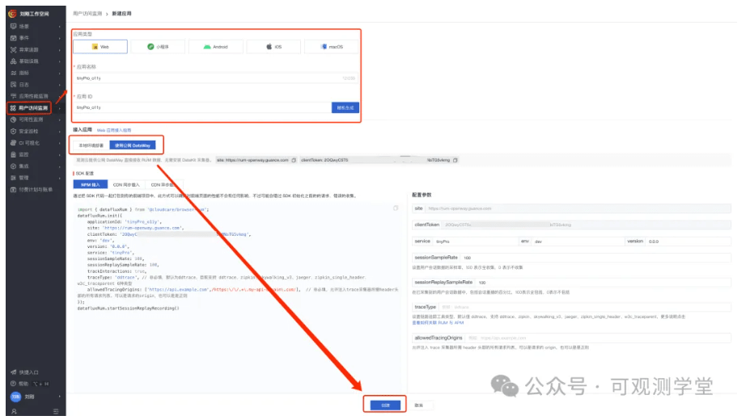

这里面的就是配置代码，后面会用到。

#### **第二步：下载 TinyPro 管理后台**

```
tiny init
```

控制台提示如下：

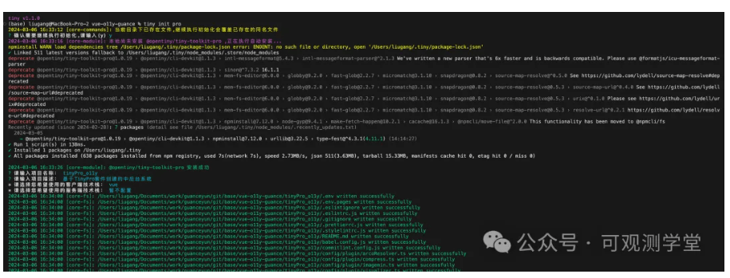
成功安装大概样式：

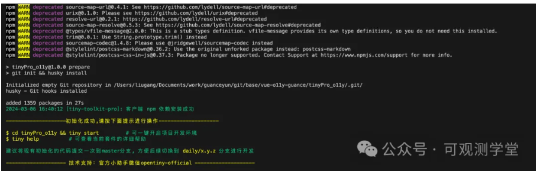

项目结构如下：

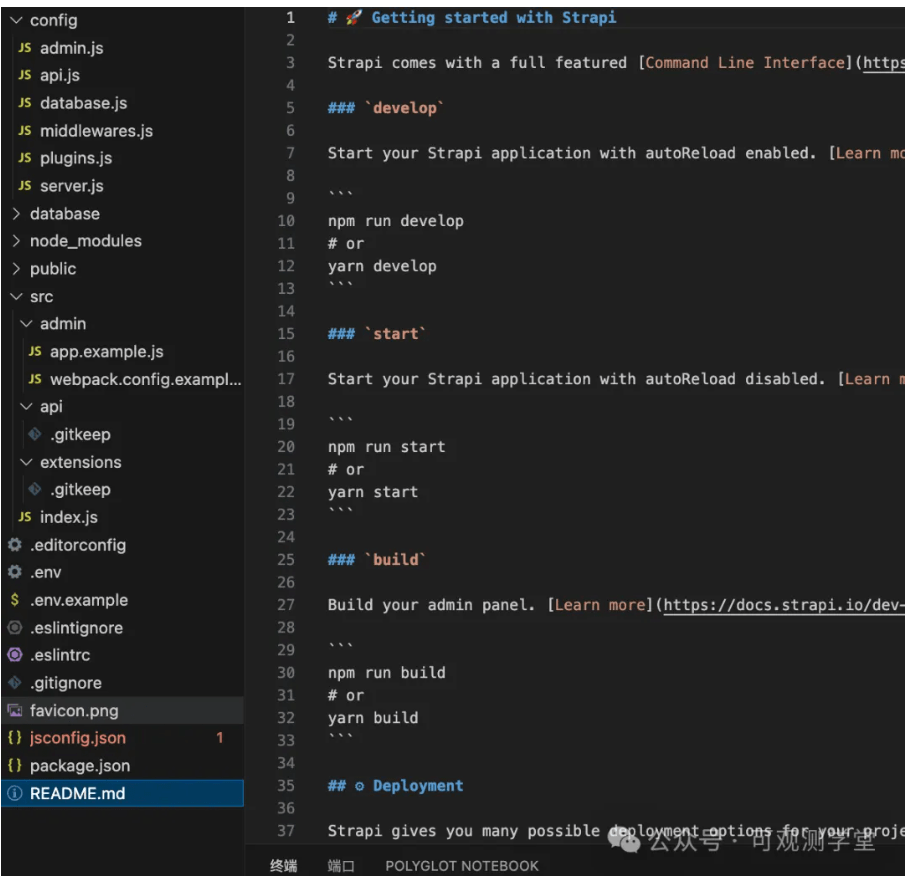

### **接入观测云 SDK**

接入观测云 SDK 有两种方式：npm 或者 cdn，选择其中一种即可。

#### **npm 方式接入**

在项目根目录执行以下脚本安装 sdk 。

```
npm install @cloudcare/browser-rum
```

安装脚本后，找到入口文件，并粘贴如下代码，注意修改。

```js
//引入观测云rum的sdk
import { datafluxRum } from '@cloudcare/browser-rum'
```

#### **cdn 方式接入**

在当前目录下找到 index.hml 并把观测云接入代码拷贝到 head 标签内，如下图所示。

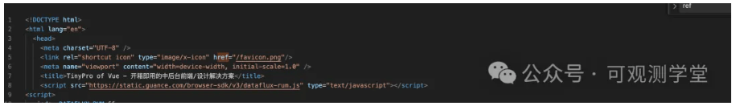

### **配置启动参数**

通过配置的参数能设置应用名称、版本、环境、采样率等。

#### **cdn 方式接入**

cdn 方式接入有同步或异步，如果选择同步方式，可以按照如下接入。

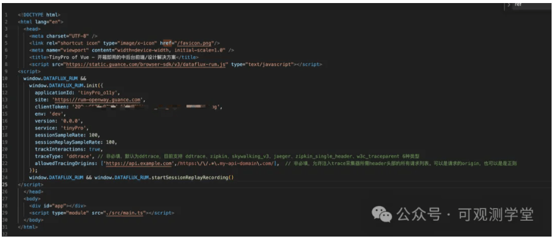

#### **npm 方式接入**

```js
//初始化sdk
datafluxRum.init({
  applicationId: 'guance',//应用id
  site: 'https://rum-openway.guance.com',
  clientToken:"***" // 请在3.1的第一步中创建的内容查看clientToken
  env: 'production',
  version: '1.0.0',
  sessionSampleRate: 100,
  sessionReplaySampleRate: 70,
  trackInteractions: true,
  traceType: 'ddtrace', // 非必填，默认为ddtrace，
                        //目前支持 ddtrace、zipkin、skywalking_v3、jaeger、zipkin_single_header、w3c_traceparent 6种类型
  allowedTracingOrigins: ['https://api.example.com', /https://.*.my-api-domain.com/],  // 非必填，允许注入trace采集器所需header头部的所有请求列表。
                                                                                           //可以是请求的origin，也可以是正则
 })
```

### **启动项目**

我们启动项目，命令如下：

```
tiny start
```

检查是否有数据上报，如果在 network 看到有 rum 的数据，则说明上报成功。

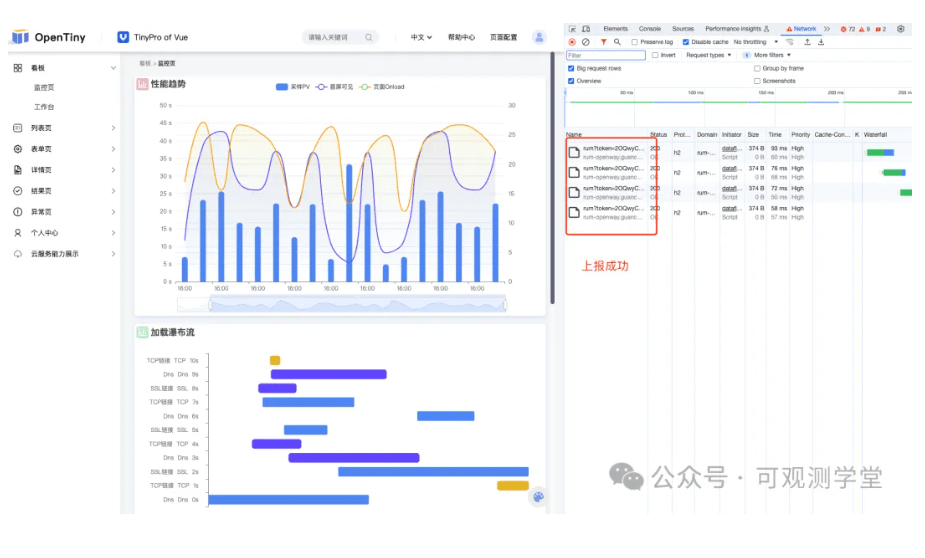

## **实践效果**

### **用户会话、轨迹**

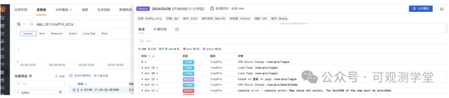

### **页面性能、设备等信息**

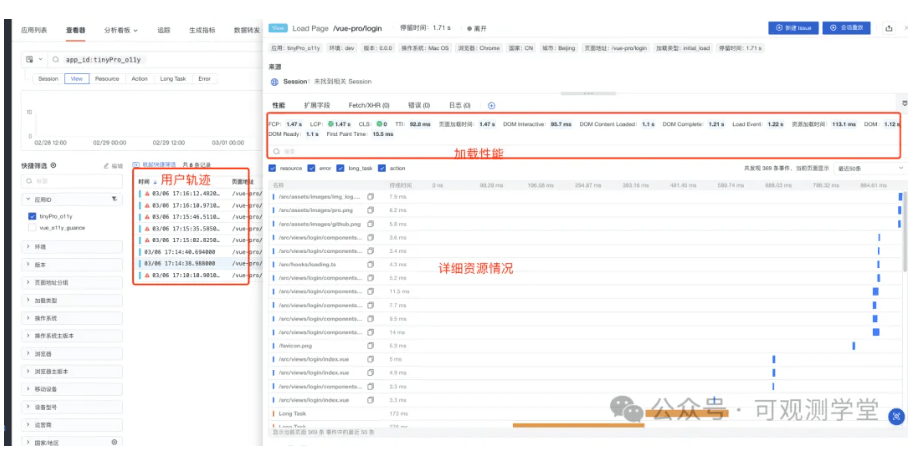

### **录制回放效果**

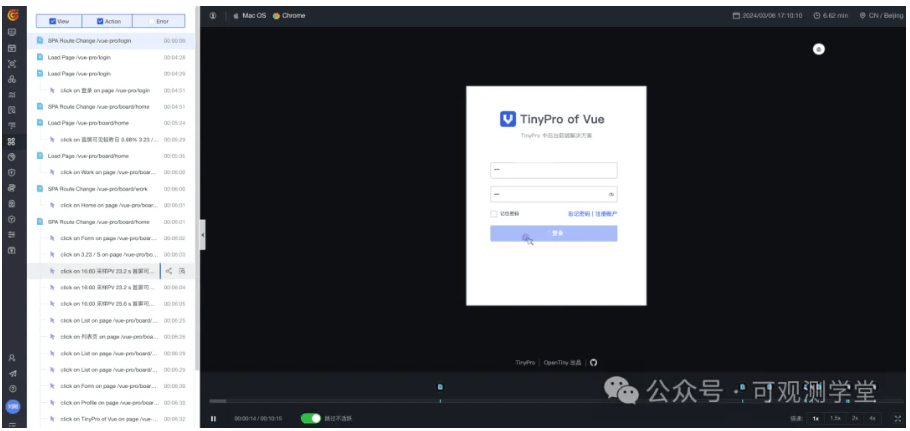

### **概览信息**


### **性能看板**

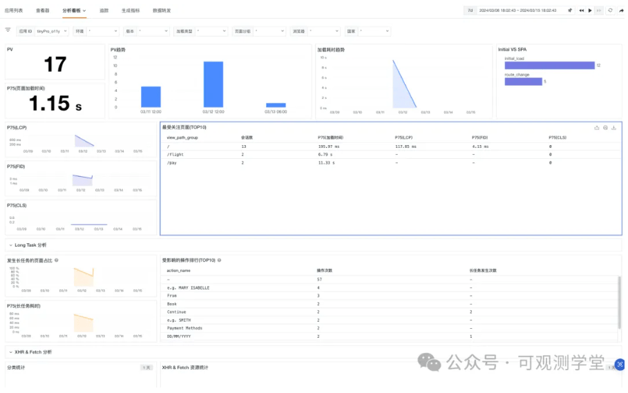

### **资源分析**

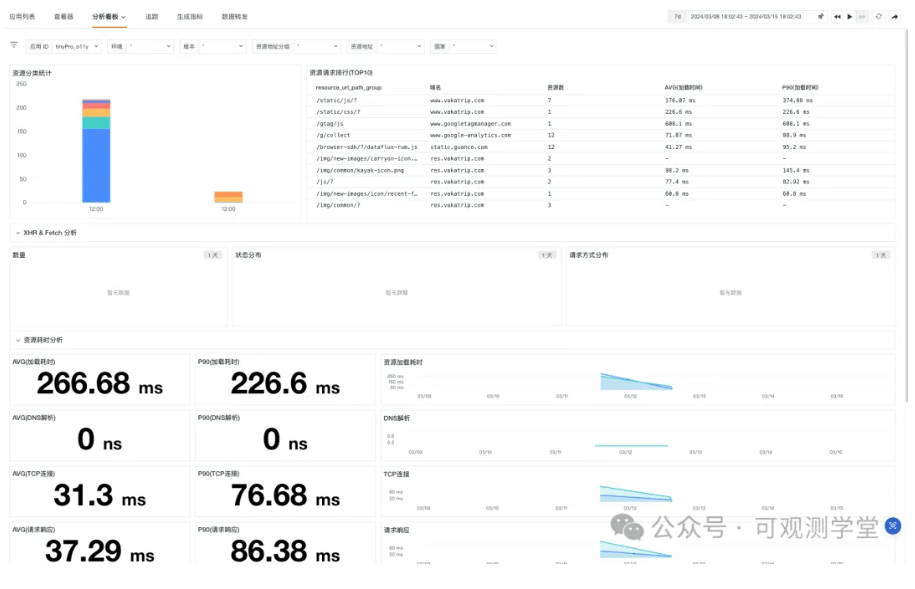

## **关于 OpenTiny**

OpenTiny 是一套企业级 Web 前端开发解决方案，提供跨端、跨框架、跨版本的 TinyVue 组件库，包含基于 Angular+TypeScript 的 TinyNG 组件库，拥有灵活扩展的低代码引擎 TinyEngine，具备主题配置系统 TinyTheme / 中后台模板 TinyPro/ TinyCLI 命令行等丰富的效率提升工具，可帮助开发者高效开发 Web 应用。

---

欢迎加入 OpenTiny 开源社区。添加微信小助手：opentiny-official 一起参与交流前端技术～

OpenTiny 官网：**<https://opentiny.design/>**  
OpenTiny 代码仓库：**<https://github.com/opentiny/>**  
TinyVue 源码：**<https://github.com/opentiny/tiny-vue>**  
TinyEngine 源码： **<https://github.com/opentiny/tiny-engine>**

欢迎进入代码仓库 Star🌟TinyEngine、TinyVue、TinyNG、TinyCLI~

如果你也想要共建，可以进入代码仓库，找到  good first issue 标签，一起参与开源贡献~
