## 知识背景

### TinyEngine 低代码引擎简介

1. 低代码引擎 TinyEngine 使能开发者定制低代码平台。它是低代码平台的底座，提供可视化搭建页面等基础能力，既可以通过线上搭配组合使用，也可以通过下载源码进行二次开发，实时定制出自己的低代码平台。适用于多场景的低代码平台开发，如：资源编排、服务端渲染、模型驱动、移动端、大屏端、页面编排等。
2. TinyEngine 是 OpenTiny 团队 2023 年开源的一个低代码引擎。代码托管在 GitHub：<https://github.com/opentiny/tiny-engine> 。欢迎大家 Star 和 提 Issue、PR 进行反馈。
3. TinyEngine 官网：<https://opentiny.design/tiny-engine#/home> 。
4. TinyEngine 在线 demo：<https://opentiny.design/tiny-engine#/tiny-engine-editor>

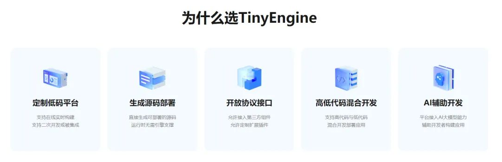

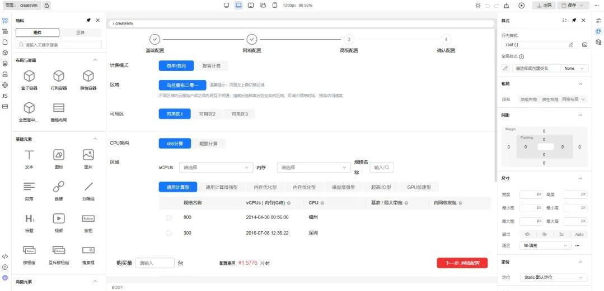

### AI 插件核心功能概览

#### 1. 智能对话交互

1.1 通过左下角 AI 图标呼出聊天窗口。
1.2 用户可输入问题或指令。
1.3 支持粘贴文档和上传单张图片（用于视觉模型分析）。

#### 2. 多模型支持

2.1 可切换不同的 AI 大模型（通过设置面板）。
2.2 支持文本和视觉模型（如 qwen-vl-max 等）。
2.3 模型配置保存到本地存储。

#### 3. 页面开发辅助

3.1 一键应用 AI 生成的页面修改，自动保存页面 Schema 状态。
3.2 实时预览 AI 生成的页面效果。

## 使用 TinyEngine 低代码引擎 AI 能力搭建华为云官网首页

### 第一步：新建页面

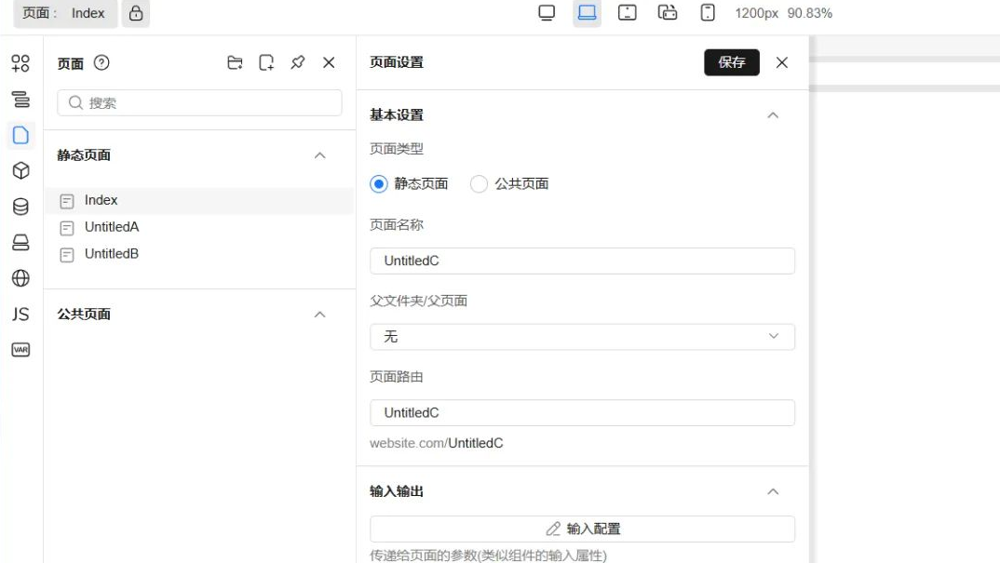

1. 单击「页面管理」的新增页面按钮。
2. 设置页面基本属性。
3. 单击「保存」。

### 第二步：设置 AI 大模型

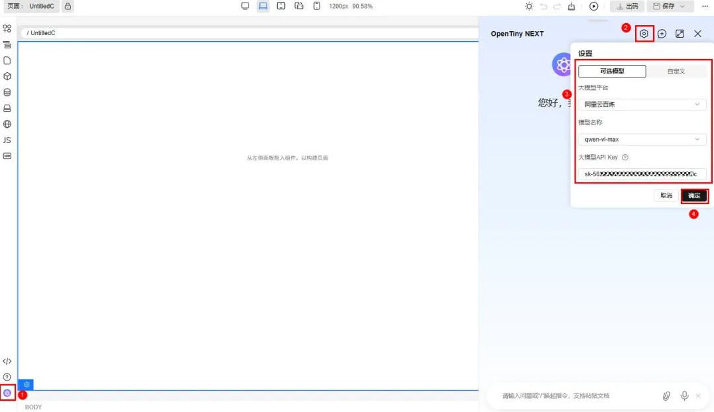

1. 点击左下角「AI 对话框」图标。
2. 打开「模型设置」面板。
3. 选择内置的大模型平台、模型并输入 API Key；也可以自定义兼容 OpenAI SDK 的平台模型服务。
4. 设置完成后单击「确定」切换大模型。

### 第三步：上传图片给 AI 识别（仅支持视觉理解模型）

若选择了视觉理解模型（例如阿里云百炼的 qwen-vl-max），AI 插件支持上传图片给 AI 识别。建议使用这个功能，能够协助 AI 理解界面，生成更准确的 UI 效果。

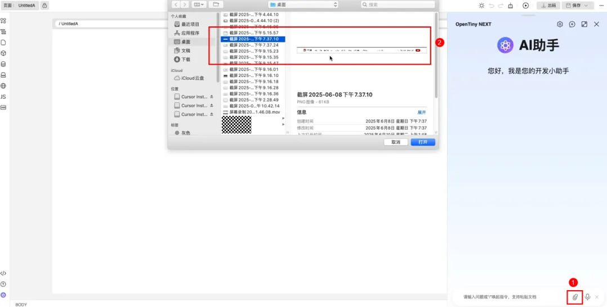

1. 在 AI 聊天窗口点击「上传图片」按钮。
2. 选择华为云首页设计稿模块截图。

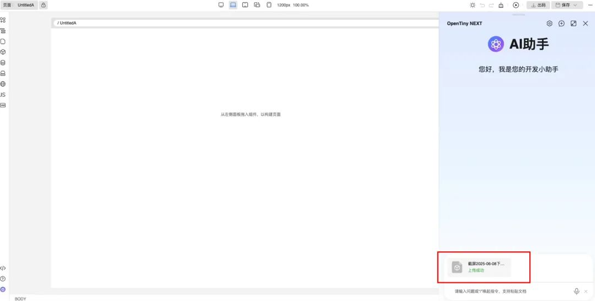

3\. 图片上传成功。

### 第四步：给 AI 发送界面描述

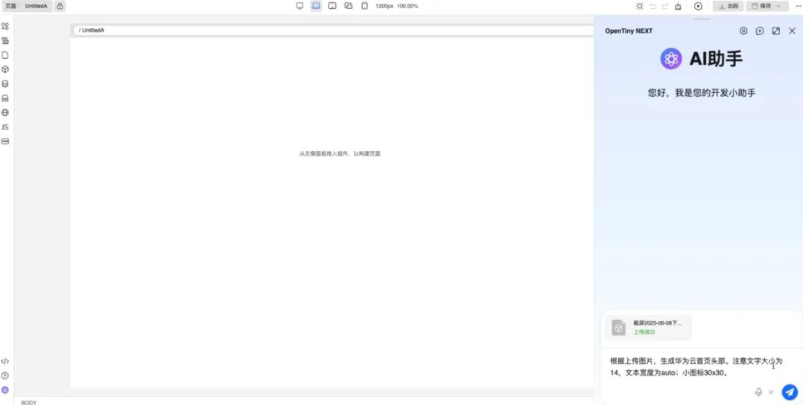

1.发送界面描述，等待 AI 返回生成效果

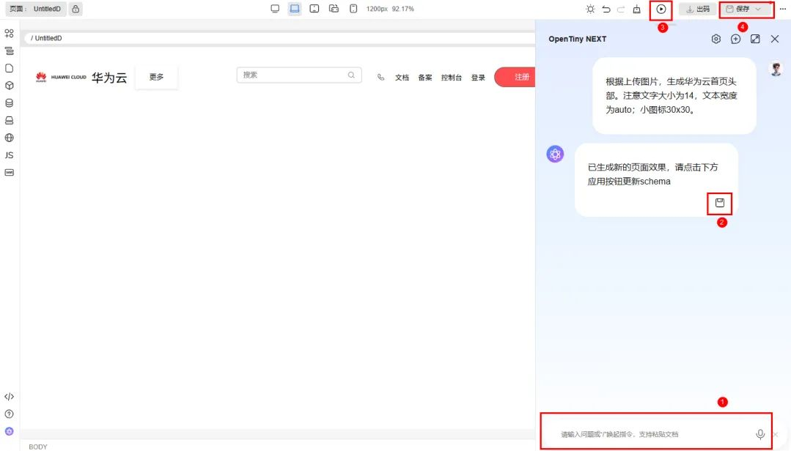

2.单击「应用」将结果生成在画布上 3.单击设计器右上角的「预览」，预览准确的页面效果。 4.点击「保存」，将 AI 生成的 UI 界面保存在画布。

## 发送界面描述示例参考

我们可以将华为云官网首页按照模块区分为：

- 头部模块
- banner 模块
- “技术即服务，让创新触手可及”模块
- “降本增效，加速企业数字化转型”模块
- “释放数字生产力，使能千行百业创新”模块
- “构筑开放共赢”模块
- “全球用户”模块
- “全球基础设施”模块
- footer 模块

根据每个模块的 UI 进行描述，明确指定布局、样式和组件等要求，以及注明尺寸、颜色等细节。

### 示例参考如下

#### 一、 生成华为云首页头部的两种示例

##### 第一种：结合图片上传功能+文字描述

1. 上传华为云首页头部截图

2\. 输入：“根据上传图片，生成华为云首页头部。注意文字大小为 14，文本宽度为 auto；小图标 30x30。”

3. 若 AI 一开始识别不到部分细节，可以继续输入需求让 AI 进行调整。比如输入：“去掉注册按钮的边框”。
   生成效果如下：
   

##### 第二种：仅使用文字描述输入

1. 输入：“我要生成华为云首页头部。注意文字大小为 14，文本宽度为 auto；这个头部分三部分，左边为华为云的 logo；中间为一些菜单项；右边有一个搜索框，搜索框右边也有几个菜单，最右边为一个红色背景的注册按钮，带有合适的圆角，按钮的文本为白色，右边部分的菜单文字要和其他内容一样在一行展示，搜索框的宽度可以对应缩短。”，生成效果如下

   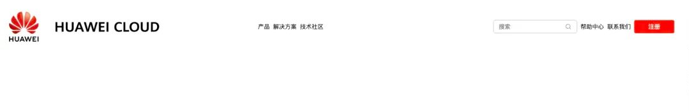

#### 二、 华为云首页 banner 示例（视觉理解模型）

1. 上传华为云首页 banner 截图

   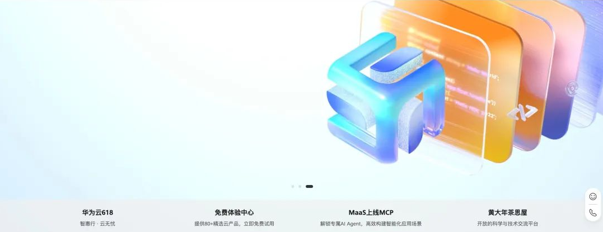

2\. 输入：“根据图片生成 banner 模块，整个模块垂直排列；走马灯铺满整个宽度；卡片模块水平排列，高度 80 宽度平均，定位在走马灯下方，每个卡片内部垂直居中排列。”，生成效果如下

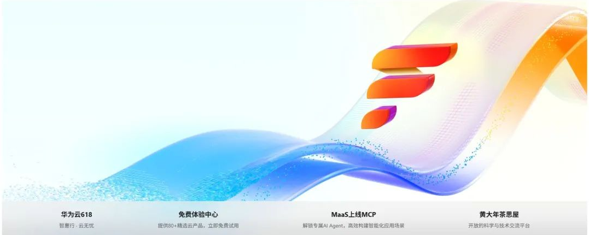

#### 三、 “降本增效，加速企业数字化转型”模块示例（视觉理解模型）

1. 上传华为云首页“降本增效，加速企业数字化转型”模块截图

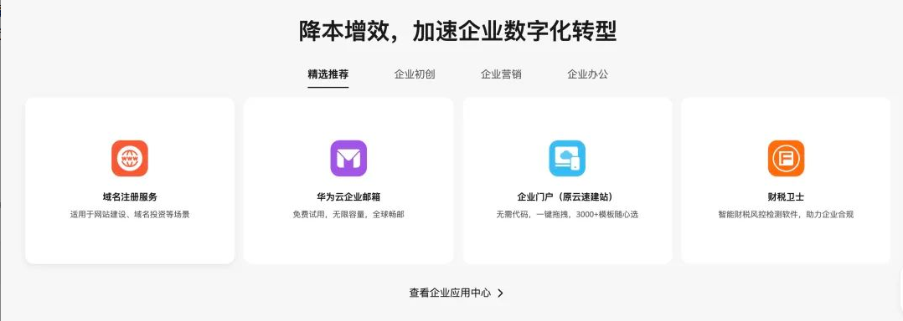

2\. 输入：“根据上传图片生成“降本增效，加速企业数字化转型”模块，模块垂直排列。每个卡片需要添加边框阴影且卡片宽高一致，卡片内部垂直居中排列，；顶部标题，居中显示；使用 TinyTabs 组件；每个卡片内部小图片宽高一致。”，生成效果如下

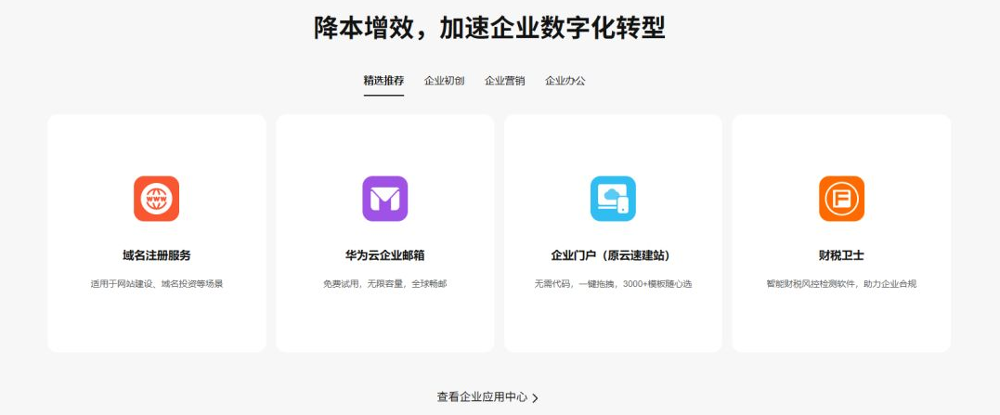

#### 四、 “全球基础设施”模块示例（视觉理解模型）

1. 上传华为云首页“全球基础设施”模块截图

2\. 输入：“根据上传图片生成"全球基础设施"模块。每个数据和文本垂直居中排列。”，生成效果如下

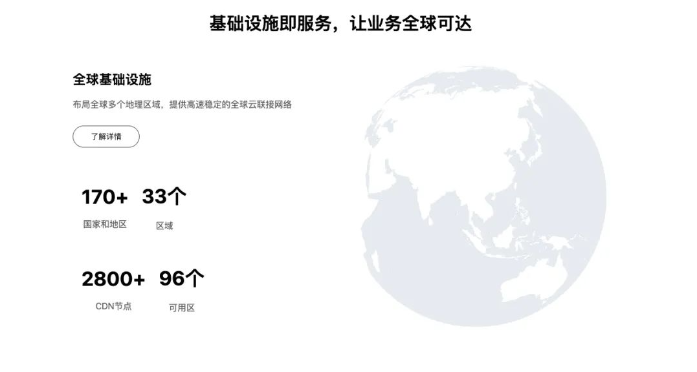

#### 其余模块描述参考

<strong>“技术即服务，让创新触手可及”模块提问示例：</strong>
根据上传图片生成“技术即服务，让创新触手可及”模块，每个卡片需要添加边框阴影且卡片宽高一致，卡片内部垂直居中排列；顶部标题，居中显示；使用 TinyTabs 组件；布局要求模块内部 8 张卡片平均按照两行展示，一行四张卡片；每个卡片内部小图片宽高一致。

<strong>“构筑开放共赢的全球生态”模块提问示例：</strong>
生成“构筑开放共赢的全球生态”的模块。背景图显示在右侧，不要平铺；卡片在最下面展示，每个卡片需要添加边框阴影且宽高一致，卡片内部垂直左侧排列。

<strong>“全球用户”模块提问示例：</strong>
根据上传图片生成“全球用户”模块。使用 TinyTabs 组件，图片用走马灯展示。

<strong>华为云官网 footer 提问示例：</strong>
根据上传的图片，生成华为云官网的 footer。注意背景颜色、文字颜色、字体大小、字体系列、填充、边距、边框等。准确匹配颜色和尺寸。

## 实验总结

TinyEngine 低代码引擎 AI 能力提供了简洁高效的页面生成流程：通过点击左下角 AI 图标启动对话框，运用自然语言指令和图像识别技术，在设计器高效生成符合华为云设计规范的页面模块。
让开发者了解到 TinyEngine 低代码引擎结合 AI 快捷搭建应用的魅力，对低代码提供的强大能力有一定了解，对前言的前端技术方案有所掌握。

## 关于 OpenTiny

欢迎加入 OpenTiny 开源社区。添加微信小助手：opentiny-official 一起参与交流前端技术～\
OpenTiny 官网：**<https://opentiny.design>**\
OpenTiny 代码仓库：**<https://github.com/opentiny>**\
TinyVue 源码：**<https://github.com/opentiny/tiny-vue>**\
TinyEngine 源码：**<https://github.com/opentiny/tiny-engine>**\
欢迎进入代码仓库 Star ⭐ TinyEngine、TinyVue、TinyNG、TinyCLI、TinyEditor\~ 如果你也想要共建，可以进入代码仓库，找到 good first issue 标签，一起参与开源贡献\~
