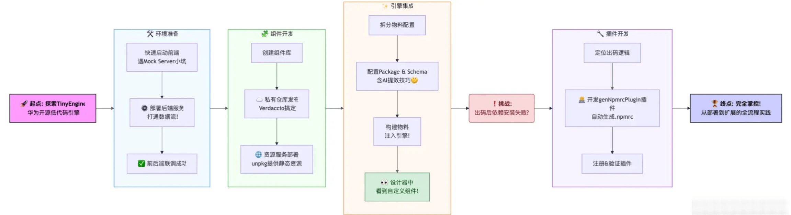
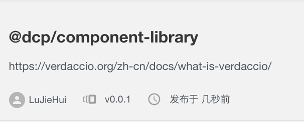
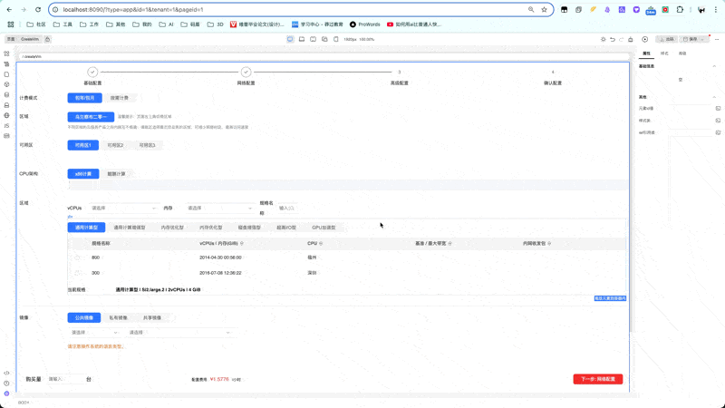
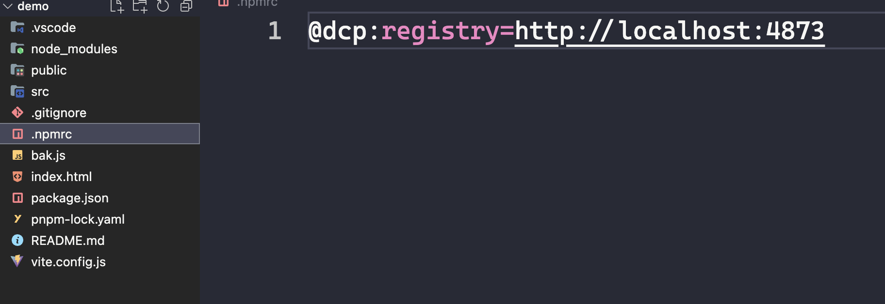

本文由羽毛笔记（chrome 插件）作者、h5vue 作者**观默**原创。

> 本文适合对低代码开发有一定兴趣，并具备 Vue.js、Node.js 及基本命令行操作经验的前端开发者。

## 一起来搞低代码--华为 TinyEngine 上手指南

在深度开发、使用一个月之后，我想来跟你分享一下这款华为开源的低代码引擎--TinyEngine。它基于 Vue3，利用 DSL 实现从 schema 生成源码，支持多框架集成，且拥有强大的插件系统，能实现各种定制化开发的需求。如果你正在寻找一款趁手的低代码引擎或者你对低代码开发感兴趣，那你不妨来试试 TinyEngine。我会用这篇文章手把手带你完成项目搭建、组件库部署与注册并开发一款简单的插件。



## 前端部署

从 [tiny-engine](https://github.com/opentiny/tiny-engine) 拉取 `develop` 分支并安装依赖后就可以直接开启本项目：

```bash
git clone git@github.com:opentiny/tiny-engine.git -b develop
pnpm i
pnpm dev
```

是的，就跟其他项目一样，现在我们可以访问 `localhost:8090` 来初步体验了。


在初步体验之后，发现出码后的项目无法成功安装依赖，这是因为 dev 其实启动了一个 mock server 做为服务端，但是这个 mock server 已经落后于版本需求了（截止到 v2.3）。

所以我们直接进入下一个环节。

## 后端部署

同样从 [tiny-engine-backend-java](https://github.com/opentiny/tiny-engine-backend-java) 部署拉取 `develop` 分支并安装依赖后就可以直接开启本项目，具体步骤请参考[官方说明](https://opentiny.design/tiny-engine#/help-center/course/dev/1201)

可以根据实际情况调整配置信息：`app/src/main/resources/application-dev.yml`：

```yml
server:
  address: 0.0.0.0
  port: 7090

spring:
  # 数据库信息
  datasource:
    username: xxx
    password: xxx
    url: xxx
```

启动后端服务后，我们需要同步调整 tiny-engine 项目中的以下配置：

1. `designer-demo/engine.config.js` 中的`material`属性增加域名信息： <http://localhost:8090/mock/bundle.json> （这里的域名应该是 tiny-engine 的地址，不是后端服务地址）
2. `tiny-engine/designer-demo/env/.env.development` 中`VITE_ORIGIN` 设置为刚刚部署的后端服务地址：`VITE_ORIGIN=http://127.0.0.1:7090`

经过以上配置的调整，我们现在就可以通过 `pnpm serve:frontend` 启动项目了。

经过测试，出码后的项目可以正常安装依赖&运行。

## 组件库搭建与发布

#### 组件库

如果你没有现成的组件库，你可以考虑用我发布到这个组件库项目模板 [component-library-thin](https://github.com/Ljhhhhhh/component-library-thin) 。

```bash
git clone git@github.com:Ljhhhhhh/component-library-thin.git
```

#### verdaccio

组件库可以发布到公网的`npm`，不过我需要用私有仓库，所以就选择 [verdaccio](https://verdaccio.org/zh-cn/)。按照官方说明进行安装并开启服务：

```bash
npm install -g verdaccio
verdaccio
```

开启服务后注意一下给出的配置地址(`/path/to/config.yaml`)，增加这条配置：`listen: 0.0.0.0:4873`，使他可以通过多种地址进行访问。

修改完成后，重启服务。

#### 发布组件库

通过 verdaccio 搭建私有仓库后，我们回到组件库项目并按实际情况来配置组件库中的 `publishConfig` 信息：

```json
"publishConfig": {
    "registry": "http://localhost:4873"
}
```

随后就是打包、添加账号并发布：

```bash
npm build
npm adduser --registry http://localhost:4873/
npm publish
```

发布完成后我们访问 <http://localhost:4873/> 可以看到已经有了刚刚发布的组件信息。



## 组件资源服务

> 如果你是把组件库部署到了公共的`npm`上，可以跳过这部分内容，组件资源可以直接通过 [unpkg](https://unpkg.com/)获取

在 tinyEngine 中，想要注册第三方组件库做为物料需要通过资源服务的方式，那么我们可以用自己部署`unpkg`的方式来提供资源服务。

这里推荐 [lzwme 的 unpkg](git@github.com:lzwme/unpkg.git)，因为官方的 unpkg 需要搭配`CLOUDFLARE`，此项目已经做了一些适配国内网络的工作，可以减少一些心智负担。

在 clone 此项目后，在根目录下新建一个`.env`文件，并根据实际情况写入配置：

```bash
# verdaccio 服务地址
NPM_REGISTRY_URL=http://127.0.0.1:4873

# unpkg 部署信息
ORIGIN=http://127.0.0.1
PORT=4874
```

现在我们可以安装依赖并通过`pnpm serve` 来启动`unpkg`服务了。
启动完成后，可以通过访问`http://127.0.0.1:4874/:package`获取到组件的静态资源。

> 静态资源的地址可以保存一下，下一步就会用到

## 如何注册组件到 TinyEngine

发布了组件库，也提供了静态资源服务，现在就可以在 TinyEngine 中消费我们的组件了。
不过别急，还需要你跟着我一步一步操作：

**第一步：**
基于 mock 下的 bundle.json 拆分组件：`pnpm splitMaterials`，执行此指令会在根目录下生成两部分物料配置文件：

1. materials/packages.json 这个是依赖包的信息
2. materials/components/\*\*.json 这里存放着所有组件的 schema

**第二步：**
追加需要注册的组件库信息到 `materials/packages.json`的 packages 数组，如：

```json
{
  "name": "我的组件库",
  "package": "@dcp/component-library", // 组件库包名
  "version": "0.0.1",
  "script": "http://127.0.0.1:4874/@dcp/component-library@0.0.1/js/component-library.mjs", // 上一步得到的组件静态资源地址
  "destructuring": true, // 引入方式，true=变量引入，false=default 引入
  "npmrc": "@dcp:registry=http://127.0.0.1:4873" // 需要追加到 npmrc 的镜像信息
}
```

**第三步：**
根据[物料协议](https://opentiny.design/tiny-engine#/protocol)添加组件 schema（component.json），这里列举出比较重要的一些配置：

```json
{
  "component": "MainMenuButton",
  "icon": "button",
  "npm": {
    "package": "@dcp/component-library",
    "exportName": "MainMenuButton",
    "version": "0.0.1",
    "script": "http://127.0.0.1:4874/@dcp/component-library@0.0.1/js/component-library.mjs",
    "destructuring": true,
    "npmrc": "@dcp:registry=http://127.0.0.1:4873"
  },
  "group": "customer",
  "category": "button",
  "schema": {
    "properties": {}, // 组件的 props 信息
    "events": {}, // 组件提供的事件
    "slots": {} // 组件的插槽信息
  },
  "snippets": {} // 组件面板配置
}
```

组件配置信息还是挺多的，推荐参考已有的组件 schema 进行学习验证。
当然，我们也可以应用 AI 帮我们生成组件 schema，我在附录中提供了一条 prompt，经过我的多次优化，使用效果还不错。

**第四步：**
按照数据库配置更新根目录下`.env.local`配置：

    SQL_HOST=127.0.0.1
    SQL_PORT=3306
    SQL_USER=root
    SQL_PASSWORD=12345678
    SQL_DATABASE=tiny_engine_data_java

**第五步：**
执行指令：`pnpm buildMaterials`

如果一切正常的话，designer-demo/public/mock/bundle.json 下的配置和数据库的 t_components 表中会插入新增的组件信息。
现在到验收成果的时候了。

执行指令：`pnpm run serve:frontend` 并访问：<http://127.0.0.1:8090/?type=app&id=1&tenant=1&pageid=1>

可以看到我们的组件已经可用：



但是我们出码后会发现无法安装依赖，并提示找不到组件库对应的包地址。
这是因为我们私有化部署的组件库还需要提供对应的私库地址，那我们动手实现一个 npmrc 文件生成的插件吧。

## 源码开发-出码生成 npmrc 文件

> 建议先从官网教程了解插件开发：<https://opentiny.design/tiny-engine#/help-center/course/dev/17>

#### debug 思路

通过 Vue DevTools 可以定位到`DesignToolbars` 组件
再根据 css 类定位到 toolbar-right-content 对应的 div，可以看到左侧的按钮是通过遍历`state.rightBar`得到的。
对 `DesignToolbars`进行 debug，可以看到 `state.rightBar` 数据如下：

```json
[
  ["engine.toolbars.themeSwitch", "engine.toolbars.redoundo", "engine.toolbars.clean"],
  ["engine.toolbars.preview"],
  ["engine.toolbars.generate-code", "engine.toolbars.save"]
]
```

合理猜测，出码对应的是`engine.toolbars.generate-code`，通过全局查询，可以在`packages/toolbars`下找到`generate-code` 这个插件

从 `gererate` 函数找到生成文件函数：`getPreGenerateInfo`，继续追查找到 `generateAppCode`，发现此函数从`engine.service.generateCode` 得到

继续追查，发现 `generateAppCode` 核心为 `@opentiny/tiny-engine-dsl-vue` 导入的`generateApp`。
那就直接找到 `name` 为 `@opentiny/tiny-engine-dsl-vue` 的包。

通过`@opentiny/tiny-engine-dsl-vue`下的`generateApp`方法，可以看到它主要是调用各种内置的插件进行文件的生成，比如`genDependenciesPlugin`。

#### 具体实现

那么我们可以模仿`genDependenciesPlugin`来写一个`genNpmrcPlugin`：

```js
import { mergeOptions } from '../utils/mergeOptions'
import { parseImport } from '@/generator/vue/sfc/parseImport'

const defaultOption = {
  fileName: '.npmrc',
  path: '.'
}

const getComponentsSet = (schema) => {
  const { pageSchema = [], blockSchema = [] } = schema
  let allComponents = []

  pageSchema.forEach((pageItem) => {
    allComponents = allComponents.concat(parseImport(pageItem.children || [])?.components || [])
  })

  blockSchema.forEach((blockItem) => {
    allComponents = allComponents.concat(parseImport(blockItem.children || [])?.components || [])
  })

  return new Set(allComponents)
}

const parseSchema = (schema) => {
  const { componentsMap = [] } = schema
  const resDeps = []
  const componentsSet = getComponentsSet(schema)

  for (const { package: packageName, npmrc, componentName } of componentsMap) {
    if (
      npmrc &&
      packageName &&
      componentsSet.has(componentName) &&
      resDeps.findIndex((item) => item === npmrc) === -1
    ) {
      resDeps.push(npmrc)
    }
  }

  return resDeps
}

function genNpmrcPlugin(options = {}) {
  const realOptions = mergeOptions(defaultOption, options)

  const { path, fileName } = realOptions

  return {
    name: 'tinyEngine-generateCode-plugin-npmrc',
    description: 'add package dependencies to .npmrc',
    /**
     * 分析依赖，写入 package.json
     * @param {import('@opentiny/tiny-engine-dsl-vue').IAppSchema} schema
     * @returns
     */
    run(schema) {
      const npmrcInfo = parseSchema(schema)
      const originNpmrcItem = this.getFile(path, fileName)

      // 如果没有 .npmrc 文件，直接写入
      if (!originNpmrcItem) {
        this.addFile({ fileType: 'npmrc', fileName, path, fileContent: npmrcInfo.join('\n') }, true)
        return
      }

      // 如果有 .npmrc 文件，需要先读取文件内容，进行合并去重
      const originNpmrcContent = originNpmrcItem.fileContent
      const newNpmrcContent = [...new Set([...npmrcInfo, ...originNpmrcContent])].join('\n')

      this.addFile({ fileType: 'npmrc', fileName, path, fileContent: newNpmrcContent }, true)
    }
  }
}

export default genNpmrcPlugin
```

剩下的就是注册此插件，然后 build 一下当前包之后，就可以去验收成果了：



成功生成`.npmrc`，且内容正确，可以成功安装依赖。

## 结语

通过这一趟实践旅程，我们不仅让 TinyEngine 在本地顺利运行起来，更重要的是，我们亲手打通了从搭建私有组件库、配置资源服务，到将其无缝融入 TinyEngine 物料体系，乃至最终通过编写插件解决实际工程问题的完整闭环。这不仅仅是一次技术的演练，更是对 TinyEngine 作为一款开源低代码引擎其强大扩展性和定制能力的深度体验。

希望这篇指南能为你揭开 TinyEngine 的面纱，让你感受到它在提升开发效率、应对复杂场景方面的潜力。掌握这些基础后，你将能更自信地去探索 TinyEngine 提供的丰富功能，构建更复杂的低代码应用，甚至为这个充满活力的开源社区贡献自己的一份力量。低代码的世界广阔，而 TinyEngine 无疑是其中值得你深入探索的利器。

## 附录

#### 组件 schema 生成 prompt

    给 Vue 组件生成符合 OpenTiny 规范的组件 Schema，请按照以下详细步骤执行:

    # 预习

    通过了解 @componentSchema/TinyButton.json @componentSchema/TinyCheckbox.json 的数据，了解组件的 schema 格式规范

    # 第一步：全局信息提取

    1. 组件基本信息

       - id: 1
       - version: 从 package.json 中提取
       - component: 从 defineComponent 的 name 属性提取组件名称
       - 根据组件功能，生成符合规范的中文名称及描述
       - 根据组件类型，选择适当的 icon & group & category

    2. 配置 npm 相关信息

       - package: 从 package.json 中提取 name
       - exportName: 使用组件名
       - version: 从 package.json 中提取 version
       - script: http://localhost:4874/@dcp/component-library@0.0.1/dist/componet-library.mjs
       - destructuring: 是否需要解构
       - npmrc: @dcp:registry=http://localhost:4873

    3. 配置 configure 节点
       - 设置 loop、condition、styles 等基础配置项(通常都为 true)
       - 根据组件特性设置 isContainer、isModal、isPopper 等值
       - 定义快捷属性(shortcuts.properties)，选择 3-5 个最重要的属性

    # 第二步：props 属性分析

    1. 遍历组件的所有 props 定义

       - 提取每个 prop 的名称、类型、默认值和验证规则
       - 识别 prop 是否具有 required 属性
       - 分析 prop 的用途(根据名称和组件逻辑)

    2. 属性分类

       - 将属性按功能分组：基础属性、样式属性、高级属性等
       - 为每个分组创建合适的中文标签和描述

    3. 详细属性映射
       对每个属性生成规范的 schema 描述:
       - property: 属性名
       - label: 中文显示名称
       - description: 详细功能描述
       - type: 数据类型(string, number, boolean, object 等)
       - defaultValue: 默认值
       - widget: 基于属性类型选择适当的组件
         - 字符串类型 → InputConfigurator
         - 数字类型 → NumberConfigurator (添加 min/max/step 参数)
         - 布尔类型 → SwitchConfigurator
         - 颜色值 → ColorConfigurator
         - 下拉选项 → SelectConfigurator
         - 复杂对象/数组 → CodeConfigurator (JSON 编辑器)

    # 第三步：事件分析

    1. 识别组件中的所有事件(emit)调用

       - 提取事件名称、参数信息
       - 分析事件触发条件和上下文

    2. 为每个事件创建规范的事件描述
       - 生成事件名称(通常以"on"开头，如 onClick)
       - 创建中文标签和描述
       - 定义 functionInfo，包括 params(参数定义)和 returns

    # 第四步：插槽分析(如果有)

    1. 识别组件模板中的<slot>标签

       - 记录插槽名称、默认内容和使用场景
       - 确定是否为具名插槽、作用域插槽

    2. 在 schema 中添加对应的插槽配置(如需要)

    # 第五步：snippets 示例代码生成

    1. 创建多个有代表性的使用示例

       - 默认配置示例
       - 不同功能组合的典型示例(2-3 个)
       - 特殊场景示例(如有)

    2. 为每个示例定义:
       - name: 中文名称
       - icon: 图标
       - snippetName: 使用唯一标识符
       - schema.props: 设置属性值

    # 第六步：校验与优化

    1. 确保生成的 schema 符合 OpenTiny 协议规范

       - 检查必填字段是否完整
       - 验证结构是否符合规范要求

    2. 对属性分组进行优化

       - 确保分组逻辑清晰
       - 属性配置符合用户习惯

    3. 完善描述文本
       - 确保描述准确表达属性功能
       - 添加使用提示和最佳实践建议

    # 第七步：最终输出

    生成完整的 JSON 结构，包含:

    - id 和 version 信息
    - name、component 和描述信息
    - npm 配置
    - group/category 分类
    - configure 配置
    - schema 定义(properties 和 events)
    - snippets 示例代码

    # 校验

    与现有的其他组件 schema 比对，校验生成的 schema 数据结构一致，配置完整度，如果发现不一致，需要进行调整

    # 输出

    将生成的 schema 文件输出到 componentSchema 目录下

## 关于 OpenTiny

欢迎加入 OpenTiny 开源社区。添加微信小助手：opentiny-official 一起参与交流前端技术～\
OpenTiny 官网：**<https://opentiny.design>**\
OpenTiny 代码仓库：**<https://github.com/opentiny>**\
TinyVue 源码：**<https://github.com/opentiny/tiny-vue>**\
TinyEngine 源码： **<https://github.com/opentiny/tiny-engine>**\
欢迎进入代码仓库 Star🌟TinyEngine、TinyVue、TinyNG、TinyCLI、TinyEditor\~ 如果你也想要共建，可以进入代码仓库，找到 good first issue 标签，一起参与开源贡献\~
