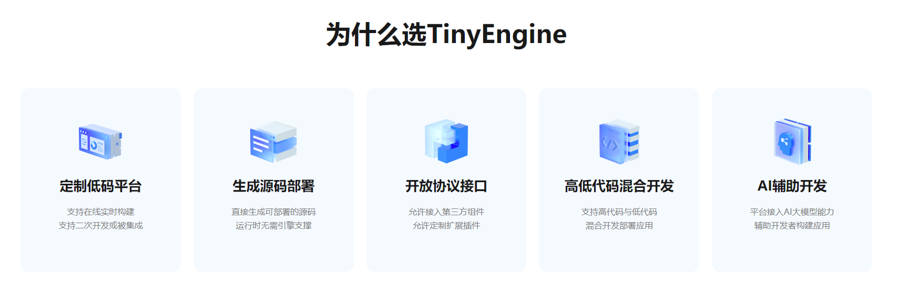
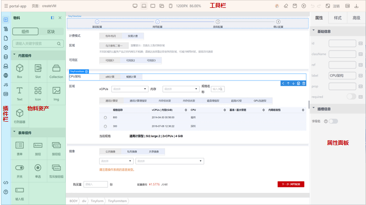
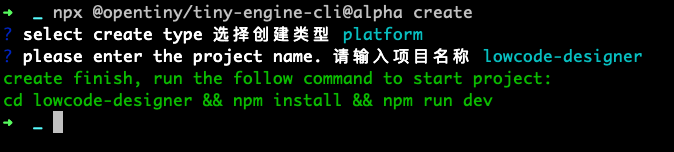
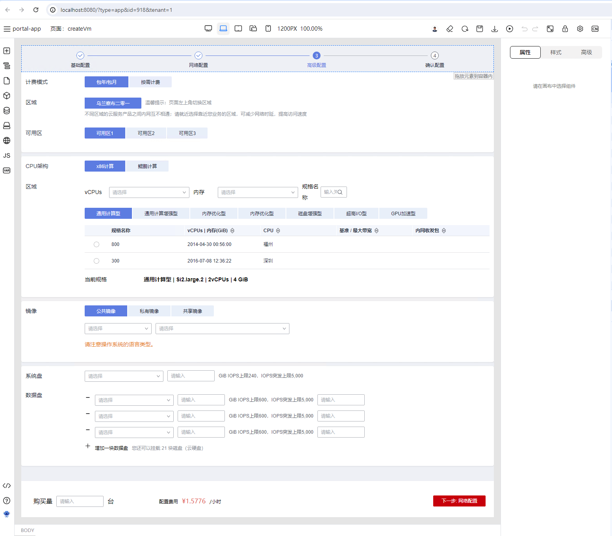
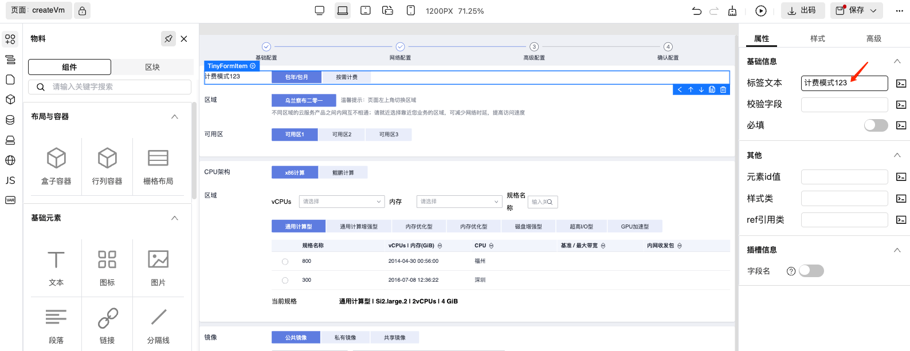
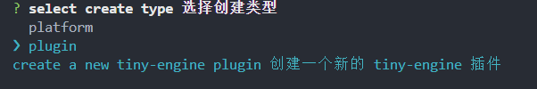
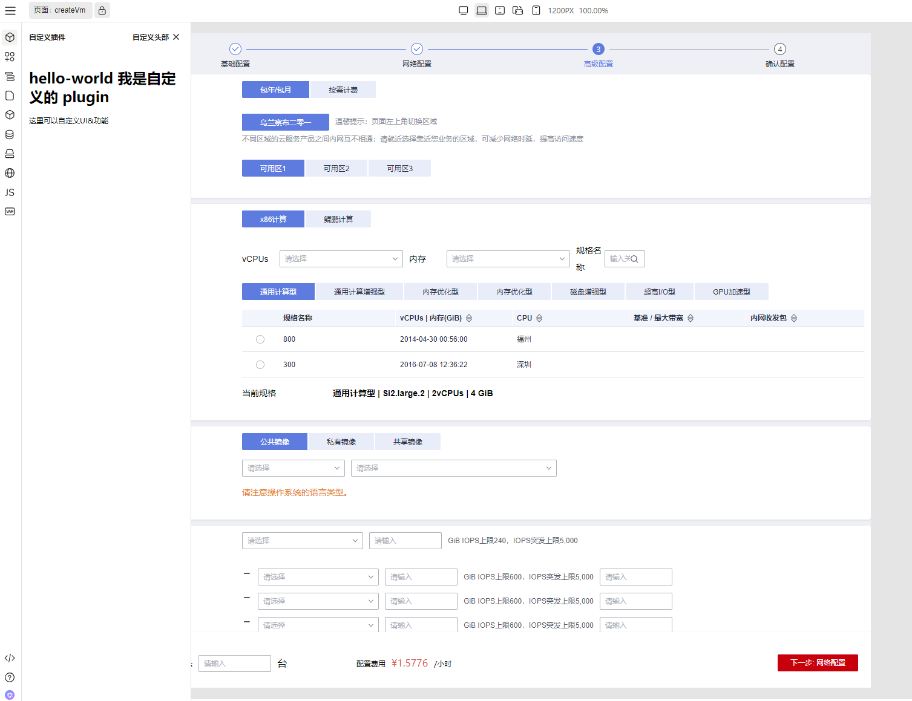

## 1.背景介绍

### 1.1 TinyEngine 低代码引擎简介

低代码开发是近些年非常热门的一种开发方式，用户可以通过可视化的方式，简单拖拽，不写代码或者编写少量代码，类似搭积木一样搭建业务应用。

TinyEngine 是一个强大的低代码引擎，可以帮助开发者快速定制自己的低代码设计器或者低代码平台。



TinyEngine 可以作为低代码平台的底座，提供可视化搭建页面等基础能力，既可以通过线上搭配组合使用，也可以通过 cli 创建个人工程进行二次开发，实时定制出自己的低代码平台。适用于多场景的低代码平台开发，如：资源编排、服务端渲染、模型驱动、移动端、大屏端、页面编排等。

TinyEngine 由 OpenTiny 团队 2023 年开源，也欢迎大家点 Star 和 提 Issue、PR 进行反馈。

- TinyEngine 官网：<https://opentiny.design/tiny-engine#/home>
- TinyEngine 在线 demo：<https://opentiny.design/tiny-engine#/tiny-engine-editor>
- TinyEngine 代码库：<https://github.com/opentiny/tiny-engine>

### 1.2 TinyEngine 插件化构建简介



TinyEngine 引擎使用插件化架构，功能模块都由一个个插件构成，例如图片中页面上方的工具栏、左侧的插件栏、右侧的属性配置栏，以及中间的画布区域，都由一个个插件构成，通过插件化的架构，可以灵活配置、自由组装出个性化的设计器。

### 1.3 TinyEngine CLI 简介

TinyEngine 还提供了 CLI 工具方便用户二次开发，通过 CLI，一行命令即可基于 TinyEngine 创建出全新的低代码项目、低代码插件项目，未来还会陆续增加创建设置器插件，创建新主题，新布局，新物料包等能力。

## 2. 实验介绍

本实验主要通过体验使用 TinyEngine 几行命令快速创建一个用户专属低代码设计器，及通过开发一个新的侧边栏插件， 帮助开发者快速了解基于 TinyEngine 二次开发定制的能力。

### 2.1 实验目标

- 使用 TinyEngine CLI，通过一行命令创建全新低代码设计器，了解基于 TinyEngine 创建个性化低代码设计器/平台、二次开发的能力。
- 体验 TinyEngine 简单拖拽、配置 的开发形式帮助开发者快速了解低代码开发使用流程。
- 完成开发一个新的基础侧边栏插件，并集成到设计器中，了解基于 TinyEngine 扩展设计器功能的能力。

### 2.2 实验环境准备

在开始实验步骤之前，先确保我们的开发环境以及工具齐全：

- Node.js v18+版本、pnpm 包管理工具。
- vscode 代码编辑器、git 代码版本管理工具。
- chrome 浏览器 110+ 版本。
- 必要的开发前端开发环境、工具等。

## 3. 实践步骤

### 3.1 一行命令创建自己的专属低代码设计器

#### 3.1.1 创建低代码设计器

执行 engine-cli create，选择 platform 以创建一个新的设计器

```sh
npx @opentiny/tiny-engine-cli@alpha create
```

执行后首次会提示是否安装`@opentiny/tiny-engine-cli`，输入“Y”并回车

之后会提示选择要创建类型，选择 platform 之后，输入设计器名称，如：lowcode-designer，即可完成新设计器项目的创建。

查看当前文件目录，看发现已经创建出了 lowcode-designer 代码目录。



#### 3.1.2 启动低代码设计器

执行下面命令安装依赖并启动项目：

```shell
# 安装依赖
npm install

# 启动项目
npm run dev
```

启动完项目之后，我们应该能看到浏览器打开的默认的低代码设计器：



#### 3.1.3 体验低代码设计器

之后可以体验下低代码开发方式：

- 拖拽物料面板中组件到中间画布中
- 在右侧属性面板中修改属性值观察画布中的变化
- 在画布中拖拽组件调整组件的布局与位置



### 3.2 通过开发插件扩展设计器新功能

#### 3.2.1 一行命令创建新插件

另起一个终端，输入下面命令，选择创建 plugin 类型，创建一个新的插件

```shell
npx @opentiny/tiny-engine-cli@alpha create
```



输入插件名称：demo-plugin

之后就可以在 demo-plugin 目录看到新创建的插件，进去该目录安装依赖：

```shell
cd demo-plugin && npm install
```

#### 3.2.2 将插件接入设计器

使用 VS Code 打开设计器项目，修改 registry.js

```diff
import { Breadcrumb, Fullscreen, /* ... */, GenerateCodeService } from '@opentiny/tiny-engine'
import engineConfig from './engine.config'
++ import DemoPlugin from './demo-plugin'

export default {
 // ...
--  plugins: [Materials, Tree, Page, Block, Datasource, Bridge, I18n, Script, State, Schema, Help, Robot],
++  plugins: [DemoPlugin, Materials, Tree, Page, Block, Datasource, Bridge, I18n, Script, State, Schema, Help, Robot],
  dsls: [{ id: 'engine.dsls.dslvue' }],
  settings: [Props, Styles, Events],
  canvas: Canvas
}

```

#### 3.2.3 开发调试插件

重新打开项目页面，可以看到侧边栏多了一个新的插件：



修改插件代码，设计器界面也会实时刷新。

之后可以尝试完成以下功能：

- 为插件实现一个“添加按钮”，点击按钮展开插件二级页面
- 在二级面板中添加一个输入框，并实现保存功能，点击保存按钮将输入框内容显示到一级面板中

如此即完成了一个简单的 TinyEngine 侧边栏插件开发全流程。

## 4. 总结

本实践活动指导通过使用 TinyEngine CLI 创建一个全新设计器，上手体验低代码能力，并开发新的侧边栏插件扩展设计器能力，掌握基于 TinyEngine 定制设计器与插件的方式，了解 TinyEngine 的插件化架构与插件扩展能力。但实验中的部分只是 TinyEngine 扩展定制能力的一个缩影，TinyEngine 提供了各种灵活的自定义能力，期待您的继续使用。

## 5. 关于 OpenTiny

OpenTiny 官网：<https://opentiny.design>\
TinyVue 源码：<https://github.com/opentiny/tiny-vue（欢迎> Star ⭐）\
TinyEngine 源码：<https://github.com/opentiny/tiny-engine（欢迎> Star ⭐）\
B 站：<https://space.bilibili.com/15284299>\
欢迎加入 OpenTiny 开源社区。添加微信小助手 opentiny-official 一起参与交流前端技术～
