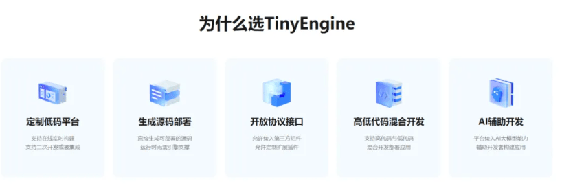
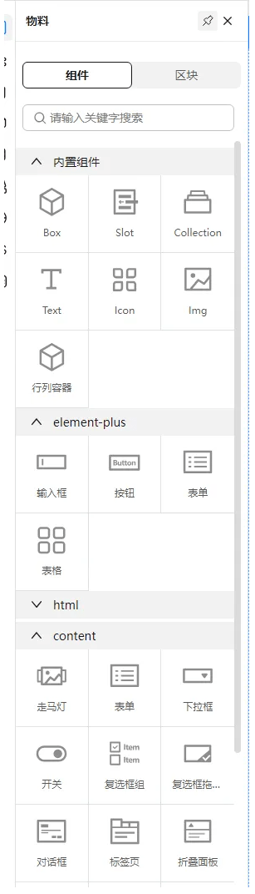
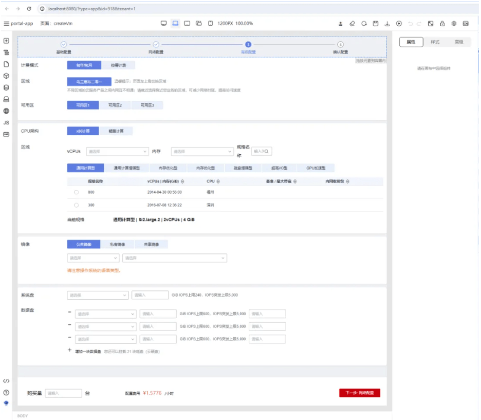
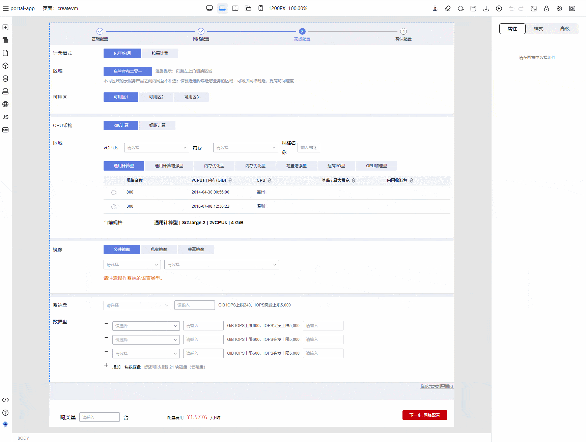
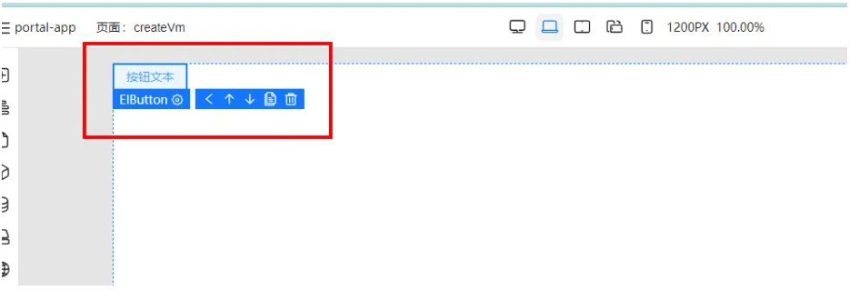
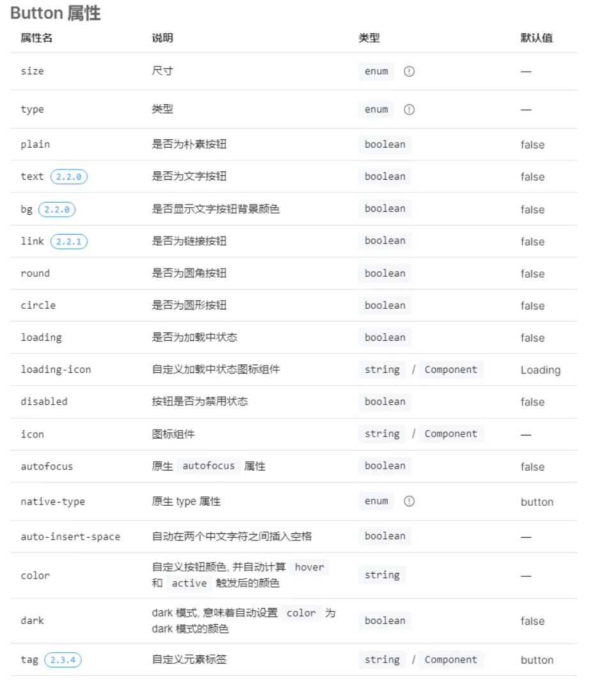
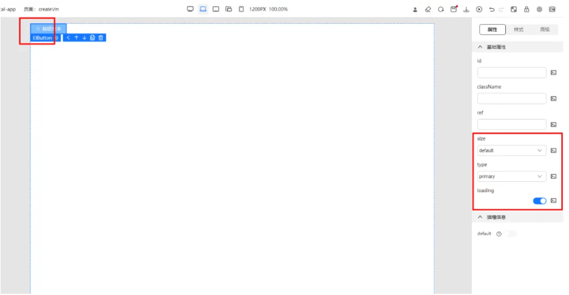
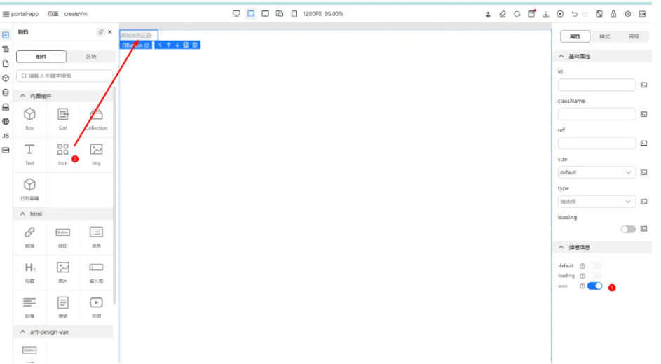

本文由体验技术团队 TinyEngine 项目成员炽凌创作，欢迎大家实操体验，本体验内容基于 TinyEngine 低代码引擎提供的环境，介绍了如何通过 TinyEngine 低代码引擎实现三方物料集成，帮助开发者快速开发。

## 知识背景

### 1.1 TinyEngine 低代码引擎简介

- TinyEngine 是 OpenTiny 团队 2023 年开源的一个低代码引擎。使能开发者定制低代码平台。它是低代码平台的底座，提供可视化搭建页面等基础能力，既可以通过线上搭配组合，也可以通过下载源码进行二次开发，实时定制出自己的低代码平台。适用于多场景的低代码平台开发，如：资源编排、服务端渲染、模型驱动、移动端、大屏端、页面编排等。

- 代码托管 GitHub：<https://github.com/opentiny/tiny-engine>  （欢迎大家 Star 和 提 Issue、PR 进行反馈）
- TinyEngine 官网：<https://opentiny.design/tiny-engine#/home>
- TinyEngine 在线 demo：<https://opentiny.design/tiny-engine#/tiny-engine-editor>



### 1.2 TinyEngine 第三方物料集成简介

- TinyEngine 默认自带 TinyVue 组件库的物料。同时也支持集成其他第三方组件库比如 Element Plus 、Ant Design Vue 或者是业务方自己的业务组件库。



## 三方物料集成指导说明

### 2.1 项目初始化

在进行项目初始化之前，先确保开发环境以及工具齐全：

- Node.js v16+版本、pnpm 包管理工具。
- vscode 代码编辑器、git 代码版本管理工具。
- chrome 浏览器 110+ 版本。
- 必要的前端开发环境、工具等。

工具齐全之后，开始克隆项目：

```shell
# 从 github 中克隆项目
git clone https://github.com/opentiny/tiny-engine.git

# 从 gitee 中克隆项目
git clone https://gitee.com/opentiny/tiny-engine.git
```

安装依赖并启动项目：

```shell
# 安装依赖，如果没有 pnpm 工具，可以先执行 npm i -g pnpm 安装
pnpm install

# 拆分原有物料
pnpm splitMaterials

# 持续监听构建物料
pnpm buildMaterials

# 另开一个终端，本地启动低代码引擎
pnpm dev
```

启动完项目之后，可以看到浏览器打开的默认的页面编排设计器：



打开清空当前页面，打开物料面板尝试拖拽添加物料。



至此，已经完成了启动 TinyEngine 低代码引擎并使用物料在画布进行编排的功能。

接下来，导入第三方的组件库的组件，这里以 Element Plus 组件库的 Button 组件为例。

导入组件库的组件大致分为两步：

- 获取组件库 esm 的运行时产物地址，根据物料协议添加组件，拖入画布确认能正常渲染显示。
- 根据组件文档添加 schema 配置，方便在画布中进行选中之后能够在属性面板配置组件的属性。

### 2.2 配置添加基本物料

为了能够添加组件，可以先在项目根目录的 materials/components 路径下添加对应的组件 json 文件，比如，添加 Element Plus 组件库的 Button 组件，那么就在该路径下面添加 ElButton.json 文件。

文件里的内容，大致就是根据物料协议文档进行添加：<https://opentiny.design/tiny-engine#/protocol> 。

下面添加一个示例，该示例代码添加了 ElementPlus 组件库的 Button 组件，并包含了基本的字段：

- npm：npm 字段描述了该组件所属的 package（组件库），以及版本、esm 画布运行时、导出名称等等信息
- component：component 字段是 esm 画布运行时导出的名称。
- schema：schema 描述了该组件支持的配置属性，在画布选中组件之后，在右侧属性面板会展示 schema 配置的可配置属性。
- snippets：snippets 为一个数组，表示改组件在左侧物料面板中展示的内容。
- snippets.schema ：该 schema 为预置的一些 children、属性配置等等。可以让用户拖出即可用，达到零配置的效果。
- 等等...

```json
{
  "id": 1,
  "version": "2.4.2",
  "name": {
    "zh_CN": "按钮"
  },
  "component": "ElButton",
  "icon": "button",
  "description": "常用的操作按钮",
  "doc_url": "",
  "screenshot": "",
  "tags": "",
  "keywords": "",
  "dev_mode": "proCode",
  "npm": {
    // 组件库名称
    "package": "element-plus", // 组件库版本
    "version": "2.4.2", // 组件库 esm 运行时
    "script": "https://unpkg.com/element-plus@2.4.2/dist/index.full.mjs", // 组件库 css 样式表
    "css": "https://unpkg.com/element-plus@2.4.2/dist/index.css",
    "dependencies": null, // 组件库导出名
    "exportName": "ElButton"
  },
  "group": "基础组件",
  "category": "element-plus",
  "configure": {
    "loop": true,
    "condition": true,
    "styles": true,
    "isContainer": true,
    "isModal": false,
    "isPopper": false,
    "nestingRule": {
      "childWhitelist": "",
      "parentWhitelist": "",
      "descendantBlacklist": "",
      "ancestorWhitelist": ""
    },
    "isNullNode": false,
    "isLayout": false,
    "rootSelector": "",
    "shortcuts": {
      "properties": ["type", "size"]
    },
    "contextMenu": {
      "actions": ["copy", "remove", "insert", "updateAttr", "bindEevent", "createBlock"],
      "disable": []
    },
    "invalidity": [""],
    "clickCapture": true,
    "framework": "Vue"
  },
  "schema": {
    "properties": [
      {
        "name": "0",
        "label": {
          "zh_CN": "基础属性"
        }, // 这里配置组件可配置属性
        "content": [
          {
            "property": "size",
            "label": {
              "text": {
                "zh_CN": "size"
              }
            },
            "description": {
              "zh_CN": "尺寸"
            },
            "required": true,
            "readOnly": false,
            "disabled": false,
            "cols": 12,
            "labelPosition": "top",
            "type": "string",
            "defaultValue": "default",
            "widget": {
              "component": "MetaSelect",
              "props": {
                "options": [
                  {
                    "label": "large",
                    "value": "large"
                  },
                  {
                    "label": "default",
                    "value": "default"
                  },
                  {
                    "label": "small",
                    "value": "small"
                  }
                ]
              }
            }
          }
        ],
        "description": {
          "zh_CN": ""
        }
      }
    ],
    "events": {}, // 插槽声明定义
    "slots": {}
  },
  "snippets": [
    // 物料面板的配置
    {
      "name": {
        "zh_CN": "按钮"
      },
      "icon": "button",
      "screenshot": "",
      "snippetName": "ElButton",
      "schema": {
        "children": [
          {
            "componentName": "Text",
            "props": {
              "text": "按钮文本"
            }
          }
        ]
      }
    }
  ]
}
```

添加保存以上内容，刷新页面，并从物料面板中拖拽出来 ElButton 组件，发现可以正常渲染。



至此，已经实现了如何添加一个第三方物料到 TinyEngine 低代码引擎中，接下来，可以进一步完善物料配置，可以直接右侧属性面板进行组件的相关属性配置。

### 2.3 添加物料配置描述

无论是基础公共组件库还是业务组件库，每个组件都会存在一些配置，方便用户定制化一些组件的表现行为以及样式。同样的，在画布拖拽编排好组件之后，可能需要对组件进行一些配置，这需要根据物料协议以及组件文档添加可配置项。

以 Element Plus 的 Button 组件为例：



假如需要添加 type、size、loading 等三个可配置属性项，则可以添加如下的属性配置项：

以下代码主要在 schema.properties[0].content 中添加了 type、size、loading 等三个属性。主要有几个关键属性：

- property：property 属性值与组件的可配置属性项一一对应。即 size -> size 、type -> type、loading -> loading
- label：label 对应右侧属性面板显示的可配置项描述。
- description：对 label 的更详细补充描述。
- widget：用于配置该属性的表单配置。如 type 可以用下拉选择框让用户选择对应的 type，loading 则可以用 switch 开关配置。
- widget.component：描述使用什么配置组件
- widget.props：描述改配置组件的 props。
- 等等....

```json
{
  "component": "ElButton", // ... 参考上述原有配置
  "schema": {
    // 这里添加可配置属性数组
    "properties": [
      {
        "label": {
          "zh_CN": "基础属性"
        },
        "content": [
          {
            // property 代表可配置属性为 size
            "property": "size", // label 是展示在属性面板的可配置项名称
            "label": {
              "text": {
                "zh_CN": "size"
              }
            }, // 对可配置项的描述
            "description": {
              "zh_CN": "尺寸"
            },
            "required": false,
            "readOnly": false,
            "disabled": false,
            "cols": 12,
            "labelPosition": "top",
            "type": "string",
            "defaultValue": "default",
            "widget": {
              // 可配置项是一个下拉框
              "component": "MetaSelect", // 下拉框的可选值，有 large、default、以及 small
              "props": {
                "options": [
                  {
                    "label": "large",
                    "value": "large"
                  },
                  {
                    "label": "default",
                    "value": "default"
                  },
                  {
                    "label": "small",
                    "value": "small"
                  }
                ]
              }
            }
          },
          {
            "property": "type",
            "label": {
              "text": {
                "zh_CN": "type"
              }
            },
            "description": {
              "zh_CN": "类型"
            },
            "required": false,
            "readOnly": false,
            "disabled": false,
            "cols": 12,
            "labelPosition": "top",
            "type": "string",
            "widget": {
              "component": "MetaSelect",
              "props": {
                "options": [
                  {
                    "label": "primary",
                    "value": "primary"
                  },
                  {
                    "label": "success",
                    "value": "success"
                  },
                  {
                    "label": "warning",
                    "value": "warning"
                  },
                  {
                    "label": "danger",
                    "value": "danger"
                  },
                  {
                    "label": "info",
                    "value": "info"
                  }
                ]
              }
            }
          },
          {
            "property": "loading",
            "label": {
              "text": {
                "zh_CN": "loading"
              }
            },
            "description": {
              "zh_CN": "是否为加载中状态"
            },
            "required": false,
            "readOnly": false,
            "disabled": false,
            "cols": 12,
            "labelPosition": "top",
            "type": "string",
            "widget": {
              "component": "MetaSwitch",
              "props": {}
            },
            "device": []
          }
        ]
      }
    ]
  }
}
```

添加完之后，保存文件，刷新浏览器，重新拖入 ElButton 组件并选中。会发现右侧属性面板添加上了配置的属性配置项。



经过此步骤，就顺利完成了在物料中添加可配置选项这一环节。这使得用户也可以在画布中方便地配置属性并复用组件。

### 2.4 配置物料插槽

除了属性配置之外，还有一种特殊的配置：插槽配置。某些组件会内置特定的插槽，让用户可以自定义组件中某一部分的 UI 或者行为。以 Element Plus 中的 Button 组件为例，该组件提供了 default、loading、icon 三个插槽。同样，TinyEngine 的物料协议支持配置插槽的可选项，用户可以在设置面板中启用插槽开关，然后往插槽拖入内容。

以下是配置 Element Plus Button 组件的 icon 插槽的配置示例：

该示例主要在 schema 结构下添加了 slots 配置。

- slots.xxx： xxx 代表插槽名称。
- slots.xxx.label：代表在右侧属性面板显示的名称。
- slots.xxx.description：对 label 的补充描述（默认 hover 之后才会显示）。

```json
{
  "component": "ElButton", // ... 参考上述原有配置
  "schema": {
    // 这里添加可配置属性数组
    "properties": [
      {
        "label": {
          "zh_CN": "基础属性"
        },
        "content": [
          {
            // property 代表可配置属性为 size
            "property": "size", // label 是展示在属性面板的可配置项名称
            "label": {
              "text": {
                "zh_CN": "size"
              }
            }, // 对可配置项的描述
            "description": {
              "zh_CN": "尺寸"
            },
            "required": false,
            "readOnly": false,
            "disabled": false,
            "cols": 12,
            "labelPosition": "top",
            "type": "string",
            "defaultValue": "default",
            "widget": {
              // 可配置项是一个下拉框
              "component": "MetaSelect", // 下拉框的可选值，有 large、default、以及 small
              "props": {
                "options": [
                  {
                    "label": "large",
                    "value": "large"
                  },
                  {
                    "label": "default",
                    "value": "default"
                  },
                  {
                    "label": "small",
                    "value": "small"
                  }
                ]
              }
            }
          }
        ]
      }
    ],
    "slots": {
      // default  默认插槽
      "default": {
        "label": {
          "zh_CN": "default"
        },
        "description": {
          "zh_CN": "自定义默认内容"
        }
      }, // icon 自定义图标插槽，打开该开关之后，用户可以自定义 icon
      "icon": {
        "label": {
          "zh_CN": "icon"
        },
        "description": {
          "zh_CN": "自定义图标组件"
        }
      }
    }
  }
}
```

保存文件，刷新页面，重新拖入 ElButton 组件。即可测试自定义图标功能。



至此，就实现了如何添加第三方组件，并根据第三方组件的属性文档添加属性可配置项。

### 2.5 使用预览功能

添加完成后，开发者也可以发挥自己的想象力，使用已有组件和添加的两个按钮组件进行搭建页面。并使用页面预览功能完成渲染。

## 关于 OpenTiny

OpenTiny 是一套企业级 Web 前端开发解决方案，提供跨端、跨框架、跨版本的 TinyVue 组件库，包含基于 Angular+TypeScript 的 TinyNG 组件库，拥有灵活扩展的低代码引擎 TinyEngine，具备主题配置系统 TinyTheme / 中后台模板 TinyPro/ TinyCLI 命令行等丰富的效率提升工具，可帮助开发者高效开发 Web 应用。

欢迎加入 OpenTiny 开源社区。添加微信小助手：opentiny-official 一起参与交流前端技术～  
OpenTiny 官网：**<https://opentiny.design/>**
OpenTiny 代码仓库：**<https://github.com/opentiny/>**
TinyVue 源码：**<https://github.com/opentiny/tiny-vue>**  
TinyEngine 源码： **<https://github.com/opentiny/tiny-engine>**  
欢迎进入代码仓库 Star🌟TinyEngine、TinyVue、TinyNG、TinyCLI~ 如果你也想要共建，可以进入代码仓库，找到  good first issue 标签，一起参与开源贡献~
