本文由体验技术团队 TinyEngine 项目组成员创作~

在 TinyEngine 开源后，对私有化部署存在诉求的用户越来越多，而当前 TinyEngine 多项内容都依托在公网中，当前官网提供的区块发布方案，为公网环境下的发布，不能完全满足部分用户的需求。因此需要提供用户能够在内网环境下，也能够正常使用 TinyEngine 的全部功能的方案。

现在提出区块发布私有化的两种解决方案给用户自行选择：

- 将区块发布到 npm 私仓中，搭建内部的 unpkg 和私仓环境
- 将区块发布到数据库中，从库中直接读取区块产物。

> **推荐使用第一种方式**，因为采用私仓的方式能尽可能保留我们当前的模式，以及能够使用区块版本浮动功能，并且在我们基础物料组件库中，我们也能将组件库上传到私仓里，达到基础物料的私有化。

注：

- 搭建 unpkg：基于开源 unpkg（<https://github.com/mjackson/unpkg>）， 在公司内部搭建 npm 的 cdn 环境
- 私仓环境：在公司内部搭建一个私有的 npm registry，提供发布和拉取能力。

## **方案一**

**将区块发布到 npm 私仓中**
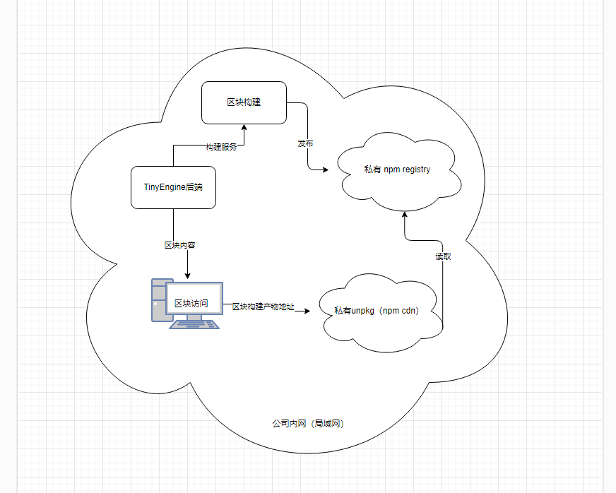

### **一、安装 verdaccio**

当前业界内存在很多搭建 npm 私仓的方案，如: verdaccio, neuxs, cnpmjs 等，大家可以自行选择。在此以使用 verdaccio 为例，可以查看 verdaccio 官网文档或者相关学习文档来安装使用 verdaccio ，在这里只做简单介绍。

#### **1.1 verdaccio 安装**

本地直接通过 npm 下载

```
npm install verdaccio
```

本地启动

```
verdaccio
```

或者使用 pm2 启动

```
# 启动 verdaccio
pm2 start ./verdaccio
# 查看进程
pm2 log verdaccio 
```

虚拟机可以通过 docker 拉取镜像

```js
docker pull verdaccio/verdaccio
```

启动

```js
docker run -it  -p 4873:4873 verdaccio/verdaccio
```

（线上使用请配置数据持久保存，以免数据丢失。）

#### **1.2 注册用户**

```js
npm login --registry=http://localhost:4873/
```

#### **1.3 创建 token，此 token 替换原 npm 上申请的 token，用于发包**

```js
npm token create --registry=http://localhost:4873/
```

token 生成完后，需要配置到环境变量`NPM_AUTH_TOKEN`中，后续 webService 会使用；本地运行时的配置：

`vi ~/.bashrc`

```js
export NPM_AUTH_TOKEN=xxxx  # 填入刚生成的token
```

设置完后，重新打开命令行或在当前命令行执行以下命令，让设置的环境变量生效。(git bash 中设置的环境变量无法适用于 powershell 和 cmd )

`source ~/.bashrc`

#### **1.4 安装后验证**

在安装并完成测试后， 访问  <http://localhost:4873/> ，在 verdaccio 的管理界面能看到发布上去的 npm 包表示安装成功。

建议发布的测试包名称格式：@公司码/组件名，以便于后续搭建 unpkg 时测试使用。以下是测试用的 package.json 供参考：

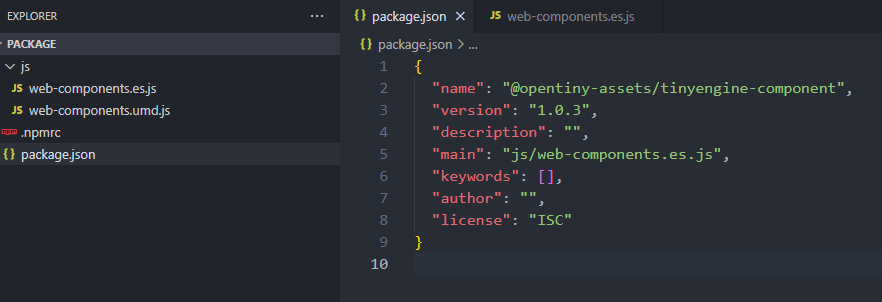

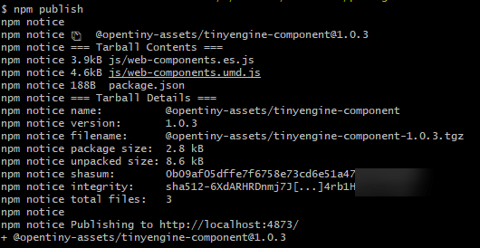

发布完成后， 访问  <http://localhost:4873/> ，在 verdaccio 的管理界面能看到发布上去的 npm 包表示安装成功。

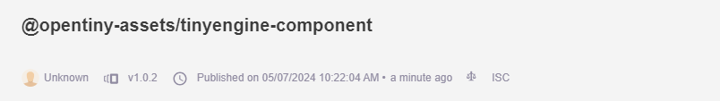

### **二、安装 unpkg**

在 verdaccio 安装好后，TinyEngine 的包已经能够正常发布在私仓上，如果想要在 TinyEngine 的页面上去获取到私仓里的包，正确的显示区块，这里还需要借助 unpkg 去获取到包的数据，而由于公网的 unpkg 无法直接读取 npm 私仓里的包，因此还需要搭建自己的 unpkg 服务器，结合私有的 unpkg，才能在 TinyEngine 的页面上显示你所建的区块。

unpkg 的搭建，大家可以自行在网上参考相关文档，将官方的 unpkg 源码下载下来，进行改造，也可以参考别人的成功案例。改造成功后，访问  <http://localhost:8080/>  能看到 unpkg 服务启动成功。

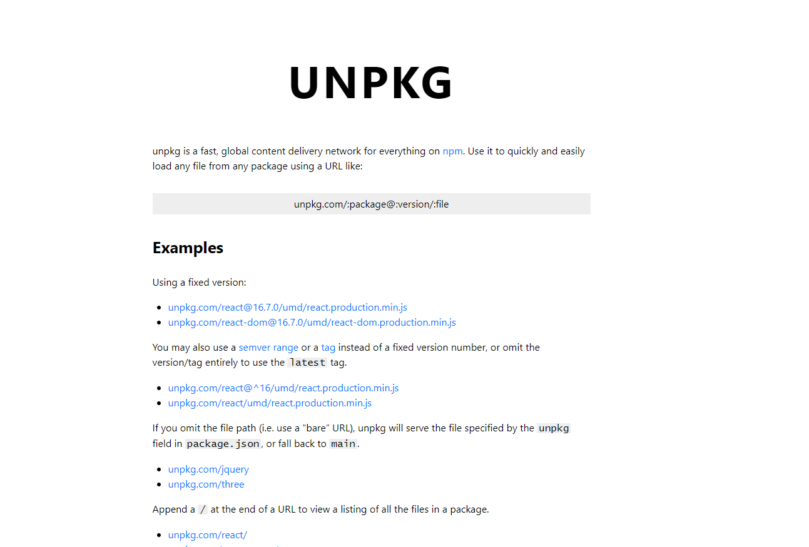

然后访问之前发布的测试包： `http://localhost:8080/@公司码/组件名` ，如能显示 js 文件内容, 则表示 unpkg 安装成功。

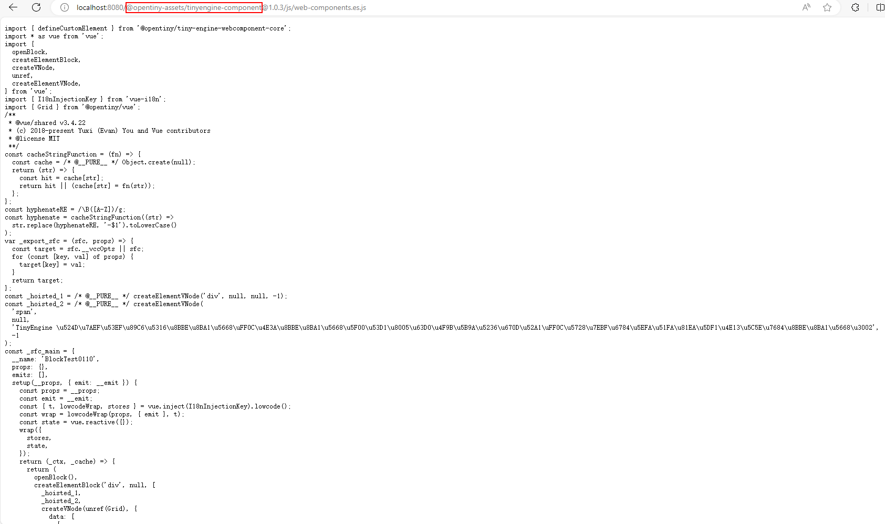

### **三、修改 tiny-engine-webservice**

#### **3.1 修改 app/service/material-center/blockBuilder.ts 的 代码**

```js
public unpkgBaseUrl = 'http://localhost:8080'; // 修改为unpkg服务的ip端口
```

```js
generatePackageJson(blockInfo, version) {
        let { label, id } = blockInfo
        label = label.replace(/\W|_/g, '').toLocaleLowerCase() || 'default'
        const name = `@opentiny-assets/tinyengine-block-${label}-${id}` // 修改点：发包的名称根据自己情况更改, @opentiny-assets改成 @用户的公司码
        this.pkgName = name
        return {
        name,
        version,
        description: '',
        main: `js/web-component.es.js`,  // 修改点：main 必须是 js/web-component.es.js , 否则 unpkg 无法读取到 js 文件
        keywords: [],
        author: '',
        license: 'ISC'
        }
    }
```

#### **3.2 修改 config.default.ts 的代码**

替换 registry 为自己的私仓地址

```js
config.registry = 'http://127.0.0.1:4873/' // 修改点：替换为自己的私仓地址
```

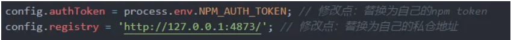

**注意：**  在 1.3 小节里，已经生成了 npm token，写入到了`NPM_AUTH_TOKEN`环境变量。因此本文件中`authToken`的赋值就不用再修改了，若是没有更换的话，记得参考 1.3 小节，去替换你的环境变量。

#### **3.3 修改 app/service/cnpm.ts 的代码**

去掉  `--access=public`

```js
  async publishCnpm(packagePath) {
    const commands = ['npm publish']; // 修改点：去掉原先的--access=public
    return this.ctx.helper.execCommandWithCatch(commands, { cwd: packagePath }, 'publish cnpm');
  }
```

### **四、在 TinyEngine 中发布区块**

以上步骤完成后，可以启动 tiny-engine 进行区块发布测试。验证过程中可以通过查看   tiny-engine-webservice 的发布过程排查问题，TinyEngine 会生成组件包:

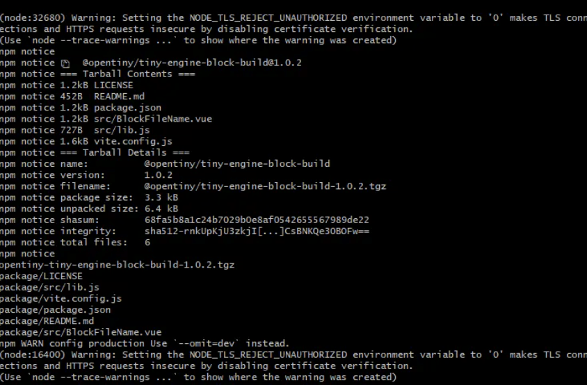

然后发布到私仓:

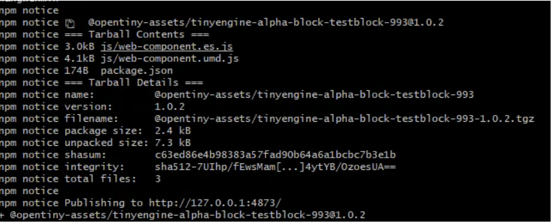

发布完成之后，可以打开  <http://localhost:4873/>  验证是否发布成功

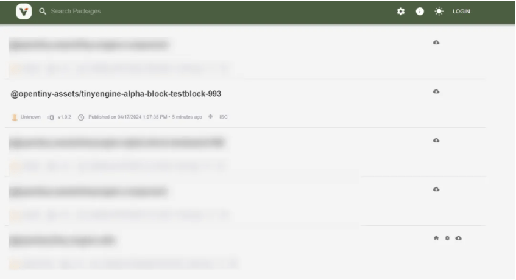

并且查看本地启动的 unpkg，是否能够正常访问刚才发布的区块。


验证完成后，可以在物料中把刚才发布的区块进行添加，添加完毕后就可以正常的使用区块功能。

### **五、服务部署**

当前步骤都是在电脑本地环境下运行调试的，在本地验证正确后，可以自行部署到服务器中。实际生产部署模式以企业、组织内部具体情况具体分析，具体安装以及启动操作流程都跟本地一致，可能会有安装目录位置的差异。

## **方案二**

**将区块发布到数据库**

### **一、方案目的**

原有的区块托管于 npm，通过 cdn 获取已发布区块内的文件，如果没有公网环境，且不使用私仓的情况下，为区块的托管提供数据库托管方案，使得区块的使用不在依赖于公网环境和 cdn

### **二、设计思路**

- 将原有的区块发布修改成把区块构建产物转成二进制数据存储到数据库
- 后端生成构建产物链接，替换原有区块发布后托管在 unpkg 的连接，格式为：<http://localhost:7011/material-center/api/block/read/@opentiny-assets/tinyengine-dev-block-testceshi11-2328@1.0.17/js/web-components.umd.js>
- 提供链接访问获取文件的后端方法

### **三、简单 demo，仅供参考**

#### **1. 新增存储数据库的表，字段如下：**

| **id**       | **int(10)**  | **自增 id** |
| ------------ | ------------ | ----------- |
| file_name    | varchar(255) | 文件名      |
| package_name | varchar(255) | 包名        |
| file_content | longtext     | 文件内容    |
| version      | varchar(255) | 版本        |
| created_at   | timestamp    | 创建时间    |
| updated_at   | timestamp    | 更新时间    |

strapi 生成表可以在管理面板创建，也可以在 tiny-engine-data-center 服务根目录 api 文件夹下自己编辑代码，无需手动在 mysql 创建表

```js
  {
  "kind": "collectionType",
  "collectionName": "block_file_store",
  "info": {
    "name": "block-file-store",
    "description": ""
  },
  "options": {
    "increments": true,
    "timestamps": true
  },
  "attributes": {
    "package_name": {
      "type": "string",
      "required": true
    },
    "file_name": {
      "type": "string",
      "required": true
    },
    "version": {
      "type": "string",
      "required": true
    },
    "file_content": {
      "type": "text",
      "required": true
    }
  }
}
```

#### **2. 修改发布方法**

config.default.ts 文件中新增配置

```js
config.dataBaseUrl = 'http://localhost:7011/material-center/api/block/read'
```

发布接口在文件夹路径`/tiny-engine-webservice/app/service/material-center/blockBuilder.ts`下，实现如下：

```js
private async publish(folder, blockInfo, version): Promise<any> {
    let { label, id } = blockInfo;
    label = (label as String).replace(/\W|_/g, '').toLocaleLowerCase() || 'default';
    const env = 'alpha'; // 视具体情况而定，可以从RUN_MODE环境变量取，也可以不使用
    const name = `@opentiny-assets/tinyengine-${env}-block-${label}-${id}`;
    this.pkgName = name;
    
    const prefix = `${this.config.dataBaseUrl}/${this.pkgName}@${version}`;
    const files = await globPromise(`**/*.*`, {
      cwd: folder
    });
    for(const file of files){
      const fileContent = await fs.readFile( path.join(folder, file));
      // 文件转二进制
      const base64Data = fileContent.toString('base64');
      const filename = file.substring(file.lastIndexOf('/') + 1);
      // 存储数据库
      await this.service.material.blockFilesStore.create({
        package_name: name,
        file_name: filename,
        version: version,
        file_content: base64Data
       });
     }
    return this.filterFiles(files, prefix);
  }
```

#### **3. 新增后端获取区块产物 api 接口：**

##### **3.1 接口**

| **Method** | **URI**                         | **Description**          |
| ---------- | ------------------------------- | ------------------------ |
| GET        | material-center/api/block/read/ | 根据区块链接信息读取文件 |

###### **3.1.1 请求 request**

| **Name**     | **Mandatory** | **Type** | **position** | **Description** |
| ------------ | ------------- | -------- | ------------ | --------------- |
| file_name    | M             | string   | body         | 文件名          |
| version      | M             | string   | body         | 版本            |
| package_name | M             | string   | body         | 包名            |

###### **3.1.2 响应 Response**

| **Name** | **Mandatory** | **Type** | **Description** |
| -------- | ------------- | -------- | --------------- |
| data     | O             | object   | 响应数据实体    |

在  `router/materialCenter/base.ts`  新增路由：

```js
// 路由获取文件链接读取文件
subRouter.get('/block/read/*', controller.materialCenter.block.readFileContentLink)
```

#### **4、接口实现**

```js
async readFileContentLink(){
    const params = this.ctx.params;
    const paramTemp = params[0];
    const filename = paramTemp.substring(paramTemp.lastIndexOf('/') + 1);
    const versionRegex = /@([\d.]+)/;
    const version = paramTemp.match(versionRegex)? paramTemp.match(versionRegex)[1]:null;
    const package_name = '@' + paramTemp.split('@')[1];
    const paramTemps =
    {
      file_name: filename,
      version: version,
      package_name: package_name

    }
    const res = await this.service.materialCenter.blockFileStore.find(paramTemps);
    this.ctx.type = 'text/javascript';
    this.ctx.body = Buffer.from(res.data[0]?.file_content, 'base64').toString('utf8');
  }
```

在 data-center 里 block-file-store/controller 下 block-file-store.js 新增根据文件名和包名查询最新一条的最高版本的文件信息的方法：

```js
module.exports = {
  async find(ctx) {
    const { fileName, packageName } = ctx.request.query
    return strapi.services['block-file-store'].find({
      file_name: fileName,
      package_name: packageName,
      _sort: 'version:DESC',
      _limit: 1
    })
  }
}
```

#### **5、效果展示**

a.后端用 postman 调用访问文件链接效果如下：

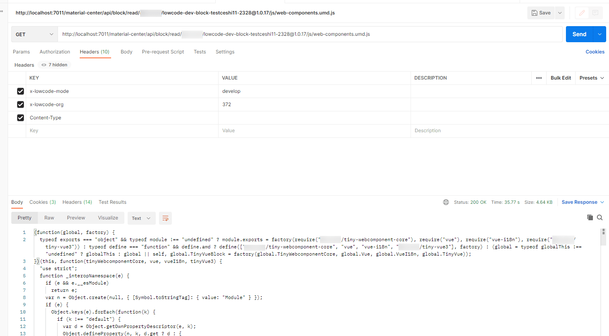

b.在环境上部署后，新建区块，对区块进行发布后，将区块加入在物料中，在画布里使用区块时，会成功返回`web-compnents.umd.js`文件，并且与刚才发布的区块版本、包名一致，能够正确显示区块内容。

## **总结**

当前介绍了两种方案的具体实现方式

- 使用方案一可以最大的提高区块发布的灵活性，并且也可以使用版本浮动功能，但是代价就是需要搭建局域网内的私仓服务和 unpkg 服务；
- 使用方案二数据库存托管的方式看似更加方便，但是可能会造成数据库存储的内容过于庞大。

大家可以根据实际情况选择最符合自己场景需求的方案，若是您有不同的想法或者建议，也欢迎您一起参与讨论，在这里(<https://github.com/opentiny/tiny-engine/discussions>)留下您宝贵的思路。

---

感谢大家对 TinyEngine 低代码引擎的支持，感谢开发者**欧阳同学**的实战经验，助力 OpenTiny 共同探索更优质的解决方案。也希望后续有更多小伙伴一起加入 OpenTiny 的开源共建，让更多开发者受益~

## **关于 OpenTiny**


[OpenTiny](https://opentiny.design/) 是一套企业级 Web 前端开发解决方案，提供跨端、跨框架、跨版本的  [TinyVue 组件库](https://opentiny.design/tiny-vue/zh-CN/overview)，包含基于 Angular+TypeScript 的 [TinyNG 组件库](https://opentiny.design/tiny-ng/overview)，拥有灵活扩展的低代码引擎 [TinyEngine](https://opentiny.design/tiny-engine#/home)，具备主题配置系统[TinyTheme](https://opentiny.design/designtheme/home) / 中后台模板[TinyPro](https://opentiny.design/pro/home)/ [TinyCLI](https://opentiny.design/tiny-cli/home)命令行等丰富的效率提升工具，可帮助开发者高效开发 Web 应用。

---

欢迎加入 [OpenTiny 开源社区](https://github.com/opentiny/)。添加微信小助手：opentiny-official 一起参与交流前端技术～更多视频内容也可关注[B 站](https://space.bilibili.com/15284299?spm_id_from=333.1007.0.0)、抖音、小红书、视频号\
OpenTiny  也在持续招募贡献者，欢迎一起共建

[OpenTiny 官网](https://opentiny.design/)：**<https://opentiny.design/>**\
[OpenTiny 代码仓库](https://github.com/opentiny/)：**<https://github.com/opentiny/>**\
[TinyVue 源码](https://github.com/opentiny/tiny-vue)：**<https://github.com/opentiny/tiny-vue>**\
[TinyEngine 源码](https://github.com/opentiny/tiny-engine)： **<https://github.com/opentiny/tiny-engine>**

欢迎进入代码仓库 Star🌟[TinyEngine](https://github.com/opentiny/tiny-engine)、[TinyVue](https://github.com/opentiny/tiny-vue)、[TinyNG](https://github.com/opentiny/ng)、[TinyCLI](https://github.com/opentiny/tiny-cli)\~
如果你也想要共建，可以进入代码仓库，找到  good first issue 标签，一起参与开源贡献\~
