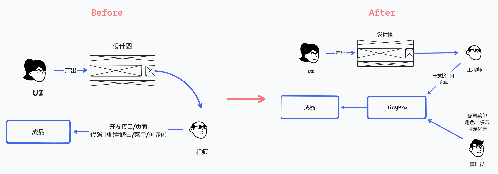
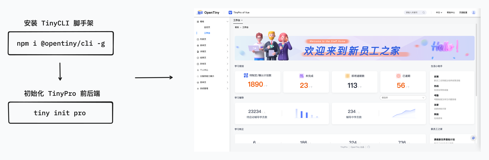
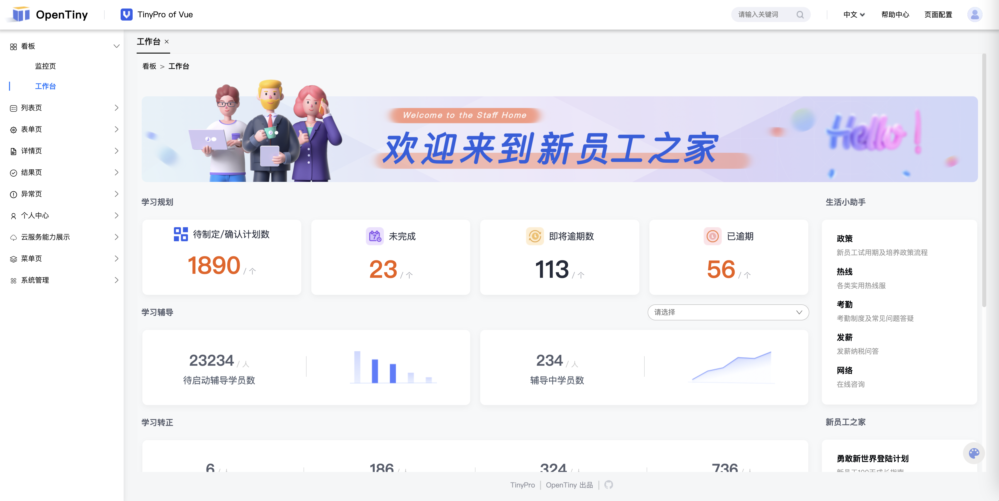
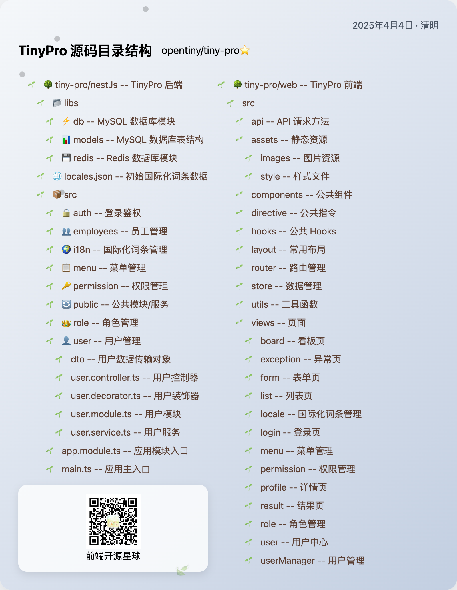
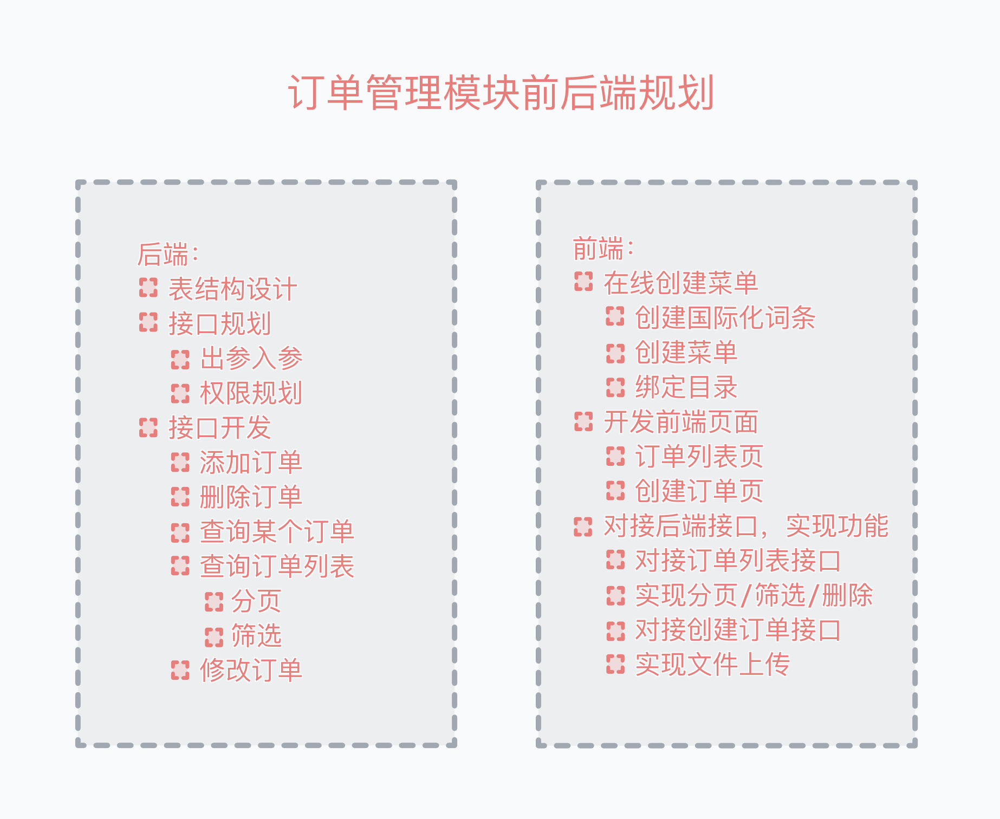

本文由体验技术团队 Kagol 原创。

[TinyPro](https://link.juejin.cn/?target=https%3A%2F%2Fgithub.com%2Fopentiny%2Ftiny-pro 'https://github.com/opentiny/tiny-pro')  是一个基于  [TinyVue](https://link.juejin.cn/?target=https%3A%2F%2Fgithub.com%2Fopentiny%2Ftiny-vue 'https://github.com/opentiny/tiny-vue')  打造的前后端分离的后台管理系统，支持在线配置菜单、路由、国际化，支持页签模式、多级菜单，支持丰富的模板类型，支持多种构建工具，功能强大、开箱即用。

- 源码：[github.com/opentiny/ti…](https://link.juejin.cn/?target=https%3A%2F%2Fgithub.com%2Fopentiny%2Ftiny-pro 'https://github.com/opentiny/tiny-pro')
- 官网：[opentiny.design/vue-pro](https://link.juejin.cn/?target=https%3A%2F%2Fopentiny.design%2Fvue-pro 'https://opentiny.design/vue-pro')

## 1 项目优势

如果将开发 Web 应用比作建造房子，那么 TinyVue 组件库中的组件就是建造房子的砖、瓦、沙石等材料，你可以用 TinyVue 组件快速搭建前端项目。

而 TinyPro 则是用 TinyVue 组件库搭建起来的“样板房”，这是一个已经搭建好的完整的后台管理系统，包含前后端。

市面上有很多后台管理模板，为什么要选择 TinyPro 呢？

我总结了下，TinyPro 主要有以下优势：

1. **上手成本低**：一行命令即可创建一个后台管理系统
2. **支持前后端**：前端基于  `Vue3` + `TypeScript` + `TinyVue`，后端基于  `NestJS`
3. **强大的功能**：支持组件粒度的权限管理、页签模式、多级菜单、多种布局方式、个性化主题、国际化、Mock 数据等丰富的特性，开箱即用
4. **使用成本低**：支持在线方式快速配置角色、用户、菜单、权限、国际化词条，无需写代码，用户使用成本低，没有开发基础的设计师、产品经理也能操作
5. **开发者友好**：支持  `Vite`、`Webpack`、`Rspack`、`Farm`  等多种构建工具

TinyPro 提供了 NestJS 后端，将菜单、路由、国际化词条、角色、用户、权限等内容都放到了后端，用户可以通过在线的方式配置菜单、路由、国际化词条等内容，这样做有以下好处：

- 前端工程师只需要专注于构建前端页面，配置菜单、国际化词条等工作可以交给管理员
- 管理员对系统有更多的控制权，功能模块的上线不需要依赖于前端开发

## 2 项目生成

TinyPro 这个后台管理模板这么好，我要怎么才能“得到”它呢？

只需要使用  `tiny init pro`  这一行命令就可以初始化一个！

    # 安装 TinyCLI 脚手架
    npm install @opentiny/cli -g

    # 初始化 TinyPro 项目
    tiny init pro

按照以下方式进行选择：

    * 请输入项目名称： demo-tiny-pro
    * 请输入项目描述： 基于TinyPro套件创建的中后台系统
    * 请选择您希望使用的客户端技术栈： vue
    * 请选择您希望使用的服务端技术栈： Nest.js
    * 请选择你想要的构建工具:  Vite
    * 请确保已安装数据库服务（参考文档 https://www.opentiny.design/tiny-cli/docs/toolkits/pro#database）： 已完成数据库服务安装，开始配置
    * 请输入Redis地址： localhost
    * 请输入Redis端口： 6379
    * 请选择数据库类型： MySql
    * 请输入数据库地址： localhost
    * 请输入数据库端口： 3306
    * 请输入数据库名称： order_sys
    * 请输入登录用户名： root
    * 请输入密码： [input is hidden]

需要注意的是：

- MySQL 地址是 localhost，端口是 3306（默认），数据库名称是 order_sys
- Redis 地址是 localhost，端口是 6379（默认）

最后输入的密码是 MySQL 数据库 root 用户的密码。

## 3 本地启动

初始化之后的项目主要包含两个目录：nestJs 和 web。

nestJs 是后端代码，web 是前端代码。

### 3.1 启动后端

我们先来启动后端。

后端使用的是 NestJS，数据库使用的是 MySQL 和 Redis，在启动 NestJS 服务之前，需要先安装和启动 MySQL 和 Redis 数据库。

- [macOS 和 Windows 操作系统下如何安装和启动 MySQL / Redis 数据库](https://juejin.cn/spost/7488905111479451688 'https://juejin.cn/spost/7488905111479451688')

启动后端之前

- 确保 MySQL 和 Redis 数据库均已启动。
- 连接数据库，并使用  `create database order_sys;`  命令创建一个空数据库。
- 修改 nestJs/.env 文件中的  `DATABASE_SYNCHRONIZE = true`。

<!---->

    # 进入 nestJs 目录
    cd nestJs

    # 安装依赖
    npm i

    # 启动后端
    npm start

<!---->

    $ npm start
    > nest start

    webpack 5.87.0 compiled successfully in 5780 ms
    [Nest] 84481  - 2025/04/04 15:10:48     LOG [NestApplication] Nest application successfully started +2ms
    Application is running on: http://[::1]:3000

后端启动成功！

### 3.2 启动前端

启动前端之前，请确保后端已经成功启动。

启动前端和启动后端的步骤基本上是一样的。

    # 进入 web 目录
    cd web

    # 安装依赖
    npm i

    # 启动前端
    npm start

<!---->

    $ npm start
    > vite --config ./config/vite.config.dev.ts --port 3031

      VITE v4.5.5  ready in 2051 ms

      ➜  Local:   http://localhost:3031/
      ➜  Network: use --host to expose
      ➜  press h to show help

前端启动成功！

前后端都成功启动之后，就可以访问：[http://localhost:3031/](https://link.juejin.cn/?target=http%3A%2F%2Flocalhost%3A3031%2F 'http://localhost:3031/')

体验 TinyPro 后台管理系统的使用啦！

TinyPro 后台管理系统的效果如下：

## 4 如何使用

前面我们已经启动了 TinyPro，接下来就带大家一起体验下如何使用。

使用之前需要先将  `nestJs/src/app.module.ts`  文件中的以下代码删掉。

    @Module({
      ...,
      providers: [
        {
          provide: APP_GUARD,
          useClass: AuthGuard,
        },
    -   {
    -     provide: APP_GUARD,
    -      useClass: RejectRequestGuard,
    -   },
        {
          provide: APP_GUARD,
          useClass: PermissionGuard,
        },
      ],
    })
    export class AppModule implements OnModuleInit {
      // ...
    }

接下来将由 TinyPro 核心贡献者  [GaoNeng-wWw](https://link.juejin.cn/?target=https%3A%2F%2Fgithub.com%2FGaoNeng-wWw 'https://github.com/GaoNeng-wWw')  带大家使用以下功能。

1. 如何增加用户

2. 如何增加菜单

3. 如何进行权限管理

   1. 创建权限

      1. 组件级权限管理
      2. 页面级权限管理

   2. 创建用户

   3. 分配权限给用户

4. 如何为角色绑定菜单

5. 创建好的国际化词条如何在前端中使用

具体演示请看以下视频（从 10:30 开始）：[TinyPro 使用指南：手把手带你本地启动 TinyPro，在线创建菜单、国际化，实现组件级权限管理](https://link.juejin.cn/?target=https%3A%2F%2Fwww.bilibili.com%2Fvideo%2FBV1PuZBYeEGb%2F 'https://www.bilibili.com/video/BV1PuZBYeEGb/')

## 5 二次开发

项目初始化之后，我们可以看下它的目录结构。

接下来我将以新增订单管理模块前后端为例，给大家演示如何基于 TinyPro 进行二次开发。

具体演示请看以下视频（从 0:12:24 开始）：[TinyPro 二次开发教程：手把手带你基于 TinyPro 搭建订单管理模块前后端](https://link.juejin.cn/?target=https%3A%2F%2Fwww.bilibili.com%2Fvideo%2FBV1aAZYYAEYb%2F 'https://www.bilibili.com/video/BV1aAZYYAEYb/')

本文对应的  [视频 1](https://link.juejin.cn/?target=https%3A%2F%2Fwww.bilibili.com%2Fvideo%2FBV1PuZBYeEGb%2F 'https://www.bilibili.com/video/BV1PuZBYeEGb/') | [视频 2](https://link.juejin.cn/?target=https%3A%2F%2Fwww.bilibili.com%2Fvideo%2FBV1aAZYYAEYb%2F 'https://www.bilibili.com/video/BV1aAZYYAEYb/') | [PPT](https://link.juejin.cn/?target=https%3A%2F%2Fkagol.github.io%2Fppt-tiny-pro 'https://kagol.github.io/ppt-tiny-pro')，欢迎大家观看视频和 PPT。

## 往期文章

- [OpenTiny 开源社区招募贡献者啦！](https://juejin.cn/post/7485572202701799464 'https://juejin.cn/post/7485572202701799464')
- [TinyPro Vue v1.1.0 正式发布：增加细粒度权限管理、页签模式、多级菜单，支持 Webpack/Vite/Rspack/Farm 多种构建工具](https://juejin.cn/post/7441231659394433039 'https://juejin.cn/post/7441231659394433039')
- [优化永不止步：TinyVue v3.20.0 正式发布，更美观的官网 UI，更友好的文档搜索，更强大的主题配置能力](https://juejin.cn/post/7445930510021656613 'https://juejin.cn/post/7445930510021656613')
- [TinyEditor v3.25.0 正式发布！2025 年第一个版本，增加标题列表导航、分隔线、多图多文件上传等实用特性](https://juejin.cn/post/7455243039655067657 'https://juejin.cn/post/7455243039655067657')

## 关于 OpenTiny

欢迎加入 OpenTiny 开源社区。添加微信小助手：opentiny-official 一起参与交流前端技术～

[OpenTiny 官网](https://opentiny.design/)：**[https://opentiny.design](https://opentiny.design/)**

[OpenTiny 代码仓库](https://github.com/opentiny)：**<https://github.com/opentiny>**

[TinyVue 源码](https://github.com/opentiny/tiny-vue)：**<https://github.com/opentiny/tiny-vue>**

[TinyEngine 源码](https://github.com/opentiny/tiny-engine)： **<https://github.com/opentiny/tiny-engine>**

欢迎进入代码仓库 Star🌟TinyEngine、TinyVue、TinyNG、TinyCLI、TinyEditor\~

如果你也想要共建，可以进入代码仓库，找到 good first issue 标签，一起参与开源贡献\~
