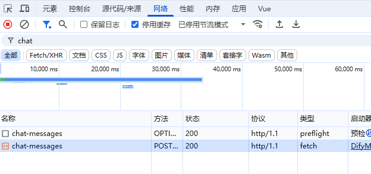
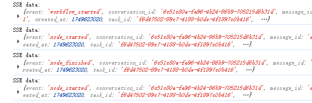

## 1.背景描述

TinyVue 是一套企业级的 Vue 框架下的组件库，它具有跨端、跨框架的特性，同时支持 Vue2 和 Vue3，支持 PC 端和移动端浏览器。

本次实验是通过改造一个使用 TinyVue 组件的常规 Web 应用，秒变为一个能够对接大语言模型的智能应用。这个应用可以让用户通过自然语言与网页进行对话，直接“精准”操作网页上的组件。

## 2.实验简介

首先，我们提供了一个用  Vue3   搭建的商品列表管理的单页面应用，它使用 TinyVue 组件库中的  Select、Grid   等组件。该商品管理应用默认会显示商品管理的表格，并且已经实现了条件查询商品，添加、删除商品和保存商品等功能。但此应用目前不支持 AI 大模型的操作，比如打开智能助手，发送的信息不会正确执行。

对接 TinyVue Next 智能框架的相关包，给 Select、Grid   等组件添加业务描述后，让智能助手等功能可以遥控操作网页。

## 3.基本要求

- 熟练使用 VSCode 或其他代码编辑器
- 具有 Chrome、Edge 等浏览器的调试能力
- 熟悉 Vue 开发，以及具有 TinyVue 或其它组件库的开发经验

## 4.代码实战

### 4.1 启动电商平台 demo 页面，熟悉功能

解压桌面上的工程压缩文件 agent-app-demo （可能位置与名称有调整，有疑问可咨询）

解压完成后用 VSCode 软件打开指定的工程目录，打开终端，执行以下命令安装依赖：

```bash
npm install
```

安装完成后执行以下命令，启动电商平台 demo 页面。

```bash
npm run dev
```

启动成功后，查看商品列表并简单的进行增删改查的操作。

但此时测试 AI 智能助手，则是无响应的。下一步就来对应用进行简单改造。

### 4.2 引用 vue-next 等智能包进行应用改造

将上面的普通应用，秒变为智能应用，需要以下 4 步， 需要按顺序完成。

#### 4.2.1 引入智能包

在终端中执行以下命令，安装相关智能包。

```bash
npm install @opentiny/tiny-vue-mcp @opentiny/next-vue -S
```

#### 4.2.2 全局注册 TinyVue MCP 的工具

在`main.ts`  文件中，引入`@opentiny/tiny-vue-mcp`，注册 TinyVue MCP 的工具。

```js
import { createMcpTools, getTinyVueMcpConfig } from '@opentiny/tiny-vue-mcp'

import { registerMcpConfig } from '@opentiny/vue-common'

// 1、 将 TinyVue MCP的工具注入到 vue-common 层中，之后应用可以TinyVue MCP的功能

registerMcpConfig(getTinyVueMcpConfig(), createMcpTools)
```

#### 4.2.3   创建 MCP Client 的远端会话

在`App.vue`文件中，引入`@opentiny/next-vue`， 创建 MCP Client 的远端会话。

**注意：代码中连接需要自行提供**\
目前 agent 代理服务器代码未开源，如想进一步了解可以在 github 中提 issue 单\
提交 issue 连接：<https://github.com/opentiny/tiny-vue/issues>

```js
import { useNextClient } from '@opentiny/next-vue'
import { globalConversation } from './composable/utils'

// 2、创建 sessionId ， 一个 ref<string> 的值， 并保存起来，智能助手会访问该变量进行通讯

const { sessionId } = useNextClient({
  clientInfo: { name: 'my-project', version: '1.0.0' },
  // url为工具调用方，token为对应的凭证
  proxyOptions: { url: 'https://xxx/sse', token: '' }
})

globalConversation.sessionId = sessionId
```

#### 4.2.4 在应用页面，创建 MCP Server， 并给组件声明“业务属性”

在`views/productManager/index.vue`中，创建 MCP Server

```js
import { useNextServer } from '@opentiny/next-vue'
// 3、创建web应用所需的 McpServer 变量， 用于注册页面中的组件到系统中。
const { server } = useNextServer({
  serverInfo: { name: 'company-list', version: '1.0.0' }
})
// 4、 模板中，在AI智能助手要操作的组件上，去绑定 server 和 组件的 “业务描述”。  这样 AI就能关联mcp，并识别每个组件的业务定义了。
```

在`views/productManager/index.vue`文件中， 可以改造 TinyVue 的组件，它们支持属性 tiny_mcp_config， 传入 server 和组件的业务描述，例如：

```html
<tiny-base-select
  v-model="statusFilter"
  :options="statusOptions"
  placeholder="商品状态"
  clearable
  :tiny_mcp_config="{
    server,
    business: {
      id: 'category-status',
      description: '商品状态的下拉框',
    },
  }"
>
</tiny-base-select>
```

其中 business.id 是组件在页面上的唯一 id。 business.description 是描述组件的业务含义， 这样与大模型对话时，大模型可以“精准”的知道页面上有什么可以操纵。

接下来，给商品状态的 Select， 商品列表的表格，按钮等等，都可以添加上 :tiny_mcp_config 属性了。

给分类下拉框添加 tiny_mcp_config

```html
<tiny-base-select
  v-model="categoryFilter"
  :options="categoryOptions"
  placeholder="商品分类"
  clearable
  :tiny_mcp_config="{
    server,
    business: {
      id: 'category-select',
      description: '商品分类的下拉框',
    },
  }"
>
</tiny-base-select>
```

给商品列表表格添加

```html
<tiny-grid
  auto-resize
  ref="gridRef"
  :data="displayProducts"
  :height="520"
  :edit-config="{ trigger: 'click', mode: 'cell', showStatus: true }"
  :tiny_mcp_config="{
    server,
    business: {
      id: 'category-list',
      description: '商品列表',
    },
  }"
>
    <!--省略部分代码-->
</tiny-grid>
```

### 4.3 通过页面的 AI 智能助手进行网页的智能操作

经过 4.2 节， 我们已经将普通的应用秒变为智能应用。此时就可以通过“AI 智能体”工具跟网页对话了

对下拉框，你可以尝试提问：   在商品分类下拉框中，弹出下拉面板选中手机分类。

对于表格， 你可以问：帮我在商品列表中删除最贵的且分类为手机的商品。

这里就可以发挥想像力，对网页进行各种提问，看看大模型能否正确判断行为，并调用正确的 MCP 方法。

如果“AI 智能体”工具不能执行成功，可以打开浏览器控制台，参考以下内容进行排查：

控制台有无报错

打开“网络” 面板，查看 chat-messages 接口是否异常



查看控制台打印的： SSE data: xxxx   信息。可以跟踪大模型的执行过程，查看调用 MCP 工具的中间过程等。



### 4.4 页面添加可识别二维码，通过手机远程操作

通过文字去操作页面有点麻烦，如果能通过语音就是远程遥控网页是不是就好了。

在“App.vue”的顶部增加 的二维码组件:

```html
<div class="qr-code">
    <span>
        页面识别二维码， 请用手机扫码后，在浏览器中打开。    
    微信的浏览器可能没有语音功能，需要使用手机内置的浏览器访问。   </span
  >
    <tiny-qr-code :value="sessionUrl" :size="100" color="#1677ff"></tiny-qr-code>
     
</div>
```

二维码的 value= sessionUrl ，它是通过 sessionId 计算出来的一个 url。在`App.vue`添加以下 js 代码：

**注意：代码中连接需要自行实现并部署远程操控服务**\
如对此有疑问或者有兴趣交流，欢迎提交 issue： <https://github.com/opentiny/tiny-vue/issues>

```js
import CryptoJSfrom"crypto-js";
import { computed } from"vue";

const sessionUrl = computed(() => {
// 未创建session时

if (!sessionId.value) return"no session"; // 创建好 sessionId后，加密后拼接成 sessionUrl ，  这样手机扫码后会连接这个Url页面

const encryptedId = CryptoJS.AES.encrypt(
    sessionId.value,
    "secret-session-id"
  ).toString();

return"https://xxx?id=" + encodeURIComponent(encryptedId);
});
```

这样，我们的应用顶部会有一个二维码，用手机扫描后，使用手机上的浏览器打开，就可以选择“语音控制器”，跟它对话了，通过手机远程指挥网页。

因为上述流程中 proxyOptions.url 与 语音远程操控页面需要自行部署服务，因此提供了临时的线上体验连接：<https://opentiny.design/tiny-vue/zh-CN/os-theme/comprehensive>

## 5.实验总结

通过本次实验，我们不仅掌握了将普通 Web 应用转化为智能 Web 应用的关键技能，还学会了利用智能助手或远程手机对网页进行精准操控。

该实验引导用户深入思考网页未来可能呈现的形态与无限可能，让每一位用户都能深切体验到人工智能为 Web 开发领域所带来的震撼，感受技术进步如何重塑我们的网页世界。

## 关于 OpenTiny

欢迎加入 OpenTiny 开源社区。添加微信小助手：opentiny-official 一起参与交流前端技术～

OpenTiny 官网：**<https://opentiny.design>**\
OpenTiny 代码仓库：**<https://github.com/opentiny>**\
TinyVue 源码：**<https://github.com/opentiny/tiny-vue>**\
TinyEngine 源码： **<https://github.com/opentiny/tiny-engine>**\
欢迎进入代码仓库 Star🌟TinyEngine、TinyVue、TinyNG、TinyCLI、TinyEditor\~\
如果你也想要共建，可以进入代码仓库，找到 good first issue 标签，一起参与开源贡献\~
