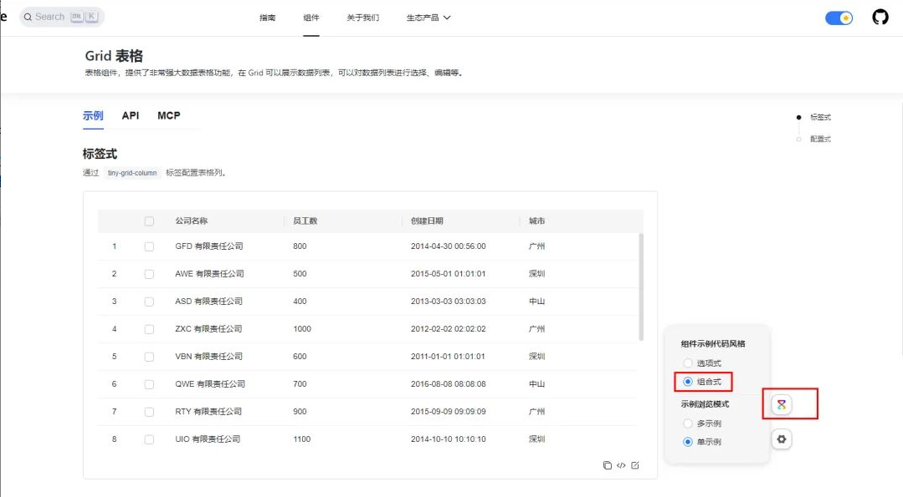
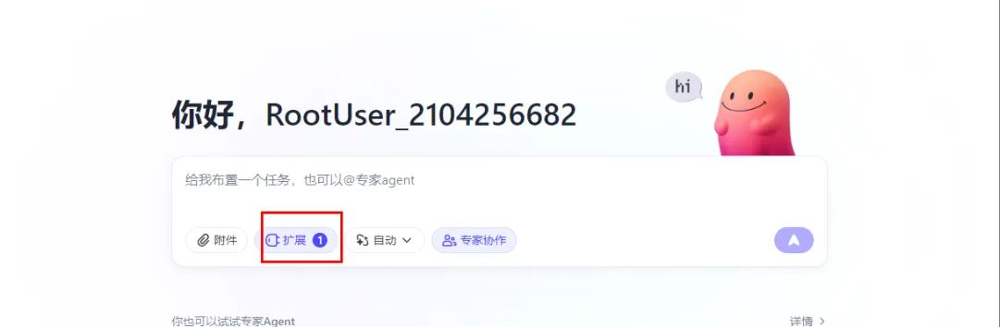
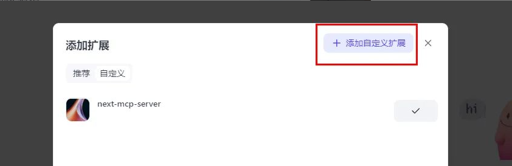
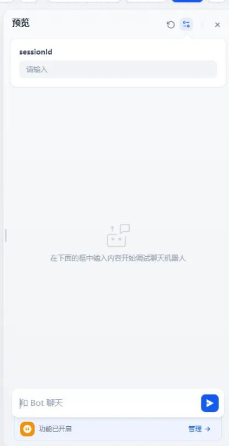

## 实验简介

通过体验基于标准 MCP 协议的  Web 智能组件库——TinyVue，开发者可以了解 AI 智能体控制 TinyVue 智能组件的各类行为。本次实验主要是在 TinyVue 官网上，开发者能够通过 AI 对话框，以语音或文字方式与网站组件进行互动，并且还能借助 VSCode Copilot、Cursor 等 IDE 工具，Dify、Coze 等智能体平台来操作这些组件。

### 实验目标

- 按照操作手册完成体验项目。
- 通过体验 AI 操作（基于标准 MCP 协议）Web 页面的过程，让 AI 智能体代替人进行页面操作，实现业务目标。
- 了解 TinyVue 智能组件库的能力。

### 实验场景

Web 浏览器

### 基本要求

熟练使用 VSCode 编辑器和 Chrome / Edge 浏览器的调试，具备基本的编程能力。

## 实战

### 步骤一：在 TinyVue 官网体验智能组件

1. 打开 TinyVue 智能组件库官网： <https://opentiny.design/tiny-vue/zh-CN/os-theme/components/grid>

2. 点击页面右下角的智联图标，并将 demo 切换到组合式模式，参考下图：



3. 打开 AI 对话框，可以通过打字聊天来操作表格，比如：请帮我选中公司人员表中员工最多的公司、帮我删除员工数最多的公司数据等等，可以体验通过自然语言对表格进行数据的增删改查操作。

### 步骤二：在手机端使用语音或者 AI 对话框操控电商演示页面

1. 打开打开一个标准的电商管理演示页面： <https://opentiny.design/tiny-vue/zh-CN/os-theme/comprehensive> （演示用的临时链接）

2. 在右侧 AI 对话框中使用打字聊天的方式操作电商管理界面，可以对管理界面进行增删改查

3. 点击手机遥控按钮打开二维码弹窗，通过手机微信扫码打开智联遥控器页面（需要在默认浏览器中打开此页面）

- 通过语音控制器来操控界面
- 通过综合遥控器来操控界面

### 步骤三（可选）：使用业界通用的 AI 智能体操控电商演示页面

1. 如果有 Coze 账号可以体验使用 Coze 空间来控制标准电商管理演示页面\
    a. 点击扩展按钮添加自定义扩展\
   
   b. 在自定义扩展中添加如下配置:\
    注意：请将 xxx 替换成你自己的域名，参考链接：<https://opentiny.design/opentiny-design/guide/mcp>
   

   ```js
   {
      "mcpServers": {
        "next-mcp-server": {
          "type": "sse",
          "url": "https://xxx/sse?sessionId=[sessionId]"
        }
      }
    }
   ```

   c. 将电商网站的 sessionId 复制到配置中去，打开电商管理演示界面的 F12，然后在会话存储空间中找到 sessionId（注意要删除第一个字符，因为其表示 sessionStorage 存储值的类型）\

   d. 添加此自定义扩展，然后在扣子空间的聊天框中通过聊天的方式操作页面

2. 如果有 Dify 账号可以体验搭建 Chatflow 来控制标准电商管理演示页面

   a. 在 Dify 控制台新建 Chatflow 工作流

   b. 在开始和结束节点之间添加 Agent 智能体，配置大模型 LLM 和 Agent 策略，配置 MCP 服务配置
   

c. 点击预览按钮，输入 sessionId（获取方式同 Coze 空间体验方式），然后进行聊天操作界面


## 总结

通过以上步骤，您已经体验了 TinyVue 组件库的智能化交互能力：

- 通过 AI 对话框操作组件（如表格、电商管理页面）。
- 使用手机遥控器进行语音交互。
- 利用 Coze 或 Dify 平台，实现更高级的自动化与智能化交互场景。
- 引领 Web 智能开发新范式。

## 关于 OpenTiny

欢迎加入 OpenTiny 开源社区。添加微信小助手：opentiny-official 一起参与交流前端技术～\
OpenTiny 官网：**<https://opentiny.design>**\
OpenTiny 代码仓库：**<https://github.com/opentiny>**\
TinyVue 源码：**<https://github.com/opentiny/tiny-vue>**\
TinyEngine 源码：**<https://github.com/opentiny/tiny-engine>**\
欢迎进入代码仓库 Star ⭐ TinyEngine、TinyVue、TinyNG、TinyCLI、TinyEditor\~ 如果你也想要共建，可以进入代码仓库，找到 good first issue 标签，一起参与开源贡献\~
