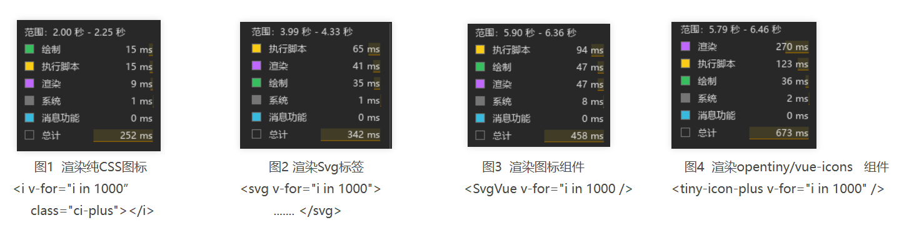

我们非常高兴地宣布  `@opentiny/icons`  正式发布啦！

·  源码：<https://github.com/opentiny/icons>（欢迎 Star ⭐）

·  官网：<https://opentiny.github.io/icons/>

·  图标预览：<https://opentiny.github.io/icons/browser-icons-base>

`OpenTiny Icons`  是 OpenTiny 团队开发的一款纯 CSS 图标库，覆盖了华为云规范中的四大类型的图标，其中单色图标以线型图标为主的设计风格，图标统一为`16*16`的大小，拥有安全边距，保证了一致的视觉大小。彩色图标是高清的华为云服务图标统一为`72*72`的大小，彩色状态图标统一为`80*80`的大小。

该图标库主要有以下亮点特色：

· ` 纯``CSS``图标库 `：纯 CSS 图标，支持 Vue / React 等所有的前端框架

· `高性能`：基于 UnoCSS，性能极优越，可全面代替组件型图标

· `按需引用`：支持  **@iconify-json**导出方式，配合 **@unocss/preset-icons**插件，  可实现按需引用

· ` 图标美观``/``丰富 `：290+ 基础单色图标，精致美观，风格统一，大小&颜色随心变，可满足大部分日常开发需要

· `可扩展`：支持自定义 SVG 图标，兼容整个  [Iconify](https://iconify.design/)  生态的图标

· `支持多色图标`：支持 240+ 的多色图标，覆盖常见的空数据、请求状态、应用权限等场景

· `适用场景多`：支持组件库的开发，日常应用开发

## 历史背景

我们团队目前维护着一套 Vue 组件的图标库，在维护中一直秉持着“只增不减”的原则，造成图标库存在了很多问题，比如：图标名错误，图标重复，另外图标来源不同，存在多个设计规范，视觉大小不统一，但由于已经上生产使用，一直不敢清理整顿，越来越膨胀。与此同时，我们的设计部门也维护着一套图标集，有基础图标、服务图标、状态图标等等，不仅图标设计得很漂亮，有完善的图标设计规范指导，风格一致，而且设计部门每月都在持续维护更新。于是就想基于设计部门的图标集做一个新的图标库并开源出来，跟设计部门沟通了一下，得到了许可！

图标库是很小众的技术，从早先的字体图标，到现在形形色色的组件库图标，我们应该使用什么技术去做呢？我们做了以下分析：

1、在当前组件化开发思想中，很多框架提供了图标组件，但我们认为“组件封装”多少都会带来一定的性能影响，这一点可以验证，见本文的性能分析部分，所以我们放弃了组件化图标的方案。

2、前端大神 Anthony Fu 在自己的博客[《聊聊纯 CSS 图标》](https://antfu.me/posts/icons-in-pure-css-zh)中提到：**在纯 CSS 中按需使用任何图标的能力**的一套方案，能支持单色和彩色图标。`纯CSS`才是纯粹的前端技术，而且它天然支持所有的前端框架，Anthony Fu 大神也表达过`图标不适合做成组件`的意见，让我们更加坚定用`CSS`来做图标的想法。

于是我们将  `OpenTiny`  设计团队设计的  `SVG`  图标资源，使用上文的[图标算法](https://github.com/opentiny/icons/blob/7e1dde24f54c678dabc3eb4f3c837380a2a66a1c/scripts/build.ts#L81)构建出来一套  `@opentiny/icons`  图标库。

接下来带大家快速上手  `@opentiny/icons`图标库：

## 快速入门

以一个普通的  `vite工程`  为例，执行以下命令安装  `@opentiny/icons`  图标库。

    npm install @opentiny/icons

在  `style.css`  中加入以下内容，就可以放心使用图标库了

```ts
@import "@opentiny/icons/style/all.css"
```

由于是纯 CSS 图标库，可以通过`CSS`去完全控制样式，其中`单色图标`支持通过字体大小和颜色去自定义样式，而`彩色图标`仅支持自定义大小。以下图标类名，可以从官网的“图标预览”中查询。

```css
<i class="ci-home" style="font-size:14px; color:#000;"></i>
<i class="ci-email" style="font-size:16px; color:#d32222;"></i>
<i class="ci-news" style="font-size:18x; color:#4822d3;"></i>
<i class="ci-date" style="font-size:20px; color:#40d322;"></i>
<hr />
<i class="ci-svc-ecs" style="font-size:72px;"></i>
<i class="ci-svc-obs" style="font-size:72px;"></i>
<i class="ci-svc-cbr" style="font-size:72px;"></i>
<i class="ci-svc-live" style="font-size:72px;"></i>
<hr />
```

效果如下：


## 图标类别

除了全量引入之外，还可以按`图标类别`导入图标，以减小引入样式文件的体积。通过  [图标预览](https://opentiny.github.io/icons/browser-icons-base '按住ctrl点击直接打开')  可以快速了解这些图标类别。所有图标类名的前缀统一为  `ci-类别-*`, 其中`base类别`的图标最为常用，所以省略了类别，其它类别的图标必须带着类别。

- 全量图标: all.css
- 基础图标: base.css
- 服务图标: svc.css
- 服务扩展图标: ext.css
- 状态图标: stat.css

比如只导入基础图标：

    @import "@opentiny/icons/style/base.css"

## 按需引用 (推荐)

`UnoCSS`是一个非常优秀的原子化 CSS 引擎，它提供有  [`@unocss/preset-icons`  图标插件](https://unocss.dev/presets/icons '按住ctrl点击直接打开')，可以实现按需引用图标，减小构建产物大小。[Iconify](https://iconify.design/)  是一个全面的图标解决方案，提供了一个庞大的图标库，它维护了 150 多个开源图标集的超过 20 万个图标。@unocss/preset-icons 图标插件就是使用  [Iconify](https://iconify.design/)作为图标数据源，如果想使用图标插件，就需要用户提前安装`@iconify-json/*`  依赖包，也就是发布为  `IconifyJson 格式的图标数据集` 。

为了支持  [`@unocss/preset-icons`  图标插件](https://unocss.dev/presets/icons '按住ctrl点击直接打开')，我们也将所有的图标以  `IconifyJson`  格式的导出，这样就可以在项目中，使用图标插件并按需引用图标了。

通过引入  `@unocss/preset-icons`  插件，可以实现按需引用图标，减小构建产物大小，并且可以调整图标前缀，避免与其它图标库冲突。

在  `vite.config.ts`  文件中加入以下内容。

```ts
import { defineConfig } from 'vite'
import UnoCSS from 'unocss/vite'
import presetIcons from '@unocss/preset-icons'

export default defineConfig({
  plugins: [
    UnoCSS({
      presets: [
        presetIcons({
          prefix: '',
          extraProperties: {
            display: 'inline-block',
            'vertical-align': 'middle'
          },
          collections: {
            ci: () => import('@opentiny/icons/json/icons.json', { assert: { type: 'json' } }).then((i) => i.default)
          }
        })
      ]
    })
  ]
})
```

然后在  `main.ts`  中添加下面代码，以启用  `UnoCSS`  的功能：

```ts
import 'virtual:uno.css'
```

经过以上配置，就可以正常使用所有的图标了。

详细用法可参考[官网配置说明](https://opentiny.github.io/icons/quick-start#%E6%8C%89%E9%9C%80%E5%BC%95%E7%94%A8-%E6%8E%A8%E8%8D%90 '按住ctrl点击直接打开')。

## 自定义 SVG 图标

当需要使用设计师提供的  `SVG图标`  时， `@unocss/preset-icons`  插件允许我们快速的自定义图标，比如在上面配置的`collections`  节点中增加如下配置，就可以通过  `<i class="custom-circle"></i>`  来显示一个图标了。

```ts
  collections: {
    ci: () => import('@opentiny/icons/json/icons.json', { assert: { type: 'json' }}).then((i) => i.default),
    custom: {
      circle: '<svg viewBox="0 0 120 120"><circle cx="60" cy="60" r="50"></circle></svg>',
      /* ...其它自定义图标... */
    },
  }
```

详细用法可参考[UnoCSS 文档](https://unocss.dev/presets/icons#customization) 。

## 图标方案的对比&择优

当我们获得精美设计的图标之后，为什么我们会选择`纯CSS图标库`做为最优的渲染方案，尤其是在组件化思潮的时代，选择了这种看起来有些“低端”的技术呢？

做技术的人都会善于思考技术的本质与摸索最佳实践，所以跟风永远不是最好的选择。我们思考的是什么才是当前图标库的最佳实践，最优的性能的方案？

现在就`“渲染svg 图标方案”`来讲，我们有多少种技术渲染出来，哪种技术性能最好呢？这里使用 Vue 技术栈来研究一下，如果选择其它前端框架也会得到近似的结果吧。

- ~~svg 字体方案~~
- ~~svg 精灵图方案~~
- 纯 CSS 图标方案
- 渲染 Svg 标签
- 渲染图标组件： 封装 Svg 标签到组件模板中
- 渲染第三方图标库：本质也是渲染图标组件，比如  @opentiny/vue-icons， @ant-design/icons-vue ，@element-plus/icons-vue

上述方案中， 字体方案性能应该很优秀，但是它是过时方案，比如需要字体文件，只能是单色，容易模糊失真等； svg 精灵图必须放置几百个 svg 到 html 中且不能摇树，也是不太能接受的方案。

所以我们只讨论后面的 4 种情况。

对这 4 种情况，我们打开浏览器开发者工具录制性能，然后单次渲染 1000 个图标，最后对执行脚本，渲染绘制时长进行分析（机器不同，数据会不同，但不影响横向评比）：



通过分析以上结果，我们得到以下结论：

1、执行脚本时间：

- 由图 1，2 可知：vdom 越大，渲染的元素越多，执行脚本时长越大。 执行脚本时长排序：渲染大 svg  >  渲染小 svg > 渲染 i 标签 。
- 由图 2，3 可知：  由于 Vue 组件在运行时，并不是“零成本"，所以执行脚本时长排序： 渲染组件 >  直接渲染 Dom

2、绘制（Painting) 时间 & 渲染（Rendering)  时间：

- 由图 1 与图 2，3，4 比较可知，纯 CSS 图标的绘制时长为 15ms,  渲染时长为 9ms，  其它方案绘制时长 36\~ 47ms，渲染时长 41\~ 270ms， 这说明浏览器通过 css 绘制的性能是直接绘制 Svg 的 2\~3 倍。猜测是由于 css 的内容是固定的，且在 css 编译时就缓存结果，但页面上渲染 svg 元素时，浏览器需要实时解析后才能绘制，无法提前优化。

综上，纯 CSS 图标就是最优性能的图标方案，它具有最简单的 dom 结构， 又具有最快的绘制性能，综合性能远远超过了 svg 方案和 svg 组件方案。如果你在注重性能的场景，比如大数据表格时，请一定使用纯 CSS 图标代替图标组件，欢迎考虑一下@opentiny/icons 图标库了！

从另一个角度上，CSS 是前端的三大基本技术之一，它天然就支持所有框架，所有浏览器场景。在【Anthony Fu】托尼的开源之路: 集论中， 也表达过类似的观点：每次增加技术约束，就会减少目标受众用户，如果 Vite 只服务于 Vue 技术栈， 那么它无法拥有目前广泛的目标受众用户。图标库也一样，当你实现了一套 Vue\React\Solid .... 的图标库时，你无形就排除了许多的目标用户。只有拥抱纯 CSS，拥抱纯前端的技术才能放大自身的价值。

## 关于 OpenTiny

欢迎加入 OpenTiny 开源社区。添加微信小助手：opentiny-official 一起参与交流前端技术～\
OpenTiny 官网：**<https://opentiny.design>**\
OpenTiny 代码仓库：**<https://github.com/opentiny>**\
TinyVue 源码：**<https://github.com/opentiny/tiny-vue>**\
TinyEngine 源码：**<https://github.com/opentiny/tiny-engine>**\
欢迎进入代码仓库 Star🌟TinyEngine、TinyVue、TinyNG、TinyCLI、TinyEditor\~ 如果你也想要共建，可以进入代码仓库，找到 good first issue 标签，一起参与开源贡献\~
