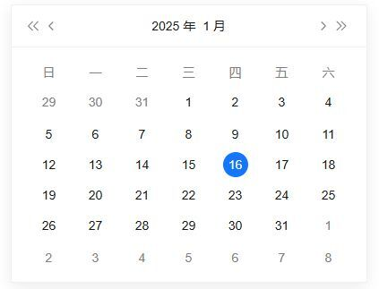
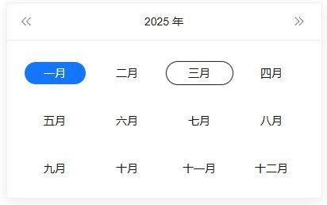
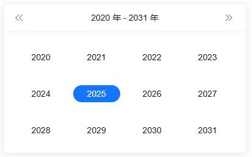
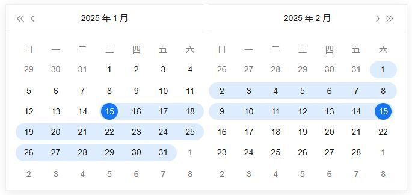
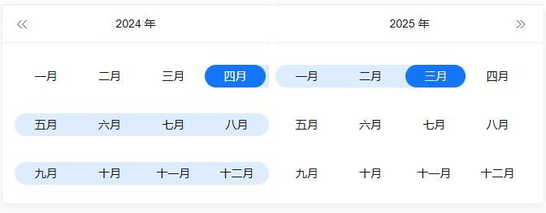
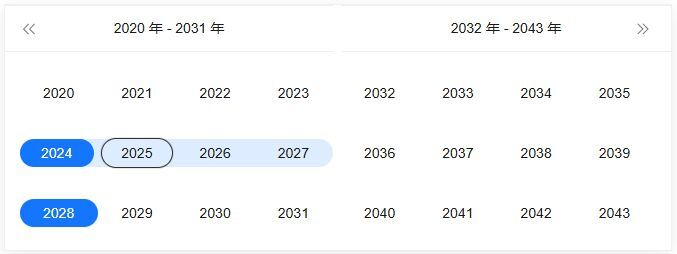
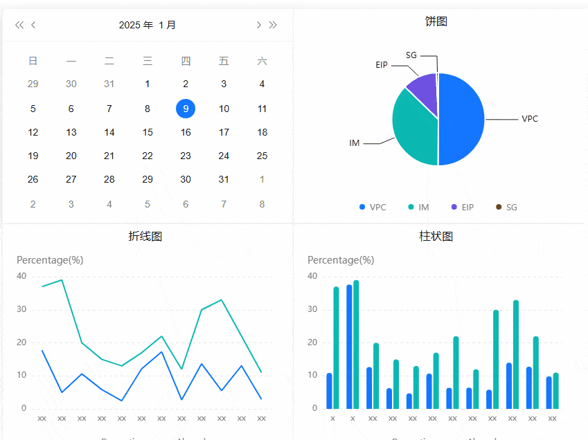

本文由体验技术团队刘坤原创。

现代 Web 开发中，日期选择器是不可或缺的组件之一。无论是用户填写表单、筛选数据，还是设置预约时间，日期选择器都能提供便捷的操作体验。然而，在某些场景下，我们可能需要将日期面板单独使用，例如在弹窗、浮层或抽屉中展示，以提升用户体验。

DatePicker 组件全新升级，支持日期面板单独使用！无论您是需要在复杂页面中嵌入日期选择器，还是希望在特定场景下提供独立的日期选择功能，这个功能都能满足您的需求。

- 源码：<https://github.com/opentiny/tiny-vue> （欢迎 Star ⭐）

- 官网：<https://opentiny.design/tiny-vue/zh-CN/os-theme/overview>

## 基本介绍和使用场景

DatePicker 组件是一款功能强大的日期选择工具，支持单选、范围选择、快捷选项等多种模式。此次更新后，日期面板可以独立于组件使用，这意味着开发者可以根据实际需求，将日期面板嵌入到任何页面或功能模块中，而无需依赖完整的 DatePicker 组件。

### 适用场景

**表单填写：** 在用户需要选择日期等场景中，日期面板可以作为独立组件嵌入表单。

**预约系统：** 在预约功能中，单独展示日期面板，让用户更直观地选择日期和时间。

**日历应用：** 如果你正在开发日历类应用，日期面板可以单独使用，帮助用户快速选择日期。

**复杂业务场景：** 在需要自定义布局或与其他组件深度集成的场景中，日期面板的独立使用能力将极大提升开发效率。

**数据筛选：** 在数据展示页面中，通过直接使用日期面板，方便用户快速筛选数据。

## 如何快速上手

使用 DatePicker 组件的日期面板非常简单。以下是示例代码：

```js
<template>
  <div class="demo-date-panel-wrap">
    <div class="value">{{ value }}</div>
    <tiny-date-panel v-model="value"></tiny-date-panel>
    <div class="value1">{{ value1 }}</div>
    <tiny-date-range type="daterange" v-model="value1"></tiny-date-range>
    <div class="value2">{{ value2 }}</div>
    <tiny-month-range v-model="value2"></tiny-month-range>
    <div class="value3">{{ value3 }}</div>
    <tiny-year-range v-model="value3"></tiny-year-range>
  </div>
</template>

<script setup>
import { ref } from 'vue'
import { TinyDatePanel, TinyDateRange, TinyMonthRange, TinyYearRange } from '@opentiny/vue'

const value = ref('2025-01-15')
const value1 = ref(['2025-01-15', '2025-02-15'])
const value2 = ref(['2024-03', '2025-02'])
const value3 = ref(['2024', '2028'])
</script>
```

效果如下：

1、日期面板（**TinyDatePanel**)



2、月份面板（**TinyDatePanel:type=month**)



3、年份面板（**TinyDatePanel:type=year**)



4、日期区间面板（**TinyDateRange:type=daterange**)



5、月份区间面板（**TinyMonthRange**)



6、年份区间面板（**TinyYearRange**)



## 亮点特性介绍

**1、灵活的面板类型**

DatePicker 面板组件支持多种面板类型，满足不同场景的需求：

- 日期选择：默认的日期选择面板，支持单选和范围选择。
- 日期区间选择：单独的日期区间选择面板，适合需要时间区间的场景。

**2、自定义样式**

DatePicker 面板组件提供了丰富的样式配置选项，您可以根据项目需求自定义面板的外观：

- 主题颜色：支持自定义主题颜色，与您的项目风格完美融合。
- 布局调整：可以调整面板的布局，例如调整日期格子的大小、排列方式等。

**3、便捷的事件处理**

DatePicker 面板组件提供了对应的事件回调，方便您在不同场景下处理用户操作：

- SelectChange：当用户选择日期或时间时触发，返回选中的日期

## 如何二次拓展

DatePicker 组件不仅功能强大，还支持二次扩展，满足复杂业务场景的需求。

**1. 自定义快捷选项**

您可以根据需求自定义快捷选项。例如，在日期面板中添加额外的快捷选中日期按钮：

```js
<template>
  <div class="demo-date-panel-wrap">
    <div class="value">{{ value }}</div>
    <tiny-date-panel v-model="value" :shortcuts="shortcuts"></tiny-date-panel>
  </div>
</template>
<script setup>
import { ref } from'vue'
import { TinyDatePanel } from'@opentiny/vue'

const value = ref('2025-01-15')
const shortcuts = [
  {
    text: '今天',
    onClick(picker) {
      const date = newDate()
      picker.$emit('pick', date)
    }
  },
  {
    text: '昨天',
    onClick(picker) {
      const date = newDate()
      date.setTime(date.getTime() - 3600 * 1000 * 24)
      picker.$emit('pick', date)
    }
  },
  {
    text: '一周前',
    onClick(picker) {
      const date = newDate()
      date.setTime(date.getTime() - 3600 * 1000 * 24 * 7)
      picker.$emit('pick', date)
    }
  }
]
</script>
```

**2、与其他组件灵活混合使用，例如和 popper 组件混合使用**

```js
<template>
   <tiny-popover placement="top-start">
      <template #reference>
          <tiny-button>点我展示面板</tiny-button>
      </template>
      <template #default>
          <div class="value">{{ value }</div>
          <tiny-date-panel v-model="value"></tiny-date-panel>
      </template>
   </tiny-popover>
</template>

<script setup>
import { ref } from 'vue'
import { TinyPopover, TinyButton, TinyDatePanel } from *@opentiny/vue'

const value = ref('2025-01-15')
</script>
```

效果如下：


2.1 和 chart 组件混合使用

```js
<template>
  <div class="demo-date-panel-wrap">
      <div style="display: flex; width: 1oepx; justify-content: baseline">
          <div style="">
              <tiny-date-panel v-model="value" @select-change="handleSelectChange"></tiny-date-panel>
          </div>
          <div style="width: 420px; border: solid 1px #fofofo">
              <h3class="title">饼图</h3>
                  <br />
                  <div class="content">
                      <tiny-chart :key="key" type="ring" :options="options3" :width="420" height="270px"></tiny-chart>
                  </div>
          </div>
      </div>
      <div style="display: flex; width: 1ooopx; justify-content: baseline">
          <div style="width: 420px; border: solid 1px #fofofo">
              <h3 class="title">折线图</h3>
              <div class="content">
                  <tiny-chart type="line" :width="420" height="311px" :options="options1"></tiny-chart>
              </div>
          </div>
          <div style="width: 420px; border: solid 1px #f0f0fe">
              <h3 class="title">柱状图</h3>
              <div class="content">
                  <tiny-chart type="histogram" :width="420" height="311px" :options="options2"></tiny-chart>
              </div>
          </div>
      </div>
  </div>
</template>
<script setup lang="jsx">
import { ref } from'vue'
import { TinyHuichartsasTinyChart } from'@opentiny/vue-huicharts'
import { TinyDatePanel  } from'@opentiny/vue'

const value = ref('2025-01-15')
const options1 = ref({
padding: [50, 30, 50, 20],
legend: {
    show: true,
    icon: 'line'
  },
data: [
    { Month: 'Jan', Domestics: 33, Abroad: 37 },
    { Month: 'Feb', Domestics: 27, Abroad: 39 },
    { Month: 'Mar', Domestics: 31, Abroad: 20 },
    { Month: 'Apr', Domestics: 30, Abroad: 15 },
    { Month: 'May', Domestics: 37, Abroad: 13 },
    { Month: 'Jun', Domestics: 36, Abroad: 17 },
    { Month: 'Jul', Domestics: 42, Abroad: 22 },
    { Month: 'Aug', Domestics: 22, Abroad: 12 },
    { Month: 'Sep', Domestics: 17, Abroad: 30 },
    { Month: 'Oct', Domestics: 40, Abroad: 33 },
    { Month: 'Nov', Domestics: 42, Abroad: 22 },
    { Month: 'Dec', Domestics: 32, Abroad: 11 }
  ],
xAxis: {
    data: 'Month'
  },
yAxis: {
    name: 'Percentage(%)'
  }
})

const options2 = ref({
padding: [50, 30, 50, 20],
legend: {
    show: true,
    icon: 'line'
  },
data: [
    { Month: 'Jan', Domestics: 33, Abroad: 37 },
    { Month: 'Feb', Domestics: 27, Abroad: 39 },
    { Month: 'Mar', Domestics: 31, Abroad: 20 },
    { Month: 'Apr', Domestics: 30, Abroad: 15 },
    { Month: 'May', Domestics: 37, Abroad: 13 },
    { Month: 'Jun', Domestics: 36, Abroad: 17 },
    { Month: 'Jul', Domestics: 42, Abroad: 22 },
    { Month: 'Aug', Domestics: 22, Abroad: 12 },
    { Month: 'Sep', Domestics: 17, Abroad: 30 },
    { Month: 'Oct', Domestics: 40, Abroad: 33 },
    { Month: 'Nov', Domestics: 42, Abroad: 22 },
    { Month: 'Dec', Domestics: 32, Abroad: 11 }
  ],
xAxis: {
    data: 'Month'
  },
yAxis: {
    name: 'Percentage(%)'
  }
})

const options3 = ref({
type: 'pie',
data: [
    { value: 100, name: 'VPC' },
    { value: 90, name: 'IM' },
    { value: 49, name: 'EIP' },
    { value: 14, name: 'SG' }
  ]
})

consthandleSelectChange = () => {
  options1.value.data = options1.value.data.map((item) => {
      item.Domestics = item.Domestics * (Math.random() * 0.9 + 0.1)
      return item
  })
  options2.value.data = options2.value.data.map((item) => {
      item.Domestics = item.Domestics * (Math.random() * 0.9 + 0.1)
      return item
  })
  options3.value.data = options3.value.data.map(item) => {
      item.value = item.value * (Math.random() * 0.9 + 0.1)
      return item
  })
}
</script>
```

效果如下：



更多场景期待您的探索和发掘

## 总结

DatePicker 面板组件支持日期面板单独使用，为开发者提供了更大的灵活性和可定制性。无论是基础的日期选择功能，还是复杂的业务场景，DatePicker 面板组件都能满足您的需求。快来体验这个组件吧！

## 关于 OpenTiny

欢迎加入 OpenTiny 开源社区。添加微信小助手：opentiny-official 一起参与交流前端技术～\
OpenTiny 官网：**<https://opentiny.design/>**\
OpenTiny 代码仓库：**<https://github.com/opentiny/>**\
TinyVue 源码：**<https://github.com/opentiny/tiny-vue>**\
TinyEngine 源码： **<https://github.com/opentiny/tiny-engine>**\
欢迎进入代码仓库 Star🌟TinyEngine、TinyVue、TinyNG、TinyCLI\~ 如果你也想要共建，可以进入代码仓库，找到 good first issue 标签，一起参与开源贡献\~
