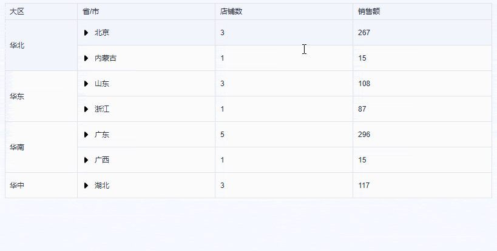
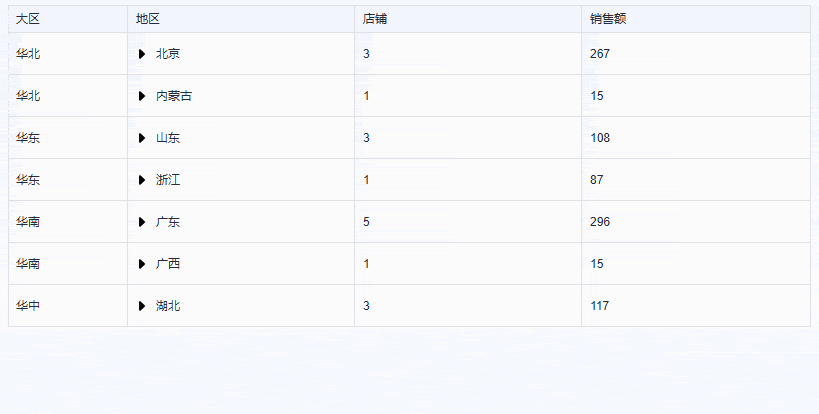
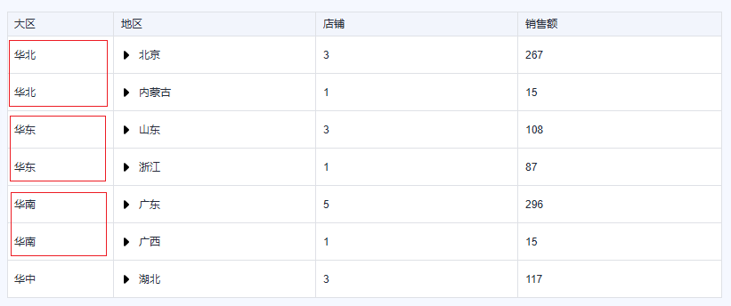
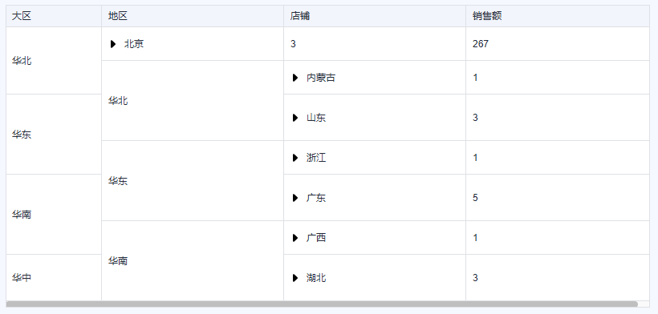
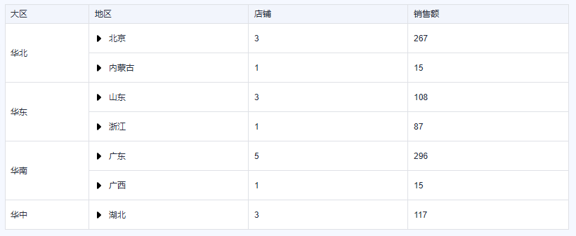
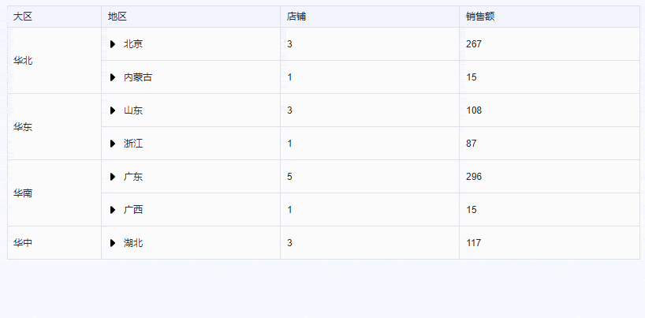
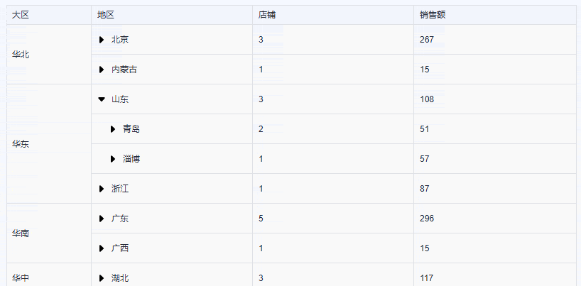
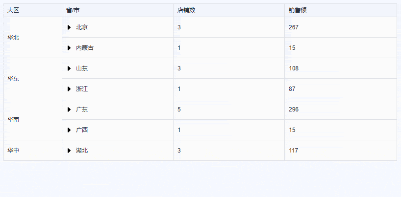

本文由孟智强同学原创。

## **背景**

团队某个小项目切换 UI 框架，要将 Element 换成  TinyVue。期间遇到一个树表形式的业务表格，支持多级下钻，且第一列有合并行。当初用 Element 实现这个表格时费了一些周折，料想 TinyVue 上场应该也不轻松，谁曾想一上手才知道——这比 Element 实现容易多了！

先上最终效果图（表格内容已脱敏处理)：



## **显示树表**

TinyVue 的表格组件支持树表（详情），我们只需将业务数据按约定格式处理好，再简单进行配置即可。用到的表格数据如下：

```ts
const rawData = [
  { area: '华北', province: '北京', city: '北京', store: '密云店', sales: 72 },
  { area: '华东', province: '山东', city: '淄博', store: '蓝翔NO.1', sales: 57 },
  { area: '华中', province: '湖北', city: '武汉', store: '北区', sales: 21 },
  { area: '华北', province: '北京', city: '北京', store: '朝阳总店', sales: 123 },
  { area: '华东', province: '山东', city: '青岛', store: '蜊叉泊分店', sales: 12 },
  { area: '华中', province: '湖北', city: '武汉', store: '南区', sales: 42 },
  { area: '华北', province: '北京', city: '北京', store: '香山店', sales: 72 },
  { area: '华南', province: '广东', city: '广州', store: '花城店', sales: 90 },
  { area: '华南', province: '广西', city: '桂林', store: '甲天下', sales: 15 },
  { area: '华中', province: '湖北', city: '武汉', store: '城中区', sales: 54 },
  { area: '华南', province: '广东', city: '东莞', store: '万象汇', sales: 35 },
  { area: '华东', province: '山东', city: '青岛', store: '金沙滩分店', sales: 39 },
  { area: '华南', province: '广东', city: '深圳', store: '天虹', sales: 85 },
  { area: '华东', province: '浙江', city: '绍兴', store: '鲁镇店', sales: 87 },
  { area: '华南', province: '广东', city: '东莞', store: '大润发', sales: 26 },
  { area: '华北', province: '内蒙古', city: '乌兰察布', store: '乌拉旗舰店', sales: 15 },
  { area: '华南', province: '广东', city: '广州', store: '越秀店', sales: 60 }
]
```

我们先把它处理成树表约定的格式：

```ts
const mergeKeys = ['area', 'province', 'city'] // 需要合并的字段名
// 根据合并字段进行排序，方便后续处理
rawData.sort((a: any, b: any) => {
  for (let key of mergeKeys) {
    if (a[key] !== b[key]) {
      return a[key].localeCompare(b[key])
    }
  }
  return 0
})

// 生成树表所需格式的数据
const tableData = rawData.reduce((arr, item) => {
  const provinceNode = initNodeData(arr, item, 'province')
  const cityNode = initNodeData(provinceNode.children, item, 'city')

  cityNode.children.push({
    place: item.store,
    store: 1,
    sales: item.sales
  })

  return arr
}, [] as any[])

function initNodeData(arr: any[], row: any, placeKey: string) {
  const placeValue = row[placeKey]
  let matched = arr.find((v) => v.place === placeValue)

  if (!matched) {
    matched = {
      area: row.area,
      place: placeValue,
      store: 0,
      sales: 0,
      children: [] // 子级
    }
    arr.push(matched)
  } // 统计当前行的 store 数量和 sales

  matched.store += 1
  matched.sales += row.sales

  return matched
}
```

处理好的  `tableData`  格式如下：

```json
[
  {
    "area": "华北",
    "place": "北京",
    "store": 3,
    "sales": 267,
    "children": [
      {
        "area": "华北",
        "place": "北京",
        "store": 3,
        "sales": 267,
        "children": [
          {
            "place": "密云店",
            "store": 1,
            "sales": 72,
            "_RID": "row_3"
          },
          ...
        ]
      }
    ]
  },
  ...
]
```

模板的配置非常方便，只需为需要展开的列配置  `tree-node`  即可。

> Element 中的树表默认只能通过第一列的单元格来控制展开和折叠，如果想要在其他列中实现同样的功能，就需要使用一点黑魔法 hack。这一点要为 TinyVue 的方便好用点赞！

```ts
<template>
  <tiny-grid :data="tableData" :tree-config="{ children: 'children' }" border>
    <tiny-grid-column title="大区" field="area" width="120" />
    <tiny-grid-column title="地区" field="place" tree-node /> <!-- 这列控制树表展开/折叠 -->
    <tiny-grid-column title="店铺" field="store" />
    <tiny-grid-column title="销售额" field="sales" />
  </tiny-grid>
</template>
```

效果如下图：



## **跨行合并首列单元格**

TinyVue 表格组件提供了  `row-span`  和  `span-method`  两种单元格合并的方法，但前者不支持嵌套树表，所以这里选择后者。`span-method`  这个方法是不是很眼熟？对了，Element Table 中也有这个方法，两者在使用上几乎一模一样。

```ts
<template>
  <tiny-grid span-method="spanMethod" ... >...</tiny-grid>
</template>
```

```ts
function spanMethod({ columnIndex, row }: { columnIndex: number; row: any }) {
  if (columnIndex === 0) {
    // 首列跨行合并
    return {
      rowspan: 1, // 如何求跨行合并数值？
      colspan: 1
    }
  }
}
```

接下来的问题就是如何求出  `spanMethod`  方法返回值中的  `rowspan`  的值。

我们先来看表格，在初始状态下，表格首列需要跨行合并的单元格如下图红框处所示：



不难看出每个“大区”（area）的跨行合并数就是其相邻且内容相同单元格的个数，例如“大区”一列中相邻的“华北”单元格有 2 个，则它的跨行合并数就是 2。我们可以通过定义一个  `rowspanMapping`  变量来保存这些“大区”分别对应的跨行合并数：

```ts
// 跨行合并数，Map key 为 area 的值，Map value 为跨行合并数
const rowspanMapping: Map<string, number> = new Map()

// 统计不同大区的默认跨行合并数
tableData.forEach((item) => {
  const spanValue = rowspanMapping.get(item.area) ?? 0
  rowspanMapping.set(item.area, spanValue + 1)
})
```

然后我们就得到了表格初始形态首列的跨行合并数信息：

```ts
Map(4) {'华北' => 2, '华东' => 2, '华南' => 2, '华中' => 1}
```

再应用到  `spanMethod`  方法中：

```ts
function spanMethod({ columnIndex, row }: { columnIndex: number; row: any }) {
  if (columnIndex === 0) {
    // 首列跨行合并
    return {
      rowspan: rowspanMapping.get(row.area), // 获取当前单元格跨行合并数
      colspan: 1
    }
  }
}
```

然而，实际的渲染效果与我们预期的完全不同，表格布局出现了严重的错位。如下图所示：



经过分析，我们发现在进行单元格合并时，合并组中的起始单元格会占据对应的行数，而其余单元格则需要被移除，以保证表格的结构不会出现错位。在 TinyVue 表格组件的  `spanMthod`  方法中，我们通过将  `rowspan`  设为 0 来实现这一点。例如，“华北”的  `rowspan`  为 2，则第一个“华北”单元格的  `rowspan`  值就为 2，而第二个“华北”单元格则应该设为 0，即移除不渲染。

为此，我们需要改进我们统计大区默认跨行合并数的方法。我们可以通过定义一个私有属性来记录当前“大区”是否首次出现：

```ts
tableData.forEach((item) => {
  const spanValue = rowspanMapping.get(item.area) ?? 0 // 当前 area 值首次出现（用于设定 rowspan 的作用行）
  item._isAppearFirst = !rowspanMapping.has(item.area)
  rowspanMapping.set(item.area, spanValue + 1)
})
```

合并方法也要随之调整：

```ts
function spanMethod({ columnIndex, row }: { columnIndex: number; row: any }) {
  if (columnIndex === 0) {
    // 首列跨行合并
    return {
      // 当前大区若首次出现，则应用跨行合并数，否则设为0（不渲染）
      rowspan: row._isAppearFirst ? rowspanMapping.get(row.area) : 0,
      colspan: 1
    }
  }
}
```

完成后效果如下图所示：



## **合并行动态适配树表展开与折叠**

目前为止，我们已经实现了树表和表格初始化状态首列的行合并，接下来要将两者结合起来完成最终效果。

当展开树表中的任意一行时，当前行下方会显示新的表格行；相反，折叠任意一行时，下方对应的表格行也会隐藏。换句话说，随着树表的展开和折叠，表格的总行数会发生变化，因此需要动态调整对应首列的跨行合并数，以确保表格布局不发生错位。

举例说明：

1. “华东”的跨行合并数默认为 2
   
2. 当展开“山东”时，会显示下级的“青岛”和“淄博”，此时“华东”的跨行合并数应该加上这 2 个新出现的表格行，变为 4，才能确保表格布局恢复正常。
   
3. 同理，当继续展开“青岛”时，会显示 2 个下级行，此时“华东”的跨行合并数应该再加上这 2 个新出现的表格行，变为 6
   

> 树表的折叠操作与展开类似，只是将新增的表格行替换为减少的表格行，这里不再赘述。

原理搞清了，下面分享代码实现。

既然需要根据树表的展开和折叠来计算跨行合并数，那么首先就要监听树表切换事件  `toggle-tree-change`：

```ts
<template>
  <tiny-grid @toggle-tree-change="handleExpand" ... >
    ...
  </tiny-grid></template>
```

    function handleExpand({ row }: { row: any }) {
      // ?
    }

在表格组件底层，当树表展开或折叠后，会重新获取单元格合并数信息以进行布局。换句话说，我们需要在  `handleExpand`  方法中计算出树表行操作后的合并数，以便  `spanMethod`  方法能够获取到最新的单元格合并数。

为了计算操作后的合并数，我们需要知道当前操作是“展开”还是“折叠”，以便进行针对性的处理：

- 当前为折叠操作，需要减去待折叠的行数
- 当前为展开操作，需要加上待展开的行数

我们为每行数据添加一个私有属性  `_treeExpanded`  来存储展开/折叠状态。

```ts
function initNodeData(arr: any[], row: any, placeKey: string) {
  ...
  if (!matched) {
    matched = {
      ...
      _treeExpanded: false  // 自定义属性：当前树表行是否展开
    };
  }
 ...
}
```

这样我们就可以在  `handleExpand`  方法中进行展开或折叠的合并行数处理了：

```ts
function handleExpand({ row }: { row: any }) {
  const curRowspan = rowspanMapping.get(row.area) ?? 0 // 当前 area 的跨行合并数
  const changedRowspan = row.children.length // 当前行的子级数量
  let spanValue
  if (row._treeExpanded) {
    // 当前行已展开：当前为折叠操作，需要减去待折叠的行数
    spanValue = curRowspan - changedRowspan
  } else {
    // 当前行已折叠：当前为展开操作，需要加上待展开的行数
    spanValue = curRowspan + changedRowspan
  }
  row._treeExpanded = !row._treeExpanded // 更新状态
  rowspanMapping.set(row.area, spanValue)
}
```

目前的效果已经非常接近了，但通过测试我们发现：当树表按层级顺序逐步展开或折叠时，一切正常，然而，若直接跨层级操作，就会出现布局错位。正如下图所示：



这是因为跨层级操作时，我们的代码中只考虑了当前行子级的变动数量，而没有考虑子级的子级，以及更深层级的展开/折叠状态。因此，我们需要将当前行的所有子级都纳入考虑。下面是最终调整后的代码：

```ts
function handleExpand({ row }: { row: any }) {
  const curRowspan = rowspanMapping.get(row.area) ?? 0
  let changedRowspan = row.children.length // 当前行已展开：当前为折叠操作，需要减去待折叠的行数（含后代） // 当前行已折叠：当前为展开操作，需要加上待展开的行数（含后代）

  const deepExpandedCount = (arr: any[]) => {
    if (!Array.isArray(arr)) {
      return
    }

    arr.forEach((item: any) => {
      if (item._treeExpanded) {
        // 递归累加已经展开的子级个数
        changedRowspan += item.children.length
        deepExpandedCount(item.children)
      }
    })
  }

  deepExpandedCount(row.children)

  const spanValue = curRowspan + changedRowspan * (row._treeExpanded ? -1 : 1)
  row._treeExpanded = !row._treeExpanded // 更新状态
  rowspanMapping.set(row.area, spanValue)
}
```

## **要点总结**

1、为需要控制树表展开/折叠的列配置  `tree-node`  属性；

2、`span-method`  方法返回当前单元格的合并数，其中  `rowspan`  为跨行合并数，当设为 0 时，当前单元格不渲染；

3、定义一个变量以存储表格的跨行合并数信息；

4、对于相邻且内容相同的同组单元格，仅设置该组首个单元格的  `rowspan`  为对应的跨行合并数，其余单元格均设为 0；

5、监听表格的  `toggle-tree-change`  事件，区分树表的展开、折叠操作，动态修改对应的跨行合并数信息。

## **关于 OpenTiny**

欢迎加入 OpenTiny 开源社区。添加微信小助手：opentiny-official 一起参与交流前端技术～\
OpenTiny 官网：**<https://opentiny.design/>**\
OpenTiny 代码仓库：**<https://github.com/opentiny/>**\
TinyVue 源码：**<https://github.com/opentiny/tiny-vue>**\
TinyEngine 源码： **<https://github.com/opentiny/tiny-engine>**\
欢迎进入代码仓库 Star🌟TinyEngine、TinyVue、TinyNG、TinyCLI\~ 如果你也想要共建，可以进入代码仓库，找到  good first issue 标签，一起参与开源贡献\~
