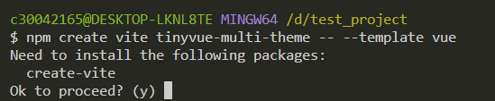
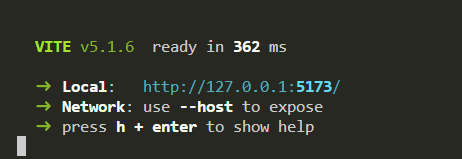
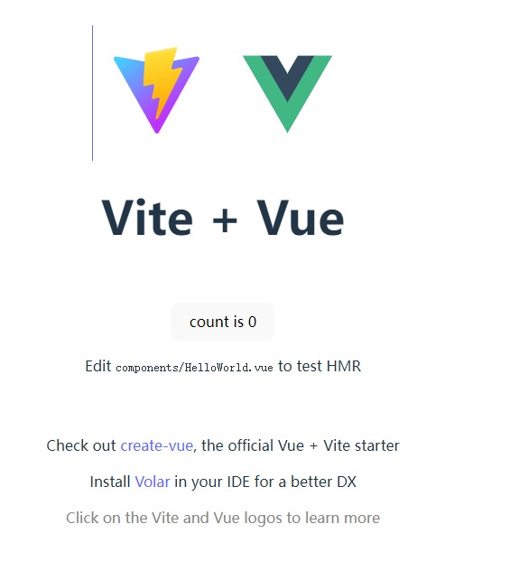
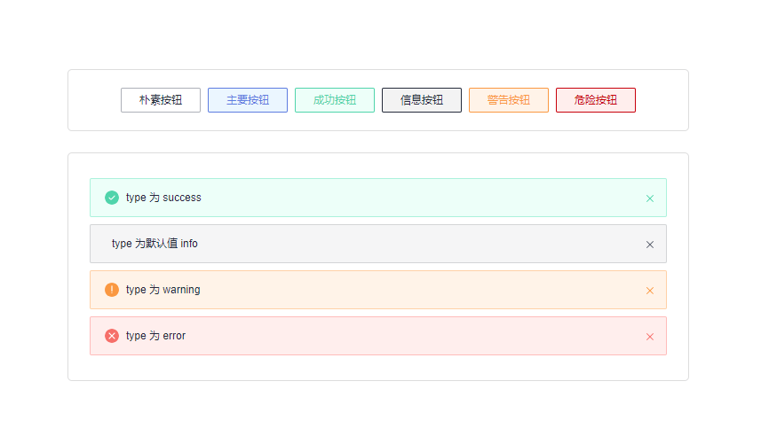
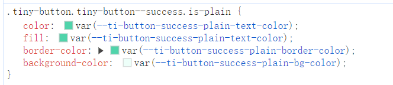
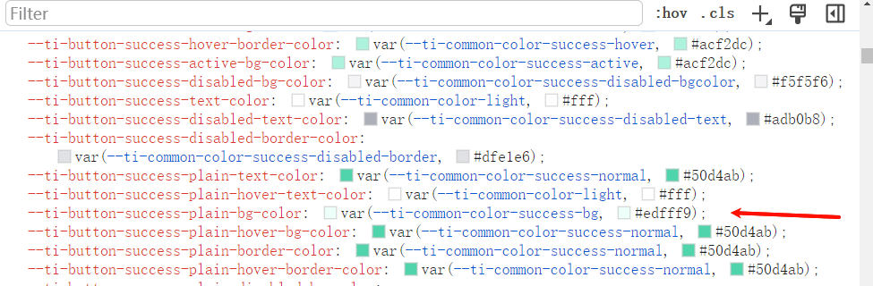
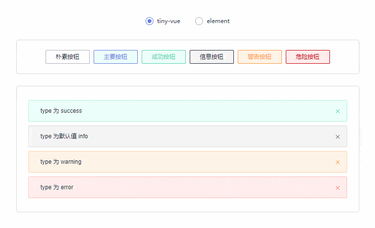
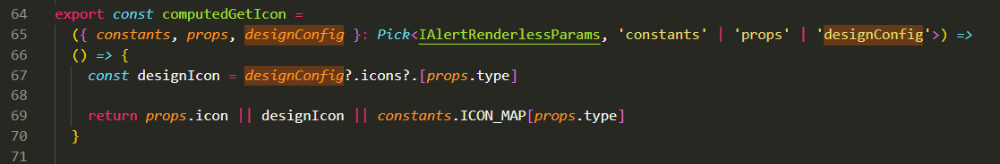
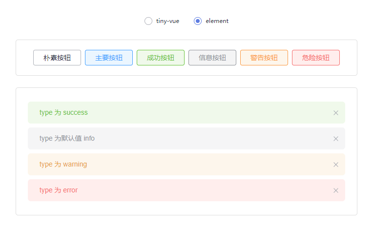
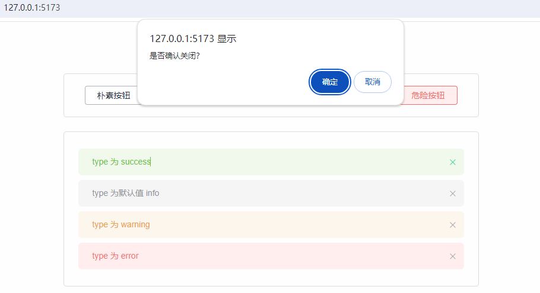

本文由体验技术团队 TinyVue 项目成员岑灌铭创作，欢迎大家实操体验，本实操内容通过实现 TinyVue 中 Button 组件和 Alert 的类 element 主题适配，让开发者感受到 TinyVue 跨设计规范的亮点特性，同时对 TinyVue 组件库多主题的实现原理有个初步的了解。

## 知识背景

### **1. TinyVue 组件库简介**

- OpenTiny 是一套企业级前端开发解决方案，其中包含了组件库、低代码、中后台模板、CLI 命令行等丰富的效率提升工具。其中 TinyVue 是其中一款支持跨端、跨框架以及跨设计规范的组件库。

- 本次实操内容通过实现 TinyVue 中 Button 组件和 Alert 的类 element 主题适配，让开发者感受到 TinyVue 跨设计规范的亮点特性，同时对 TinyVue 组件库多主题的实现原理有个初步的了解。

- 代码托管 GitHub：<https://github.com/opentiny/tiny-vue> （欢迎大家 Star 和 提 Issue、PR 进行反馈）
- TinyVue 官网：<https://opentiny.design/tiny-vue/zh-CN/smb-theme/overview>

### **2.环境基本要求**

- node.js v16+ npm v8+
- 代码编辑器 VsCode 以及 Chrome/Edge 浏览器

## 代码实战

### **1.使用 Vite 创建一个 Vue3 项目**

1.1 打开 VSCode 软件，使用 Ctrl+~快捷键打开终端。执行以下命令安装 Vite

```
npm install -g vite
```

1.2 使用 Vite 创建一个 Vue3 工程

```
npm create vite@latest tinyvue-multi-theme -- --template vue
```



命令行提示是否安装 create-vite@latest，输入`y`后回车，安装并创建

```
cd tinyvue-multi-theme
npm install
npm run dev
```

创建工程完毕后，依次输入以上命名

- 进入工程文件夹
- 安装依赖
- 执行命令启动项目

出现以下界面，则说明项目启动成功，Ctrl+鼠标左边单击  <http://127.0.0.1:5173/>  从浏览器启动项目





浏览器打开会出现以上界面，说明一切正常，到此为止，Vue3 项目已经完成创建。

### **2.安装 TinyVue，使用 button 以及 alert 组件**

安装@opentiny/vue,在 vscode 终端下执行以下命名，安装 TinyVue 组件库

```
npm install @opentiny/vue@3.16.0
```

打开 OpenTiny 官网  <https://opentiny.design/tiny-vue/zh-CN/overview>  找到 Button 组件和 Alert 组件，可以参考官网 demo 的写法新增本次实验所需代码。

在 components 文件夹下，新建`ButtonDemo.vue`文件,  使用 Button 组件，新增 6 个类型的朴素按钮。

```js
<template>
  <tiny-button plain> 朴素按钮 </tiny-button>
  <tiny-button type="primary" plain> 主要按钮 </tiny-button>
  <tiny-button type="success" plain> 成功按钮 </tiny-button>
  <tiny-button type="info" plain> 信息按钮 </tiny-button>
  <tiny-button type="warning" plain> 警告按钮 </tiny-button>
  <tiny-button type="danger" plain> 危险按钮 </tiny-button>
</template>

<script>
import { Button } from "@opentiny/vue";
export default {
  components: {
    TinyButton: Button,
  },
};
</script>
```

在 components 文件夹下，新建`AlertDemo.vue`文件, 使用 Alert 组件，新增 4 个类型 alert。

```js
<template>
  <div>
    <tiny-alert type="success" description="type 为 success"></tiny-alert>
    <tiny-alert type="simple" description="type 为默认值 info"></tiny-alert>
    <tiny-alert type="warning" description="type 为 warning"></tiny-alert>
    <tiny-alert type="error" description="type 为 error"></tiny-alert>
  </div>
</template>

<script>
import { Alert } from "@opentiny/vue";

export default {
  components: {
    TinyAlert: Alert,
  },
};
</script>
```

删除无关文件`HelloWorld.vue` ，修改`App.vue`文件，引入`ButtonDemo.vue`和`AlertDemo.vue`组件。

```js
import ButtonDemo from './components/ButtonDemo.vue'
import AlertDemo from './components/AlertDemo.vue'
```

修改模板代码，删除 vite 初始 demo 代码，使用引入的 Button 和 Alert。

```html
<template>
      
  <div class="theme-app">
          
    <div class="container">        <button-demo></button-demo>       </div>
          
    <div class="container">        <alert-demo></alert-demo>       </div>
        
  </div>
</template>
```

删除原本 vite 初始 demo 代码样式代码，新增本次实验所需的样式代码，使其看起来更美观一些。

```css
<style scoped>
.container {
  width: 650px;
  padding: 20px 24px;
  border-radius: 5px;
  border: 1px solid #ddd;
  margin-top: 24px;
}
</style>
```

完成以上步骤，就已经掌握了 TinyVue 组件的基本用法了，打开页面查看，如果显示以下页面，那么准备工作就完毕了~



### **3.实现样式切换**

下面来准备第三步，实现样式上的切换，开始实现之前，首先简单介绍一下 TinyVue 主题适配的原理。

#### **原理：**

在页面打开控制台，查看 button 的样式，可以看到样式属性值都是使用的 css var 变量。这些变量都以 ti-button 开头，这些可以称之为组件级变量。



通常情况下，相同类型（成功类型）的背景色、文本色等在不同组件中属性值相同，因此组件库定义了这部分常用到公共变量。而绝大多数组件级变量也都是使用的公共变量。



本次实验中 Button 和 Alert 的组件级变量的背景色正是使用的同一个公共变量`ti-common-color-success-bg`

主题适配的原理就是覆盖这些 css var 变量的值，去达到改变样式的效果。了解了原理后，就可以开始实现样式切换了。

#### **实战：**

在 components 文件夹下，新建`ChangeTheme.vue`文件,  编写切换样式逻辑。

这里使用 TinyVue 内置的 theme-tool 切换主题工具，只需要定义好相应主题变量的值即可，工具就会自动完成覆盖变量值的操作。

然后引入 Radio 组件，选中不同值时切换不同的主题，引入 theme-tool 工具，尝试修改上文提到的公共变量`ti-common-color-success-bg`，这里先设置为测试值 green 查看效果。

```js
<script setup>
import {
  Radio as TinyRadio,
  RadioGroup as TinyRadioGroup,
} from "@opentiny/vue";
import TinyThemeTool from "@opentiny/vue-theme/theme-tool";
import { ref } from "vue";

const theme = ref("tiny-vue");
const themeTool = new TinyThemeTool();
const elementTheme = {
  id: "element-theme",
  name: "elementTheme",
  cnName: "饿了么主题",
  data: {
    "ti-common-color-success-bg": "green",
  },
};

const emit = defineEmits(["change-theme"]);
const changeTheme = (theme) => {
  themeTool.changeTheme(theme === "element" ? elementTheme : null);
  emit("change-theme", theme);
};
</script>

<template>
  <tiny-radio-group v-model="theme" @change="changeTheme">
    <tiny-radio label="tiny-vue"></tiny-radio>
    <tiny-radio label="element"></tiny-radio>
  </tiny-radio-group>
</template>
```

在`App.vue`中引入并使用`ChangeTheme`组件

```js
// script下新增
import ChangeTheme from './components/ChangeTheme.vue'

// template下新增
;<change-theme></change-theme>
```

接着打开页面查看效果，切换主题时，成功按钮和成功类型的 alert 背景颜色都变为 green 了~



然后可以对比 element 组件样式差异：<https://element-plus.org/zh-CN/component/button.html>

将背景色、文字色等 css 属性修改为与 element 一致，当然也可以自己发挥，DIY 自己的主题。以下是一份参考配置：

```css
const elementTheme = {
  id: "element-theme",
  name: "elementTheme",
  cnName: "饿了么主题",
  data: {
    // 设置公共变量
    "ti-common-color-primary-bg": "#409eff",
    "ti-common-color-primary-normal": "#409eff",
    "ti-common-color-success-bg": "#f0f9eb",
    "ti-common-color-success-normal": "#67c23a",
    "ti-common-color-info-bg": "#f4f4f5",
    "ti-common-color-info-normal": "#909399",
    "ti-common-color-warn-bg": "#fdf6ec",
    "ti-common-color-warn-normal": "#e6a23c",
    "ti-common-color-danger-bg": "#fef0f0",
    "ti-common-color-danger-normal": "#f56c6c",
    // 设置button相关样式属性
    "ti-button-size-normal-height": "32px",
    "ti-button-border-radius": "4px",
    "ti-button-font-size": "14px",
    // 设置alert相关样式属性
    "ti-alert-border-radius": "6px",
    "ti-alert-close-font-size": "14px",
    "ti-alert-description-font-size": "14px",
    "ti-alert-success-close-icon-color": "#a8abb2",
    "ti-alert-simple-close-icon-color": "#a8abb2",
    "ti-alert-error-close-icon-color": "#a8abb2",
    "ti-alert-warning-close-icon-color": "#a8abb2",
    "ti-alert-success-title-text-color": "#67c23a",
    "ti-alert-simple-title-text-color": "#909399",
    "ti-alert-warning-title-text-color": "#e6a23c",
    "ti-alert-error-title-text-color": "#f56c6c",
    "ti-alert-border-weight": "0px",
  },
};
```

### **4.图标的适配**

完成以上三步，此时 css 样式部分已经适配完毕。但是和 element 主题还是会有差别，仔细对比发现，element 主题是没有图标的。


而对于图标的隐藏，其实也可以通过 css var 变量的方式去实现，但是只能控制图标的显示和隐藏，无法实现不同主题下展示不同的图标，因此对于图标的适配，组件库采用配置的方式去实现。

以下是组件库代码截图，组件库对于图标，预留了配置项，组件库提供   ConfigProvider 组件来实现适配不同设计规范之间的图标和逻辑。



在`App.vue`文件下，引入 ConfigProvider，定义 designConfig，因为 element 是没有图标，因此配置为返回 null。定义切换方法 changeDesign，在切换样式的同时切换主题配置。

```js
import { ConfigProvider } from '@opentiny/vue'
import { ref } from 'vue'
const elementConfig = {
  name: 'elementConfig', // 自定义规范名称
  components: {
    Alert: {
      icons: {
        warning: () => null,
        success: () => null,
        error: () => null
      }
    }
  }
}
const designConfig = ref({})
const changeDesign = (val) => {
  console.log(val === 'element')
  designConfig.value = val === 'element' ? elementConfig : {}
}
```

在模板中使用 ConfigProvider，传入主题配置。因为主题配置为非响应式更新，因此需要配置一下 key，切换配置后重新加载一下。

```html
<template>
    <change-theme @change-theme="changeDesign"></change-theme>   <config-provider
    :design="designConfig"
    :key="designConfig.name"
  >
        
    <div class="theme-app">
            
      <div class="container">        <button-demo></button-demo>       </div>
            
      <div class="container">        <alert-demo></alert-demo>       </div>
          
    </div>
      </config-provider
  >
</template>
```

配置完 designConfig 后，图标问题也解决了~



### **5.交互的适配**

完成以上 4 点，已经完成了 Button 组件和 Alert 组件的类 element 主题适配了，第 5 点属于拓展内容，试想一下，如果 element 主题在关闭 alert 前，需要弹出确认框确认，应该如何适配？

得益于 TinyVue 的 renderless 架构，可以很轻易地实现逻辑的替换，从而适配不同交互规范。对原理感兴趣的话，可以查看往期文章《[手把手教你实现 miniTinyVue 版组件库](http://mp.weixin.qq.com/s?__biz=MzU5ODA3OTY5Ng==&mid=2247493339&idx=1&sn=32cae8e40c371dffca8470e8bddd3919&chksm=fe4b0764c93c8e729f1312bf6c2f8233dd3a5d1ec535fed36e011e69a6bb04e97c07c0a8cd97&scene=21#wechat_redirect)》

这里直接贴实现方式，在 elementConfig 中新增替换 handleClose 的配置。

```js
const elementConfig = {
  name: 'elementConfig', // 自定义规范名称
  components: {
    Alert: {
      icons: {
        warning: () => null,
        success: () => null,
        error: () => null
      }, // 可以通过renderless重写某个方法，自定义交互逻辑
      renderless: (props, hooks, { emit }, api) => {
        const state = api.state
        return {
          handleClose() {
            const isClose = confirm('是否确认关闭？')
            if (isClose) {
              state.show = false
            }
          }
        }
      }
    }
  }
}
```

打开页面，尝试关闭其中一个 alert，发现关闭前会弹出确认框。至此，样式、图标以及交互的适配都完成了~



## 总结

至此，本次实操体验已全部完成。相信通过本次实操体验，你已经对 TinyVue 跨设计规范的原理以及相关工具有一个初步了解了~

如果你感兴趣，完全通过`theme-tool`和`config-provider`打造一套属于自己的主题 ~

## 关于 OpenTiny

OpenTiny 是一套企业级 Web 前端开发解决方案，提供跨端、跨框架、跨版本的 TinyVue 组件库，包含基于 Angular+TypeScript 的 TinyNG 组件库，拥有灵活扩展的低代码引擎 TinyEngine，具备主题配置系统 TinyTheme / 中后台模板 TinyPro/ TinyCLI 命令行等丰富的效率提升工具，可帮助开发者高效开发 Web 应用。

欢迎加入 OpenTiny 开源社区。添加微信小助手：opentiny-official 一起参与交流前端技术～  
[OpenTiny 官网](https://opentiny.design/)：**https://opentiny.design/**
[OpenTiny 代码仓库](https://github.com/opentiny/)：**https://github.com/opentiny/**
[TinyVue 源码](https://github.com/opentiny/tiny-vue)：**https://github.com/opentiny/tiny-vue**
[TinyEngine 源码](https://github.com/opentiny/tiny-engine)： **https://github.com/opentiny/tiny-engine**  
欢迎进入代码仓库 Star🌟TinyEngine、TinyVue、TinyNG、TinyCLI~ 如果你也想要共建，可以进入代码仓库，找到  good first issue 标签，一起参与开源贡献~
