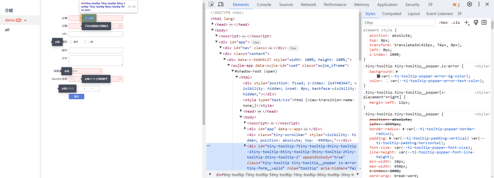
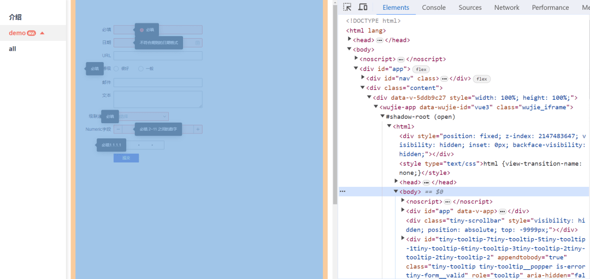
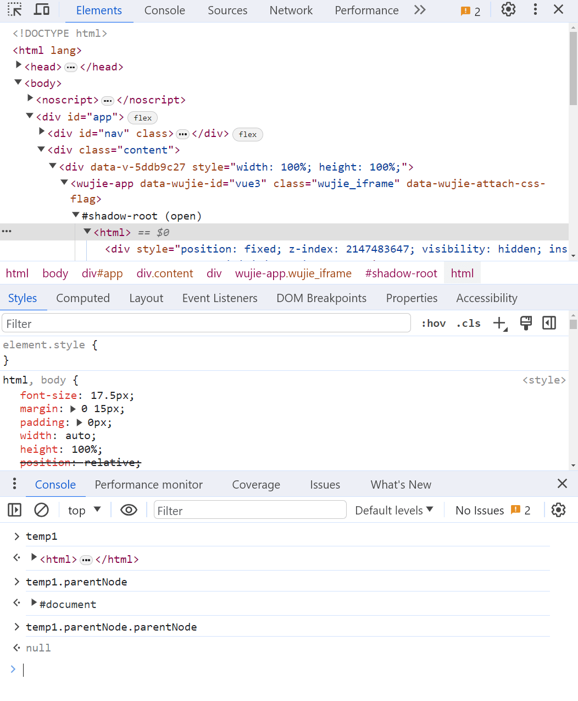
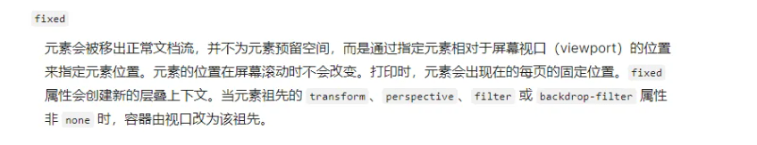
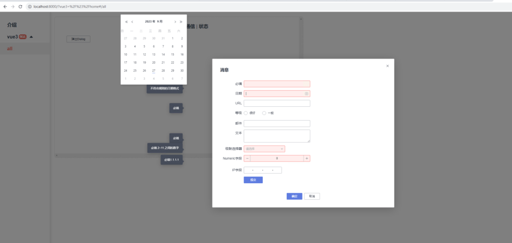
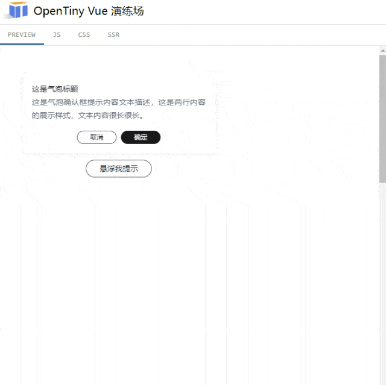
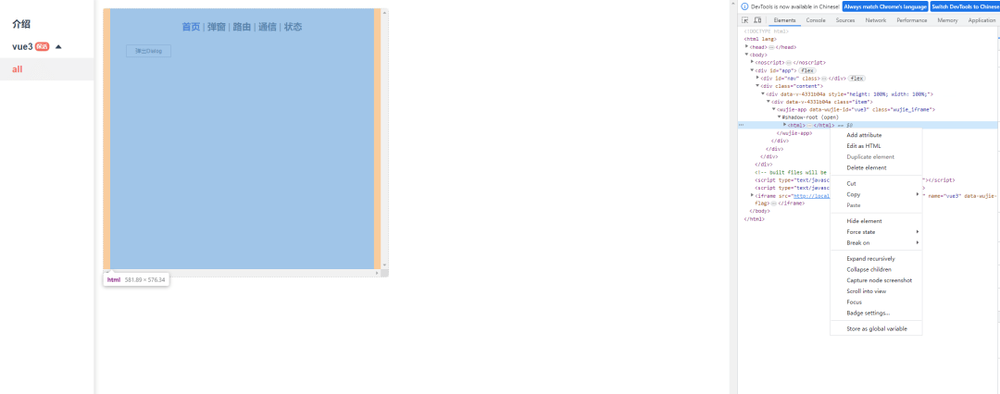
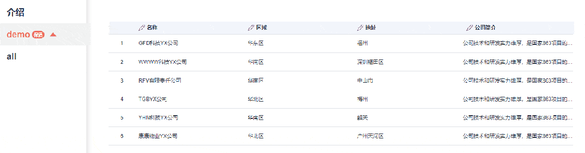
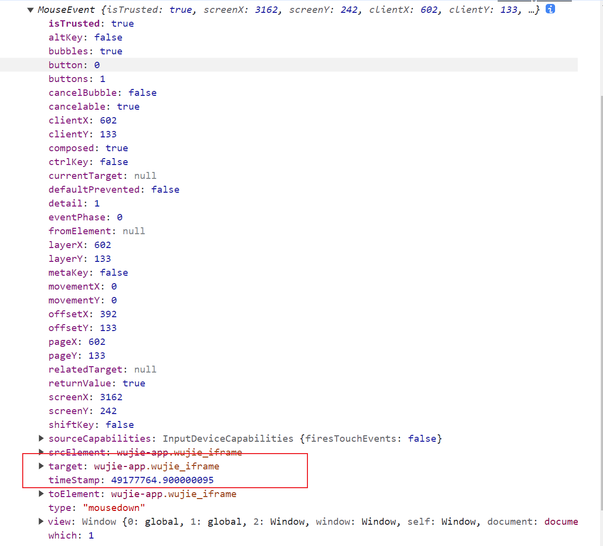
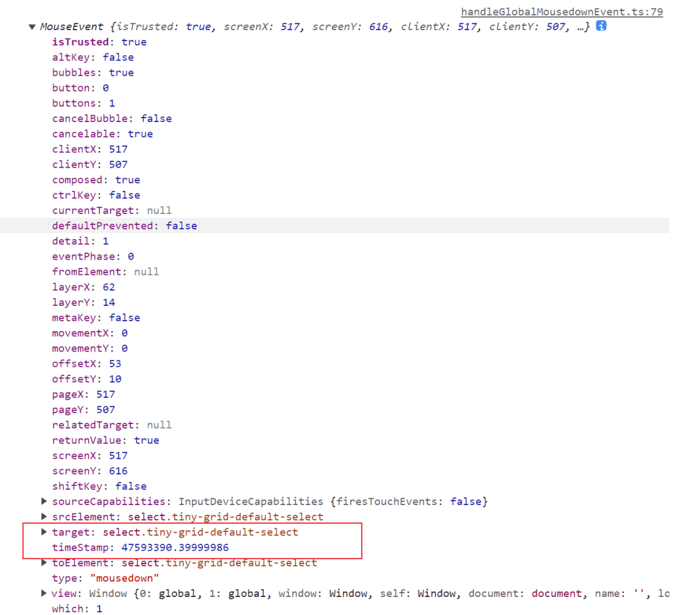

本文由体验技术团队 TinyVue 项目成员岑灌铭同学创作。

## **前言**

微前端是一种多个团队通过独立发布功能的方式来共同构建现代化 web 应用的技术手段及方法策略，每个应用可以选择不同的技术栈，独立开发、独立部署。

`TinyVue`组件库的跨技术栈能力与微前端十分契合，往期我们也有文章，指导如何在`wujie`微前端中使用`TinyVue`组件库，文章链接：<https://mp.weixin.qq.com/s/ZqDXemh0GfnQpWACdzXdig>

目前许多对微前端有需求的用户已经在使用`wujie`和`TinyVue`开发了，在使用了一段时间后，合作企业用户和个人用户反馈了组件库一些问题。经过一番交流、沟通与定位，最终发现是用户接入了微前端框架后，在特定场景下导致的一系列问题，在非微前端应用中，组件库运行良好。

复现问题后，通过一系列排查与分析，最终总结出了四个问题：

1. **absolute 定位的弹出元素错位，且页面滚动不会重新定位**
1. **fixed 定位的弹出元素错位**
1. **弹出元素位置发生翻转**
1. **表格中的 select 点击后，下拉选项出现后马上消失**

对于以上问题，`TinyVue`组件库做了相应的适配以及给用户提供了解决方案，最终使得 TinyVue 组件良好运行在`wujie`微前端中。

首先来简单介绍一下`wujie`微前端实现原理，`wujie`微前端是采用`iframe`+`webcomponet`的实现方式。通过`iframes`实现`js`沙箱能力。子应用的实例`instance`在`iframe`内运行，`dom`在主应用容器下的`webcomponent`内，通过代理  `iframe`的`document`到`webcomponent`，可以实现两者的互联。

想要了解更多可以查看，无界微前端介绍：<https://wujie-micro.github.io/doc/guide/>

接下来展开说一下，收集总结的四个问题~

## **问题总结**

### **问题一：absolute 定位的弹出元素错位，且页面滚动不会重新定位。**


**“弹出元素错位”错误原因分析：**

打开控制台，审查元素查看样式，看到`element.sytle`的第一直觉是`transfrom`的偏移量计算不正确，顺着这个线索排查计算错误的原因。



排查前先简单介绍一下`TinyVue`组件库这个偏移量的计算规则：

1.找到弹出元素的 [offsetParent](https://developer.mozilla.org/en-US/docs/Web/API/HTMLElement/offsetParent)（父定位元素），如果没有则返回`body`。  
2.使用 [getBoundingClientRect](https://developer.mozilla.org/en-US/docs/Web/API/Element/getBoundingClientRect)  计算  [offsetParent](https://developer.mozilla.org/en-US/docs/Web/API/HTMLElement/offsetParent)  以及引用元素（图中的输入框，简称为`reference`）距离视口的位置信息。  
3.以弹出元素放右边为例，`transform`的左偏移量的计算规则为`reference.left - offsetParent.left + reference.width`

因为弹出元素的`position`设置为`absolute`，所以弹出元素的定位是根据其`offsetParent`计算位置的，没有`offsetParent`则是根据视口来计算位置。

上述例子中，弹出元素的`offsetParent`为 null，因此默认返回了`body`作为其`offsetParent`，绝大部分情况下，`body`和视口左侧和上侧是对齐的，因此用`body`计算的偏移量，在视口上也适用。

在微前端中，子应用的`body`可能相对于视口有偏移。弹出元素的偏移量实际是根据`body`计算的，但他是非定位元素，最终导致的元素错位。



**解决方案：**

既然计算规则是根据`body`计算的，那么将子应用将`body`设置为`position: relative`将其变为定位元素即可。

**滚动不会重新定位原因分析：**

首先还是简单介绍组件库这部分逻辑：

1.通过`parentNode`向上查找引用元素（输入框）的可滚动的祖先元素(如果没有配置冒泡则返回第一个可滚动祖先元素，否则返回所有可滚动祖先元素)  
2.为`步骤1`获取到的元素加上滚动方法的监听。  
3.祖先元素滚动时重新计算弹出元素的位置，使弹出元素跟随引用元素。

但是在`wujie`微前端中，子应用的`document`再往上查找就是`null`了。而滚动条在主应用当中。因此主应用的滚动无法被监听到。



**解决方案：**

将子应用将`body`设置为`position: relative`同样也解决了上述问题。设置后，只有当子应用内滚动条滚动后才需要重新计算。

### **问题二：** **fixed 定位的弹出元素错位。**

在修复的问题一的情况下，依旧有部分情况会出现弹出元素错位的 bug。并且下图中可以看到，弹出元素从右边翻转到了左边。


**原因分析：**

表单元素在`modal`中，`modal`是`fixed`定位，因此表单输入框也是`fixed`定位。由于引用元素是`fixed`定位，所以弹出元素与之相对应也应该使用`fixed`定位。

组件库逻辑对于`fixed`定位的弹出元素偏移量的计算，在问题一提到的步骤下还增加了部分特殊处理。下面代码是计算偏移量逻辑其中较为关键的一段代码：

```js
/**
 * @description 计算弹出元素的偏移量
 * @param el 引用元素
 * @param parent 弹出元素的祖先定位元素
 * @param fixed 弹出元素是否绝对定位
 * @returns 用于计算偏移量的相关信息
 */
const getOffsetRectRelativeToCustomParent = (el: HTMLElement, parent: HTMLElement, fixed: boolean) => {
  let { top, left, width, height } = getBoundingClientRect(el)
  let parentRect = getBoundingClientRect(parent)

  if (fixed) {
    let { scrollTop, scrollLeft } = getScrollParent(parent)
    parentRect.top += scrollTop
    parentRect.bottom += scrollTop
    parentRect.left += scrollLeft
    parentRect.right += scrollLeft
  }

  let rect = {
    top: top - parentRect.top,
    left: left - parentRect.left,
    bottom: top - parentRect.top + height,
    right: left - parentRect.left + width,
    width,
    height
  }

  return rect
}
```

已上述代码为例，上述逻辑`Modal`弹窗情况下，`parent`和`scrollParent`都是`body`。

21-30 行代码的目的是，为了解决在`body`在滚动后，`parentRect.top`为负数，需要加上`scrollTop`才是相对视口的偏移量。

但是上面的计算逻辑有个大前提，那就是`body`的左侧和上侧和视口一致，上面这段不太严谨的逻辑经过漫长的迭代，直到在微前端中'暴雷'。

**解决方案：**

当`position`设置为`fixed`后，弹出元素在绝大多数情况都是相对视口定位了，但是也有特殊情况，以下是 mdn 文档的截图：



为了兼容上述的特殊情况，新增了`getAdjustOffset`方法，此方法计算相对于视口的修正偏移量，设置 top 和 left 为 0，使用`getBoundingClientRect`计算出来的结果不为 0 的话，多出来的偏移量就是因为上述的 css 样式影响了，

获取这个修正偏移量后，后续的计算只需要加上这个偏移量，弹出元素和`reference`元素的位置就能够正确对应上了。

以下是修改后的相关核心代码：

```js
/** 设置transform等样式后，fixed定位不再相对于视口，
 * 使用1乘1px透明元素获取fixed定位相对于视口的修正偏移量。 
**/
const getAdjustOffset = (parent: HTMLElement) => {
  const placeholder = document.createElement('div')
  setStyle(placeholder, {
    opacity: 0,
    position: 'fixed',
    width: 1,
    height: 1,
    top: 0,
    left: 0,
    'z-index': '-99'
  })
  parent.appendChild(placeholder)
  // 正常应返回 { transform: translateY( 0, left: 0 }
  // 否则就是被特殊的css样式影响了
  const result = getBoundingClientRect(placeholder)
  parent.rem)oveChild(placeholder)
  return result
}

/**
 * @description 计算弹出元素的偏移量
 * @param el 引用元素
 * @param parent 弹出元素的祖先定位元素
 * @param fixed 弹出元素是否绝对定位
 * @returns 用于计算偏移量的相关信息
 */
const getOffsetRectRelativeToCustomParent = (
  el: HTMLElement,
  parent: HTMLElement,
  fixed: boolean,
  popper: HTMLElement
) => {

  let { 
    top,
    left,
    width,
    height
  } = getBoundingClientRect(el)

  // 如果是fixed定位，需计算要修正的偏移量。
  if (fixed) {
    if (popper.parentElement) {
      const { 
        top: adjustTop,
        left: adjustLeft
      } = getAdjustOffset(popper.parentElement)
      top -= adjustTop
      left -= adjustLeft
    }
    return {
      top,
      left,
      bottom: top + height,
      right: left + width,
      width,
      height
    }
  }

  let parentRect = getBoundingClientRect(parent)
  let rect = {
    top: top - parentRect.top,
    left: left - parentRect.left,
    bottom: top - parentRect.top + height,
    right: left - parentRect.left + width,
    width,
    height
  }

  return rect
}
```

### **问题三：弹出元素位置发生翻转**

在问题二的截图中除了弹出元素错位问题，还有另外一个问题：弹出元素发生了翻转。



**原因分析：**

弹出类的元素，存在一个边界检测逻辑，当计算出弹出元素超出边界后，为了展示的完整性和美观，会自动将元素翻转。


在用户没有特定配置的情况下，默认的边界为'视口'，下面是关于边界计算逻辑的节选：

```js
/** 计算边界逻辑 */
const getBoundaries = (
  data: UpdateData,
  padding: number,
  boundariesElement: string | HTMLElement) => {

    // ... other code

    else if (boundariesElement === 'viewport') {
  let offsetParent = getOffsetParent(this._popper)
  let scrollParent = getScrollParent(this._popper)
  let offsetParentRect = getOffsetRect(offsetParent)
  let isFixed = data.offsets.popper.position === 'fixed'
  let scrollTop = isFixed ? 0 : getScrollTopValue(scrollParent)
  let scrollLeft = isFixed ? 0 : getScrollLeftValue(scrollParent)

  const docElement = window.document.documentElement
  boundaries = {
    top: 0 - (offsetParentRect.top - scrollTop),
    right: docElement.clientWidth - (offsetParentRect.left - scrollLeft),
    bottom: docElement.clientHeight - (offsetParentRect.top - scrollTop),
    left: 0 - (offsetParentRect.left - scrollLeft)
  }
}
    // ... other code
}
```

可以看到，视口的边界计算逻辑和`window.document.documentElement`也就是`html`有关。组件库运行在子应用中，因此这里也就是子应用的`html`。但在子应用中，`html`的宽高可能会比真实视口小得多，导致边界计算被约束在子应用范围当中，触发了翻转逻辑，导致了错误的翻转。



**解决方案:** 组件库对外暴露一个全局配置，用户在子应用中可以引入全局配置，将主应用的  `window`赋值给全局配置的  `viewportWindow`  用于边界判断。

```js
import globalConfig from '@opentiny/vue-renderless/common/global'

// 需要判断是否在子应用当中
if (window.__POWERED_BY_WUJIE__) {
  // 子应用中可以通过window.parent获取主应用的window
  globalConfig.viewportWindow = window.parent
}
```

getBoundaries 方法也相对应做一下修改

```js
/** 计算边界逻辑 */
const getBoundaries = (data: UpdateData, padding: number, boundariesElement: string | HTMLElement) => {
  // ... other code

  // 新增代码
  const viewportWindow = globalConfig.viewportWindow || window
  const docElement = viewportWindow.document.documentElement

  boundaries = {
    top: 0 - (offsetParentRect.top - scrollTop),
    right: docElement.clientWidth - (offsetParentRect.left - scrollLeft),
    bottom: docElement.clientHeight - (offsetParentRect.top - scrollTop),
    left: 0 - (offsetParentRect.left - scrollLeft)
  } // ... other code
}
```

### **问题四：表格中的 select 点击后，下拉选项出现后马上消失**



**原因分析：**

当开启表格编辑状态时，表格默认处于显示状态，当点击表格某一行时，会进入到编辑状态。当点击表格此行外的其他区域，表格就会清除编辑状态，进入显示状态。

是否点击外部是通过监听`document`的点击事件，当点击任意元素后，都会被冒泡捕获，组件库使用点击事件的`event.target`来判断用户是否点击了表格编辑行以外的元素。

正常情况下，点击 select，`event.target`能够找`select`对应的元素，可以正常的判断`select`元素是在对应的容器中，则不会切换至显示状态。



在`wujie`微前端下，点击`select`，`event.target`找到的是`wujie-app`。这个问题是浏览器原生的处理，详情可以参考：<https://javascript.info/shadow-dom-events>   此时`wujie-app`不在对应的容器内，认为点击了对应行以外的区域，因此切换至显示状态，下拉选项消失。



**解决方案：**  
组件库加入兼容逻辑，获取  `event.target`  的方式修改成： `(e.target.shadowRoot && e.composed) ? (e.composedPath()[0] || e.target) : e.target`。  
加入兼容逻辑后，无论组件是否运行在微前端中，点击事件都能找到真实点击的`dom`元素，因此问题也就解决了。

### **结语**

总体而言，上述遇到的问题主要原因有两个，其一是 wujie 微前端中，子应用的`window`和视口`window`不是同一个。其二是`webcomponent`内部元素事件冒泡被外部元素捕获时，`event.target`会被代理到`webcomponent`跟元素上导致的目标判断错误。

针对问题一，整体的解决思路是要么将作用范围限定在子应用当中，例如问题一解决方案，给子应用`body`加上样式`position: relative`。要么是通过类似依赖注入的方式，让相关逻辑可以正确地获取到主应用的`window`。  
针对问题二，思路就非常明确了，目标就是要找到正确的`event.target`，通过加上兼容代码后，无论是否在`webcompoent`中，都能正确返回`event.target`

当然以上提到的问题，已经在`@opentiny/vue`的`3.13.0`新版本发布修复了，欢迎下载使用~

## **关于 OpenTiny**

[OpenTiny](https://opentiny.design/) 是一套企业级 Web 前端开发解决方案，提供跨端、跨框架、跨版本的  [TinyVue 组件库](https://opentiny.design/tiny-vue/zh-CN/overview)，包含基于 Angular+TypeScript 的 [TinyNG 组件库](https://opentiny.design/tiny-ng/overview)，拥有灵活扩展的低代码引擎 [TinyEngine](https://opentiny.design/tiny-engine#/home)，具备主题配置系统[TinyTheme](https://opentiny.design/designtheme/home) / 中后台模板[TinyPro](https://opentiny.design/pro/home)/ [TinyCLI](https://opentiny.design/tiny-cli/home)命令行等丰富的效率提升工具，可帮助开发者高效开发 Web 应用。

---

欢迎加入 [OpenTiny 开源社区](https://github.com/opentiny/)。添加微信小助手：opentiny-official 一起参与交流前端技术～更多视频内容也可关注[B 站](https://space.bilibili.com/15284299?spm_id_from=333.1007.0.0)、抖音、小红书、视频号  
OpenTiny  也在持续招募贡献者，欢迎一起共建

[OpenTiny 官网](https://opentiny.design/)：**https://opentiny.design/**  
[OpenTiny 代码仓库](https://github.com/opentiny/)：**https://github.com/opentiny/**  
[TinyVue 源码](https://github.com/opentiny/tiny-vue)：**https://github.com/opentiny/tiny-vue**
[TinyEngine 源码](https://github.com/opentiny/tiny-engine)： **https://github.com/opentiny/tiny-engine**

欢迎进入代码仓库 Star🌟[TinyEngine](https://github.com/opentiny/tiny-engine)、[TinyVue](https://github.com/opentiny/tiny-vue)、[TinyNG](https://github.com/opentiny/ng)、[TinyCLI](https://github.com/opentiny/tiny-cli)~
如果你也想要共建，可以进入代码仓库，找到  good first issue 标签，一起参与开源贡献~
