本文由体验技术团队 Kagol 原创~  
前两天，common-intellisense 开源项目的作者 Simon-He95 在 VueConf 2024 群里发了一个重磅消息：

common-intellisense 支持 TinyVue 组件库啦！

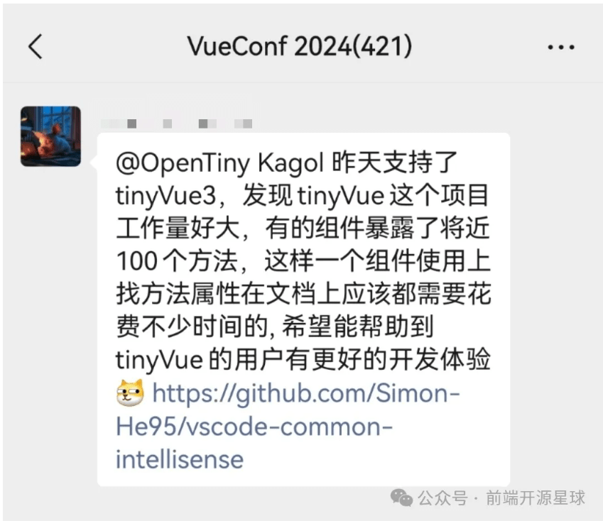

common-intellisense  插件能够提供超级强大的智能提示功能，包含属性`(props)`、事件`(events)`、插槽`(slots)`以及对应的注释和类型，实例上的方法`(methods)`等等，支持多个 UI 库，让你的开发效率更上一层楼。

TinyVue 是一套跨端、跨框架的企业级 UI 组件库，支持 Vue 2 和 Vue 3，支持 PC 端和移动端，包含 100 多个简洁、易用、功能强大的组件，内置 4 套精美主题。

有了 common-intellisense 的加持，我们一起来看看 TinyVue 组件的使用体验如何吧！

## 没有使用 common-intellisense 插件

假如你已经有了一个 Vite 工程，可通过以下方式安装 TinyVue 组件库：

```css
npm i @opentiny/vue
```

然后直接在 App.vue 中使用：

```xml
<script setup lang="ts">
import { Alert as TinyAlert } from '@opentiny/vue'
</script>

<template>
  <tiny-alert description="这是一条提示信息" size="large">
    <template #title>这是一个标题</template>
  </tiny-alert>
</template>
```

组件效果如下：

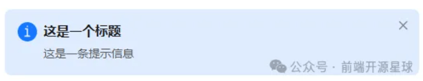

组件 UI 看着挺好看的，但是开发体验却不是太好。

首先鼠标移到组件名称上，只有一些不太友好的 TypeScript 类型提示。

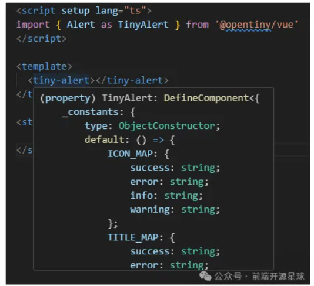

在组件上配置 props 名称，也不会自动提示。

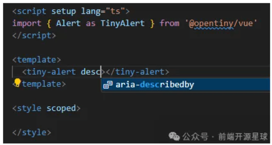

接下来我们安装下 common-intellisense 插件试试看。

## 使用 common-intellisense 插件

确保你使用的 VSCode 代码编辑器，使用  `Ctrl + Shift + X`  快捷键，呼起“扩展”抽屉，输入  `common-intellisense`  关键字找到 common-intellisense 插件，点击安装。

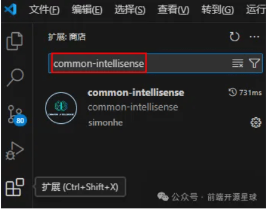

### 组件 API 表格提示

这时我们将鼠标移到组件名称上，会看到完整的 API 表格提示。

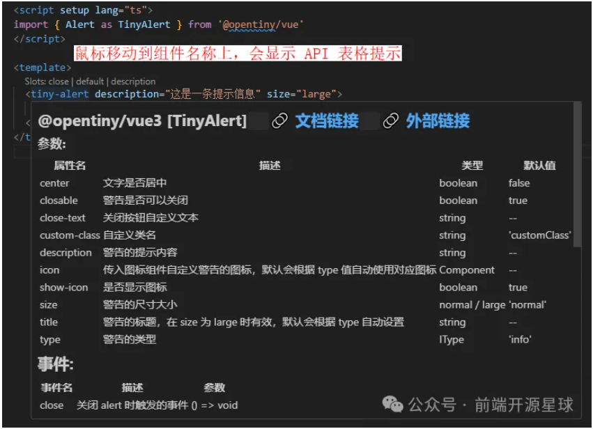

### 组件 props 提示和模拟搜索(props)

我们尝试在组件名称后面输入一个空格，会提示组件的 props 列表。

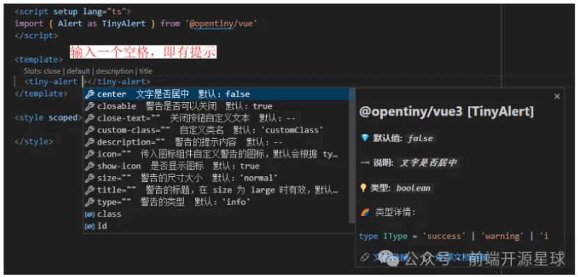

边输入字符，可以边过滤 props，比如输入  `c`，则只显示  `center` / `closable`  等  `c`  打头的属性。

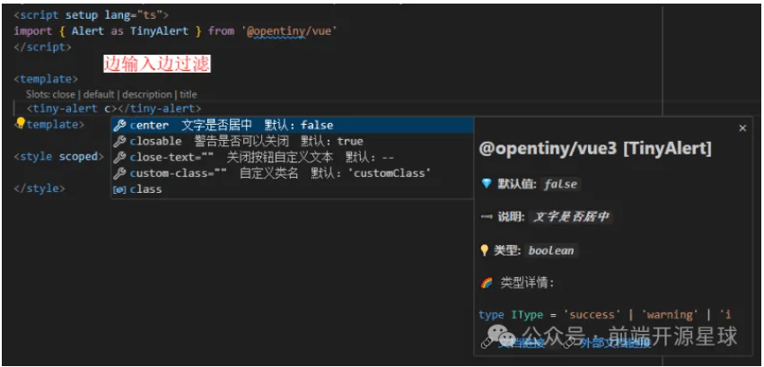

还支持模糊搜索，即使忘记属性怎么拼写也没关系，依然会有提示，比如输入  `detio`，也能提示出  `description`  属性。

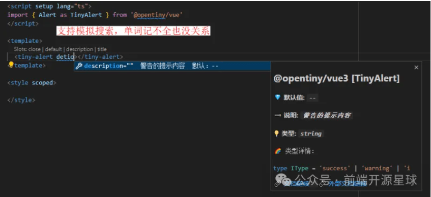

值得一提的是，不仅支持 props 名称的过滤，还支持 props 描述的过滤，比如输入`large`，可以提示出  `title`  属性，因此 title 属性的描述中有  `large`  关键词。

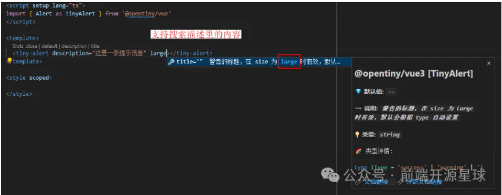

### props 值的提示

props 的提示列表，可以支持方向键选择组件 props，比如输入  `size`  出现了  `size` / `title`  两个属性，我选择  `size`。

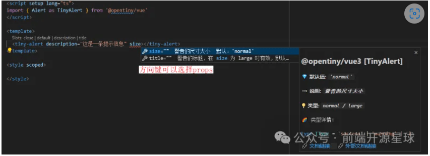

选中 props 之后，按 Enter 回车键会提示可选的 props 值，Alert 组件的 size 有两个可选值：`normal` / `large`。

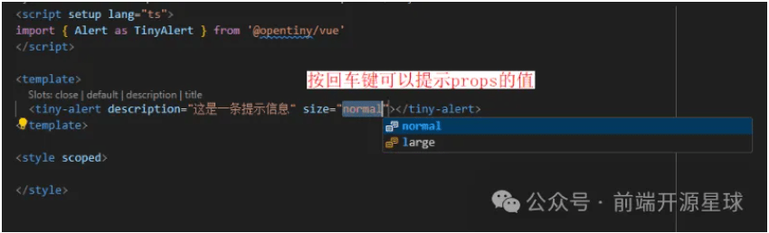

将鼠标移到属性名称上，也可以提示该属性的描述信息。

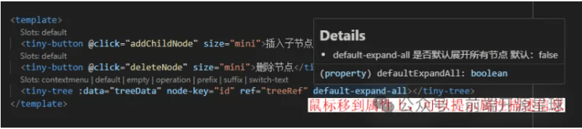

### 组件事件提示（events）

输入  `@`  符号，会提示组件的事件列表。

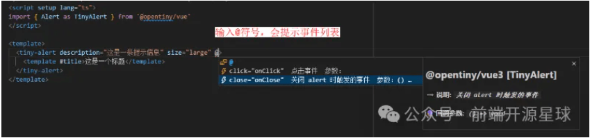

事件也支持事件描述内容的搜索。

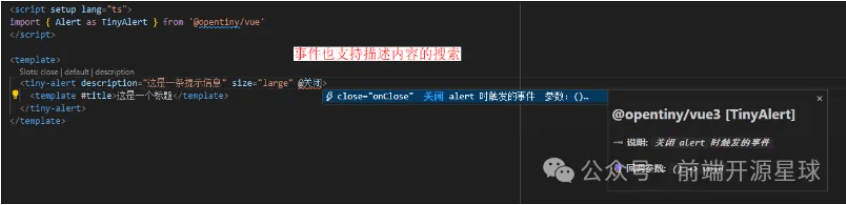

### 组件实例方法的提示（methods）

除了组件 props / events 可以提示之外，common-intellisense 插件还支持组件实例方法的提示。

以 Tree 组件为例：

```php
<script setup lang="ts">
import { ref } from 'vue'
import { Tree as TinyTree, Button as TinyButton } from '@opentiny/vue'

const treeData = ref([
  {
    id: '1',
    label: '数据 1',
    children: [
      { id: '1-1', label: '数据 1-1', children: [{ id: '1-1-1', label: '数据 1-1-1' }] },
      { id: '1-2', label: '数据 1-2' }
    ]
  },
  {
    id: '2',
    label: '数据 2',
    children: [
      { id: '2-1', label: '数据 2-1' },
      { id: '2-2', label: '数据 2-2' }
    ]
  },
  {
    id: '3',
    label: '数据 3',
    children: [{ id: '3-1', label: '数据 3-1' }]
  }
])

// tree 组件实例
const treeRef = ref()

// 在当前选中节点下插入子节点
const addChildNode = () => {
  const currentNodeId = treeRef.value.getCurrentNode().id
  const currentNode = treeRef.value.getNode(currentNodeId)
  treeRef.value.addNode(currentNode)
}

// 删除选中节点
const deleteNode = () => {
  const currentNodeId = treeRef.value.getCurrentNode().id
  treeRef.value.remove(currentNodeId)
}
</script>

<template>
  <tiny-button @click="addChildNode" size="mini">插入子节点</tiny-button>
  <tiny-button @click="deleteNode" size="mini">删除节点</tiny-button>
  
  <tiny-tree :data="treeData" node-key="id" ref="treeRef" default-expand-all></tiny-tree>
</template>
```

输入  `treeRef.value.`  时，会提示 Tree 组件暴露出来的方法列表。

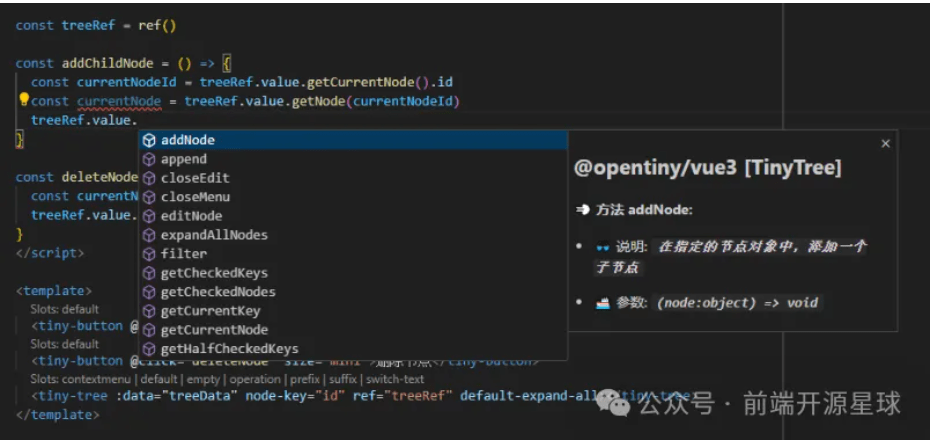

也支持方法的过滤，比如输入  `re`  会过滤出  `remove`  方法。

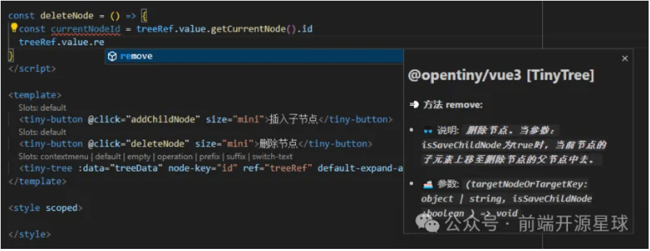

效果如下：

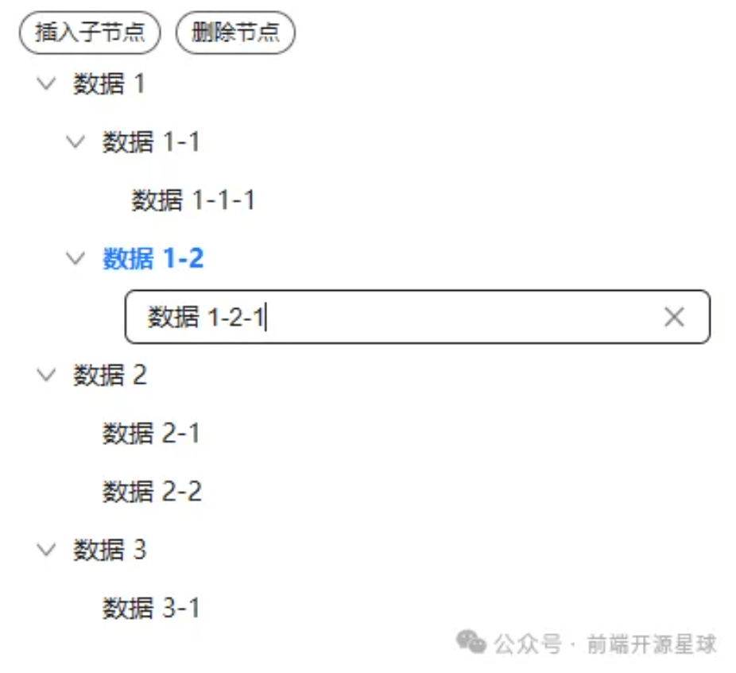

### 组件插槽提示（slots）

在组件上方有一行小字，提示了当前组件有哪些插槽可以配置。

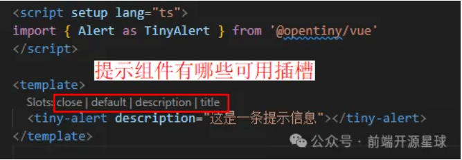

对于已经配置过的插槽，也会进行隐藏，比如 title 插槽已经配置过，就不再显示在提示中。


是不是非常丝滑，有了这个插件，几乎不用再去网站上查询组件用法，减少来回切换成本，让我们的开发工作更加聚焦、更加高效，心动不如行动起来！

欢迎朋友们体验和反馈：

- **TinyVue**
- **common-intellisense**

## 关于 OpenTiny


OpenTiny 是一套企业级 Web 前端开发解决方案，提供跨端、跨框架、跨版本的 TinyVue 组件库，包含基于 Angular+TypeScript 的 TinyNG 组件库，拥有灵活扩展的低代码引擎 TinyEngine，具备主题配置系统 TinyTheme / 中后台模板 TinyPro/ TinyCLI 命令行等丰富的效率提升工具，可帮助开发者高效开发 Web 应用。

欢迎加入 OpenTiny 开源社区。添加微信小助手：opentiny-official 一起参与交流前端技术～  
[OpenTiny 官网](https://opentiny.design/)：**[https://opentiny.design/](https://opentiny.design/)**
[OpenTiny 代码仓库](https://github.com/opentiny/)：**[https://github.com/opentiny/](https://github.com/opentiny/)**
[TinyVue 源码](https://github.com/opentiny/tiny-vue)：**[https://github.com/opentiny/tiny-vue](https://github.com/opentiny/tiny-vue)**  
[TinyEngine 源码](https://github.com/opentiny/tiny-engine)： **[https://github.com/opentiny/tiny-engine](https://github.com/opentiny/tiny-engine)**  
欢迎进入代码仓库 Star🌟TinyEngine、TinyVue、TinyNG、TinyCLI~ 如果你也想要共建，可以进入代码仓库，找到  good first issue 标签，一起参与开源贡献~
