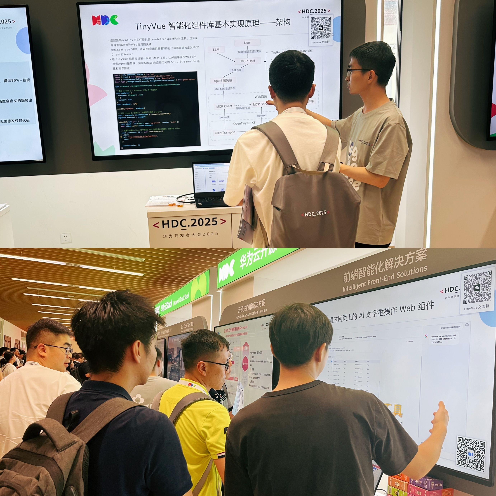
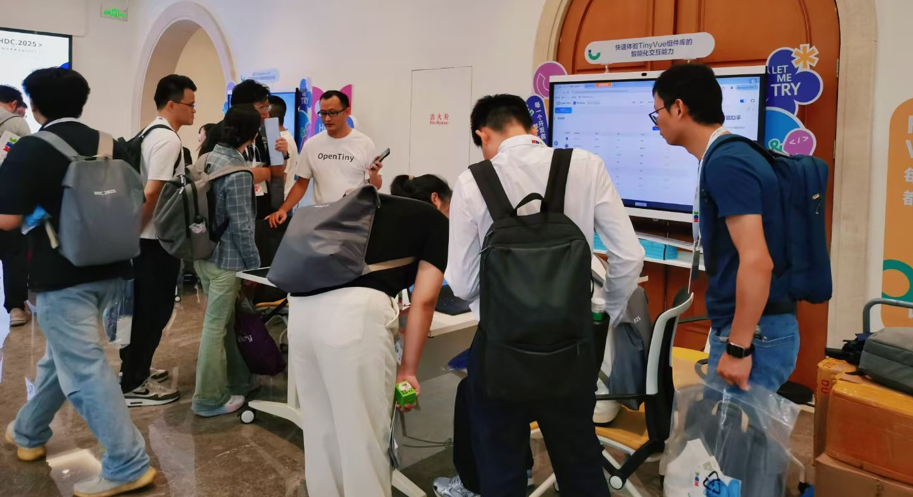
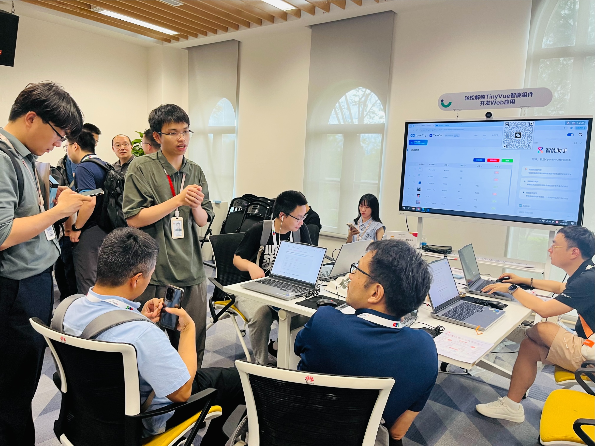

随着最后一场活动落下帷幕，为期 3 天的 HDC 华为开发者大会在东莞松山湖成功收官。这场旗舰级盛会汇聚了全球开发者、技术专家和行业领袖，为推动科技创新、构建智慧未来的新商业蓝图注入了全新动力，也为参会者呈现出一场精彩绝伦的知识与交流盛宴。在大会主论坛上，众多行业大咖发表主题演讲，分享了他们在各自领域的深入见解与实践经验。同时技术专家们也在专题论坛、圆桌、OpenSpeech、扫地僧、训练营、体验官、AI 应用开发馆、红蓝对抗赛、嘉年华等等多个热门环节与大家近距离交流，引发了与会者的广泛共鸣，提供了极具价值的技术指导与行业洞察。

而本次 OpenTiny 社区聚焦前端智能化解决方案，结合当前最具前景及热度的 AI 技术领域，吸引了来自全国各地的 300+名开发者、研究人员及企业代表参与，从专题论坛到展台交流，从体验官到训练营，通过丰富多彩的活动与开发者进行深度交流与互动，共同见证 OpenTiny 的最新成果与未来趋势。

## 直击现场

### 1.专题论坛

6 月 21 日下午，华为云高级前端开发工程师曾令卡在《AI+开源：赋能开发者迈向 AI 时代》的专题论坛上发表了关于《基于 MCP 协议：快速解锁 AI 操作 Web 组件》的分享，本次演讲聚焦于 TinyVue 智能组件库的探索与实践。首先介绍了 TinyVue 组件库及其智能化升级，通过封装 TinyVue MCP 组件描述层，使组件支持 MCP，进而让 AI 大模型能够操作组件。接着，从三种场景演示如何利用自然语言操作组件，包括网页 AI 对话框操作、Copilot 等 MCP Host 操作以及 Coze 等智能体搭建平台操作，让观众直观感受其强大功能。此外，还分享了 TinyVue 智能组件库的实现原理，讲解如何将现有 Web 应用集成该组件库以实现 AI 自动操作组件，提升 Web 应用操作效率。最后，总结了 TinyVue 智能组件库的优势与前景，欢迎开发者们使用并参与开源共建，共同推动 Web 开发领域的创新与发展。

### 2.展览展示

除了主线演讲外，OpenTiny 还参与了丰富的互动交流环节，展览展示就是其中一个重要的环节。在展区，OpenTiny 的 TinyVue 智能组件库吸引了众多参与者的目光，大家热烈交流项目经验，探讨技术合作的可能性，其中来自某互联网企业的开发者就提到：“使用非 Vue 的前端框架（比如 React、Angular）搭建的 Web 应用，是否可以接入你们这套智能化解决方案？”答案是肯定的。

### 3.产品体验官

体验官现场也非常火爆，本次的主题为《快速体验 TinyVue 组件库的智能化交互能力》。主要接待了主要来自国内中小型企业及一些个人开发者，连中午吃饭时间也络绎不绝的有开发者前来体验。在 TinyVue 官网上，开发者能够利用 AI 对话框以语音或文字的形式与网站组件互动，并且还可以借助 Copilot、Coze、Dify 等智能助手来操作这些组件。TinyVue 核心成员郑志超带着开发者们一起体验着 TinyVue 智能组件库的这些能力，整个过程层层递进，在体验的同时也为开发者们打开了一扇通往前沿 Web 开发技术的大门，引发了现场开发者的热烈讨论与积极反馈。

### 4.CodeLabs 训练营

训练营现场则是聚焦项目具体场景实践，TinyVue 成员岑灌铭通过技术支持帮助开发者轻松上手 TinyVue 智能组件开发 Web 应用，本次训练营以高校学生和工作不久的开发者为主，通过体验训练营任务，跟着手册一起完成实操训练，了解了具体电商场景的 Web 开发以及 TinyVue 智能组件库的技术原理。

除此之外 OpenTiny 的另外一个核心项目 TinyEngine,也通过训练营的方式与大家见面，本次 TinyEngine 项目负责人伍其和及项目成员王莉纯，带着大家使用 TinyEngine 低代码引擎 AI 能力搭建华为云官网首页，让开发者了解到 TinyEngine 低代码引擎结合 AI 快捷搭建应用的魅力，同时了解 AI   插件的智能对话交互、多模型支持、页面辅助开发等核心功能。

本次 HDC 开发者大会的成功举办，不仅为全球开发者提供了一个学习、交流、合作的优质平台，促进了技术知识的传播与共享，也推动了开发者社区的繁荣发展，更在鸿蒙生态、大模型技术发展史上留下了浓墨重彩的一笔。

OpenTiny 也紧跟时代发展趋势，结合最前沿的技术，在本次大会上推出了最新的智能化技术成果，向开发者在前端领域的应用实践提供了新思路和新方向，后续 OpenTiny 也将结合实际应用场景，投身于前端智能化解决方案的创新实践，为前端领域的发展贡献更多力量。

## Q\&A

**1、OpenTiny NEXT 是否可以快速接入一些已有的 Web 应用？**

答：如果现有的 Web 应用代码质量良好且函数工具封装得当，我们可以以较小的成本进行接入，后续官方的 agent-server 会提供 OAuth 第三方登录功能，对接现有的业务应用。

**2、这些工具是否支持直接修改后台数据？**

答：支持。工具在前端进行声明，因此可以用于修改数据、操作 DOM 和调用接口等前端逻辑操作。权限控制依然沿用原有 Web 应用的方式，确保安全可控。

**3、现在仅支持 Vue 的 SDK 吗？未来是否会推出 React、Angular 等其他技术栈的 SDK？**

答：目前仅提供了 Vue 的 SDK，但遵循标准的 MCP 协议，这意味着它与特定的技术栈无关。我们计划在未来推出适用于原生 JS 及其他主流框架如 React、Angular 的 SDK。

**4、接入 SDK 时是否有安全信任的问题？**

答：由于工具在前端定义，权限管理机制继承自原始 Web 应用，不会出现权限滥用的情况。此外，后续官方的 agent-server 会提供 OAuth 第三方登录功能，只有当前业务用户授权才可以走通代理服务。

**5、为什么要让 AI 代替人操作 Web 界面，而不是直接调用后台 API 接口？**

答：Web 应用一般都有 UI 界面，因为需要给人互动，如果 AI 绕过 UI 界面直接调用后台接口，人无法与系统进行交互；AI 在背后做了什么，人也是完全不知情的，失去了对系统的控制，就没人敢用这个系统了。另外就是现有的 Web 应用本身有一套登录鉴权系统，AI 只能操作人有权限操作的界面，人没有权限操作的界面，AI 也无法操作，这样才能确保系统的安全。

**6、现有 Web 应用如何快速实现智能化，让 AI 能够识别和操控？**

答：现有的 Web 应用都是设计成给人操作的，要让 AI 能够识别和操控，就需要做适当的改造，这是必须要做的，借助我们 OpenTiny 提供的智能化解决方案，你只需要少量代码就可以接入 AI。如果你的 Web 应用是使用 TinyVue 智能组件库搭建的，就天然包含了一系列方便 AI 操作页面的 MCP 工具，你只需要引入我们提供的 TinyVue MCP 软件包和 SDK 工具，连接我们提供的 Agent 服务，给你的 Web 应用补充必要的业务信息，就能被 AI 识别和操控啦。如果你的 Web 应用没有使用我们的 TinyVue 智能组件库，就需要自己实现一套 MCP 工具，其他步骤都是相同的。

**7、使用非 Vue 的前端框架（比如 React、Angular）搭建的 Web 应用，是否可以接入你们这套智能化解决方案？**

答：当然可以，我们提供的智能化解决方案是一个基于标准 MCP 协议的通用方案，支持 Vue / React / Angular 等多种前端框架，支持 AI 对话框 / VSCode Copilot / Cursor / Dify / Coze 等多种 MCP Host，只不过如果你使用的是 Vue 框架，我们提供配套的 TinyVue 智能组件库，已经给你封装好了丰富的开箱即用的 MCP 工具，用 TinyVue 智能组件库搭建出来的 Web 应用，天然能够被 AI 操控。

**8、整体体验下来，这个应用的改造还需要开发者介入来参与开发，后续会不会做成那种输入一句话或者上传一张图片就能生成完整网站的功能？**

答：本次训练营主要目的就是让开发者体验 TinyVue 智能组件库轻松改造应用的。不过 OpenTiny 一套企业级前端开发解决方案，你说的上传图片生成网页的功能自然也是有的，使用 TinyEngine 加智能助手便可。

**9、TinyVue 训练营都是对组件库进行的配置，方法都是组件库提供的 toolcall，如果我想要进入自己的工具，你们这套实现方案能做到吗？**

答：当然可以，训练营中用到的 next-vue 是完全符合 MCP 协议的，你可以使用  MCP  协议内容的任何功能。本次试验重点的 TinyVue 智能组件库，因此自定义工具部分只是没有相关体现，如果需要注册自己的工具，只需要按正常注册流程即可，自定义注册的工具同样可以被远程调用。

**10、TinyEngine 的这个 AI 能力可以放在校园系统使用吗？**

答：当然可以。我们的 AI 插件可以调用兼容 openai sdk 的 AI 大模型平台，并且我们的代码都是开源的，可以将 AI 插件的代码拉到校园系统里调整提示词和逻辑进行适配。

**11、如果想要应用 TinyEngine 的这些功能需要收费吗？如果我想要自己部署一套呢？**

答：目前看到的功能以及后端代码都是开源的，不需要收费。我们官网也提供了 Java 和 Node.js 的服务端部署等平台开发指南，支持用户私有化部署。如果想要了解平台二开，可以加入我们的开源群一起探讨。

**12、针对个别细节的样式，TinyEngine 的 AI 插件能够去调整吗？**

答：目前 AI 插件能够针对各个模块去调整 AI 细节，比如输入“把注册按钮的边框去掉”。针对选中节点对单个节点进行提问调整的功能还在持续开发中。

## 关于 OpenTiny

欢迎加入 OpenTiny 开源社区。添加微信小助手：opentiny-official 一起参与交流前端技术～\
OpenTiny 官网：**<https://opentiny.design>**\
OpenTiny 代码仓库：**<https://github.com/opentiny>**\
TinyVue 源码：**<https://github.com/opentiny/tiny-vue>**\
TinyEngine 源码：**<https://github.com/opentiny/tiny-engine>**\
欢迎进入代码仓库 Star🌟TinyEngine、TinyVue、TinyNG、TinyCLI、TinyEditor\~ 如果你也想要共建，可以进入代码仓库，找到 good first issue 标签，一起参与开源贡献\~
