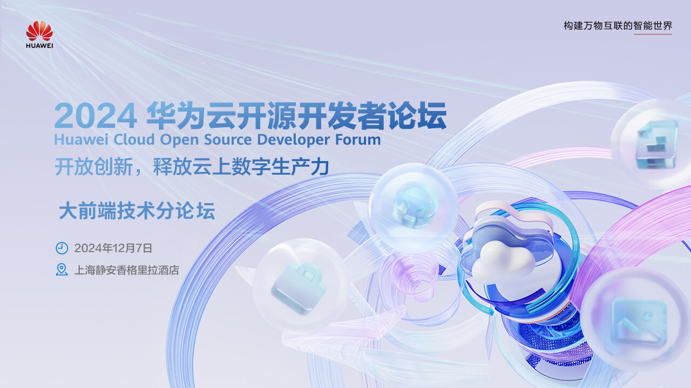
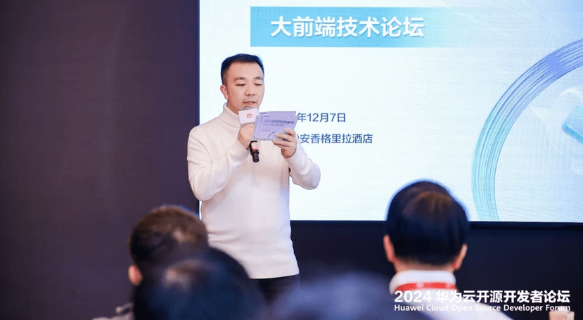
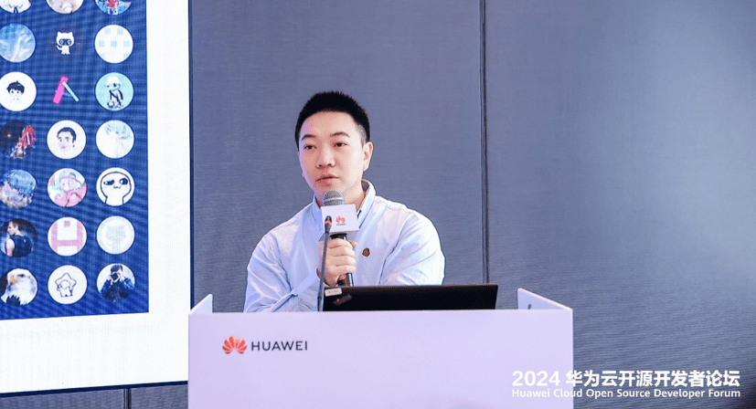
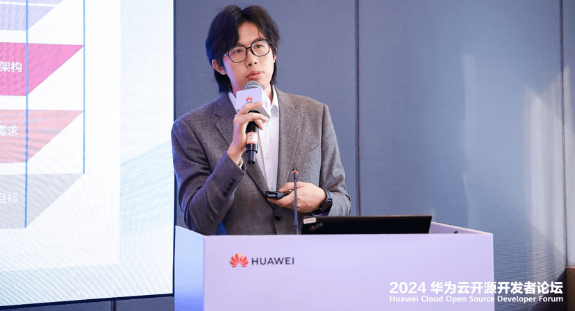
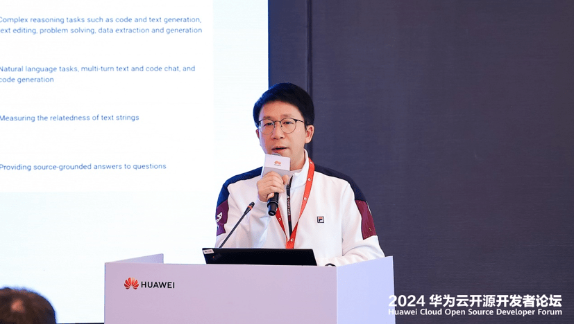
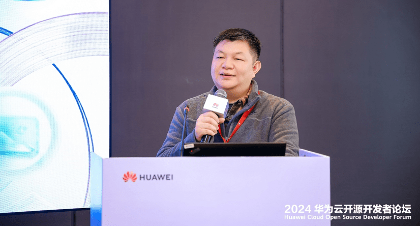
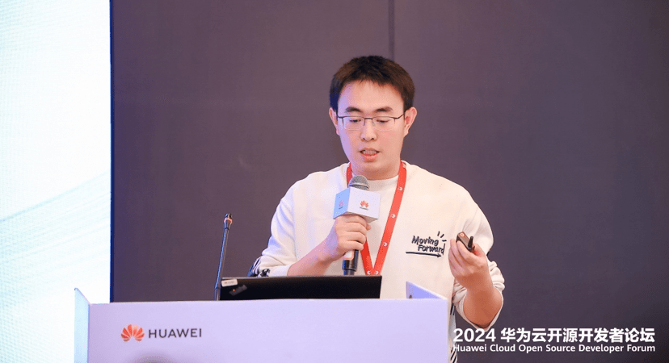
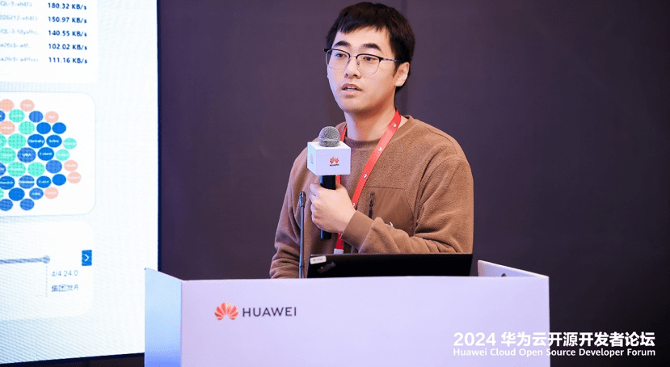
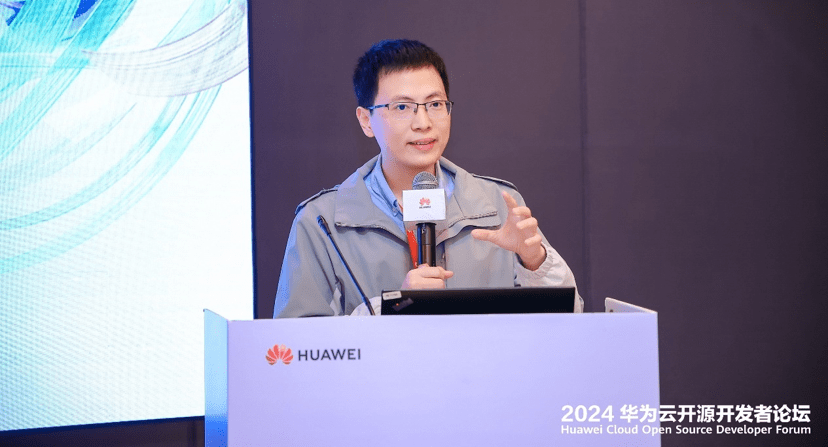
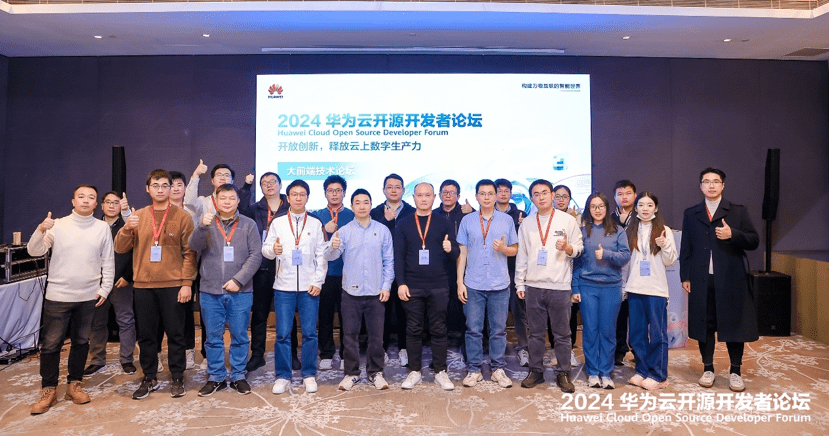

12 月 7 日华为云开源开发者论坛圆满落下帷幕。此次大会以“开放创新，释放云上数字生产力”为主题，由一个主论坛+三个分论坛组成。全方位阐述了“开源生态前景剖析”，“开源技术解读”，“开源开发者支持与实践”等时下热点开源话题。吸引了来自全国各地的开发者、技术专家和行业领袖。

本次大前端技术论坛围绕 7 个议题展开分享，聚焦业务驱动的前端工具实践。包含 OpenTiny、DevUI、GitCode 等技术的创新应用。内容融合 AI 发展趋势，结合业务实际场景，进行深度洞察，开展技术分享。希望与开发者们共同打造一个开放、包容、共赢的前端开源技术生态，共同推动大前端技术的创新与发展。

> “**参会论坛活动，是作为一位观察者还是作为一位实践者？这个论坛到底会讲些什么？对我当前的遇到的问题到底有什么帮助？”** 想必是留在参会嘉宾心里的问题，因此大家对本次活动也是期待已久，希望能在此次活动上开展多维度的思想碰撞，打开更广阔的视角，收获自己想要的答案。接下来就和小编一起看看现场到底有什么精彩内容\~

## **业务驱动的前端工具实践**

活动开始前，参会者们就早早进入会场，现场座无虚席，带着心中的疑问，等待着活动的正式开始\~

首先华为云 Paas 前端开发团队的崔一龙老师作为本次活动主持人给所有参会嘉宾介绍了本次活动的整体流程，本次大前端技术论坛也就此拉开序幕\~

论坛的核心无疑是技术分享，Web 前端一站式开发是现代软件开发中的重要环节之一，对开发者有非常重要的意义。首先华为云前端技术专家**华宇果**老师在 **《OpenTiny 开源体系助力 Web 前端一站式开发》** 的主题演讲中阐述了前端开发者的痛点问题，并为大家带来了相应的解决方案，提到 OpenTiny 系列工具集，包含 TinyVue、TinyNG、TinyCLI、TinyCharts、TinyEngine 等项目。希望通过这些开源工具帮助开发者们高效开发。他也表示“开源产品在于持续运营和打磨，OpenTiny 在华为内部孵化多年，提供了一系列的前端开源技术项目，为开发过程的各个阶段提供对应的组件、工具能力，帮助前端开发人员更高效的完成业务开发”。

在当今 AI 时代，智能化场景、无边界体验交互成为了科技领域的一大热点。DevUI 作为智能化场景交互与无边界体验探索的先锋，推出了智能化场景交互场景解决方案 MateChat。华为云前端技术专家**侯凡**老师发表了 **《MateChat - 基于 DevUI 的智能化场景交互探索和实践》** 主题演讲。阐述了 DevUI 在华为的落地实践，同时说明了后续 12 月的开源计划。他表示“"无边界体验"将是未来智能化时代下重要交互概念之一。MateChat 基于 DevUI 在内部 IDE、工作台、业务流场景下的智能化探索，提供多样化的无边界开源交互场景解决方案，旨在为用户提供更智能、更便捷的 AI 体验。”

Web 混合 AI 应用开发是 AI 领域的未来趋势之一。混合 AI 结合了人工智能技术和 Web 开发，为开发者提供了更多的灵活性和便利性。华为云 Web 前端框架技术专家**莫春辉**老师紧扣当前火爆的 AI 话题从实际出发，面向开发者，带来了 **《轻松上手 Web 混合 AI 应用开发》** 的分享、他表示“随着提供 AI 能力的 Web 应用快速增长，本地运行 AI 大模型逐渐成为新趋势，未来必将形成结合远程与本地 AI 大模型架构的新型 Web 应用。”

低代码的出现，让企业可以只用很少甚至不需要代码即可快速开发系统。项目也可将其快速配置和部署，因此越来越多企业使用低代码引擎进行平台开发。上海启业信息技术有限公司技术总监**欧阳志翔**老师在本次前端技术论坛上也带来了 **《使用 TinyEngine 开发项目经验分享》** 的演讲，他提到“很高兴使用 TinyEngine 低代码引擎完成了公司的校园数智化平台、企业数智化平台两套产品的升级开发。也希望能将一些开发经验分享给大家，通过案例与大家共同探讨，包含对物料、工具类、区块、出码运行的实战经验。”

GitCode 是新一代由 AI 驱动的开源开发者平台，GitCode 高级产品经理**周宇翔**老师发表了 **《GitCode 使用 DevUI 的开源实践》** 的分享，他提到“GitCode 结合了 CSDN 的运营能力和华为云产品能力，提供了专属社区运营工具、代码托管服务和数据服务。DevUI 以其高效、开放、可信和乐趣的设计理念，为 GitCode 提供了代码编辑、检视工具和组件，显著提升了开发效率和用户体验。GitCode 与 DevUI 的合作不仅促进了社区的繁荣，也加速了项目的上线进程。”

除了技术解读、企业实战案例分享，近期图表库也重磅发布了新版本。2012 实验室高级前端工程师**王强**老师在本次分论坛上重磅介绍了 TinyCharts 关系图引擎，发表了关于 **《OpenTiny Charts 关系图引擎-构建复杂业务图表新视角》** 的演讲。他表示“TinyCharts 关系图引擎是一款前端可视化引擎，专注于实现业务表达类关系图。它为开发者提供了开箱即用的关系图组装能力，并支持跨框架节点、折叠展开、连线动效、拓扑布局、局部渲染等功能。”

TinyEngine 低代码引擎在近期也正式发布 2.0 版本，发布之后，不少开发者都想了解新版本到底有哪些特性，和之前有哪些区别呢？华为云前端高级工程师**李旭宏**老师在本次大会上也分享了 **《TinyEngine 2.0 构建跨行业低代码平台》** ，他表示“TinyEngine 以其无与伦比的扩展性和定制性，为每一位开发者提供了一个无限可能的平台，让个性化的解决方案触手可及”\

随着最后一个议题分享结束，本次前端技术分论坛也逐渐落下帷幕\~特别值得一提的是，每个议题分享结束之后，参会嘉宾们都非常踊跃，对每个议题都想进行深入的探究，希望能将实际项目中遇到的挑战难题能与本次分享的解决方案结合应用。也提出了很多疑问，例如：“TinyEngine 低代码引擎是否可以用于高校课题实践？gitcode 和 gitee 有什么区别？OpenTiny 如何处理企业开发兼容性问题？MateChat 后续的应用场景有哪些？TinyCharts 有什么特别之处？混合 AI 未来会如何发展”等等问题。对于每个问题，演讲嘉宾也是非常认真的给出了自己的答案，希望能尽量帮助开发者解决问题，解答困惑。很多参会者也表示每一个分享都充满了干货，让大家受益匪浅。

至此，论坛活动正式结束。对于大前端开源技术的发展，到底是作为观察者还是实践者，参会嘉宾心中已然有了自己的答案\~

最后由于时间有限，主持人邀请了参会嘉宾一起合影留念，留下本次活动难忘的瞬间\~

随着论坛的圆满结束，参会者们也不禁对未来充满期待。大前端技术作为数字化转型的重要驱动力，也不断的改变着大家的工作和生活。开发者们也在不断探索的路上持续在思考如何有效的使用开源所提供的工具/解决方案来实现项目的业务目标，保证技术先进性。

## **关于 OpenTiny**

欢迎加入 OpenTiny 开源社区。添加微信小助手：opentiny-official 一起参与交流前端技术～\
OpenTiny 官网：**<https://opentiny.design/>**\
OpenTiny 代码仓库：**<https://github.com/opentiny/>**\
TinyVue 源码：**<https://github.com/opentiny/tiny-vue>**\
TinyEngine 源码： **<https://github.com/opentiny/tiny-engine>**\
欢迎进入代码仓库 Star🌟TinyEngine、TinyVue、TinyNG、TinyCLI\~ 如果你也想要共建，可以进入代码仓库，找到  good first issue 标签，一起参与开源贡献\~
