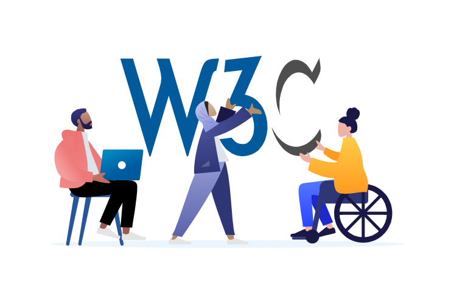
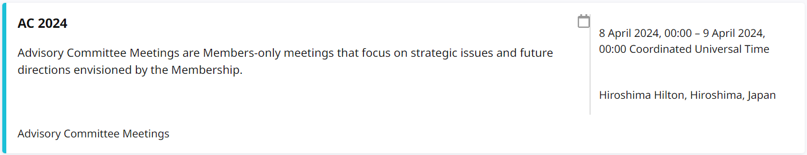
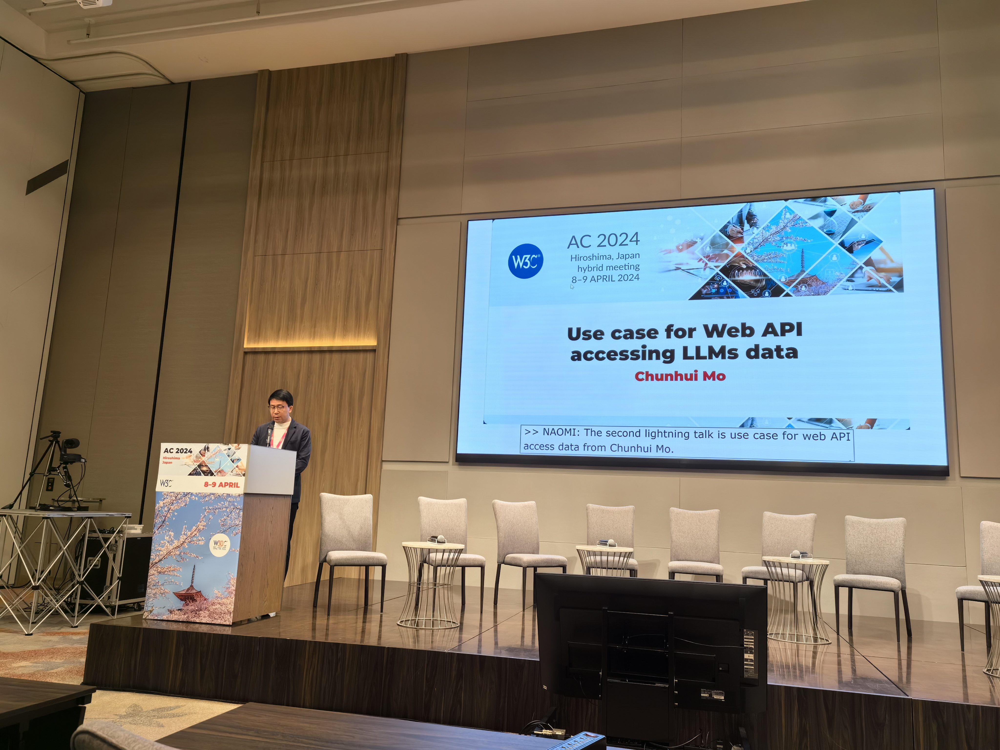
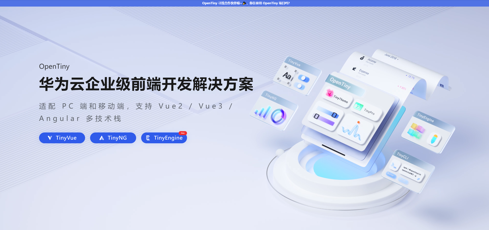

近日，万维网联盟（World Wide Web Consortium，简称 W3C）于 4 月 8 日-4 月 9 日在日本召开 2024 年顾问委员会会议（Advisory Committee Meeting）。华为产业发展专家丁蔚博士及华为云 OpenTiny 项目的 Web 前端框架技术专家莫春辉老师也受邀参与了本次 W3C 的顾问委员会会议。

## **什么是 AC 会议**

万维网联盟是 Web 技术领域最具权威和影响力的国际中立性技术标准机构。到目前为止，W3C 已发布了 400 多项影响深远的 Web 技术标准及实施指南，如广为业界采用的超文本标记语言（HTML）、可扩展标记语言（XML）以及帮助残障人士有效获得 Web 内容的信息无障碍指南（WCAG）等，有效促进了 Web 技术的互相兼容，对互联网技术的发展和应用起到了基础性和根本性的支撑作用。因此 W3C 作为 Web 标准组织也是为了制定 Web 标准，带动整个 Web 技术的发展。

其中顾问委员会会议（Advisory Committee Meeting）也是 W3C 的年度重要技术会议之一。W3C 的顾问委员会是 W3C 会员及团队参与的会议，讨论 W3C 的运营策略、及主要技术方向，征求会员及团队意见。每年举行两次（其中下半年的 AC 会议与 W3C 的年度技术大会 TPAC 联合举行），不对公众开放。W3C 的会员应指派 AC 代表，并由 AC 代表参与会议。AC 会议主要集中在春季，围绕组织运作等经营性事务展开，主要是收集各领域提案，参与人员进行讨论及投票。而 TPAC 会议主要是在每年的秋季召开，主要围绕技术层面，进行技术讨论。

## **为什么参与 AC 会议**

OpenTiny 作为企业级前端开发解决方案，包含 UI 组件库、低代码引擎、脚手架工具、中后台模板及主题配置系统等效率提升工具。其中 TinyEngine 低代码引擎作为 OpenTiny 的核心项目之一，在 AI 时代的大背景下，也是紧扣前端技术演变发展趋势，不断迭代技术能力，只为了给开发者带来更好的使用体验，拓展更多的可能性。在此过程中，OpenTiny 的技术专家们在研究 AI 能力与前端技术结合时也发现了一些问题。比如：AI 助手通过收集用户数据并通过官网发送给 Web 应用的后端服务所导致的隐私安全问题；对接不同大模型接口时需开发不同代理层的成本及性能问题；在不同 Web 应用上需要完成流程复用情况时，AI 协作能力问题。

在发现问题后，华为产业发展专家丁蔚博士推荐了 OpenTiny 的技术专家莫春辉老师共同参与了本次 W3C 的顾问委员会会议——AC 会议。

## **议题分享**

在 2024 年 AC 会议的闪电演讲中，莫春辉老师以《Use case for Web API accessing LLMs data》为主题展开了分享，首先提到了随着 AI 应用快速增长，Web 应用中的 AI 助手引发用户安全和隐私担忧。同时由于访问大语言模型需鉴权，Web 应用后端需增加 AI 代理服务，导致开发部署成本增加网络性能降低等问题，针对以上问题也提出了一种可能的解决方案。这个方案假设用户的电脑已经搭载了 AI CPU 并内置了大语言模型，同时浏览器也能提供了新的 WEB AI API。Web 应用的 AI 助手可以直接调用这些 API，与本地存储的大语言模型进行交互。让用户的数据只在用户的电脑内部传输，从而解决了安全和隐私的问题。此举由于不需要 AI 代理服务，这也降低了 Web 应用的开发和部署成本，并提高了 AI 助手的网络性能。同时，在该方案中也期望 WEB AI API 能支持按需下载训练数据、访问通用或私有模型，提升用户 AI 体验。

目前 OpenTiny 也持续在思考如何更好的将 AI 技术与前端技术结合，并不断进行探索与实践。也提出相关的解决方案，期望后续通过时间地积累及技术的发展助力，将想法不断地优化实现，逐步提炼形成提案并努力使其真正达到国际标准，从而对整个行业及生态发展贡献出一份力量。

## **关于 OpenTiny**

[OpenTiny](https://opentiny.design/) 是一套企业级 Web 前端开发解决方案，提供跨端、跨框架、跨版本的  [TinyVue 组件库](https://opentiny.design/tiny-vue/zh-CN/overview)，包含基于 Angular+TypeScript 的 [TinyNG 组件库](https://opentiny.design/tiny-ng/overview)，拥有灵活扩展的低代码引擎 [TinyEngine](https://opentiny.design/tiny-engine#/home)，具备主题配置系统[TinyTheme](https://opentiny.design/designtheme/home) / 中后台模板[TinyPro](https://opentiny.design/pro/home)/ [TinyCLI](https://opentiny.design/tiny-cli/home)命令行等丰富的效率提升工具，可帮助开发者高效开发 Web 应用。

---

欢迎加入 [OpenTiny 开源社区](https://github.com/opentiny/)。添加微信小助手：opentiny-official 一起参与交流前端技术～更多视频内容也可关注[B 站](https://space.bilibili.com/15284299?spm_id_from=333.1007.0.0)、抖音、小红书、视频号  
OpenTiny  也在持续招募贡献者，欢迎一起共建

[OpenTiny 官网](https://opentiny.design/)：**https://opentiny.design/**  
[OpenTiny 代码仓库](https://github.com/opentiny/)：**https://github.com/opentiny/**  
[TinyVue 源码](https://github.com/opentiny/tiny-vue)：**https://github.com/opentiny/tiny-vue**
[TinyEngine 源码](https://github.com/opentiny/tiny-engine)： **https://github.com/opentiny/tiny-engine**

欢迎进入代码仓库 Star🌟[TinyEngine](https://github.com/opentiny/tiny-engine)、[TinyVue](https://github.com/opentiny/tiny-vue)、[TinyNG](https://github.com/opentiny/ng)、[TinyCLI](https://github.com/opentiny/tiny-cli)~
如果你也想要共建，可以进入代码仓库，找到  good first issue 标签，一起参与开源贡献~
