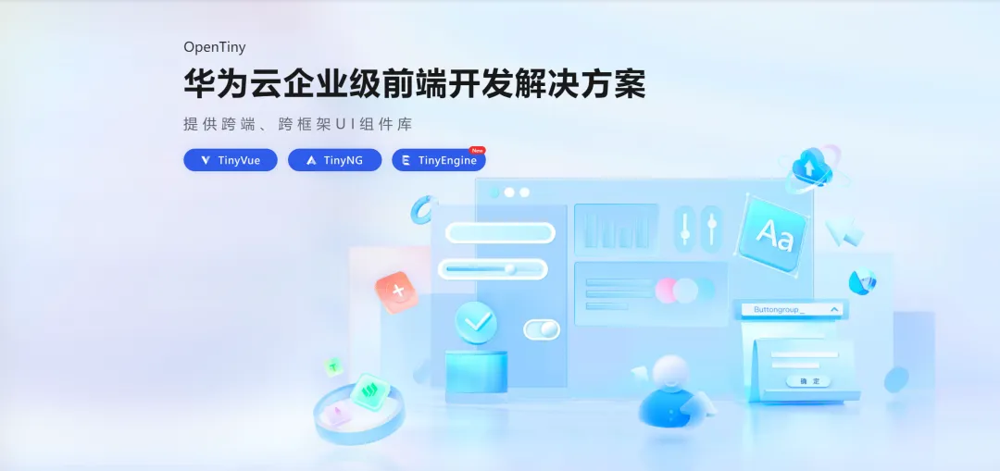

OpenTiny 前端 Web 应用开发挑战赛开赛啦~

<b>30万</b>奖金等你拿！

无论你是个人还是团队作战！

只要你对前端感兴趣，想要参与<b>前端项目实战</b>

你就可以报名参赛！！！

**报名入口：** <https://competition.atomgit.com/competitionInfo?id=341b80d53f52b95c53606723e10f575b>

只要你报名参与《[OpenTiny 前端 Web 应用开发挑战赛](https://competition.atomgit.com/competitionInfo?id=341b80d53f52b95c53606723e10f575b)》

- 你可以了解开源文化！
- 你可以提升技术能力！
- 你可以结交志同道合的伙伴！
- 你可以提升职业发展机会！
- 你可以获得奖励和认可！

**如果你担心，报名后不知道如何开始？放心，我们有社群答疑，随时帮助你~
如果你担心，报名后不知道选哪个赛题？我们会为你详细解释每个赛题的具体内容~  
如果你担心，开发任务比较艰巨不知道如何动手？我们会有技术大牛辅导你，为你保驾护航~**

当然，报名之后，也欢迎你多多了解和体验 OpenTiny 开源项目

官网：<https://opentiny.design>

源码：<https://github.com/opentiny> （欢迎 star）

**活动详情：**

**温馨提示：** **个人或团队都可以参与报名~ 报名成功后，添加小助手，将报名成功截图发送给小助手，小助手拉你进活动答疑群。**

**近期热点：**

- [TinyEngine 服务端正式开源啦！！！](https://juejin.cn/post/7317827078116081691)
- [TinyVue 组件库助力赛意信息获得工业软件种子奖](https://juejin.cn/post/7307178043411693594)
- [低代码引擎 TinyEngine 正式开源！！！](https://juejin.cn/post/7280926568854667299)

## **关于 OpenTiny**

[OpenTiny](https://opentiny.design/) 是一套企业级 Web 前端开发解决方案，提供跨端、跨框架、跨版本的  [TinyVue 组件库](https://opentiny.design/tiny-vue/zh-CN/overview)，包含基于 Angular+TypeScript 的 [TinyNG 组件库](https://opentiny.design/tiny-ng/overview)，拥有灵活扩展的低代码引擎 [TinyEngine](https://opentiny.design/tiny-engine#/home)，具备主题配置系统[TinyTheme](https://opentiny.design/designtheme/home) / 中后台模板[TinyPro](https://opentiny.design/pro/home)/ [TinyCLI](https://opentiny.design/tiny-cli/home)命令行等丰富的效率提升工具，可帮助开发者高效开发 Web 应用。

---

欢迎加入 [OpenTiny 开源社区](https://github.com/opentiny/)。添加微信小助手：opentiny-official 一起参与交流前端技术～更多视频内容也可关注[B 站](https://space.bilibili.com/15284299?spm_id_from=333.1007.0.0)、抖音、小红书、视频号

OpenTiny  也在持续招募贡献者，欢迎一起共建

[OpenTiny 官网](https://opentiny.design/)：**https://opentiny.design/**

[OpenTiny 代码仓库](https://github.com/opentiny/)：**https://github.com/opentiny/**

[TinyVue 源码](https://github.com/opentiny/tiny-vue)：**https://github.com/opentiny/tiny-vue**

[TinyEngine 源码](https://github.com/opentiny/tiny-engine)： **https://github.com/opentiny/tiny-engine**

欢迎进入代码仓库 Star🌟[TinyEngine](https://github.com/opentiny/tiny-engine)、[TinyVue](https://github.com/opentiny/tiny-vue)、[TinyNG](https://github.com/opentiny/ng)、[TinyCLI](https://github.com/opentiny/tiny-cli)~

如果你也想要共建，可以进入代码仓库，找到  good first issue 标签，一起参与开源贡献~
