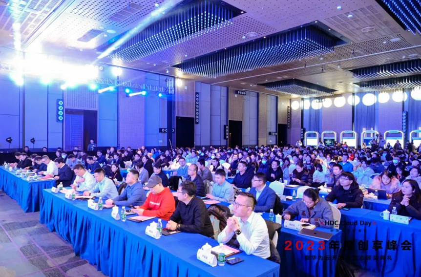
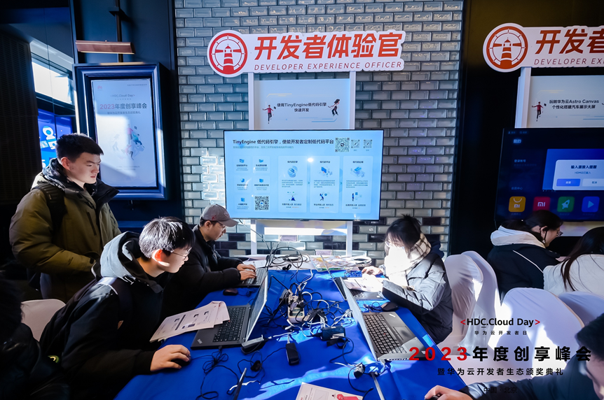
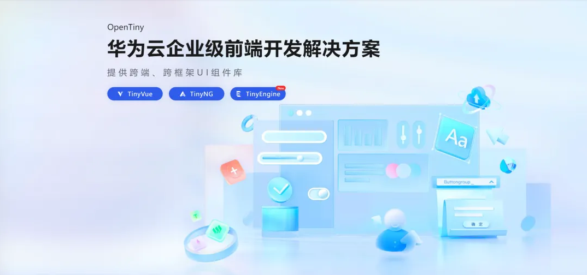

## 活动简介

华为云开发者日是面向全球开发者的旗舰活动，旨在全方位服务与赋能开发者，围绕华为云生态“**知、学、用、创、商**”成长路径，通过前沿技术分享、场景化动手体验、优秀应用创新推介，开发者提供沉浸式学习与交流平台。

12 月 20 日，华为云开发者日·2023 年度创享峰会成功举办，众多开发者与技术爱好者齐聚一堂，在现场，有 600 余名开发者与华为云技术专家共同就大模型应用、CodeArts 软件开发等技术话题进行深入探讨，分享实战技巧与解决方案。此外，华为云还精心设置了 KooLabs 工作坊、产品体验官、展区等环节，让开发者亲身体验华为云产品的技术魅力。

OpenTiny 在本次创享峰会中参与产品体验官及展台环节，与大家共同探讨了**如何使用 TinyEngine 低代码引擎快速开发**。

## OpenTiny 亮点概览

1、产品体验官

在本次华为云开发者日·2023 年度创享峰会中，OpenTiny 通过线下产品体验官环节与开发者近距离交流，旨在促进双方之间的互动与交流，让开发者更好地了解 OpenTiny 的低代码引擎 TinyEngine 的特性和优势，同时为 OpenTiny 团队收集宝贵的意见和建议。

在产品体验官环节中，开发者可以亲身体验 TinyEngine 低代码引擎的各项功能和特点，包括但不限于”通过简单拖拽形式快速完成简单页面搭建“的实操方式等，在此过程中，开发者实战完成“使用 TinyEngine 低代码引擎快速开发”，因此也更深入地了解了 TinyEngine 的优势和价值，后续可以将其更好地应用到自己的项目中。当然，也有一些高校开发者问到一些实操类问题，例如：”样式如何绑定“、”进入平台后，第一步要做什么，怎么创建页面“、”创建页面为什么要设置 ID 和路由“、”怎样使两个元素水平排列“等问题，OpenTiny 团队的小伙伴也是耐心给予解答和帮助。

2、展台交流

此外，OpenTiny 团队也会与开发者进行面对面的展台交流和互动，了解开发者的需求和反馈，共同探讨前端的技术问题和发展趋势。这种近距离的交流方式有助于加强开发者与项目之间的联系和合作，也为未来的技术发展打下了坚实的基础。本次展台交流环节中，开发者十分热情，TinyEngine 项目工程师也深入浅出地对 TinyEngine 低代码引擎的核心功能做了精彩的介绍。包含 **“定制低码平台”、“生成源码部署”、“开放协议接口”、“高低代码混合开发”、“AI 辅助开发”** 等~开发者通过展台也更加直观地了解了 TinyEngine 的特性及应用场景。当然在整个过程中，开发者们也是提出了很多和 TinyEngine 低代码引擎有关的问题。包含”是否有公司在使用“、”如何配合业务“、”后端开源会采用哪种语言“等等~针对此类问题，OpenTiny 团队的小伙伴也是耐心记下大家的问题和需求，并且仔细为大家做出解答。

## Q&A

**1. TinyEngine 有没有公司在使用，是怎么配合业务的？**

答：TinyEngine 已在公司内外部多个项目中使用，具体可以查看官网文档的相关案例

官网链接：<https://opentiny.design/tiny-engine#/help-center/course/case/34>

**2. 与其他厂商的低代码平台有什么区别？**

答：TinyEngine 是 OpenTiny 团队自主研发的低代码工具，使用的是 Vue 技术栈，使能开发者定制低代码平台。其中的亮点主要有“定制低码平台”、“生成源码部署”、“开放协议接口”、“高低代码混合开发”、“AI 辅助开发”

具体内容可参考:

[https://mp.weixin.qq.com/s/FYtT_BKlQbkBxeDBrULZhw](http://mp.weixin.qq.com/s?__biz=MzU5ODA3OTY5Ng==&mid=2247491716&idx=1&sn=bac73961f59bd8928d0ba017c7514735&chksm=fe4b013bc93c882d569401c6e13993ba701f712bf19789b26bfda3ac8f84b4d769a471ab84b0&scene=21#wechat_redirect)

**3. 大屏的场景要如何使用 TinyEngine 进行搭建，是否有案例？**

答：目前已支持大屏场景组件的导入和大屏插件的开发，因此是具备是支持大屏场景的编排能力，可以持续关注我们的开源社区，相关案例后续也会在门户官网的使用手册-实战案例中补充

**4. 后端开源会采用哪个语言？**

答：Node.js

**5. 低代码的趋势是怎样的？**

答：低代码平台如今被广泛应用于各个行业，未来跟随 AI，大数据和云计算的快速发展发展前景更加广阔，会有更多能力被应用于低代码平台建设

**6. AI 能力后续的拓展方向，官网的 Demo 版本是基于文心一言，整个 AI 能力是否都是站在其他 AI 引擎的肩膀上？**

答：目前展示的 AI 接入的是文心一言的通用大模型，已验证 TinyEngine 低代码引擎可引入 AI 能力。后续会接入华为的盘古大模型。

## 关于 OpenTiny

OpenTiny 是一套企业级 Web 前端开发解决方案，提供跨端、跨框架、跨版本的 TinyVue 组件库，包含基于 Angular+TypeScript 的 TinyNG 组件库，拥有灵活扩展的低代码引擎 TinyEngine，具备主题配置系统 TinyTheme / 中后台模板 TinyPro/ TinyCLI 命令行等丰富的效率提升工具，可帮助开发者高效开发 Web 应用。

---

欢迎加入 OpenTiny 开源社区。添加微信小助手：opentiny-official 一起参与交流前端技术～

OpenTiny 官网：**<https://opentiny.design/>**

OpenTiny 代码仓库：**<https://github.com/opentiny/>**

TinyVue 源码：**<https://github.com/opentiny/tiny-vue>**

TinyEngine 源码： **<https://github.com/opentiny/tiny-engine>**

欢迎进入代码仓库 Star🌟TinyEngine、TinyVue、TinyNG、TinyCLI~

如果你也想要共建，可以进入代码仓库，找到  good first issue 标签，一起参与开源贡献~
