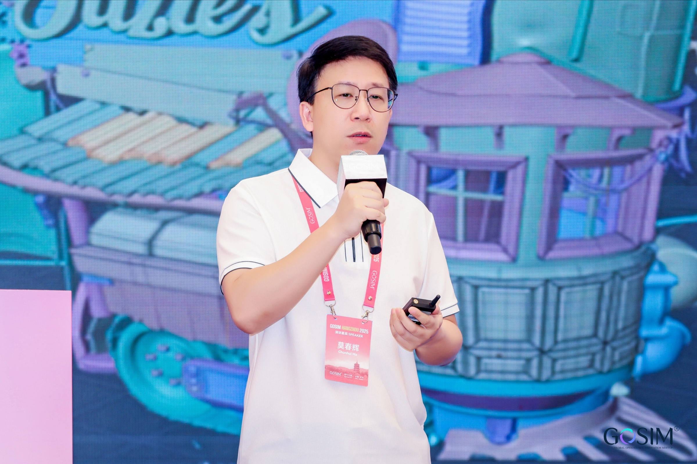
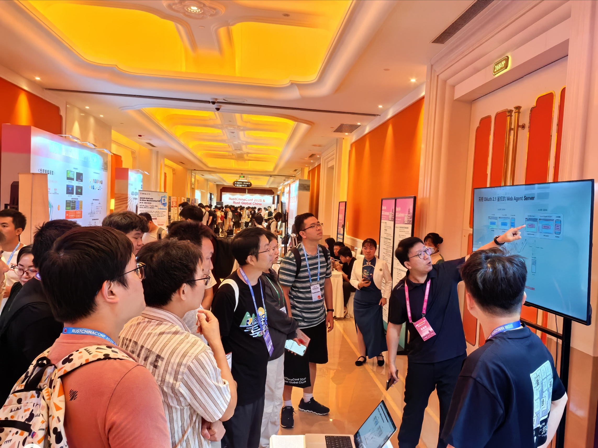
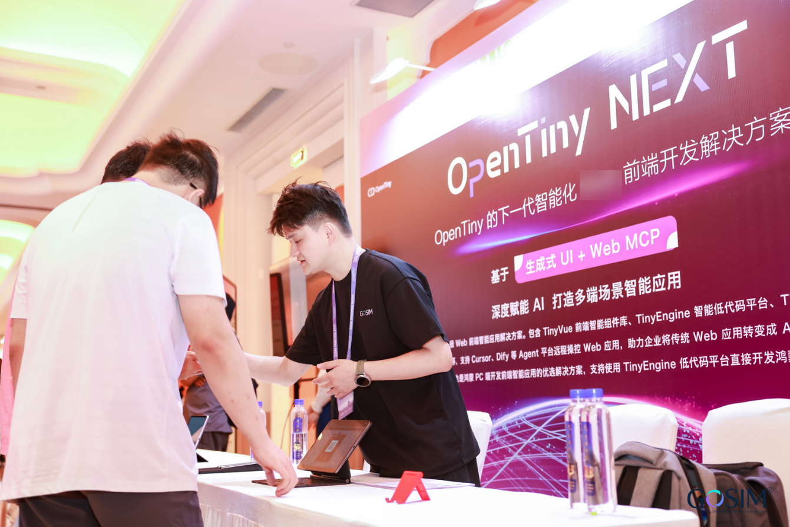

9 月 13–14 日，GOSIM Hangzhou 2025 在杭州隆重启幕。本次大会由 GOSIM 全球开源创新汇主办、CSDN 承办，以国际化、社区化、强互动为特色，深入聚焦开源与 AI 的前沿技术与跨界创新。OpenTiny 受邀参与 GOSIM Hangzhou 2025「智能体互联网」主题论坛并设立展位，向 1500+ 全球开发者公开展示 OpenTiny NEXT 企业级前端智能化方案。

## 直击现场

### 1、主题演讲

在本次智能体互联网论坛中，华为 Web 前端框架专家、OpenTiny 项目负责人莫春辉老师以《探索与实践智能体 Web 应用开发》为题，展开了一场关于下一代 Web 应用范式的前瞻分享。他提出：生成式 UI 与 WebMCP 技术的深度融合，将成为未来 3-5 年 Agentic Web 应用开发的核心基础设施，动态交互的 AI 原生应用将加速取代传统静态交互模式，重新定义人机协作边界。

莫老师也提到了“前端即工具”的理念：通过生成式 UI 与 MCP（模型上下文协议）的标准化接口，让浏览器组件自动注册为 Agent 可调用的工具，实现 Agent 从“被动渲染”到“主动执行”的范式跃迁。这一理念直击当前智能体应用开发中“意图理解-工具调用”断层的痛点，为 Web 前端向智能执行层进化提供了可落地的技术路径。

为验证该理念的实践价值，莫老师现场演示了 OpenTiny NEXT 前端智能化解决方案的突破性能力：在“出差申请”场景中，用户仅需输入自然语言指令“我下周三出差上海一周，帮我处理一下”，系统即可依托 MCP 协议自动调用差旅系统的 API，完成出差行程、日历行程等全链路操作。整个过程无需开发者编写任何工具调用代码，真正实现了“指令即应用”的智能化开发体验。

这一技术突破标志着 OpenTiny NEXT 已构建起从意图理解到工具编排的完整闭环，为企业应用的智能化改造提供了低本高效的解决方案。正如莫老师所言：“当每一个企业应用都能支持 AI 理解用户意图并自主完成任务，自然语言将成为企业应用的下一代交互范式。”

OpenTiny NEXT 具体技术内容详解：[一场 MCP 生态的变革——详解 OpenTiny NEXT 逆向思维的技术创新](https://juejin.cn/spost/7552564746572742671)

### 2、展台互动

除主线演讲外，OpenTiny 还设立了互动展位，在展位上，开发者可以近距离与 OpenTiny 的技术专家们进行交流与探讨。在技术展区，OpenTiny 技术团队系统拆解了 OpenTiny NEXT 前端智能化解决方案的技术底座：通过设计架构图直观呈现了基础设施层（IaaS）中 WebAgent 如何作为“连接 Agent 智能体与企业应用内置的 MCP 服务的手臂”；开发工具层（PaaS/SDKs）中 NEXT-SDKs 如何以跨框架兼容性实现开发工具库的“开箱即用”，以及 TinyEngine NEXT 智能低代码引擎如何通过自然语言自动生成可执行应用逻辑；应用与组件层（SaaS/UI）中 TinyRobot 如何构建企业级智能体对话入口，配合 TinyVue NEXT 生成式 UI 组件库实现“千人千面”的动态界面渲染。技术负责人莫春辉老师强调：“我们的愿景是让每个企业应用都具备 AI 理解力，使自然语言从辅助工具升级为下一代交互范式。”

同时，展区也提供实操体验的环节，开发者通过“扫码打开应用-添加 MCP 工具-指令输入-调用工具并操作应用”四步操作，仅需用自然语言描述，Agent 即可自动调用差旅应用 API 完成全流程操作。一位来自金融行业的开发者现场体验后评价：“这种自然语言的交互方式，解决了传统企业应用操作路径长、学习成本高的痛点。”

针对企业级场景的复杂需求，展位也特别设置“专家 1v1 技术问诊”。面对“内网环境部署 Web Agent Server 的网络安全配置方案”“跨多应用流程的扫码复杂”等实际问题，技术团队也是对其一一做出了解答。两日活动中，展台累计接待咨询超 200 人次，其中 9 个高频问题被沉淀为社区知识库的 FAQ。

## FAQ

**1、你们这个 Web Agent Server 不是开源的，在公司内网要怎么使用**

答：可以加我们的微信群以及关注我们的公众号，后续推出私有化部署方案会有文档推出

**2、你们这个 Demo 场景太简单了，如果我要做的流程涉及十几个应用，难道我要打开十几个应用挨个扫码吗？**

答：我们后续会推出浏览器插件帮助打开多个应用，可以先进群后续推出可以及时得到消息

**3、你们这个有实际的项目或者企业在应用吗？**

答：我们的解决方案目前是刚刚推出，正在推广阶段，因为我们是开源项目，也是希望广大开发者来给我们提意见验证我们的方案和参与社区开发

**4、我们的应用如果要使用你们这个要做哪些事情？**

答：我们有考虑到 sdk 接入的快捷、低侵入的设计，可以在我们的官网文档上看到，这部分 sdk 的接入只有 20\~30 行左右的代码就可以实现应用智能化了，而且不需要变动现有的代码逻辑

**5、为什么要把 MCP Server 放到前端？这样做有什么考虑？**

答：市面一般的 MCP 服务都是在后端提供，但是如果您的应用后端的 API 要改造成大模型可以使用的 MCP Tool，成本是非常高的，我们用这种逆向思维把 MCP Server 放在前端，这样您是不需要对现有 Api 进行变动，原有的业务逻辑如果已经封装成前端的 Api，可以直接注册成 MCP Tool，把前端的 Api 放进 MCP Tool 的回调里就完成了对 AI 提供工具的实现

**6、你们是用什么盈利呢？**

答：我们是华为云的开源团队，目前做的解决方案是开源项目，并没有商业性质

**7、你们这个遥控端和受控端是怎么做到连接的？**

答：我们有 Web Agent Server 这个后台服务作为中心节点，遥控端和受控端实际并没有直接进行连接访问，而是与 Web Agent Server 进行通信来实现所谓的连接的目的

**8、你们生成式 UI 是怎么做的？**

答：生成式 UI 原理：Agent 返回的是 json 对象，由渲染引擎生成可运行的代码

**9、你们选的是什么大模型？支持定制吗？**

答：目前我们 demo 用的是 DeepSeek, 后期需要用户自己提供大模型

## 关于 OpenTiny

欢迎加入 OpenTiny 开源社区。添加微信小助手：opentiny-official 一起参与交流前端技术～\
OpenTiny 官网：<https://opentiny.design>\
OpenTiny 代码仓库：<https://github.com/opentiny>\
TinyVue 源码：<https://github.com/opentiny/tiny-vue>\
TinyEngine 源码：<https://github.com/opentiny/tiny-engine>\
OpenTiny NEXT 已正式发布，官网、文档、示例、Demo 一站配齐。未来已来，欢迎上车！\
欢迎进入代码仓库 Star🌟TinyEngine、TinyVue、TinyNG、TinyCLI、TinyEditor\~ 如果你也想要共建，可以进入代码仓库，找到 good first issue 标签，一起参与开源贡献\~
