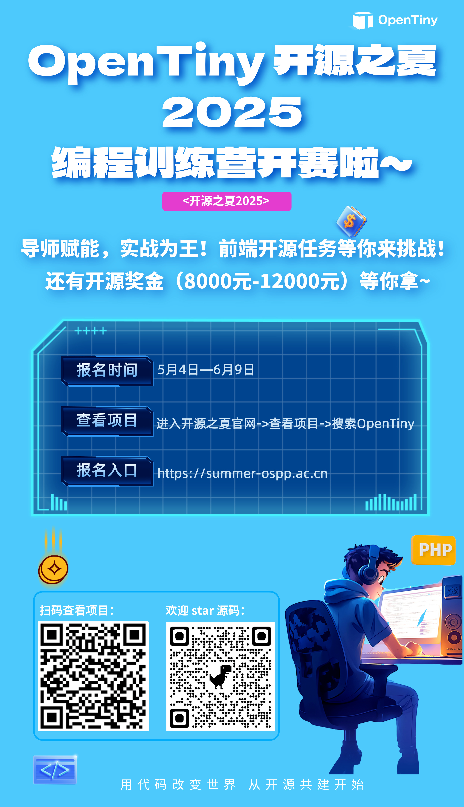

## 活动背景

开源之夏是由中国科学院软件研究所“开源软件供应链点亮计划”发起并长期支持的一项暑期开源活动，旨在鼓励在校学生积极参与开源软件的开发维护，培养和发掘更多优秀的开发者，促进优秀开源软件社区的蓬勃发展，助力开源软件供应链建设。活动联合各大开源社区，针对重要开源软件的开发与维护提供项目，并向全球高校学生开放报名。

学生可自主选择感兴趣的项目进行申请，中选后在项目开发者（社区导师）的指导下进行开发。根据项目的难易程度和完成情况，结项者将获取开源之夏活动奖金和结项证书。

## 参赛对象

- 本活动面向年满 18 周岁的高校在校学生。在 9 月 30 日开发结束之前，学生需保持在校学生状态。若已收到研究生或博士生录取通知，可提供录取通知书及相关说明材料。

- 中国籍学生参与活动时需提供身份证、学生证、教育部学籍在线验证报告（学信网）或在读证明。

- 外籍学生参与活动时需提供护照，同时提供录取通知书、学生卡、在读证明等文件用于证明学生身份。

## OpenTiny 项目介绍

本次 OpenTiny 一共有 15 个项目，包含 7 个基础类及 8 个进阶类赛题。大家可以根据自己感兴趣的项目参与报名。

报名入口：[summer-ospp.ac.cn/](https://link.juejin.cn/?target=https%3A%2F%2Fsummer-ospp.ac.cn%2F)

如何查看项目：进入官网-》查看项目-》搜索 OpenTiny

奖金设置

进阶难度：学生结项奖金税前人民币  12000 元。

基础难度：学生结项奖金税前人民币  8000 元。

项目奖金来源：组委会支持项目的结项奖金由组委会提供，社区支持项目的结项奖金由社区提供。

## 如何参与

### 01 项目沟通

a．注册报名

- 学生通过活动官网首页的学生登录入口注册学生账号、登录系统，并按活动要求填写提交个人资料，资料经组委会审核通过即报名成功。

- 往届学生可登录原账号更新信息并报名。

- 学生在社区开源仓库中提交的 git email 必须使用学生报名时所用的 git email。

- 学生不得同时以导师身份参加本活动。

b. 选择 OpenTiny 组织项目

- 从 官网-查看项目 中，找到 OpenTiny，点击进入后选择你想要参加的 1 个项目，学生最多可以提交 1 个项目的申请书，最终一个项目最多由一名学生承担。

c. 与导师沟通

- 官网项目描述中有项目指定导师的姓名与联系邮箱，学生可通过电子邮箱与导师进行沟通，邮件沟通是参与社区活动的基本方式。同时添加小助手微信：opentiny-official 备注：开源之夏，加入 OpenTiny\*开源之夏活动交流群

- 请学生注意与导师沟通的基本礼仪，导师仅提供力所能及的指导和建议，项目本身的申请、设计和开发都是由学生自己完成。

- 此阶段既是了解项目详情的时期，也是了解 OpenTiny 运作方式、熟悉 OpenTiny 社区礼仪的时期。

### 02 项目申请

a. 准备项目申请材料

- 参考阅读 项目申请通关秘籍。

- 根据项目要求，参考**项目申请模板**准备相关材料。

- 项目申请书的质量是评定学生申请是否通过的最主要标准。

- 中选学生的项目申请书将于官网公示。

b. 提交项目申请

- 通过系统提交申请材料。

- 学生最多可以提交 1 个项目的申请书，且最终最多只能承担一个项目。

### 03 中选公示

- 学生可根据活动时间和活动流程阶段在开源之夏官网和系统中查看项目申请结果。

- 中选学生须登录系统签署劳务协议。

### 04 开发预热

- 中选学生可以与社区及导师进一步就项目进行沟通，明确项目需求、开发方案与时间规划，为项目开发预热。

### 05 项目开发与成果提交

- 7-9 月为项目开发阶段，学生不得提前开始项目开发，导师也不得要求学生提前进行开发。

- 项目研发过程中使用的代码仓库为项目详情下的链接仓库。

- 学生需要在项目开发结束前（9 月 30 日 UTC+8）向上述项目仓库提交 PR/MR，并在系统中上传项目结项报告、填写 PR/MR 链接。

- 项目开发结束后有一个月的项目 PR/MR 合并期（10 月 1 日- 10 月 30 日 UTC+8），已提交的 PR/MR 需在此期间完成合并。

- 学生应独立完成项目开发，不能由导师或其他人员代为提交或修改 PR/MR。导师仅针对项目，指导学生制定计划、提供相关推荐文档链接、指导学生如何参与社区、提供针对实现方案的改进方向性建议等。

- 活动无统一中期评审，社区与导师会自行对学生成果进行阶段性评估，若在开发过程中发现学生实际开发情况与预期有差异，导师有权力向组委会申请终止项目。若学生因特殊原因无法继续项目，需向导师、社区、组委会提交申请终止项目。

- 📝 结项报告内容应包括：

（1）已完成工作：根据原定方案和时间规划，描述项目产出过程及项目成果，应与项目申请书方案内容一一对应。

（2）遇到的问题及解决方案：总结与心得。

（3）测试用例：对应的测试验证结果。

（4）后续工作安排：是否需要调整工作计划等。

📋 具体格式及内容请参考 结项报告模板。

### 06 结项考核

考核流程

i. 导师就以下方面审核学生项目成果，并在系统中填写导师评审意见：

- 学生承接的项目需要以 PR/MR 的形式提交到项目所在的开源社区仓库中并完成合并

- 评估项目产出是否符合项目最初设立的目标和要求

- 提交给社区的贡献的列表

- 评估项目产出运行情况

- 项目相关文档的完善程度

- 对于研发类项目，结项报告是否提供了对应的测试验证结果

- 社区及导师认为需要评估的其他方面

ii. 组委会组织评审团，针对项目产出进行评审，并综合社区的评审意见，给出最终评审结论（通过或未通过）。

### 07 结项公示

- 学生可在活动官网和系统查看结项审核结果。

- 成功结项的学生在系统中填写收款银行卡信息。

- 通过结项考核的学生将获得结项劳务报酬以及结项证书，并有机会参与优秀学生评选。

### 08 年度优秀学生评选

- 社区及导师根据结项学生的参与情况推荐开源之夏年度优秀学生人选，组委会根据推荐名单进行复审并确认最终优秀学生名单。

## 注意事项

1、学生已经是社区的一员，可以申请社区的项目吗？

- 可以申请。但申请人不能同时作为本次活动中任一项目的导师参与活动。

2、学生什么时候开始项目开发？是否可以提前开发？

- 组委会正式公布中选学生后，中选学生可以开始项目开发。

- 只有通过导师审核、社区审核与组委会审核通过的学生，才能被认定为项目中选学生。在组委会公布中选学生名单之前，项目中选人处于未确定状态。导师不允许提前内定学生、不允许私下向学生承诺中选结果，也不能要求学生提前开始开发工作。在中选结果公示之前进行的开发、提交的 PR/MR 链接不符合结项审核的时间要求，将不予认可。

- 在中选公示前，学生应将精力放在完善项目申请书与项目方案上。磨刀不误砍柴工，无论是本次活动的项目，还是未来学生在工作中参与的项目，前期的项目规划和方案设计都是非常重要的。

3、学生应该使用什么编程语言来开发项目？

- 学生可根据社区项目的需求来选择编程语言，一般应当与社区使用的编程语言保持一致

4、学生奖金说明

a. 项目奖金额度是多少？

- 项目难度分为基础和进阶两档，对应结项奖金分别为：税前人民币  8000 元和税前人民币  12000 元。

b. 学生奖金如何发放？

- 中选公示后，学生必须在系统内签署《劳务合同书》与《临时用工人员备案表》。

- 通过结项考核的学生将获得奖金。若结项评审未通过，则不予发放奖金。

- 填写信息前，学生需确认所提供的收款银行卡属于一类银行卡（二类银行卡日转账限额将影响奖金发放）。

- 学生奖金由银行转账方式发放，银行卡须为本人名下借记卡，结项的学生应及时在点亮计划管理系统内填写银行卡信息：

收款人姓名：

手机号：

开户行：

开户行号：

银行卡号：

身份证号：

\*注：采集数据仅用于此次活动，活动组委会将采取合理的措施来保护隐私数据、个人身份信息和其他敏感资料。

c. 外籍学生奖金如何发放？

- 目前组委会只能通过国际资金清算系统（SWIFT 系统）进行外汇拨款，金额将按汇款当日实时汇率，人民币转换美元结算，若外籍结项学生提供的个人银行账户被 SWIFT 系统禁用，将无法接收结项劳务报酬。

- 根据税务局管理要求，外籍学生需提供本人护照扫描件。

- 学生劳务报酬由银行转账方式发放，银行卡须为本人名下，结项考核通过的同学在系统填写以下银行卡信息用于转账及中国税务管理机构审核：

Payee's Full Name

Gender

ID Card Number

Nationality

Date of Birth

Telephone Number

Payee's Address

Payee's Bank Name and Address

Payee's Bank Account

Swiftcode

Scancopy of Passport

\*注：以上为按现行的国际结算政策要求所需资料，活动组委会将采取合理的措施来保护隐私数据、个人身份信息和其他敏感资料。

\*注：因收款人户名、收款人国别被 FATF、联合国、公安部等外部机构列入制裁名单导致无法汇款的情况，由收款人自行承担后果

### 关于 OpenTiny

欢迎加入 OpenTiny 开源社区。添加微信小助手：opentiny-official 一起参与交流前端技术～

OpenTiny 官网：[https://opentiny.design](https://opentiny.design/)

OpenTiny 代码仓库：[https://github.com/opentiny](https://github.com/opentiny)

TinyVue 源码：[https://github.com/opentiny/tiny-vue](https://github.com/opentiny/tiny-vue)

TinyEngine 源码：[https://github.com/opentiny/tiny-engine](https://github.com/opentiny/tiny-engine)

欢迎进入代码仓库 Star🌟TinyEngine、TinyVue、TinyNG、TinyCLI、TinyEditor~

如果你也想要共建，可以进入代码仓库，找到 good first issue 标签，一起参与开源贡献~
