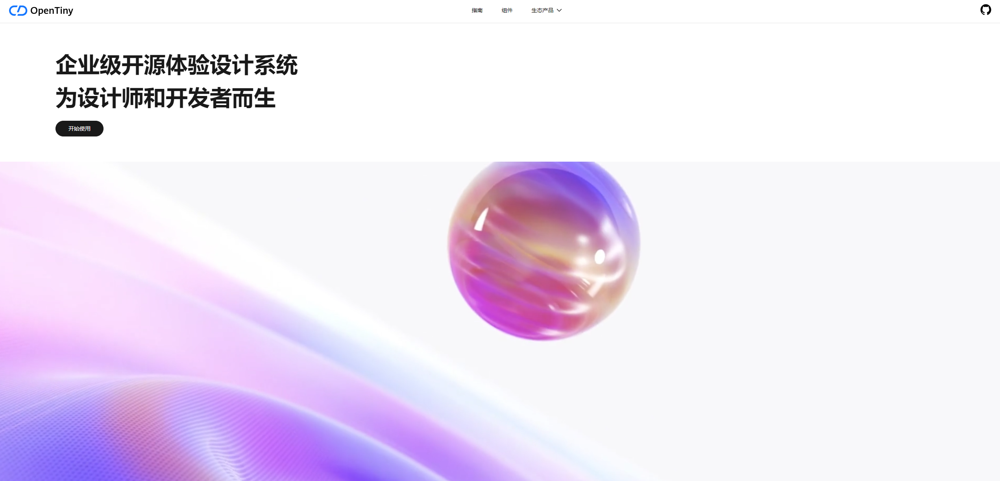
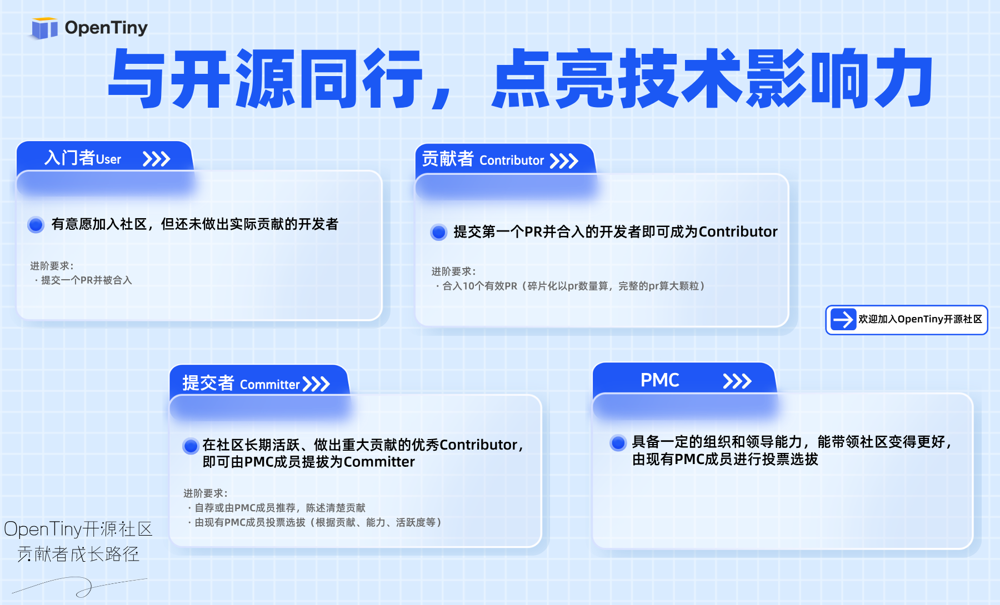

🌟 **开发者朋友你好！我们诚挚邀请你加入 OpenTiny 开源社区，一起进行项目共建，一起成为 OpenTiny 开源项目的一份子\~**

近期，OpenTiny 社区收到很多开发者对于 TinyEngine 低代码引擎二开教程的建议，项目工程师们根据社区开发者们的建议也紧锣密鼓的推进项目的演进更新。与此同时，社区开发者们也提出了很多项目 issue，作为开源社区，OpenTiny 也希望邀请更多的开源共建者一起加入进来，进行社区共建，一起打造活跃、开放的开源氛围。

## OpenTiny 是什么？

OpenTiny 是一套企业级 Web 前端开发解决方案，提供跨端、跨框架、跨版本的 TinyVue 组件库，包含基于 Angular+TypeScript 的 TinyNG 组件库，拥有灵活扩展的低代码引擎 TinyEngine，具备主题配置系统 TinyTheme / 中后台模板 TinyPro/ TinyCLI 命令行等丰富的效率提升工具，可帮助开发者高效开发 Web 应用。

**核心亮点：**

- 跨端跨框架：TinyVue 组件库使用 Renderless 无渲染组件设计架构，实现了一套代码同时支持 Vue2 / Vue3，PC / Mobile 端，并支持函数级别的逻辑定制和全模板替换，灵活性好、二次开发能力强。

- 组件丰富：PC 端有 100+组件，移动端有 30+组件，包含高频组件 Table、Tree、Select 等，内置虚拟滚动，保证大数据场景下的流畅体验，除了业界常见组件之外，我们还提供了一些独有的特色组件，如：Split 面板分割器、IpAddress IP 地址输入框、Calendar 日历、Crop 图片裁切等。

- 低代码引擎：低代码引擎使能开发者定制低代码平台。它是低代码平台的底座，提供可视化搭建页面等基础能力，既可以通过线上搭配组合，也可以通过创建 cli 工程进行二次开发，实时定制出自己的低代码平台。适用于多场景的低代码平台开发，如：资源编排、服务端渲染、模型驱动、移动端、大屏端、页面编排等。

- 配置式组件： 组件支持模板式和配置式两种使用方式，适合低代码平台，目前团队已经将 OpenTiny 集成到内部的低代码平台，针对低码平台做了大量优化。

- 周边生态齐全： 提供了基于 Angular + TypeScript 的 TinyNG 组件库，提供包含 10+ 实用功能、20+ 典型页面的 TinyPro 中后台模板，提供覆盖前端开发全流程的 TinyCLI 工程化工具，提供强大的在线主题配置平台 TinyTheme。

## 你能参与什么？

### 1、项目开发与优化

- 开发新特性：帮助开发社区开发者需要的新特性新功能
- 修复缺陷：解决现有组件或低代码的缺陷问题
- 跨框架适配：基于 Renderless 架构，为 React、Solid 等框架扩展组件库

### 2、文档与生态建设

- 完善文档：撰写项目使用指南、配置示例等
- 低代码插件开发：为 TinyEngine 设计通用功能插件或领域专属设计器
- AI 技术探索：结合 AI 能力优化低代码引擎的智能提示等

### 3、社区支持与创新

- 解答用户问题：在社区中帮助解答 issue 问题或定位问题

- 参与开源活动：例如参与直播分享、线下交流、编程活动等

## 你能获得什么？

### 直接价值

- 技术成长：掌握 Renderless 架构、跨框架开发、低代码引擎等前沿技术
- 职业背书：OpenTiny 官网露出，贡献记录可写入简历，拥有开源项目贡献者证书
- 丰厚奖励：编程赛事奖金、定制礼品、荣誉证书等

### 长远价值

- 个人影响力：优秀贡献者可成为社区 PMC 或 Committer，参与项目战略规划

- 社区资源：受邀参加华为全联接大会等技术峰会，与行业大牛深度交流

- 开源影响力：你的代码将被数个企业应用使用，推动前端技术革新

## 如何参与？

### 🚀  熟悉项目

- 访问 OpenTiny 官网 和 GitHub 仓库，阅读贡献指南

- 通过官网文档启动本地开发环境，进行项目开发体验

### 🔥  选择任务（仅列举部分）

| 项目       | 难度             | 任务                                                                                                                                                                                                              |
| ---------- | ---------------- | ----------------------------------------------------------------------------------------------------------------------------------------------------------------------------------------------------------------- |
| TinyVue    | 新手友好（简单） | [tree-select 绑定的 v-model 值发生改变时 组件不更新 · Issue #3167 · opentiny/tiny-vue (github.com)](https://github.com/opentiny/tiny-vue/issues/3167)                                                             |
| TinyVue    | 新手友好（简单） | [Steps 横线未对齐 · Issue #3106 · opentiny/tiny-vue (github.com)](https://github.com/opentiny/tiny-vue/issues/3106)                                                                                               |
| TinyVue    | 新手友好（简单） | [Pager align 属性不是响应式 · Issue #3083 · opentiny/tiny-vue (github.com)](https://github.com/opentiny/tiny-vue/issues/3083)                                                                                     |
| TinyVue    | 新手友好（简单） | [Pager 文档 size 属性应当为枚举 · Issue #3082 · opentiny/tiny-vue (github.com)](https://github.com/opentiny/tiny-vue/issues/3082)                                                                                 |
| TinyVue    | 新手友好（简单） | [Popeditor 文档 popseletor 属性应当为枚举 · Issue #3081 · opentiny/tiny-vue (github.com)](https://github.com/opentiny/tiny-vue/issues/3081)                                                                       |
| TinyEditor | 新手友好（简单） | [公式显示错误 · Issue #133 · opentiny/tiny-editor (github.com)](https://github.com/opentiny/tiny-editor/issues/133)                                                                                               |
| TinyEditor | 新手友好（简单） | [better-table 表格先删除然后使用 ctrl + Z 回退后，表格恢复，但是表格的着色消失 · Issue #107 · opentiny/tiny-editor (github.com)](https://github.com/opentiny/tiny-editor/issues/107)                              |
| TinyEditor | 新手友好（简单） | [document.execCommand() is deprecated, need to look for alternative solutions · Issue #97 · opentiny/tiny-editor (github.com)](https://github.com/opentiny/tiny-editor/issues/97)                                 |
| TinyEditor | 新手友好（简单） | [macOS 粘贴 word 文档内容变成了图片 · Issue #72 · opentiny/tiny-editor (github.com)](https://github.com/opentiny/tiny-editor/issues/72)                                                                           |
| TinyEditor | 新手友好（简单） | [希望完善 Playwright E2E 测试用例 · Issue #40 · opentiny/tiny-editor (github.com)](https://github.com/opentiny/tiny-editor/issues/40)                                                                             |
| TinyEngine | 进阶挑战（中等） | [使用 code configurator，language 为 json，在 snippets 中配置属性值，json 值未回显在 code configurator 中 · Issue #1206 · opentiny/tiny-engine (github.com)](https://github.com/opentiny/tiny-engine/issues/1206) |
| TinyEngine | 进阶挑战（中等） | [Tooltip 集成后 content 插槽无法渲染 · Issue #1203 · opentiny/tiny-engine (github.com)](https://github.com/opentiny/tiny-engine/issues/1203)                                                                      |
| TinyEngine | 进阶挑战（中等） | [SelectConfigurator multi 模式，文本不展示 · Issue #1188 · opentiny/tiny-engine (github.com)](https://github.com/opentiny/tiny-engine/issues/1188)                                                                |
| TinyEngine | 进阶挑战（中等） | [集成弹窗类组件时，如果组件 slot 在弹窗内部时，slot 无法进行配置 · Issue #1161 · opentiny/tiny-engine (github.com)](https://github.com/opentiny/tiny-engine/issues/1161)                                          |
| TinyEngine | 进阶挑战（中等） | [往页面放置物料的时候，部分时候位置不收控制啊 · Issue #1160 · opentiny/tiny-engine (github.com)](https://github.com/opentiny/tiny-engine/issues/1160)                                                             |
| TinyEngine | 进阶挑战（中等） | [Tabs 选项卡组件是否可以支持绑定变量！！！ · Issue #1106 · opentiny/tiny-engine (github.com)](https://github.com/opentiny/tiny-engine/issues/1106)                                                                |
| TinyVue    | 进阶挑战（中等） | [运行 npm run build:runtime 报错 · Issue #3134 · opentiny/tiny-vue (github.com)](https://github.com/opentiny/tiny-vue/issues/3134)                                                                                |
| TinyVue    | 进阶挑战（中等） | [PopConfirm 组件建议增加 message 插槽，目前 message 只能传字符串，不够灵活 · Issue #3129 · opentiny/tiny-vue (github.com)](https://github.com/opentiny/tiny-vue/issues/3129)                                      |
| TinyVue    | 进阶挑战（中等） | [NavMenu 支持配置展示菜单展开图标 · Issue #3105 · opentiny/tiny-vue (github.com)](https://github.com/opentiny/tiny-vue/issues/3105)                                                                               |
| TinyVue    | 进阶挑战（中等） | [navmenu 支持配置菜单图标 · Issue #3104 · opentiny/tiny-vue (github.com)](https://github.com/opentiny/tiny-vue/issues/3104)                                                                                       |
| TinyVue    | 进阶挑战（中等） | [config-provider 主题配置支持多层级嵌套，自动合并 · Issue #3086 · opentiny/tiny-vue (github.com)](https://github.com/opentiny/tiny-vue/issues/3086)                                                               |
| TinyEditor | 进阶挑战（中等） | [图片支持放大预览 · Issue #136 · opentiny/tiny-editor (github.com)](https://github.com/opentiny/tiny-editor/issues/136)                                                                                           |
| TinyEditor | 进阶挑战（中等） | [图片可以设置居中 居左 居右 剪裁 · Issue #123 · opentiny/tiny-editor (github.com)](https://github.com/opentiny/tiny-editor/issues/123)                                                                            |
| TinyEditor | 进阶挑战（中等） | [希望基于 Fluent Editor 封装不同框架版本的组件 · Issue #115 · opentiny/tiny-editor (github.com)](https://github.com/opentiny/tiny-editor/issues/115)                                                              |
| TinyEditor | 进阶挑战（中等） | [bubble 主题支持 · Issue #66 · opentiny/tiny-editor (github.com)](https://github.com/opentiny/tiny-editor/issues/66)                                                                                              |
| ......     | ......           | ......                                                                                                                                                                                                            |

> 在 OpenTiny github 仓库中，good first issue  代表简单共建任务，pr welcome  代表进阶共建任务，开发者朋友们也可以直接进入 github 仓库，选择自己感兴趣的任务进行共建开发。
>
> 当然，还有  question  等其他标签，大家可以根据标签含义，通过解答问题，参与讨论等形式，一起加入 OpenTiny 项目共建\~
>
> 同时，大家在选择 issue 任务后，可以直接在想要参与共建的 issue 下面评论“认领此任务”。

### 🎁  提交贡献

- Fork OpenTiny github 代码仓库，遵循贡献指南规范进行提交

- 提交 PR 后，根据社区 Maintainer 建议，进行优化和完善代码

## 以往贡献者事迹

（仅列举部分）

| 名称          | 贡献事迹                                                                                                                                                                                                                                                                                                               |
| ------------- | ---------------------------------------------------------------------------------------------------------------------------------------------------------------------------------------------------------------------------------------------------------------------------------------------------------------------- |
| GaoNeng-wWw   | 重构 ColorPicker 组件补充 E2E 测试用例，修复多个组件问题；担任开源之夏导师，指导学生完成 TinyPro 细粒度权限管理、页签模式、多级菜单、NestJS 后端支持、Webpack/Rspack/Fram 多种构建工具支持等特性；参与 CCF 开源大赛，贡献 ProcessDesign 流程设计器组件；参与 OpenTiny 贡献者直播，分享 ts-morph 通过注释生成类型文档等 |
| zzxming       | TinyEditor 核心贡献者，贡献格式刷、截屏、国际化、全屏、mention 支持链接等多个新特性，重构了表格、上传等多个模块，优化构建产物和减少包体积，提升了用户体验，修复 ESLint 代码问题等                                                                                                                                      |
| Janson1012    | 贡献格式刷、截屏、国际化、全屏、mention 支持链接等多个新特性，优化构建产物和减少包体积，修复 ESLint 代码问题等                                                                                                                                                                                                         |
| kiss-keray    | 贡献 mathlive 可编辑公式模块等                                                                                                                                                                                                                                                                                         |
| gweesin       | 给 grid 组件中增加 resizable 功能，补充 input 组件单元测试，修复多个组件问题等                                                                                                                                                                                                                                         |
| AcWrong02     | 补充多个组件单元测试，修复多个组件问题等                                                                                                                                                                                                                                                                               |
| jxhhdx        | 补充多个组件单元测试，修复多个组件问题等                                                                                                                                                                                                                                                                               |
| Floyd-bit     | 补充多个组件的单元测试和 TS 类型声明等                                                                                                                                                                                                                                                                                 |
| mengqiuleo    | 增加 PR Preview 功能，修复多个问题等                                                                                                                                                                                                                                                                                   |
| MNZhu         | 优化多个移动端组件 UI 样式等                                                                                                                                                                                                                                                                                           |
| fanbingbing16 | 增加 FloatButton 组件，修复多个组件问题等                                                                                                                                                                                                                                                                              |
| ......        | ......                                                                                                                                                                                                                                                                                                                 |

## 贡献者成长路径

📌**立即行动**：

添加  **OpenTiny 小助手微信（opentiny-official）** ，加入技术交流群，获取最新任务清单与活动资讯。

## 关于 OpenTiny

欢迎加入 OpenTiny 开源社区。添加微信小助手：opentiny-official 一起参与交流前端技术～\
OpenTiny 官网：**<https://opentiny.design>**\
OpenTiny 代码仓库：**<https://github.com/opentiny>**\
TinyVue 源码：**<https://github.com/opentiny/tiny-vue>**\
TinyEngine 源码： **<https://github.com/opentiny/tiny-engine>**\
欢迎进入代码仓库 Star🌟TinyEngine、TinyVue、TinyNG、TinyCLI\~ 如果你也想要共建，可以进入代码仓库，找到 good first issue 标签，一起参与开源贡献\~
