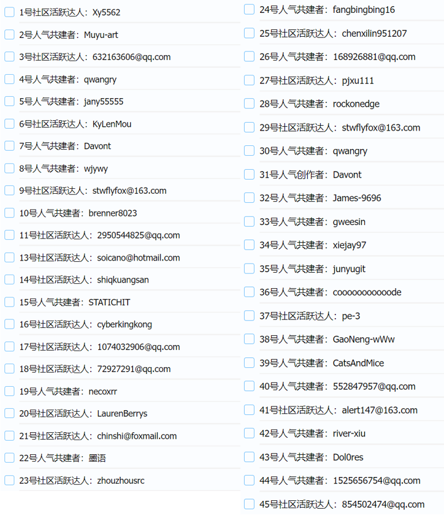

携手共创，致敬不凡！

2024 年，OpenTiny 持续在前端开源领域扎根，每一位开发者都是推动项目共同前行的宝贵力量。从 bug 修复，到技术探讨；从参与开源活动，到输出技术文章；从使用项目，到参与共建，每一步跨越，都凝聚了开发者的智慧与汗水。致敬所有在 OpenTiny 社区里默默付出、积极贡献、引领创新的杰出个人，我们正式启动“OpenTiny 年度贡献者评选”活动！快为你喜爱的人气贡献者投票吧\~

## **人气贡献者评选**

**名单公布：**

**年度贡献者投票评选时间：**

**2024 年 12 月 25 日-2024 年 12 月 31 日**

**投票规则：**

**每人每天可回答 3 次，每次最多可投 2 票，最终投票结果选取前 5 名**

**投票入口：**

**<https://wj.qq.com/s2/17249741/2aa9/>**

## **关于 OpenTiny**

欢迎加入 OpenTiny 开源社区。添加微信小助手：opentiny-official 一起参与交流前端技术～\
OpenTiny 官网：**<https://opentiny.design/>**\
OpenTiny 代码仓库：**<https://github.com/opentiny/>**\
TinyVue 源码：**<https://github.com/opentiny/tiny-vue>**\
TinyEngine 源码： **<https://github.com/opentiny/tiny-engine>**\
欢迎进入代码仓库 Star🌟TinyEngine、TinyVue、TinyNG、TinyCLI\~ 如果你也想要共建，可以进入代码仓库，找到 good first issue 标签，一起参与开源贡献\~
