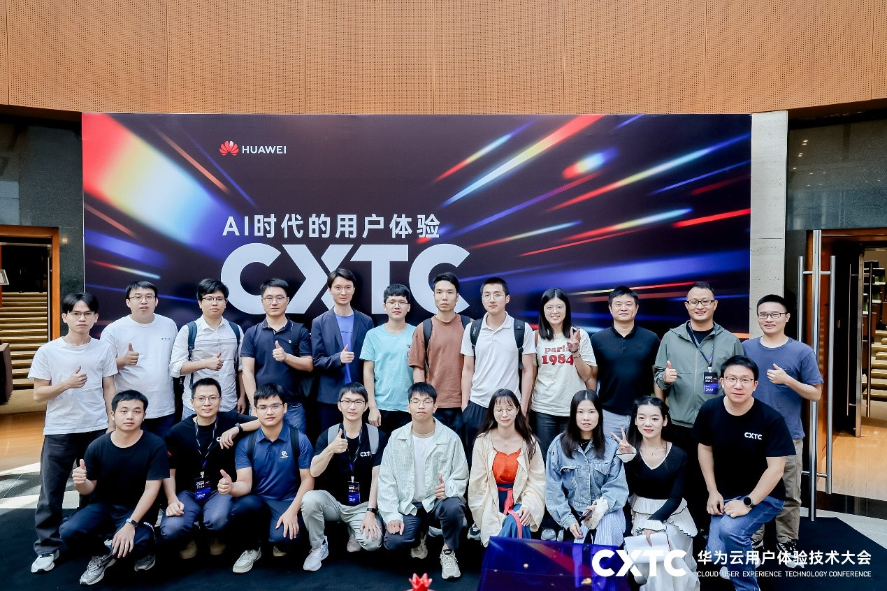
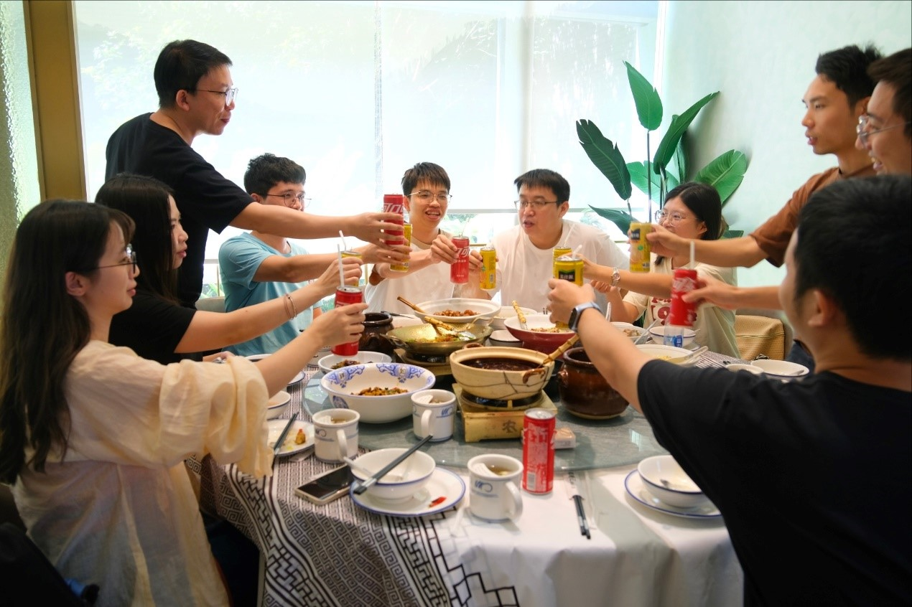
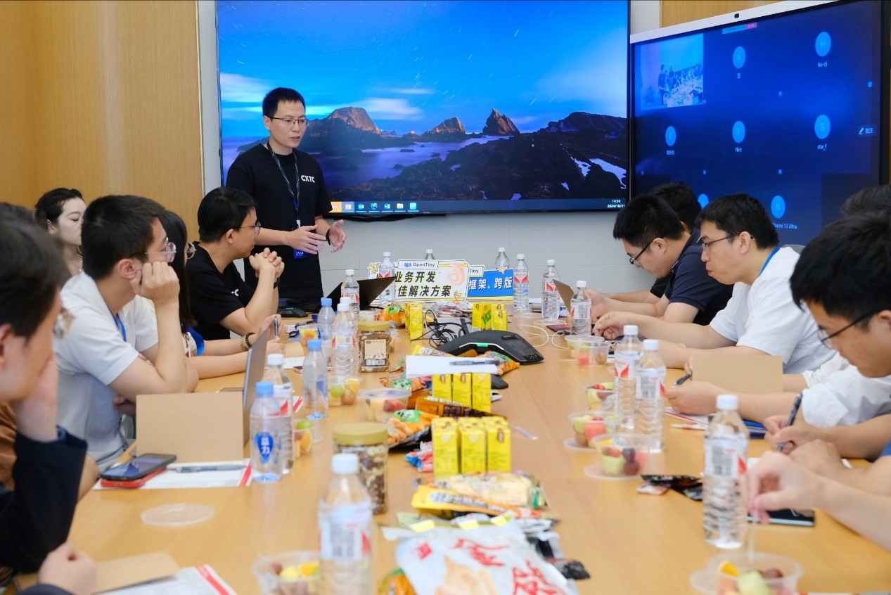
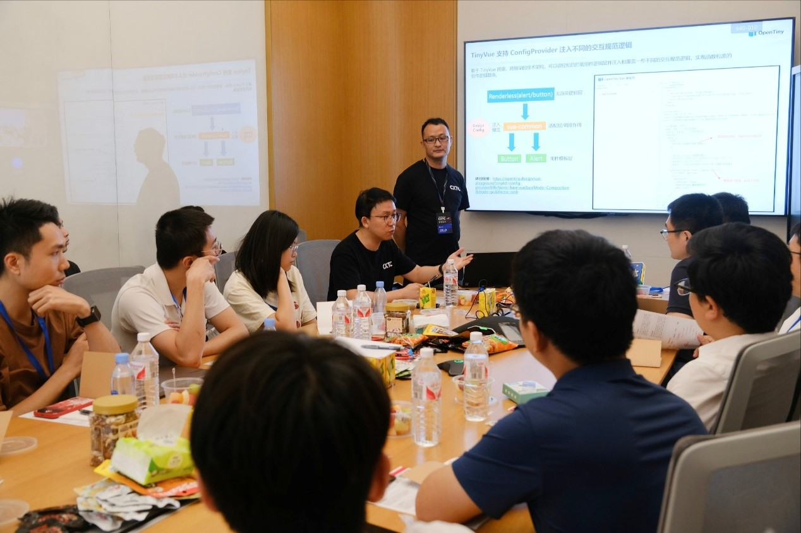
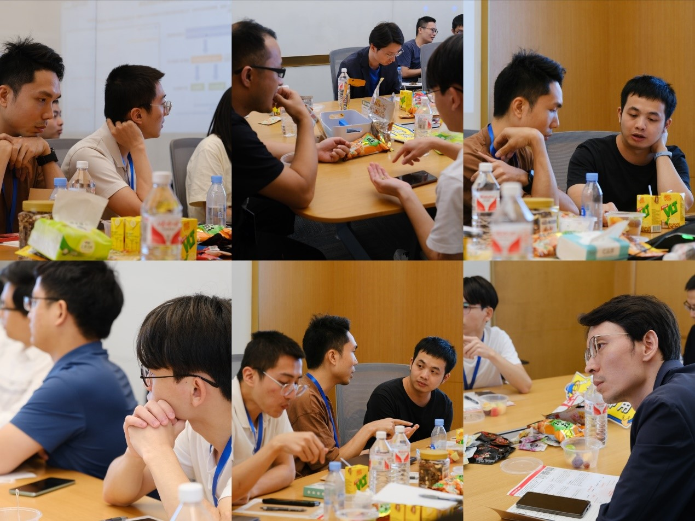
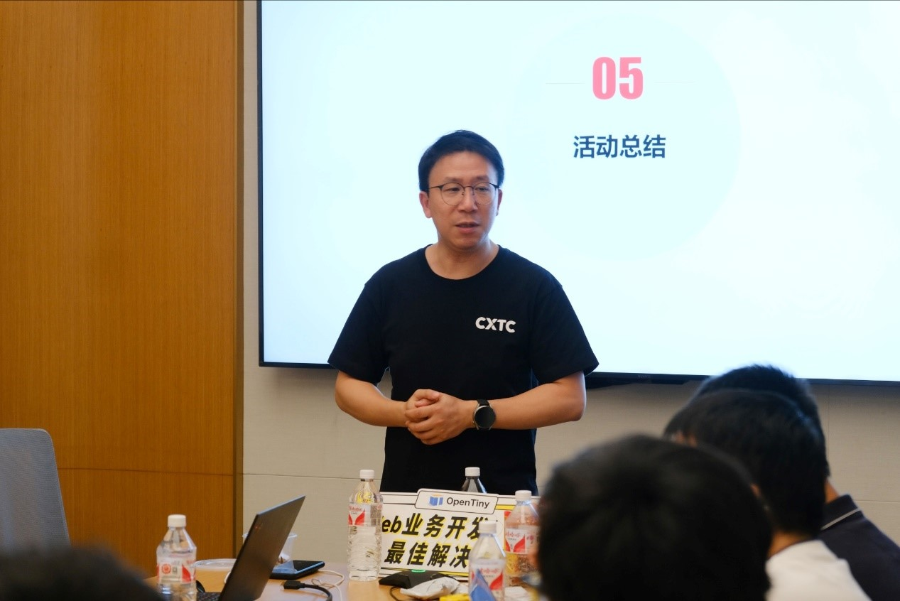
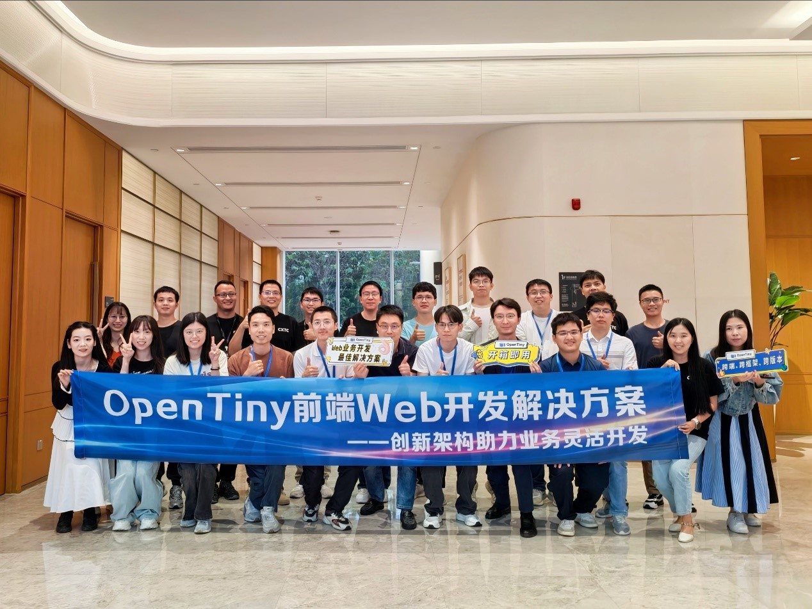

想你的风还是吹到了坂田基地~

网友见面、大型奔现现场！

是泪洒当场？还是撒腿就跑？

10 月底，体验技术大会暨[OpenTiny](https://opentiny.design/)技术交流茶话会正式在华为坂田基地召开，本次技术交流活动邀请了 8 位用户共同参与，希望通过轻松自由的茶话会形式，帮助开发者解决使用 OpenTiny 项目在日常开发中遇到的难题。此次活动不仅让社区的开发者们有机会面对面交流技术心得，还见证了 TinyEngine 低代码引擎 2.0 与 TinyVue 组件库新版本发布的相关内容，为社区的发展注入了新的活力。

**参与体验技术大会**

活动当天上午，[OpenTiny](https://opentiny.design/)成员与本次参会的企业开发者们一起参与了华为云用户体验技术大会，在本次体验技术大会上聆听了各方精英关于如何利用 AI 技术在设计、技术、服务等多个维度提升用户体验的分享，对于在当前各类 AI 应用爆发式增长的情况下，也希望通过议题分享对开发者们有一定的启发和帮助。

**午宴环节**

上午结束后，一场温馨的午宴为开发者们提供了更加轻松愉快的交流氛围。在餐桌上，大家纷纷分享了自己的技术心得和工作经验，畅谈了对前端技术发展的看法。其中有一位开发者还提到之前也参与过开放原子 OpenTiny 开源项目挑战赛，后续也希望能持续融入社区，在前端圈与大家多多交流。这种面对面的沟通方式，不仅拉近了彼此之间的距离，还为后续的技术合作打下了坚实的基础。

**TinyEngine 低代码引擎 2.0 发布介绍**

活动的重头戏之一是[TinyEngine](https://github.com/opentiny/tiny-engine)低代码引擎 2.0 的发布。作为 OpenTiny 社区的核心产品之一，TinyEngine 以其灵活和可扩展的特点，赢得了广大开发者的青睐。此次发布的 2.0 版本，在开发方式、功能和用户体验等方面都进行了全面升级，为开发者们提供了更加完善的低代码开发解决方案。

在介绍环节，[TinyEngine](https://github.com/opentiny/tiny-engine)的李旭宏老师详细介绍了新版本的特点和优势，包括高效的开发体验、二开项目丝滑同步、布局灵活、画布修改、快速使用第三方组件库、出码定制多种语言、嵌入式使用方式、模型驱动开发、AI 辅助开发等。这些升级不仅提升了开发效率，还降低了开发成本，为企业的构建低代码 Web 应用提供了有力支持。

**TinyVue 3.19.0 发布介绍**

除了[TinyEngine](https://github.com/opentiny/tiny-engine)低代码引擎之外，TinyVue 组件库 3.19.0 新版本也在此次活动中亮相。作为 OpenTiny 社区的另一个重要产品，[TinyVue](https://github.com/opentiny/tiny-vue)以其组件丰富、配置式使用和跨端跨框架的特点，成为了众多前端开发者选择的开发工具之一。[TinyVue](https://github.com/opentiny/tiny-vue)组件库核心成员郑志超老师表示此次发布的新版本，在官网优化、设计规范更新等方面都进行了全面改进，为开发者们提供了更加稳定、高效及美观的开发套件。

**OpenTiny 技术交流**

活动的另一个高热环节是 OpenTiny 技术交流环节。在这里，开发者们纷纷就自己在开发过程中遇到的问题和心得进行了分享和讨论，例如：“TinyEngine 物料管理，包括第三方组件的增加有没有简化维护的功能扩展计划”、“低代码下如何编写一些带有复杂逻辑的页面，比如需要 store 存取数据”、“TinyEngine 目前支持导入第三方基础组件库，是否也能支持导入基于第三方组件库封装的业务组件库，进一步简化页面搭建”、“[TinyVue](https://github.com/opentiny/tiny-vue)组件库在使用上存在视觉小问题，如：图标和文字没有中线对齐，表单组件图标被压扁的情况，希望及时修复”等。

当然大家不仅交流了技术解决方案，还探讨了如何更好地应用 TinyEngine 和 TinyVue 等产品来提升开发效率和质量。这种技术交流的方式，不仅促进了彼此之间的学习和成长，还为社区的技术发展提供了源源不断的动力。

**活动总结**

在活动的尾声，OpenTiny 开源项目的负责人莫春辉老师对本次活动进行了总结。他回顾了活动的各个环节和亮点，感谢了所有参与者的支持和贡献，并展望了社区未来的发展方向。他表示，OpenTiny 社区将继续秉承开放、共享和创新的理念，为开发者们提供更加优质的开发工具和服务，推动前端技术的不断发展和进步。

**合影留念**

最后，所有参与者共同合影留念，为这次难忘的线下交流茶话会画上了圆满的句号。这张合影不仅记录了大家的笑容和欢乐，更见证了 OpenTiny 社区团结、友爱和共同进步的精神。

此次体验技术大会暨 OpenTiny 线下交流茶话会活动，不仅为开发者们提供了一个宝贵的学习和交流平台，还见证了 TinyEngine 低代码引擎 2.0 和 TinyVue 新版本的发布。相信在未来的日子里，OpenTiny 社区将继续秉持初心和使命，为前端技术的发展和进步添砖加瓦，为前端开源生态的繁荣贡献力量。
